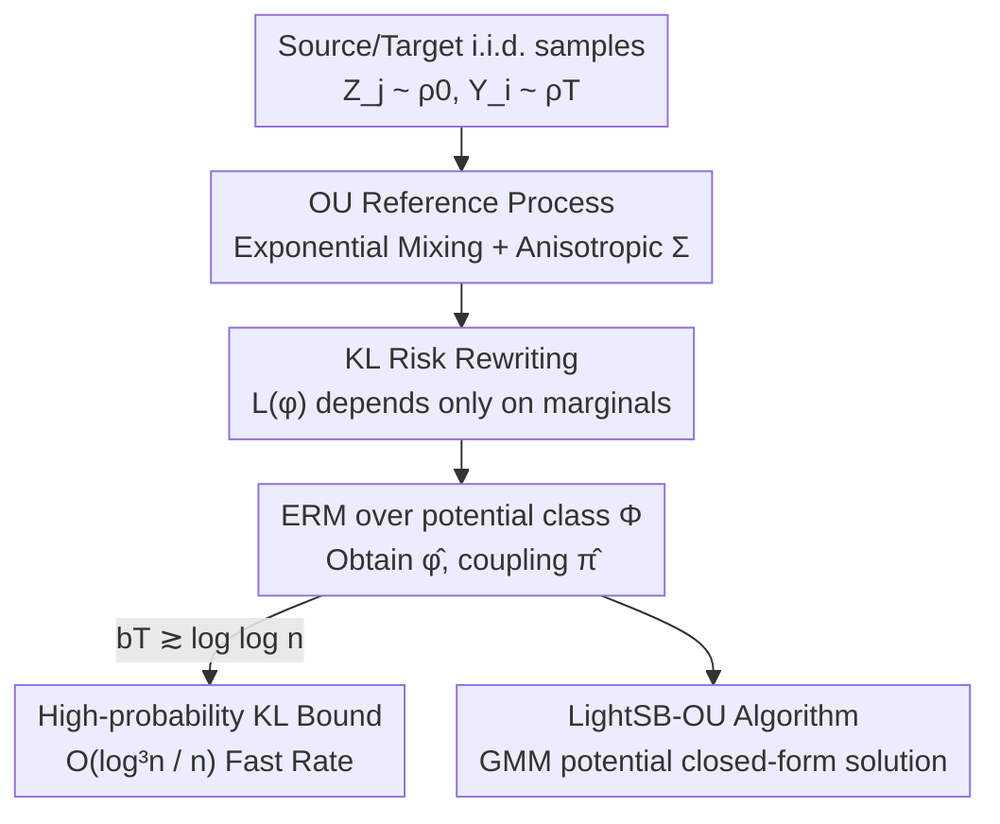

# Tight Bounds for Schrödinger Potential Estimation in Unpaired Data Translation

**Conference**: ICLR 2026  
**OpenReview**: [https://openreview.net/forum?id=2I4a6qsesO](https://openreview.net/forum?id=2I4a6qsesO)  
**Code**: https://github.com/denvar15/Tight-Bounds-for-Schrodinger-Potential-Estimation-in-Unpaired-Data-Translation  
**Area**: Learning Theory / Schrödinger Bridge / Optimal Transport  
**Keywords**: Schrödinger Bridge, Empirical Risk Minimization, Generalization Error Bounds, Ornstein-Uhlenbeck Process, Unpaired Data Translation

## TL;DR
This paper provides the first non-asymptotic high-probability generalization error bound for the Empirical Risk Minimization (ERM) estimator of the Schrödinger potential. Using only i.i.d. samples from the source and target distributions and employing the Ornstein-Uhlenbeck (OU) process as the reference dynamics, the KL divergence between the estimated coupling and the optimal coupling is bounded at a fast rate of $O(\log^3 n / n)$, significantly improving upon the previous $O(1/\sqrt{n})$ results.

## Background & Motivation

**Background**: The Schrödinger bridge has become a powerful framework for generative modeling and unpaired data translation (especially image-to-image translation). It models the process of "transforming an initial distribution $\rho_0$ into a target distribution $\rho_T$" by finding a coupling $\pi$ among all satisfies marginal constraints that is closest to a reference dynamic in the sense of relative entropy: $\inf_{\pi\in\Pi(\rho_0,\rho_T)}\mathrm{KL}(\pi,\pi_0)$. Under mild regularity, the optimal coupling takes the product form $\pi^*(x,y)=\nu^*_0(x)\,q_T(y\mid x)\,\nu^*_T(y)$, where $\nu^*_0,\nu^*_T$ are the left and right Schrödinger potentials.

**Limitations of Prior Work**: Most existing works (Korotin et al. 2024, Rigollet & Stromme 2025, Pooladian & Niles-Weed 2025) use Brownian motion $\mathrm{d}X_t=\sigma\,\mathrm{d}W_t$ as the reference process. This introduces two issues: first, the scalar $\sigma$ cannot capture the anisotropy of data; second, the correlation between $X_0$ and $X_T$ under Brownian motion decays only at a slow polynomial rate. In image translation, this translates to an "excessive or even negative" influence of the input image on the output, forcing practitioners to use large $\sigma$ or $T$ to mitigate the effect.

**Key Challenge**: More critically, at the statistical level, existing theories only prove that the **dual objective function itself** (or the risk in expectation) converges at $O(1/n)$ or $O(1/\sqrt{n})$. No guarantees have been provided for the KL divergence at the **coupling level** $\mathrm{KL}(\pi^*,\hat\pi)$—convergence of the objective does not imply convergence of the estimated coupling or distribution. Simple Gaussian experiments (Figure 1 in the paper) show that actual sample efficiency is much more optimistic than $O(1/\sqrt{n})$, revealing a clear gap between theory and empirical results.

**Goal**: (1) Select a reference process that "forgets the initial value" better than Brownian motion to fundamentally weaken the excessive influence of input on output; (2) Provide a tight, non-asymptotic, high-probability upper bound for the KL divergence between the estimated and optimal couplings.

**Key Insight**: The authors replace Brownian motion with the **Ornstein-Uhlenbeck process**. The OU process possesses exponential mixing properties—correlations decay at an exponential rate—and its transition kernel is analytically tractable. Exponential mixing happens to inject "curvature" into the empirical risk, which is the missing piece for proving fast rates.

**Core Idea**: By replacing Brownian motion with the OU process as the reference dynamics for the Schrödinger bridge and leveraging its exponential ergodicity to verify a Bernstein-type condition, the coupling KL error of the Schrödinger potential ERM estimator is locked into a fast rate with approximately linear dimensional dependence.

## Method

### Overall Architecture

The "method" studied is a chain of **statistical estimation + theoretical analysis** rather than a specific network architecture. Given samples $Z_1,\dots,Z_N$ from source $\rho_0$ and $Y_1,\dots,Y_n$ from target $\rho_T$ (with $N=n$), the goal is to estimate the right Schrödinger log-potential $\varphi^*=\log\nu^*_T$, thereby obtaining the coupling estimate $\hat\pi$. The pipeline is: choose OU reference process → rewrite coupling search as risk minimization for a single log-potential $\varphi$ → perform ERM over a parameterized potential class $\Phi$ to obtain $\hat\varphi$ → prove the KL generalization bound for the resulting coupling $\hat\pi$.

The key algebraic simplification is: using the marginal constraint $\rho_0(x)=\int\pi_\varphi(x,y)\,\mathrm{d}y$, the left potential can be eliminated, expressing the coupling solely in terms of $\varphi$:

$$\pi_\varphi(x,y)=\frac{\rho_0(x)\,q_T(y\mid x)\,e^{\varphi(y)}}{T_T[e^\varphi](x)},\qquad T_t[g](x)=\int g(y)\,q_t(y\mid x)\,\mathrm{d}y,$$

where $T_t$ is the OU operator. Thus $\mathrm{KL}(\pi^*,\pi_\varphi)=L(\varphi)-L(\varphi^*)$, and the risk functional

$$L(\varphi)=\mathbb{E}_{Z\sim\rho_0}\log T_T[e^\varphi](Z)-\mathbb{E}_{Y\sim\rho_T}\varphi(Y)$$

**depends only on the two marginal distributions $\rho_0,\rho_T$ and requires no assumptions about the joint distribution**—the fundamental reason it is suitable for "unpaired" translation. Replacing expectations with empirical means yields the ERM estimate $\hat\varphi\in\arg\min_{\varphi\in\Phi}\hat L(\varphi)$.

### Key Designs

**1. OU Reference Process: Replacing slow decay with exponential mixing**

To address the failure of Brownian motion to capture anisotropy and its slow decay of input influence, the reference dynamics is taken as an OU process:

$$\mathrm{d}X^0_t=b\,(m-X^0_t)\,\mathrm{d}t+\Sigma^{1/2}\,\mathrm{d}W_t,\qquad 0\le t\le T,$$

where $b>0$ controls the reversion rate, $m$ is the mean-reversion level, and $\Sigma$ is a positive definite covariance matrix. The corresponding Schrödinger bridge evolves under the modified drift $\beta^*(t,x)=b(m-x)+\Sigma\nabla\log\nu^*_t(x)$. Compared to Brownian motion, OU offers three advantages: $\Sigma$ naturally captures anisotropy; the mean-reversion term makes the correlation between $X_0$ and $X_T$ **decay exponentially**, suppressing excessive input influence; and the transition kernel $q_t$ is Gaussian $\mathcal N(m_t(x),\Sigma_t)$ ($m_t(x)=(1-e^{-bt})m+e^{-bt}x$, $\Sigma_t=(1-e^{-2bt})\Sigma/(2b)$), which is analytically tractable. Crucially, exponential ergodicity provides the "curvature" for the fast rate proof.

**2. Marginal Risk Functional and ERM Estimator: Dimensionality reduction to single-potential optimization**

To handle the constraint of using unpaired samples without joint distribution assumptions, the constructed risk $L(\varphi)$ utilizes only marginal information from $\rho_0$ and $\rho_T$. The empirical risk is:

$$\hat L(\varphi)=\frac1n\sum_{j=1}^n\log T_T[e^\varphi](Z_j)-\frac1n\sum_{i=1}^n\varphi(Y_i),$$

which is essentially the (constant-shifted) log-likelihood of the coupling $\pi_\varphi$ on data, or the degenerate limit of the entropic OT dual objective as the marginal penalty $\to 0$. Minimizing $\hat L$ yields the log-potential estimate $\hat\varphi$ and coupling estimate $\hat\pi=\pi_{\hat\varphi}$. This design simplifies an infinite-dimensional search over couplings into optimization over a single scalar function $\varphi$ in a finite-dimensional class.

**3. Tight High-Probability KL Generalization Bound (Theorem 1): Using Bernstein-type conditions for fast rates**

This is the core contribution. Under five mild assumptions (OU dynamics, bounded support for $\rho_0$, sub-Gaussian $\rho_T$, bounded log-potentials with $T_{\inf}\varphi=0$ for identifiability, and smooth potential class parameterization), the theorem states: when $bT\gtrsim\log\log n$, with probability at least $1-\delta$,

$$\mathrm{KL}(\pi^*,\hat\pi)\lesssim\sqrt{\Lambda(n,\delta)\,\varepsilon\,\Big(1+\log\tfrac{(b\wedge L)(M+d)}{b\varepsilon}\Big)}+\Lambda(n,\delta)\Big(1+\log\tfrac{(b\wedge L)(M+d)}{b\varepsilon}\Big),$$

where $\varepsilon=\inf_{\varphi\in\Phi}\mathrm{KL}(\pi^*,\pi_\varphi)$ is the approximation error, and $\Lambda(n,\delta)\asymp\dfrac{(\log n+\log d+\log(1/\delta))\,Dd\log n}{n}$. When the potential class is sufficiently rich such that $\varepsilon\lesssim\Lambda(n,\delta)$, the bound simplifies to:

$$\mathrm{KL}(\pi^*,\hat\pi)\lesssim\frac{(\log n+\log d+\log(1/\delta))\,Dd\log^2 n}{n}=O\!\left(\frac{\log^3 n}{n}\right).$$

This is the **first** known non-asymptotic high-probability upper bound for the KL divergence between the optimal coupling and the ERM estimator (previous work by Korotin et al. 2024 only controlled the expected excess risk). Key highlights: a convergence rate of $O(\log^3 n/n)$ when approximation error is small, and nearly linear dimensional dependence $O(d\log d)$, suitable for high-dimensional settings. The essence of the proof lies in **verifying a Bernstein-type condition**—OU exponential ergodicity introduces "curvature" into the loss when $bT\gtrsim\log\log n$. The authors note that at $T=0$, the loss is linear and lacks curvature; the condition $bT\gtrsim\log\log n$ applies to the product $bT$, allowing common settings like $T=1$ with $b\gtrsim\log\log n$.

**4. LightSB-OU: Practical closed-form algorithm with Gaussian mixture potentials**

To implement the theory, LightSB-OU is developed based on LightSB (Korotin et al. 2024). It employs a log-potential class where the "adjusted potential" $v_\theta(y)=e^{\varphi_\theta(y)-\|y\|^2/(2\sigma\sigma_1^2)}$ is a $K$-component Gaussian mixture $v_\theta(y)=\sum_{k=1}^K\alpha_k\,p(y;r_k,\sigma\sigma_1^2 S_k)$. This ensures the OU transform $T_1[e^{\varphi_\theta}](x)$ has a **closed-form expression** $c_\theta(x)=\sum_k e^{\ell_k(x)}$, avoiding numerical integration and significantly reducing computation. The only difference from standard LightSB is replacing the Gaussian kernel of Brownian motion with the OU transition kernel.

### Loss & Training

The training objective is the empirical risk $\hat L(\varphi_\theta)$ optimized over Gaussian mixture parameters $\theta=\{(\alpha_k,r_k,S_k)\}_{k=1}^K$. Experiments fix $T=1$, $\Sigma=\sigma I_d$, and tune hyperparameters such as $\sigma$, component count $K$, and learning rate using grid search and Optuna.

## Key Experimental Results

The experiments aim to verify that the OU reference process consistently improves generation quality.

### Main Results: Gaussian Mixture Model (25 components, K=30)

| Configuration | Metric | LightSB | LightSB-OU (Ours) |
|------|------|---------|-----------|
| Standard | Sliced $W_1$ | 0.260±0.016 | **0.156±0.018** |
| Standard | Mode Coverage | 24.2±0.4 | **25.0±0.0** |
| Irregular | Sliced $W_1$ | 0.525±0.024 | **0.214±0.028** |
| Irregular | MMD | 0.0024±0.0003 | **0.0004±0.0001** |
| Irregular | Mode Coverage | 21.8±0.4 | **25.0±0.0** |
| Anisotropic | Sliced $W_1$ | 0.255±0.017 | **0.206±0.024** |

Across three configurations (standard grid, irregular grid, anisotropic covariance), LightSB-OU outperforms LightSB in $W_1$, MMD, and mode coverage, with the largest improvement in the irregular setup ($W_1$ dropped from 0.525 to 0.214) and consistent 25/25 mode coverage.

### Single-cell data: Intermediate distribution recovery ($W_1$, lower is better)

| Method | $W_1$ |
|------|-------|
| OT-CFM (Tong et al. 2024a) | 0.790±0.068 |
| [SF]²M-Exact (Tong et al. 2024b) | 0.793±0.066 |
| **LightSB-OU (ours)** | **0.810~0.812±0.020** |
| LightSB (Korotin et al. 2024) | 0.823±0.017 |
| DSB (De Bortoli et al. 2021) | 0.862±0.023 |
| DSBM (Shi et al. 2023) | 1.775±0.429 |

In biological distribution prediction tasks, LightSB-OU outperforms LightSB (0.823→0.810) and several other Schrödinger bridge/flow matching solvers, remaining competitive with the state-of-the-art OT-CFM.

### Unpaired image translation: ALAE latent space (FFHQ Adult→Child)

In the ALAE latent space for 1024×1024 FFHQ, LightSB-OU achieves an FID of **24.0**, slightly better than LightSB's 24.1; qualitatively, attributes like skin tone, face shape, and glasses are well-preserved.

### Key Findings
- The most significant improvements occur in **irregular/anisotropic** settings—validating the theoretical advantages of anisotropic modeling and exponential mixing.
- Mode coverage reached a perfect 25.0, suggesting the OU reference process mitigates mode collapse.
- Image FID was nearly identical, as the paper focuses on statistical theory rather than maximizing generative SOTA; practical gains are primarily observed in low-to-medium dimensional distribution matching.

## Highlights & Insights
- **Exponential Mixing ↔ Loss Curvature ↔ Fast Rate**: This causal chain is elegant, showing how the choice of reference process—often seen as just a modeling decision—directly dictates the ability to verify Bernstein-type conditions and achieve $O(\log^3 n/n)$ rates.
- Simplifying infinite-dimensional coupling search to a marginal-only risk $L(\varphi)=\mathbb E\log T_T[e^\varphi]-\mathbb E\varphi$ makes the "unpaired" nature mathematically natural.
- The condition $bT\gtrsim\log\log n$ is interpreted as a constraint on the product $bT$, making the theory applicable in practical $T=1$ settings.
- Combining Gaussian mixture potentials with the OU kernel allows closed-form integration, a rare win-win where theoretical assumptions also simplify computation.

## Limitations & Future Work
- Strong assumptions: $\rho_0$ must have bounded support and $\rho_T$ must be sub-Gaussian; generalizing to unbounded or heavy-tailed distributions is left for future work.
- Quantification of approximation error $\varepsilon$ is omitted: Fast rates require $\varepsilon \lesssim \Lambda(n, \delta)$, but bounding this requires $\varphi^*$ to belong to specific smoothness classes (e.g., Hölder/Sobolev), which remains unproven.
- Experiments focus on theory validation; image translation FID gains were minimal, and advantages in high-dimensional large-scale generation require further testing.

## Related Work & Insights
- **vs. Korotin et al. (2024, LightSB)**: They used Brownian motion and proved $O(1/\sqrt n)$ expected excess risk; Ours uses OU, provides high-probability KL bounds, and improves the rate to $O(\log^3 n/n)$.
- **vs. Rigollet & Stromme (2025)**: They showed the dual objective $\hat S$ converges at $O(1/n)$ but gave no KL guarantees for the coupling; this work fills the gap between objective and coupling convergence.
- **vs. Pooladian & Niles-Weed (2025)**: Their plug-in drift estimator blows up as $\tau \to T$; the KL bounds in this paper remain uniform over the entire interval.

## Rating
- Novelty: ⭐⭐⭐⭐⭐ First non-asymptotic high-probability KL bound for couplings in ERM; novel use of OU for Bernstein curvature.
- Experimental Thoroughness: ⭐⭐⭐⭐ Covers synthetic, single-cell, and image tasks, though image gains are marginal.
- Writing Quality: ⭐⭐⭐⭐ Clear progression from assumptions to theorems; heavy notation but well-motivated.
- Value: ⭐⭐⭐⭐ Fills a critical gap in Schrödinger bridge statistical theory with implications for sample efficiency in generative modeling.

<!-- RELATED:START -->

## Related Papers

- [\[ICLR 2026\] Mean Estimation from Coarse Data: Characterizations and Efficient Algorithms](mean_estimation_from_coarse_data_characterizations_and_efficient_algorithms.md)
- [\[ICLR 2026\] Information Estimation with Discrete Diffusion](information_estimation_with_discrete_diffusion.md)
- [\[ICLR 2026\] Quantitative Bounds for Length Generalization in Transformers](quantitative_bounds_for_length_generalization_in_transformers.md)
- [\[ICLR 2026\] Score-Based Density Estimation from Pairwise Comparisons](score-based_density_estimation_from_pairwise_comparisons.md)
- [\[ICLR 2026\] PAC-Bayes Bounds for Cumulative Loss in Continual Learning](pac-bayes_bounds_for_cumulative_loss_in_continual_learning.md)

<!-- RELATED:END -->
