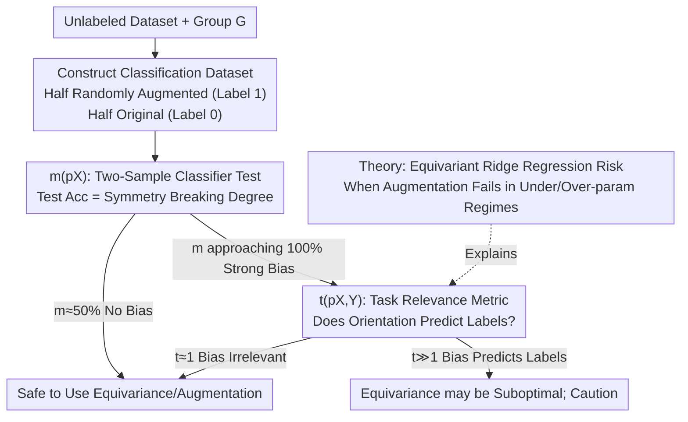

# To Augment or Not to Augment? Diagnosing Distributional Symmetry Breaking

**Conference**: ICLR 2026  
**OpenReview**: [https://openreview.net/forum?id=ZTb4YmHD9n](https://openreview.net/forum?id=ZTb4YmHD9n)  
**Area**: Learning Theory / Equivariant Learning / Data Augmentation  
**Keywords**: Distributional Symmetry Breaking, Data Augmentation, Equivariant Networks, Two-Sample Classifier Test, Ridge Regression Generalization

## TL;DR
This paper proposes a "two-sample classifier test" metric $m(p_X)$ to quantify the **distributional symmetry breaking** of a dataset (i.e., the degree to which $x$ and its transformation $gx$ appear with unequal probabilities). Combined with a task-relevance metric $t(p_{X,Y})$ and a ridge regression theory, it systematically answers "when should data augmentation/equivariant methods be used, and when are they harmful?" It reveals that common point cloud benchmarks like QM9 and ModelNet40 are actually highly "canonicalized," and the benefits of augmentation depend strongly on the dataset.

## Background & Motivation

**Background**: Equivariant networks and data augmentation are the two main methods for injecting physical symmetries (rotation, permutation, etc.) into models. Their theoretical advantages—better sample efficiency and generalization—are almost entirely built on the assumption that the ground-truth labeling function $f$ is equivariant ($f(gx)=gf(x)$).

**Limitations of Prior Work**: Beyond the explicit assumption of equivariance in $f$, there is an **implicit assumption** that has rarely been examined: it is assumed that transformed samples $gx$ appear in the data distribution as frequently as $x$, i.e., $p_X(x)\approx p_X(gx)$. Almost all existing theories on the benefits of equivariance/augmentation (Elesedy & Zaidi, Chen et al.) assume that $x$ and $gx$ occur with equal probability.

**Key Challenge**: Real-world data often **violates** this assumption. Handles on coffee cups are mostly on the side, crystal structures are canonicalized by convention, and QM9 molecules are aligned by SMILES defaults using commercial software like CORINA—all instances of "distributional symmetry breaking" (also known as symmetry bias) where $p_X(x)\neq p_X(gx)$. If data is "canonicalized," orientation information might actually be useful (e.g., "6" and "9" in MNIST are hard to distinguish if rotationally aligned but easy in their natural orientation). In such cases, forced rotational augmentation can discard discriminative information.

**Goal**: (1) Provide a practical metric to **quantify** the degree of symmetry breaking in any dataset without domain priors; (2) Determine whether this bias is relevant to specific task labels; (3) Use theory to explain how distributional asymmetry affects the optimality of equivariant methods.

**Key Insight**: Symmetry breaking is essentially the "gap between the original distribution $p_X$ and its symmetrized version $\bar p_X$." Detecting distribution gaps is a mature problem in machine learning—one can use a classifier to distinguish between two sets of samples; the higher the accuracy, the further apart the distributions.

**Core Idea**: Train a small classifier to distinguish between "original samples" and "randomly augmented samples." **Its test accuracy itself serves as an interpretable degree of symmetry breaking between 0 and 1**—50% indicates perfect symmetry (no bias), while approaching 100% indicates heavy canonicalization.

## Method

### Overall Architecture

The work follows a "Diagnosis + Decision" pipeline: Given an unlabeled dataset, first use $m(p_X)$ to quantify its canonicalization under a group $G$. If bias is significant, use the task-relevance metric $t(p_{X,Y})$ to judge if this bias is useful for the current task. Simultaneously, a ridge regression theory explains the regimes where augmentation flips from beneficial to harmful. Finally, a practical decision flowchart (Figure 6) advises practitioners on whether to apply equivariant methods.

### Key Designs

**1. $m(p_X)$: Turning "Symmetry Breaking" into Interpretable Accuracy via Two-Sample Classifier Test**

To quantify how much $p_X$ deviates from symmetry, the most direct approach is measuring its distance from the "symmetrized distribution" $\bar p_X(x):=\int_{g\in G}p_X(gx)\,dg$ (the closest invariant distribution after averaging over group orbits). While prior work by Chiu & Bloem-Reddy used MMD with kernels, selecting a kernel is difficult—especially for geometric graph data where kernels encoding chemical information are not standard and MMD values are not directly interpretable. Ours uses a common tool for detecting distribution shift: the **Two-Sample Classifier Test**, shifting the difficulty from kernel selection to "network architecture selection."

As shown in Algorithm 1: split the dataset in half; apply a random $g\sim G$ to one half and label it 1; keep the other half as-is and label it 0. Train a binary classification network (NN) and use its test accuracy as the metric:

$$m(p_X) := d_{\text{class}}(p_X,\bar p_X) = \mathbb{E}_{c\sim\text{Bern}(1/2)}\,\mathbb{E}_{x\sim p_c}\big[\mathbf{1}(\text{NN}(x)=c)\big].$$

The interpretability is excellent: if $p_X$ is already group-invariant, then $p_X=\bar p_X$, making it indistinguishable for any network ($m(p_X)\approx 1/2$). If the data is significantly canonicalized, $m(p_X)\approx 1$. The paper also provides intuition for finite groups: for an orbit $\{x_1,\dots,x_r\}$ with probabilities $p(x_i)=\theta_i$, the optimal accuracy is $m(p_X)=1-\frac12\sum_{i=1}^r\min(\frac1r,\theta_i)$. For $C_4$ (order 4), the theoretical maximum for perfect canonicalization is $1-\frac{1}{2\cdot4}=87.5\%$, which matches MNIST empirical results.

**2. $t(p_{X,Y})$: Judging "Task Utility" of Symmetry Bias to Predict Augmentation Damage**

$m(p_X)$ only answers "is there bias," but "should one augment" is a different question—augmentation only hurts when the **bias (e.g., preferred orientation) is correlated with task labels**. This is captured by $t(p_{X,Y})$.

Let the canonicalization function $c:X\to G$ represent where a sample lies on the orbit (its "orientation"). Since data augmentation destroys information in $c(x)$, we measure how much orientation predicts the label: use a **randomly initialized, untrained** equivariant network to extract $c(x)$ and predict $f(x)$ to get loss $\mathcal L\big(c(x)\to f(x)\big)$. Compare this to the loss $\mathcal L_{\text{rot}}$ where input is randomly transformed (orientation info erased):

$$t(p_{X,Y}) := \frac{\mathcal L_{\text{rot}}}{\mathcal L}.$$

When $\mathcal L\ll \mathcal L_{\text{rot}}$ (orientation significantly helps prediction), $t$ is large, suggesting symmetry bias is useful and augmentation might be harmful. In experiments, this metric is significantly $>1$ for tasks where equivariant methods underperform (e.g., QM7b dipole alignment, ModelNet40) and near $1$ for scale properties where equivariance is harmless (e.g., QM9 scalars).

**3. Equivariant Ridge Regression Theory: Explaining the Flip from "Always Beneficial" to "Harmful"**

To provide provable conclusions, ours analyzes high-dimensional ridge regression (approximating NN behavior in NTK space) under asymmetric covariance. Let $y_i=x_i^\top\beta+\varepsilon_i$ where $x_i\sim\mathcal N(0,\Sigma)$ and the ground truth $\beta$ is invariant ($g\beta=\beta$), but crucially **not assuming** $g\Sigma g^\top=\Sigma$. The conclusions split into two regimes:

- **Under-parameterized Regime** ($d<n-1$, $\lambda\to0$, Theorem 1): Data augmentation is **always beneficial**, $\mathbb E[R_X(\hat\beta_{\text{inv}})]=\frac{\sigma^2 d_0}{n-d_0-1}\le \frac{\sigma^2 d}{n-d-1}=\mathbb E[R_X(\hat\beta)]$. However, the risk of symmetrizing during test time ($P_0\hat\beta$) may go to infinity due to correlation between invariant and non-invariant features, $\mathbb E[R_X(P_0\hat\beta)]=\frac{\sigma^2}{n-d-1}\text{Tr}(\Sigma^{-1}\Sigma_{\text{inv}})$.

- **Over-parameterized Regime** ($d>n$, Theorem 2): Using a model with $d_c$ "strongly coupled modes," it is proven that when the **number of coupled modes is much smaller than the ambient dimension**, data augmentation is **guaranteed to be worse** (higher variance). Intuitively: if a non-invariant feature is strongly correlated with an invariant feature used by the ground truth, it is useful; augmentation makes this non-invariant feature unusable.

### A Full Example: Why QM9 Augmentation "Does Not Hurt, and Is Useful"

Taking QM9 (133k small molecules, Rotation Group SO(3)): step one calculates $m(p_X)$, yielding $98.3\%$ globally, indicating high canonicalization (due to SMILES alignment). Naive intuition suggests rotational augmentation would hurt due to distribution shift. However, Table 1 shows augmentation **does not hurt and even helps** for most properties. This requires step two, $t(p_{X,Y})$: for properties like $C_v$ and $\Delta\varepsilon$, $t$ is near 1 (e.g., 1.05 for $C_v$), meaning orientation bias is **irrelevant to these labels**. Furthermore, local experiments (Local QM9 $m=65.9\% \ll 98.3\%$) show equivariant methods rely on **locally equivariant features**. This explains the "high bias but harmless augmentation" paradox. In contrast, ModelNet40 ($t\approx1.41$) and QM7b dipole alignment ($t\approx3.54$) show that where orientation predicts labels, augmentation indeed drops performance.

## Key Experimental Results

### Main Results

Comparison of augmentation/equivariant settings (selected from Table 1; TT=Train+Test Aug, TF=Train Only, FF=No Aug, FT=Test Only; ↓ lower is better, ↑ higher is better):

| Setting / Dataset | QM7b $\vec\mu$ (↓) | QM9 $C_v$ (↓) | MNIST (↑) | ModelNet40 (↑) |
|---|---|---|---|---|
| Equivariant | **41** | 110 | 98.0 | 60.06 |
| TT | 53 | 147 | 97.6 | 62.39 |
| TF | 52 | 146 | 97.6 | 61.97 |
| FF | 100 | 143 | **98.8** | **78.14** |
| FT | 161 | 210 | 40.7 | 16.91 |
| $m(p_X)$ (%) | 89.66 | 98.3 | 87.5 (Theory) | — |

Key comparison: FF (78.14%) is significantly higher than TF (61.97%) on ModelNet40, indicating augmentation is harmful. On QM9, TF (146) and FF (143) are comparable, meaning augmentation is harmless.

### Task Relevance Metric Analysis

$t(p_{X,Y})$ (Table 2, predicting $f(x)$ from $c(x)$):

| Dataset | $\mathcal L$ | $\mathcal L_{\text{rot}}$ | $t=\mathcal L_{\text{rot}}/\mathcal L$ |
|---|---|---|---|
| QM7b Aligned µ | 0.128 | 0.39 | **3.54** |
| QM7b Original µ | 0.38 | 0.39 | 1.03 |
| ModelNet | 12.5 | 8.9 | **1.41** |
| QM9 $C_v$ | 3.07 | 3.22 | 1.05 |
| QM9 $|\vec\mu|$ | 1.14 | 1.17 | 1.02 |

Higher $t$ correlates with performance drops when using equivariance/augmentation, matching Table 1.

### Key Findings
- **Common point cloud benchmarks are highly "canonicalized"**: $m(p_X)$ is very high for QM9 (98.3%), ModelNet40, OC20, and QM7b, representing a long-ignored dataset bias. Even LLM crystal generation datasets show high permutation bias ($m=95\%$).
- **Harmfulness of augmentation is task-dependent**: Despite high $m(p_X)$, augmentation hurts on ModelNet40/MNIST but is harmless on QM9/QM7b—$m$ alone is insufficient; $t$ is required.
- **Local vs. Global**: QM9 local $m$ (65.9%) is lower than global (98.3%), supporting the idea that equivariant methods work on canonicalized data by exploiting local equivariance.
- **Metric robustness**: $m(p_X)$ is not sensitive to network scale (Appendix D.5), making it a reliable diagnostic tool.

## Highlights & Insights
- **Turning "Symmetry Breaking" into a universal metric**: It requires no domain priors or kernels. Training a small classifier provides a 50%-100% score with clear physical meaning for "dataset checkups."
- **Distinguishing $m$ and $t$ is critical**: This explains the "high bias, harmless augmentation" paradox and avoids the mistake of banning augmentation simply because bias exists.
- **Counter-intuitive theoretical insights**: In the under-parameterized regime, augmentation is always beneficial, but test-time symmetrization might explode risk. In the over-parameterized regime, augmentation can fail even on perfectly symmetric data near the interpolation threshold.
- The decision flowchart (Figure 6) provides an actionable judge tree based on $m$, $t$, and OOD requirements.

## Limitations & Future Work
- **Lack of explicit thresholds**: The authors note that while higher $t$ implies more harm, a rigorous "hard threshold" for $t$ is not yet established.
- **$m(p_X)$ for infinite groups (e.g., SO(3)) is only a lower bound**: A high $m$ means "clear preference for specific orientations" but does not imply complete canonicalization.
- **Theoretical assumptions**: The use of linear ridge regression and NTK approximations still leaves a gap with deep equivariant networks, and the covariance model is idealized.
- $t(p_{X,Y})$ relies on a randomly initialized equivariant network; its stability and adaptation to different groups require further validation.

## Related Work & Insights
- **vs. Chiu & Bloem-Reddy (MMD Test)**: They use MMD for non-parametric tests which requires difficult kernel selection for geometric/chemical data. Ours uses classifier accuracy, which is more interpretable and easier to adapt to complex data types.
- **vs. Elesedy & Zaidi / Chen et al. (Equivariance Theory)**: Prior works assume $p_X$ is invariant. Ours relaxes this, proving augmentation can be harmful under asymmetric covariance, a key completion of the literature.
- **vs. Functional Symmetry Breaking (Wang et al.)**: That focuses on $f(gx)\neq gf(x)$ (non-equivariant mapping). Ours focuses on **distributional** symmetry breaking $p(x)\neq p(gx)$ (where the labeling function is equivariant, but the data is canonicalized).

## Rating
- Novelty: ⭐⭐⭐⭐⭐ Quantifying "Distributional Symmetry Breaking" with a practical metric + task relevance + theory is a fresh and consistent perspective.
- Experimental Thoroughness: ⭐⭐⭐⭐ Covers MNIST, point clouds, molecules, and LLMs. However, non-SOTA settings were used, and larger equivariant models could provide more validation.
- Writing Quality: ⭐⭐⭐⭐ Clear intersection of intuition, theory, and experiments. The flowchart is very practitioner-friendly.
- Value: ⭐⭐⭐⭐⭐ Provides an actionable diagnostic tool for the geometric deep learning and molecular ML communities.

<!-- RELATED:START -->

## Related Papers

- [\[ICLR 2026\] Achieving Approximate Symmetry Is Exponentially Easier than Exact Symmetry](achieving_approximate_symmetry_is_exponentially_easier_than_exact_symmetry.md)
- [\[ICLR 2026\] Reducing Symmetry Increase in Equivariant Neural Networks](reducing_symmetry_increase_in_equivariant_neural_networks.md)
- [\[ICLR 2026\] Softmax is not Enough (for Adaptive Conformal Classification)](softmax_is_not_enough_for_adaptive_conformal_classification.md)
- [\[ICLR 2026\] The Softmax Bottleneck Does Not Limit the Probabilities of the Most Likely Tokens](the_softmax_bottleneck_does_not_limit_the_probabilities_of_the_most_likely_token.md)
- [\[ICLR 2026\] Breaking the Total Variance Barrier: Sharp Sample Complexity for Linear Heteroscedastic Bandits with Fixed Action Set](breaking_the_total_variance_barrier_sharp_sample_complexity_for_linear_heterosce.md)

<!-- RELATED:END -->
