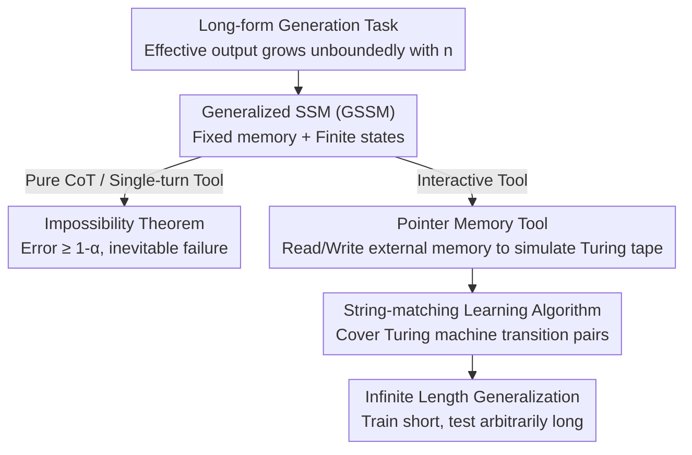

# To Infinity and Beyond: Tool-Use Unlocks Length Generalization in State Space Models

**Conference**: ICLR 2026  
**OpenReview**: [https://openreview.net/forum?id=sSfep4udCb](https://openreview.net/forum?id=sSfep4udCb)  
**Code**: None  
**Area**: Learning Theory / State Space Models / Length Generalization  
**Keywords**: State Space Models, Length Generalization, Tool-Use, ReAct, Long-form Generation

## TL;DR
This paper theoretically proves that fixed-memory State Space Models (SSMs) cannot solve "true long-form generation tasks" regardless of the chain-of-thought (CoT) length. However, by enabling **interactive calls to external memory tools**, SSMs can achieve **infinite length generalization** for any computable long-form task—e.g., training on 5-digit addition and correctly performing 1000-digit addition.

## Background & Motivation
**Background**: Transformers suffer from $O(L^2)$ computation and $O(L)$ memory costs due to the attention mechanism, making them expensive for long contexts and long-chain reasoning (CoT). State Space Models (SSMs) like Mamba, DeltaNet, and GatedDeltaNet, along with linear Transformers, have been proposed. Their advantage is **fixed memory size + linear computational growth with length**, approaching Transformer performance with cheaper inference.

**Limitations of Prior Work**: Existing studies found that SSMs significantly underperform in tasks requiring "long-sequence memory" (in-context learning, long-sequence recall). Consequently, SSMs have not yet replaced Transformers. The question remains: is this deficiency an engineering issue or a fundamental architectural limit?

**Key Challenge**: The "fixed memory" of SSMs is both an efficiency advantage and a representational ceiling. This paper formalizes this as a **long-form generation task**—a task where the size of the effective output space (the minimum support $\mathrm{supp}_\alpha$ covering $\alpha$ probability mass) grows unboundedly as the problem complexity $n$ increases (e.g., multi-digit addition, sorting, bug fixing). Intuitively, a model with a finite set of states cannot distinguish between an infinite number of answers at the output. This contrasts with Transformers, which, via CoT, possess "unbounded memory" that grows with length, enabling them to solve any computable problem in principle.

**Goal**: (1) Strictly characterize the inherent limits of SSMs in long-form generation; (2) Identify a path to break these limits without sacrificing linear efficiency.

**Key Insight**: LLMs are now commonly used as agents that call external tools (searching info, reading/writing files). Allowing an SSM to **interactively** read and write to an external memory is equivalent to providing it with an **effectively unbounded external memory**—the internal state remains finite, but information can be repeatedly offloaded to and retrieved from the external environment.

**Core Idea**: Use "interactive tool-use" to replace "infinitely increasing internal memory" to solve the length generalization problem of SSMs—and prove that **interactive** (not single-turn) tool-use is both necessary and sufficient.

## Method

### Overall Architecture
This work uses theory as the backbone supported by experimental evidence. The logic follows: strictly defining "long-form generation tasks" and "Generalized State Space Models (GSSM)", deriving impossibility and possibility theorems under three tool-use settings (pure CoT / single-turn tool / interactive tool), and finally validating theoretical predictions using real models like Mamba on arithmetic, reasoning, and programming tasks.

The core object is **GSSM**: a (potentially stochastic) function defined by a finite state set $S$, an initial state $s_0$, an update rule $u: S\times\Sigma\to S$, and an output rule $r: S\to\Delta(\Sigma)$. Any model where "memory size does not grow with sequence length"—LSTMs, linear Transformers, Mamba, or sliding-window Transformers—falls under this definition. Standard Transformers and hybrid models are **not** GSSMs as their memory grows with length.

The key pivot in the proof is: while fixed-memory models cannot solve long-form tasks alone (negative result), **integrating external memory tools into a ReAct-style interactive loop** allows a GSSM to simulate a Turing machine's tape, thereby executing any computable algorithm and achieving infinite length generalization (positive result).

### Key Designs

**1. Long-form Generation Task + GSSM: Formalizing the Limits**

The paper formalizes which tasks are fatal for SSMs. Given an input distribution sequence $\{D_n\}$ and a ground-truth function $f$, a **long-form generation task** is defined such that as complexity $n\to\infty$, the minimum support set of the output distribution $\mathrm{supp}_\alpha(f(D_n))$ monotonically increases and tends toward infinity—meaning the number of effective answer types grows unboundedly with difficulty. Multi-digit addition, sorting, and fixing bugs in $n$ lines of code satisfy this.

Under this definition, **Theorem 2.1 (Impossibility)** states: for any GSSM $h$ operating under **pure CoT or single-turn tool** settings, there exists a complexity $n_0$ such that for all $n\ge n_0$, $\mathrm{err}_n(h)\ge 1-\alpha$. The proof uses a pigeonhole argument: the final output is a function of the finite memory states. Since the number of output types increases while states remain finite, many inputs will inevitably map to incorrect answers. Even generating an arbitrarily long CoT cannot save the model because the CoT must be compressed back into the finite state.

**2. Pointer-based External Memory Tool: Simulation of a Turing Tape**

To bypass the internal memory bottleneck, memory is moved externally. Following the **ReAct** framework, the model generates three types of tokens: **thought**, **output (final answer stream)**, and **command (sent to tool oracle $O$ to receive an observation)**. The difference lies in command usage: pure CoT allows no commands; single-turn tools allow one; **interactive tools** allow infinite, interleaved commands.

The key tool is an external memory with a **pointer**: it can initialize the pointer, move it left/right, and read the token under the pointer. **Theorem 2.2 (Possibility)** proves: given such a tool and a simple learning algorithm, for any computable long-form task (where a Turing machine $T$ computes $f$), training trajectories can be constructed such that the algorithm achieves length generalization in an interactive setting. The mechanism uses external memory as the Turing tape, the pointer as the R/W head, thought tokens to track the internal state of the Turing machine, and commands to read/write symbols. Thus, a GSSM in an interactive loop **equivalently simulates a Turing machine**. Note that this **only holds for interactive settings**: single-turn tools are still bound by Theorem 2.1 because reading all information at once would overflow the finite state.

**3. String-matching Learning Algorithm + Localized Trajectories: Generalizing from Short to Long**

Expressive power alone is insufficient; one must show the model can **learn** and **extrapolate**. The analyzed learning algorithm is intentionally simple: it performs **string matching** (similar to n-grams), recording "(state, symbol) $\to$ action" snippets from training trajectories and reusing them for new inputs. Length generalization holds because a Turing machine's transition function is defined for only a **finite number of pairs** of (state, symbol). As long as the training complexity $n_0$ is large enough, these finite pairs will almost all appear in the training data. For larger $n$, every local transition encountered is already "seen," allowing correct step-by-step execution. The sample complexity is $m = n_0 M\log(M/\delta)/\epsilon$, where $M$ is a constant dependent on the Turing machine.

### Loss & Training
Standard **next-token prediction + teacher-forcing** is used. A key technique is **masking**: excluding the input question and observations (results of read operations) from the loss. Since these are generated by the environment/tool, the model is not responsible for predicting them; it only learns to generate thoughts, commands, and final outputs. Training data uses synthetic trajectories that precisely simulate the step-by-step tool interactions of target algorithms (addition, multiplication). Programming tasks utilize trajectories collected from real SWE coding agents.

## Key Experimental Results

### Main Results
On synthetic tasks, the notation $n\to m(p\%)$ indicates "trained on length $n$, achieved accuracy $p$ on length $m$" (showing the maximum $m$ where $p\ge 5\%$). SSM/RNN models significantly outperform Transformers in length extrapolation.

| Model | Addition $n\times 1$ | Mult $n\times 2$ | Logic Graph | Tower of Hanoi |
|------|------|------|------|------|
| Mamba | 10→1K (100%) | 10→1K (100%) | 10→1K (98%) | 8→12 (49%) |
| LSTM | 10→500 (100%) | 10→100 (100%) | 10→1K (100%) | 8→8 (100%) |
| GRU | 10→500 (100%) | 10→100 (100%) | 10→1K (100%) | 8→8 (100%) |
| Pythia (Transformer) | 10→20 (79%) | 10→14 (12%) | 10→1K (5%) | 8→8 (100%) |
| Mistral (Sliding) | 10→13 (25%) | 10→20 (33%) | 10→500 (9%) | 8→8 (100%) |

On addition, Mamba/LSTM trained on 5-digit trajectories can **perfectly** perform 1000-digit addition, while Transformers fail to extrapolate entirely. In programming tasks (bug fixing), Transformers perform well on small codebases, but as complexity exceeds the training distribution, **only Mamba trained with interactive agent trajectories maintains high accuracy**, while the single-turn setting collapses—fully validating the theory.

### Ablation Study
| Configuration | Phenomenon | Description |
|------|------|------|
| Interactive Tool (Full) | Perfect extrapolation to 1000 digits | Setting where theory holds |
| No CoT / No Tool | Almost no length generalization | Degenerates to pure GSSM (Theorem 2.1) |
| Single-turn Tool | Almost no length generalization | One-time read overflows finite memory |
| Hybrid-Mamba | Comparable to Mamba | Attention layers do not break extrapolation |
| RMT (Memory tokens) | No meaningful extrapolation | Learnable memory tokens are insufficient |

### Key Findings
- **Interactivity is the Watershed**: Pure CoT and single-turn tools show almost no extrapolation; only interactive tools unlock infinite length generalization—matching the contrast between the impossibility and possibility theorems.
- **Architectural Differences are Real**: In tool-augmented settings, SSMs/RNNs (Mamba/LSTM/GRU) far exceed Transformers in extrapolation. The authors suggest Transformers are hindered by positional encoding extrapolation, whereas recursive models' "fixed state + external memory" is more stable.
- **Tower of Hanoi is the Hardest**: Because output length grows **exponentially** with $n$, Mamba only extrapolates from 8 to 12 disks (49%), suggesting the growth rate of output length affects extrapolation difficulty.
- **Task Mixing is Valuable**: Auxiliary tasks (addition) sharing computational structures can help the main task (multiplication) extrapolate further when training steps are limited.

## Highlights & Insights
- **Reframing Architecture Debates**: The most striking insight is the reversal of the narrative—the fixed memory of SSMs is indeed a weakness (proven theoretically), but in an agentic/tool-use context, this weakness is compensated for by external memory. SSMs then become superior agent backbones due to their linear efficiency.
- **Turing Simulation as a Bridge**: Using "pointer memory = Turing tape" and "thought tokens = machine state" translates abstract "computability" into a trainable trajectory format. This constructive proof provides a theoretical upper bound and guides synthetic data generation.
- **Transferable Training Recipe**: Loss masking (shielding observations/inputs) + localized trajectories (each step depends only on local context) is a universal technique for any recursive model to learn length generalization in a tool loop.

## Limitations & Future Work
- **Non-standard Learning Algorithm**: Theorem 2.2 uses a string-matching algorithm rather than actual SGD training. The authors admit that whether natural algorithms (like gradient descent on RNNs) yield the same conclusion is not yet proven, though they believe it likely.
- **Trajectory Requirement**: The positive results rely on "trajectories carefully constructed for each task." In reality, optimal algorithms for many tasks are unknown or hard to script.
- **Exponential Output Tasks**: The weak extrapolation on Tower of Hanoi shows that when output length grows exponentially, models struggle to maintain execution stability even with external memory.
- **Future Directions**: Bridging interactive tool loops with real gradient training for length generalization, and studying the automatic induction of tool trajectories rather than using manual scripts.

## Related Work & Insights
- **vs. Transformer Length Generalization (Abbe et al. 2024)**: Previous works helped Transformers extrapolate using "localized" CoT; this paper applies similar "localized + Turing simulation" logic to **SSMs** and adds the **interactive tool** variable—highlighting that the SSM bottleneck is fixed memory, not positional encoding.
- **vs. Neural Turing Machines (Graves et al. 2014)**: Earlier works attempted to simulate Turing machines with end-to-end differentiable memory modules. This paper re-frames it using **discrete ReAct-style calls + string matching**, aligning with the modern agent paradigm.
- **vs. Native Mamba Generalization (Gu & Dao 2023)**: Others modify the architecture to improve SSM extrapolation; this paper instead modifies the **task interaction** (adding external memory), proving this can achieve **perfect** (not just "better") length generalization.

## Rating
- Novelty: ⭐⭐⭐⭐⭐ Highly original contrast between "SSM fixed memory limits" and "interactive tool-use unlocking infinite extrapolation."
- Experimental Thoroughness: ⭐⭐⭐⭐ Covers arithmetic, logic graphs, Tower of Hanoi, and real programming tasks with extensive ablations.
- Writing Quality: ⭐⭐⭐⭐⭐ Clear logical flow from definition to theorem to experiment.
- Value: ⭐⭐⭐⭐⭐ Provides theoretical and empirical support for SSMs as efficient agent backbones, highly relevant for the long-chain reasoning era.

<!-- RELATED:START -->

## Related Papers

- [\[ICLR 2026\] On the Expressiveness of State Space Models via Temporal Logics](on_the_expressiveness_of_state_space_models_via_temporal_logics.md)
- [\[ICLR 2026\] Quantitative Bounds for Length Generalization in Transformers](quantitative_bounds_for_length_generalization_in_transformers.md)
- [\[ICLR 2026\] A Theoretical Analysis of Mamba's Training Dynamics: Filtering Relevant Features for Generalization in State Space Models](a_theoretical_analysis_of_mambas_training_dynamics_filtering_relevant_features_f.md)
- [\[ICLR 2026\] Quotient-Space Diffusion Models](quotient-space_diffusion_models.md)
- [\[ICLR 2026\] Provable Separations between Memorization and Generalization in Diffusion Models](provable_separations_between_memorization_and_generalization_in_diffusion_models.md)

<!-- RELATED:END -->
