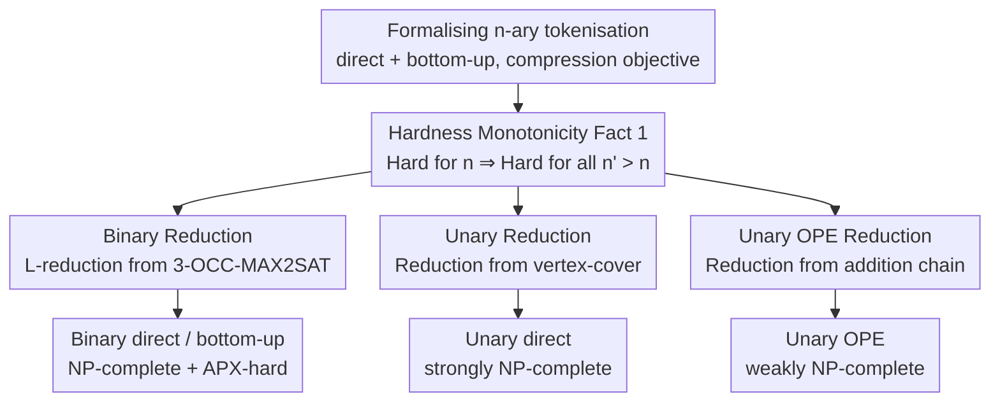

# Tokenisation over Bounded Alphabets is Hard

**Conference**: ICLR 2026  
**OpenReview**: [https://openreview.net/forum?id=Xhf9YqwlM4](https://openreview.net/forum?id=Xhf9YqwlM4)  
**Code**: None  
**Area**: Learning Theory / Computational Complexity  
**Keywords**: Tokenisation, Computational Complexity, NP-complete, APX-hard, Inapproximability

## TL;DR
While finding an "optimal tokeniser" was previously proven to be NP-complete, those proofs assumed an infinite alphabet (unrealistic). This paper restricts tokenisation to **finite, even binary or unary alphabets**, proving it remains NP-complete and APX-hard (precluding polynomial-time approximation schemes unless P=NP). This establishes the theoretical necessity of heuristic algorithms like BPE and UnigramLM.

## Background & Motivation
**Background**: Tokenisation is the first step in almost all NLP pipelines, segmenting a string $c$ into a sequence of subwords $s$. Language models operate on subwords rather than raw characters. The most common optimisation objective for selecting a tokeniser is the **compression rate**—shorter subword sequences allow more data to be processed for the same computational cost. Compression has been repeatedly shown to correlate positively with downstream model performance. Two main tokenisation approaches exist: **direct**, which provides a vocabulary $S$ and finds the optimal segmentation using the fewest subwords; and **bottom-up** (e.g., BPE), which provides a sequence of merge operations $m=\langle m_1,\dots,m_K\rangle$ applied sequentially.

**Limitations of Prior Work**: Common algorithms like BPE and UnigramLM are greedy or heuristic, offering no guarantee of finding the optimal tokeniser for their respective objectives. Recent studies (Kozma & Voderholzer 2024; Whittington et al. 2025; Lim et al. 2025) proved that finding an optimal tokeniser under compression objectives is NP-complete, and in some cases APX-hard, theoretically justifying the use of heuristics.

**Key Challenge**: However, these proofs **all assume an infinite alphabet**. In reality, strings consist of Unicode characters (~170,000), bytes (256), or even bits (2), meaning the alphabet is **finite and fixed**. Could the computational hardness be an artifact of the unrealistic assumption of an infinite alphabet? In other words, could optimal tokenisation be solved efficiently on small alphabets like binary or unary? This is a meaningful open question.

**Goal**: To define the **n-ary tokenisation problem** (where alphabet size is fixed to $n$) and determine if it remains hard under both direct and bottom-up variants.

**Core Idea**: Starting from the simplest alphabets (unary $n=1$, binary $n=2$), the authors prove that **even these simplest cases are hard**—both NP-complete and (for binary) APX-hard. Explicit inapproximability constants are calculated. Since the difficulty of the n-ary problem is monotonic with respect to $n$, proving hardness for the simplest cases implies hardness for all larger alphabets. Conclusion: Computational difficulty is an **inherent barrier** of tokenisation, not a result of large alphabets or complex constructions.

## Method

### Overall Architecture
The paper is a pure complexity theory work involving no experiments but exclusively reduction proofs. The logic follows three steps: first, formalising "n-ary tokenisation" into decision, optimisation, and gap versions; second, demonstrating a **hardness monotonicity** (hardness for a small alphabet implies hardness for a larger alphabet); and third, performing polynomial-time reductions for the unary and binary cases from classically hard problems.

The specific reduction paths are: **Binary** direct/bottom-up via L-reduction from APX-hard **3-OCC-MAX2SAT**, yielding NP-completeness + APX-hardness + explicit gap constants; **Unary direct** via reduction from **vertex-cover**, yielding strong NP-completeness; and **Unary bottom-up OPE variant** via reduction from **addition chain**, yielding weak NP-completeness.

To clarify inapproximability, two objectives and two problem types are defined. **Two compression objectives**: compressed length $G_\ell(\text{tok},D)=\sum_{c\in D}|\text{tok}(c)|$ (number of remaining symbols) and compression reduction $G_r(\text{tok},D)=\sum_{c\in D}(|\text{tok}(c)|-|c|)$ (number of symbols removed). These are equivalent for ranking tokenisers but differ significantly in measuring approximation quality: a sub-optimal solution may have an approximation ratio of 2 under $G_\ell$ but only 1.125 under $G_r$. The authors argue that $G_\ell$ is more natural as it corresponds to the throughput of a language model. Therefore, **all inapproximability results are based on $G_\ell$**. **Two problem types**: the decision version asks if symbols can be compressed to $\le\delta$ (for NP-hardness), and the optimisation version asks for the minimum compression. A **gap version** with double boundaries $(\delta_-,\delta_+)$ is also defined to calculate explicit inapproximability constants.

### Key Designs

**1. Hardness Monotonicity: Shrinking the problem to unary and binary alphabets**

Proving hardness for any alphabet individually is impossible. The key observation is that n-ary tokenisation problems form a clear hierarchy from easy ($n=1$) to hard ($n\to\infty$). **Fact 1** states: if n-ary tokenisation is hard, then $n'$-ary tokenisation is hard for all $n'>n$. The proof is a trivial reduction: any instance of an n-ary problem is a valid instance of an $n'$-ary problem (the alphabet is simply larger), and the solutions are identical. This monotonicity collapses the task of proving hardness for all alphabets into proving it for $n=1$ and $n=2$. This justifies the title "over bounded alphabets is hard": if binary bit-strings and unary strings are hard, more complex byte or Unicode strings are inevitably hard.

**2. Binary Reduction: Encoding Boolean variables with run-lengths of 0s**

The binary case addresses whether an alphabet of $\{0,1\}$ simplifies the problem. The authors perform an L-reduction from **3-OCC-MAX2SAT** (the maximum 2-satisfiability problem where each variable appears in exactly 3 clauses, proven APX-hard by Berman & Karpinski 1999). For **direct tokenisation (Reduction 1)**, each Boolean variable $X_j$ is encoded as a run of 0s: $x_j^T=0^{2j-1}$ and $x_j^F=0^{2j}$. Using 1 as a delimiter, four subsets $D_1 \sim D_4$ are constructed. $D_1, D_2, D_3$ are repeated with carefully chosen constant factors $f''=7, f'=21, f=63$ to **force a "sat-compliant" tokeniser**: any optimal tokeniser must contain tokens $1x_j^T, x_j^T1, 1x_j^F, x_j^F1$, and for each $j$, must choose between $1x_j^T1$ or $1x_j^F1$. This choice encodes the truth value of $X_j$. $D_4$ encodes each clause $1L_i^11L_i^21$, which can be compressed to 2 tokens if and only if one of its literals is true. Thus, optimal compression achieves $\delta=329J+3I-\gamma$ if and only if an assignment satisfies $\ge\gamma$ clauses.

Critically, this is an **L-reduction** (with a reduction function and a reconstruction function to map tokeniser solutions back to SAT solutions with bounded quality loss). By keeping factors $f, f', f''$ as **constants**, the APX-hardness of 3-OCC-MAX2SAT is preserved, proving that binary direct tokenisation is **APX-hard** with no polynomial algorithm providing an approximation ratio $\rho<1.000002$ (unless P=NP). The **bottom-up version (Reduction 2)** follows a similar logic, extending the data to $D_1 \sim D_5$ with larger constants, proving it is **APX-complete** with $\rho<1.0000001$.

**3. Unary Reduction: Ensuring uniqueness via numerical radix for strong NP-completeness**

The most counter-intuitive result is that direct tokenisation is hard even for a **unary alphabet** $\Sigma=\{a\}$, where strings differ only in length. There is a distinction between **strong** and **weak** NP-hardness. Unary strings can be represented as explicit strings (length $\ell$ takes $\ell$ input bits) or as a number $\ell$ (taking $\log\ell$ input bits). The authors prove **strong NP-completeness** (hard even with explicit string representation), making Fact 1 applicable.

The proof uses a reduction from **vertex-cover (Reduction 3)**. The technique involves **encoding each vertex as a large number $N=(J+I+1)^4$** within a radix system: $\text{enc}(v_j)=j+j^2N+j^3N^2$. Setting $B=N^4$, three subsets are constructed: vertex strings $D_1$ (length $\text{enc}(v_j)$), cover strings $D_2$ (length $\text{enc}(v_j)+B$), and edge strings $D_3$ (length $\text{enc}(v_j)+\text{enc}(v_{j'})+B$). The radix $N$ is large enough that all string lengths and sums of two lengths are **unique**. Consequently, an optimal vocabulary only selects "complete strings" as tokens, and selecting cover strings corresponds to selecting vertices for the cover set. Compression to $\delta=3J+2I+1-\psi$ occurs if and only if a vertex cover of size $\le\psi$ exists. The authors also note that unary direct tokenisation is equivalent to the **change-making problem** (finding the optimal set of coin denominations), proving that the decision version of the optimal denomination problem is strongly NP-complete (**Corollary 1**).

**4. Unary OPE Variant: Weak NP-completeness from addition chain**

While the standard unary bottom-up version remains an open problem, the authors analyze a common relaxation—**OPE (optimal pair encoding)**. Here, the merge sequence $m$ is used to derive a vocabulary $S_m=\Sigma\cup\{s_1\circ s_2\mid m\in m\}$, which is then applied via optimal direct segmentation. By reducing from the **addition chain problem** (which is NP-complete under binary encoding), they prove that unary OPE is at least **weakly NP-complete**. The reduction reveals that finding the shortest addition chain for a set of numbers is equivalent to an OPE case where every string in the dataset must be compressed into a single token.

## Key Experimental Results

### Complexity Landscape Summary
| Alphabet | Variant | Main Conclusion | Inapproximability Constant ($G_\ell$) |
| :--- | :--- | :--- | :--- |
| Binary $n=2$ | direct | NP-complete + APX-hard | $\rho<1.000002$ |
| Binary $n=2$ | bottom-up | NP-complete + APX-complete | $\rho<1.0000001$ |
| Unary $n=1$ | direct | **Strongly** NP-complete | — |
| Unary $n=1$ | OPE Variant | (At least) **Weakly** NP-complete | — |
| Unary $n=1$ | Standard bottom-up | Open | — |

### Comparison with Prior Work
| Work | Alphabet Assumption | Conclusion |
| :--- | :--- | :--- |
| Kozma & Voderholzer 2024 | Infinite | bottom-up: NP-complete + APX-hard |
| Whittington et al. 2025 | Infinite | direct + bottom-up: NP-complete |
| Lim et al. 2025 | Infinite | direct (with candidate tokens): NP-complete |
| **Ours** | **Finite (Binary/Unary)** | Hardness persists even for the smallest alphabets |

### Key Findings
- **Hardness is not an artifact of large alphabets**: Previous proofs relied on infinite alphabets. This paper shows that even binary or unary inputs are hard, proving computational difficulty is an **inherent barrier** of tokenisation.
- **Direct is more "stubborn" than bottom-up**: In the unary case, direct tokenisation is strongly NP-complete, whereas standard bottom-up hardness remains unproven, suggesting an asymmetric complexity landscape.
- **Elegant cross-disciplinary links**: Unary direct tokenisation $\equiv$ optimal coin denomination problem; unary OPE $\equiv$ addition chain problem.

## Highlights & Insights
- **Hardness Monotonicity strategy**: Proving that the simplest cases (n=1, 2) are hard to cover all $n$ is a highly efficient proof architecture.
- **Constant multipliers for APX-hardness**: Setting $f, f', f''$ as constants is the key technical difference from previous NP-hardness proofs, allowing for the derivation of explicit gap constants.
- **Unique encoding via large radix**: The use of $N=(J+I+1)^4$ to ensure unique string lengths and sums is a powerful technique for embedding graph structures into unstructured unary inputs.
- **Confirming practical intuition**: The paper provides mathematical proof that BPE and UnigramLM must be heuristic. Since optimal solutions cannot be found in polynomial time even for binary inputs, future research should focus on "provably good" approximation algorithms.

## Limitations & Future Work
- **Single Objective**: Only the **compression** objective was analyzed. The hardness of other objectives, such as negative log-likelihood in UnigramLM or Rényi efficiency, remains unknown.
- **Incomplete variant coverage**: Standard unary bottom-up tokenisation remains an open problem.
- **Approximation landscape gap**: While binary optimization is APX-hard, it is unknown if binary direct tokenisation belongs to APX (i.e., if a constant-factor approximation exists). The constants provided (e.g., 1.000002) were not optimized and are likely much lower than the true bounds.
- **Strong vs. Weak NP-hardness**: Whether unary OPE is strongly NP-complete remains to be solved.

## Related Work & Insights
- **vs. Whittington et al. (2025)**: They showed NP-completeness under **infinite alphabets**. This paper adapts their binary reduction and upgrades it to APX-hardness for finite alphabets.
- **vs. Kozma & Voderholzer (2024)**: They proved bottom-up tokenisation is APX-hard under infinite alphabets. This paper extends this to prove binary bottom-up is **APX-complete**.
- **vs. Lim et al. (2025)**: They used a partition cover perspective for direct tokenisation (infinite alphabets). This paper complements their work by focusing on the orthogonal dimension of restricted alphabets.

## Rating
- Novelty: ⭐⭐⭐⭐⭐ Successfully pushes tokenisation hardness proofs down to binary/unary alphabets, resolving previous open questions.
- Experimental Thoroughness: ⭐⭐⭐⭐ Purely theoretical, but the reductions are rigorous and cover multiple alphabets and variants.
- Writing Quality: ⭐⭐⭐⭐⭐ Clear notation, precise problem definitions, and well-structured proof sketches.
- Value: ⭐⭐⭐⭐⭐ Provides a solid theoretical foundation for the use of heuristics in tokenisation and directs research towards approximation algorithms.

<!-- RELATED:START -->

## Related Papers

- [\[ICLR 2026\] How hard is learning to cut? Trade-offs and sample complexity](how_hard_is_learning_to_cut_trade-offs_and_sample_complexity.md)
- [\[ICLR 2026\] Learning the Inverse Temperature of Ising Models under Hard Constraints using One Sample](learning_the_inverse_temperature_of_ising_models_under_hard_constraints_using_on.md)
- [\[ICLR 2026\] Learning Shrinks the Hard Tail: Training-Dependent Inference Scaling in a Solvable Linear Model](learning_shrinks_the_hard_tail_trainingdependent_inference_scaling_in_a_solvable.md)
- [\[ICLR 2026\] Quantum Machine Learning Advantages Beyond Hardness of Evaluation](quantum_machine_learning_advantages_beyond_hardness_of_evaluation.md)
- [\[ICLR 2026\] Poly-attention: a general scheme for higher-order self-attention](poly-attention_a_general_scheme_for_higher-order_self-attention.md)

<!-- RELATED:END -->
