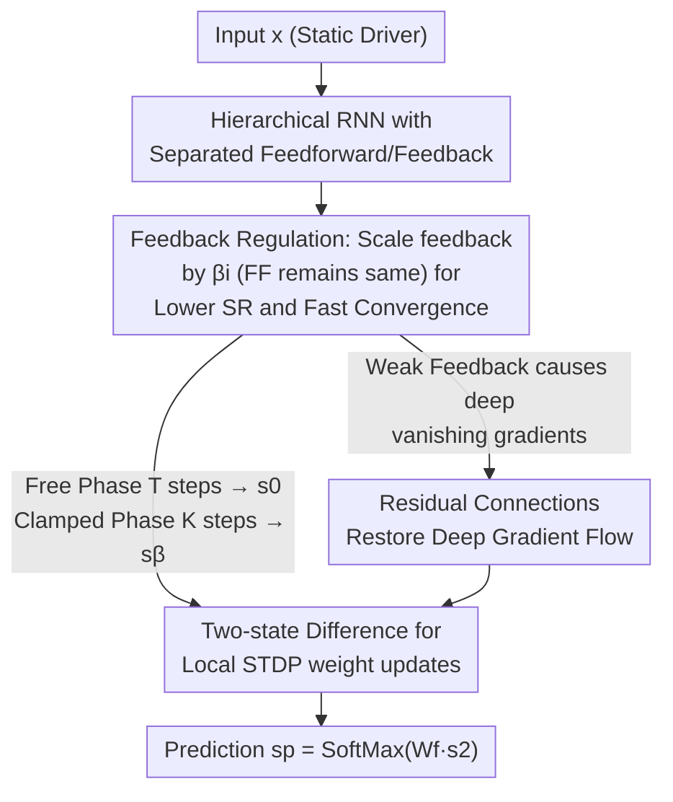

# Toward Practical Equilibrium Propagation: Brain-Inspired Recurrent Neural Network with Feedback Regulation and Residual Connections

**Conference**: ICLR 2026  
**OpenReview**: [https://openreview.net/forum?id=e5l1sD0nk2](https://openreview.net/forum?id=e5l1sD0nk2)  
**Area**: Brain-inspired Learning / Biologically Plausible Learning Algorithms  
**Keywords**: Equilibrium Propagation, Biologically Plausible Learning, Feedback Regulation, Residual Connections, Convergence

## TL;DR
Addressing the long-standing issues of slow training and instability in Equilibrium Propagation (EP), this paper proposes FRE-RNN, a brain-inspired recurrent network with feedback regulation and residual connections. By scaling only the feedback path intensity with a small coefficient $\beta_i$, the RNN convergence is accelerated, while residual connections mitigate the resulting vanishing gradients. This approach makes EP training one to two orders of magnitude faster than existing implementations while achieving accuracy comparable to Backpropagation (BP) on MNIST/CIFAR-10.

## Background & Motivation
**Background**: Backpropagation (BP) powers modern AI but relies on non-local error signals, weight transport, and precise access to activation function derivatives—features that are biologically implausible and costly for neuromorphic hardware. Equilibrium Propagation (EP) is an hardware-friendly alternative: it treats an RNN as a dynamical system that converges to a steady state under input (free phase) and then is "nudged" toward a new steady state by prediction errors at the output layer (clamped phase). Weight updates utilize only the **local information** of the difference between these two steady states, which is naturally compatible with STDP and bypasses explicit derivative computation.

**Limitations of Prior Work**: While conceptually elegant, EP is practically difficult to use—RNNs often require dozens or hundreds of iterations to reach a steady state. Running both the free and clamped phases for so many steps leads to extremely slow training and numerical instability. Previous attempts to accelerate EP (e.g., various backward iterations or analytical methods) have significantly complicated the pipeline.

**Key Challenge**: The cost and stability of EP are bottlenecked by the **convergence** of the RNN. RNN dynamics are determined by the spectral radius (SR) of the weight matrix; a larger SR leads to oscillations or chaos and slower convergence. An intuitive acceleration method is to shrink the feedforward weights $W_i$ to lower the SR, but since feedforward paths also carry inference signals, shrinking them directly weakens layer-to-layer information transfer and harms accuracy—**accelerating training and preserving accuracy are in direct conflict via "feedforward weight scaling."**

**Goal**: (1) Enable fast RNN convergence without destroying feedforward inference signals, thereby reducing the training/inference cost of EP; (2) Solve the subsequent vanishing gradient problem in deep networks to allow EP to scale to 10–20 layers.

**Key Insight**: The authors draw inspiration from the structure and dynamics of the cerebral cortex, which **dynamically regulates the strength of feedforward and feedback connections** (feedforward dominates when stimuli first appear, while feedback is prominent during spontaneous activity). Furthermore, the cortex is not a strict hierarchical chain but a "recurrent network" filled with lateral and inter-area feedback loops and long-range shortcuts, a topology that naturally possesses short average path lengths.

**Core Idea**: Move "tuning network dynamics" from the feedforward path to the feedback path—**only scale the feedback intensity by a coefficient $\beta_i$** (keeping feedforward weights intact). This weak feedback achieves fast convergence and stability, while **residual connections** recover the gradient flow lost to weak feedback.

## Method

### Overall Architecture
FRE-RNN operates within the standard "two-phase" EP framework but introduces two structural modifications. The input and output layers are decoupled from the recurrent core (with the output layer using SoftMax for comparison with feedforward networks). The intermediate hidden layers $s_1, s_2, \dots$ form the actual RNN: each hidden layer has feedforward weights $W_i$ (scaled by $\alpha_i$, default $\alpha_i=1$) and feedback weights $B_i$ (scaled by $\beta_i$, default $0.01$–$0.1$). The state update for the entire network is:

$$s^{\beta_f}[t+1] = \rho\big(W \cdot s^{\beta_f}[t] + b\big),\qquad b = [\,W_0 s_0,\ \beta_f B_f e_p\,],$$

where $\rho$ is the activation function, $e_p = s_{\star} - s_p$ is the prediction error, and $\beta_{f}$ is the "nudging factor," which essentially scales the error feedback intensity.

Training occurs in two phases: the **free phase** sets $\beta_f=0$, and the RNN iterates $T$ steps to converge to steady state $s^0$, yielding prediction $s_p = \text{SoftMax}(W_f s_2)$. The **clamped phase** allows the error $e_p$ to nudge the network via the feedback path $B_f$ (multiplied by $\beta_{f1}$, default $0.1$ for hierarchical and $0.25$ for convolutional) and iterates $K=T/2$ steps to a new steady state $s^{\beta_{f1}}$. Weight updates use the difference between the two states, following STDP-compatible rules:

$$\Delta W_i = ds_{i+1}\cdot (s^0_i)^\top,\qquad ds_{i+1}=s^{\beta_{f1}}_{i+1}-s^0_{i+1},$$

and output weights $\Delta W_f = (s_\star - s^0_p)\cdot (s^0_2)^\top$. Crucially, by reducing $\beta_i$, the iterations $T, K$ required for convergence are drastically reduced, making the two-phase process much faster. Residual connections are then added to restore gradient flow.

### Key Designs

**1. Feedback Regulation: Scaling only feedback $\beta_i$ for fast convergence without harming feedforward signals**

This directly addresses the conflict between speed and accuracy. RNN convergence speed is governed by the spectral radius (SR); a small SR leads to signal decay over time and a stable, fast-converging network, while a large SR causes oscillations or chaos. Scaling the entire weight matrix is the simplest way to lower SR, but since $W_i$ carries inference signals, scaling it results in layer-wise signal attenuation and accuracy collapse. The authors **apply scaling only to the feedback path**: feedforward weights $W_i$ are kept intact ($\alpha_i=1$), and only feedback weights are multiplied by a small coefficient $\beta_i$ (default $0.01$–$0.1$). Similar to the nudging factor $\beta_f$, $\beta_i$ scales the incoming gradient intensity. This lowers the SR—reducing convergence iterations from hundreds to tens—without affecting feedforward inference. The paper quantifies this using SR and Finite-Time Maximum Lyapunov Exponents (FTMLE): $\beta_i$ is positively correlated with SR, and when $\beta_i < 1$, both SR and FTMLE are suppressed, significantly shortening convergence time. Note that $\beta_i > 1$ (upregulating feedback) also reduces FTMLE and convergence time, but this is due to neuron state **saturation**, which degrades accuracy. Thus, the "weak feedback" regime is the effective range. Feedback weights remain fixed during training, further simplifying the implementation compared to vector-field EP.

**2. Residual Connections: Short paths to compensate for deep vanishing gradients caused by weak feedback**

Weak feedback is a double-edged sword: it enables fast convergence but exacerbates vanishing gradients in deep RNNs (the error signal decays repeatedly through each layer's weak feedback). Borrowing from cortical long-range shortcuts, the authors introduce **residual connections across non-adjacent layers**. In a 10-layer symmetric RNN, 3 long-range bidirectional residual chains skip adjacent layers; for asymmetric connections, edges are randomly added between any non-adjacent layers with probability $P=20\%$, forming an "Arbitrary Graph Topology" (AGT). Residual connections **shorten the credit assignment path**, providing a "shortcut" for gradients to return without being attenuated by layer-wise weak feedback. Consequently, MNIST accuracy for a 10-layer network increases by ~5% and CIFAR-10 by ~9% with residuals, even allowing the training of 20-layer networks. Asymmetric AGT even outperforms Feedback Alignment (FA) on MNIST. This design complements feedback regulation: the former ensures speed and stability, while the latter ensures that "speed and stability" do not come at the cost of trainability in deep networks.

**3. Weak feedback implicitly coordinates layer-wise plasticity, removing the need for layer-specific learning rates**

This is a side benefit of feedback regulation, corresponding to its biological role. Previous EP research argued that weak feedback creates huge gradient disparities, requiring learning rates that differ by orders of magnitude for each layer. This paper finds that because weak feedback naturally creates gradients of different intensities across layers, a 3-layer RNN with $\beta_i=0.01$ can be trained with a **unified learning rate** (Table 1, "ours (tanh)"). In other words, the $\beta_i$ coefficient acts as both a convergence tuner and an implicit coordinator of layer-wise plasticity. This aligns with the hypothesis that different cortical areas possess different plasticities due to their functions—disparities in plasticity can be achieved either explicitly via learning rates or implicitly by modulating gradient intensity.

### Loss & Training
Training follows the contrastive update of EP (see $\Delta W_i, \Delta W_f$ above), requiring no explicit backpropagation chain. Default hyperparameters: $T = 10 \times N_{\text{hidden}}$, $K = T/2$ (Table 2 uses $K = 5 \times N_{\text{hidden}}$ to ensure saturation at $\beta_i = 0.1$); hierarchical structures use $\beta_i = 0.01$, convolutional use $0.01$. Shallow networks (<4 layers) use feedback scaling of $0.01$–$0.1$, while deeper structures use $0.1$–$0.25$. Adam is the primary optimizer, with tanh or hard-sigmoid activations. Feedback weights are fixed during training.

## Key Experimental Results

Experiments were conducted on MNIST (70k 28x28 images) and CIFAR-10 (60k 32x32 images), compared against prototype EP (P-EP), BP, and Feedback Alignment (FA), with 5 independent runs per experiment.

### Main Results: Accuracy and Cost Comparison with P-EP / BP (Table 1)

| Architecture | Method | Test Accuracy | Wall-clock Time (HH:MM:SS) |
| :--- | :--- | :--- | :--- |
| 2HL | P-EP (sigmoid-s) | 98.05%±0.10% | 1:56:– |
| 2HL | **Ours (tanh, Adam)** | **98.39%±0.04%** | **0:01:16** |
| 2HL | BP (tanh, Adam) | 98.26%±0.06% | 0:00:18 |
| 3HL | P-EP (sigmoid-s) | 97.99%±0.18% | 8:27:– |
| 3HL | **Ours (tanh, Adam)** | **98.36%±0.06%** | **0:02:11** |
| 3HL | BP (tanh, Adam) | 98.36%±0.08% | 0:00:24 |
| Conv | P-EP (hard-sigmoid) | 98.98%±0.04% | 8:58:– |
| Conv | **Ours (hard-sigmoid)** | **99.14%±0.02%** | **0:12:28** |

Compared to P-EP, ours is at least an order of magnitude faster in both hierarchical and convolutional architectures (3HL reduced from 8h 27m to 2m 11s), with slightly improved accuracy comparable to BP. The speedup stems primarily from the significant reduction in iterations required for convergence.

### Ablation Study: Role of Residuals and Depth Scalability (Table 2)

| Arch-Conn | Method | MNIST Test | CIFAR-10 Test |
| :--- | :--- | :--- | :--- |
| 5-symm | BP | 97.69%±0.10% | 49.23%±0.81% |
| 5-symm | Ours | 97.64%±0.10% | 50.72%±0.17% |
| 10-symm | Ours (No Residual) | 92.49%±0.32% | 34.90%±0.38% |
| 10-symm | **Ours-Residual** | **97.49%±0.05%** | **44.46%±0.51%** |
| 10-asymm | FA | 94.52%±0.26% | 30.16%±6.12% |
| 10-asymm | **Ours-AGT** | **96.87%±0.11%** | 30.94%±4.90% |
| 20-symm | Ours-Residual | 95.95%±0.18% | 43.61%±1.17% |
| Conv | Ours | 99.27%±0.07% | 75.04%±0.51% |

### Key Findings
- **Residuals are vital for deep EP**: Without residuals, a 10-layer symmetric network achieves only 92.49% on MNIST and 34.90% on CIFAR-10; with residuals, these recover to 97.49% (+5%) and 44.46% (+9%), close to BP at the same depth, and allow training up to 20 layers.
- **$\beta_i$ has an optimal range coupled with depth**: Shallow networks favor small $\beta_i$ (0.01–0.1), while deep networks suffer from vanishing gradients if $\beta_i$ is too small; the optimal $\beta_i$ shifts upward with depth. At $\beta_i=4$, accuracy fails to pass 95% even with $T=100$ due to large SR/FTMLE and instability.
- **Feedback downregulation yields definitive speedup**: Models with $\beta_i=0.01$ and $T=10, K=5$ perform similarly to $T=100, K=50$, allowing a 10x compression of iterations.
- **Limitations of asymmetric random feedback**: On CIFAR-10, 10-layer asymmetric AGT is nearly 14% lower than the symmetric version, attributed to error signals being distorted by multiple random fixed feedback connections, making it difficult to coordinate feedforward weight learning.

## Highlights & Insights
- **Moving "dynamics tuning" from feedforward to feedback** is the key move: while scaling both lowers SR, scaling feedback preserves inference signals whereas scaling feedforward harms both. The placement of a single coefficient $\beta_i$ determines EP's practicality.
- **One coefficient, three roles**: $\beta_i$ simultaneously controls convergence speed, stability (SR/FTMLE), and layer-wise plasticity disparities, enabling training with a unified learning rate and solving the historically difficult layer-wise tuning in EP.
- **Biological inspiration translates to quantifiable engineering gains**: The observations of "dynamic feedback regulation" and "long-range shortcuts" in the cortex correspond precisely to feedback scaling and residual connections. The method exhibits significant robustness to weight/state noise, offering direct guidance for in-situ learning on neuromorphic hardware.
- These structural changes are orthogonal to other algorithmic accelerations (like analytical methods), allowing for superimposed use to expand the design space of efficient EP.

## Limitations & Future Work
- **Gap with BP on complex datasets**: Deep fully connected networks on CIFAR-10 significantly lag behind BP, likely due to imprecise gradient approximation in EP; applicability to deep CNNs remains unverified.
- **Fast degradation of asymmetric structures**: Inaccurate random error feedback leads to faster accuracy decay as depth increases; how to design residual topologies for large-scale deep asymmetric networks remains to be studied.
- **Heuristic hyperparameters**: The effective range of $\beta_i$ (0.01–0.1 for shallow, 0.1–0.25 for deep) is currently found through empirical tuning; a general method for automated determination is missing.
- **Limited to static inputs**: Like most EP work, this handles static input classification; extending naturally converging EP-RNNs to sequential tasks remains an open problem.

## Related Work & Insights
- **vs P-EP (Prototype EP)**: P-EP integrates input/output layers into the recurrent core and uses symmetric energy models, leading to slow convergence (hours). This paper uses a vector-field setting, decouples I/O layers, and scales feedback to achieve 1–2 orders of magnitude speedup with superior accuracy.
- **vs BP**: BP relies on non-local errors, weight transport, and explicit derivatives; ours is a local, STDP-compatible alternative that matches BP in shallow/convolutional settings but lags in deep complex tasks.
- **vs Feedback Alignment (FA)**: FA uses random fixed feedback to propagate errors. Our asymmetric AGT outperforms FA on MNIST and is competitive on CIFAR-10, while providing additional control over convergence and stability.
- **Theoretical Links**: The authors demonstrate that in the infinitesimal limit of "weak nudging + weak feedback," the EP of FRE-RNN is equivalent to Local Representation Alignment (LRA) and BP, with weak feedback making dynamics closer to feedforward networks.

## Rating
- Novelty: ⭐⭐⭐⭐ Moving network dynamics tuning from feedforward to feedback is simple but crucial; using residuals to solve deep vanishing gradients is a clean approach.
- Experimental Thoroughness: ⭐⭐⭐⭐ Systematically explores $\beta_i$ across depth for SR/FTMLE/convergence/accuracy with solid ablation; however, limited to MNIST/CIFAR-10.
- Writing Quality: ⭐⭐⭐⭐ Motivations and biological correspondences are clear; formulas and pseudocode are complete.
- Value: ⭐⭐⭐⭐ Advances EP from "theoretical curiosity" to "practically usable," achieving 1–2 orders of magnitude speedup and BP-level results, with direct implications for neuromorphic hardware.

<!-- RELATED:START -->

## Related Papers

- [\[ICLR 2026\] Online Learning and Equilibrium Computation with Ranking Feedback](online_learning_and_equilibrium_computation_with_ranking_feedback.md)
- [\[ICLR 2026\] Parameterized Hardness of Zonotope Containment and Neural Network Verification](parameterized_hardness_of_zonotope_containment_and_neural_network_verification.md)
- [\[ICLR 2026\] Training-Free Determination of Network Width via Neural Tangent Kernel](training-free_determination_of_network_width_via_neural_tangent_kernel.md)
- [\[ICLR 2026\] Residual Feature Integration is Sufficient to Prevent Negative Transfer](residual_feature_integration_is_sufficient_to_prevent_negative_transfer.md)
- [\[ICLR 2026\] Enabling Fine-Tuning of Direct Feedback Alignment via Feedback-Weight Matching](enabling_fine-tuning_of_direct_feedback_alignment_via_feedback-weight_matching.md)

<!-- RELATED:END -->
