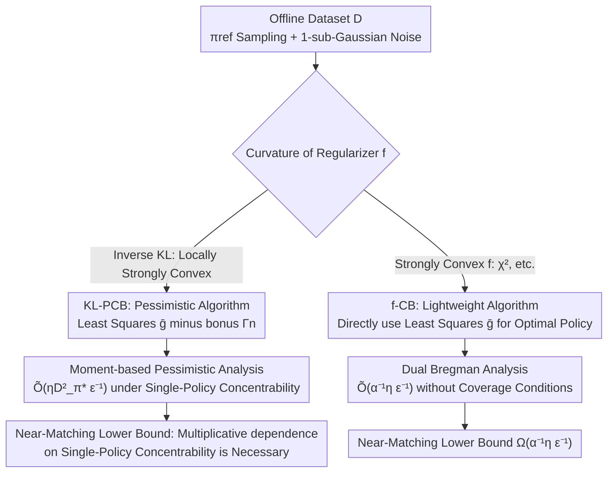

# Towards a Sharp Analysis of Offline Policy Learning for f-Divergence-Regularized Contextual Bandits

**Conference**: ICLR 2026  
**OpenReview**: [https://openreview.net/forum?id=ly6MB2Cfx2](https://openreview.net/forum?id=ly6MB2Cfx2)  
**Code**: None  
**Area**: Learning Theory / Offline Reinforcement Learning / Contextual Bandits  
**Keywords**: Offline policy learning, f-divergence regularization, sample complexity, concentrability, pessimism

## TL;DR
This paper provides the **weakest data coverage conditions** required for offline $f$-divergence regularized contextual bandits to achieve an $\widetilde{\Theta}(\epsilon^{-1})$ sample complexity under a regularized objective. For the most commonly used inverse KL regularization, a new pessimistic estimation analysis achieves $\widetilde{O}(\epsilon^{-1})$ under **single-policy concentrability** for the first time, accompanied by nearly matching lower bounds. For divergences with a strongly convex $f$, it is proven that an $\widetilde{\Theta}(\epsilon^{-1})$ rate can be achieved **without any pessimistic estimation or coverage conditions**.

## Background & Motivation

**Background**: Many offline RL algorithms rely on $f$-divergence regularization to stabilize training and constrain the policy to remain near a reference policy $\pi_{\mathrm{ref}}$. The inverse KL regularized objective $J(\pi)=\mathbb{E}_\pi[r]-\eta^{-1}\mathrm{KL}(\pi\|\pi_{\mathrm{ref}})$ is the most popular form in practice (used in entropy-regularized RL and RLHF/DPO fine-tuning of Large Language Models). Theoretically, KL is also special—it is the only divergence that belongs to both $f$-divergences and Bregman divergences, offering both computational and statistical advantages.

**Limitations of Prior Work**: A large volume of past theoretical work has analyzed the **unregularized** reward maximization objective, whose sample complexity has a natural $\Omega(\epsilon^{-2})$ lower bound, preventing fast convergence. A recent wave of work (Xiong et al. 2024; Zhao et al. 2024, etc.) has shifted to analyzing suboptimality under **regularized objectives**, which in principle can achieve $\Omega(\epsilon^{-1})$. However, existing results either remain stuck at $\widetilde{O}(\epsilon^{-2})$ or achieve $\widetilde{O}(\epsilon^{-1})$ only by assuming a very restrictive **all-policy concentrability** condition—requiring the behavior policy to cover almost all possible actions, which is often unrealistic in offline scenarios.

**Key Challenge**: The fundamental difficulty of offline learning is **distribution shift**, characterized by coverage conditions (concentrability). However, "achieving the fast rate $\epsilon^{-1}$" and "requiring only weak coverage conditions" have been difficult to achieve simultaneously—results either have slow convergence or high data coverage requirements. Furthermore, while most analyses assume KL is the correct regularization target, the $f(x)=x\log x$ corresponding to inverse KL is only **convex** rather than **strongly convex**. Whether switching to a divergence with better curvature (strongly convex $f$) would yield looser coverage dependence remained an open question.

**Goal**: To answer a core open question: **What is the weakest coverage condition required for offline learning to be nearly optimal under an $f$-divergence regularized objective?** This is solved by splitting the problem into two representative classes of divergences: (1) Inverse KL (locally strongly convex); (2) Divergences induced by a strongly convex $f$.

**Key Insight**: The authors observe that the regularized objective $J(\pi)$ is **strongly concave** due to the convexity of the regularizer. Since the objective function has curvature near the optimum, the suboptimality gap $J(\pi^*)-J(\widehat\pi)$ could potentially be compressed into a second-order quantity $[\mathrm{TV}(\pi^*\|\widehat\pi)]^2\approx\widetilde{O}(n^{-1})$ rather than a first-order one. The challenge lies in correctly coupling this curvature benefit with pessimistic estimation in the offline setting to ensure dependence only on single-policy concentrability.

**Core Idea**: For inverse KL, a **moment-based risk upper bound** is refined using "pessimistic reward estimation + KL strong convexity," bypassing the need for "uniform control over the difference of any two functions in the class," thereby reducing coverage dependence from all-policy to single-policy. For strongly convex $f$, the suboptimality gap is framed from a **dual Bregman** perspective as the Bregman divergence of a dual function, proving it does not depend on any concentrability at all.

## Method

### Overall Architecture

This paper is not about a leaderboard-climbing algorithm but a **tight analysis of sample complexity**. The setting is an offline contextual bandit $(\mathcal{S},\mathcal{A},r,\pi_{\mathrm{ref}})$, where the agent receives an i.i.d. dataset $\mathcal{D}=\{(s_i,a_i,r_i)\}_{i=1}^n$ sampled from a behavior policy $\pi_{\mathrm{ref}}$ (with 1-sub-Gaussian reward noise). The goal is to output an $\epsilon$-optimal policy $\widehat\pi$ for the regularized objective and determine "how many samples $n$ and what coverage conditions are needed."

The authors split $f$-divergences into two paths, designing algorithms and proofs based on their respective curvature properties:

The outputs of these two paths are the upper and lower bounds in Table 1, supplemented by numerical experiments to verify slopes and an extension to Contextual Dueling Bandits (CDB).

### Key Designs

**1. Concentrability and $D^2$-divergence: Quantifying "coverage conditions" into two levels of intensity sensitive to function classes**

Whether offline learning succeeds depends on whether the behavior policy $\pi_{\mathrm{ref}}$ covers the regions the optimal policy visits, known as concentrability. The authors characterize this using two metrics. One is based on density ratios: the all-policy version $C_\Pi:=\sup_{\pi,s,a}\pi(a|s)/\pi_{\mathrm{ref}}(a|s)$ requires covering all policies, while the single-policy version $C_{\pi^*}:=\sup_{s,a}\pi^*(a|s)/\pi_{\mathrm{ref}}(a|s)$ only requires covering the optimal policy, which is strictly weaker and more realistic. The other is the $D^2$-divergence (inspired by Eluder dimension) which better fits the function class $\mathcal{G}$:

$$D^2_{\mathcal{G}}((s,a);\pi):=\sup_{g,h\in\mathcal{G}}\frac{(g(s,a)-h(s,a))^2}{\mathbb{E}_{(s',a')\sim\rho\times\pi}[(g(s',a')-h(s',a'))^2]}.$$

Its meaning is: if two candidate reward functions are close under the behavior distribution, how close are they at $(s,a)$—characterizing the ability to generalize estimates from $\pi_{\mathrm{ref}}$ data to a specific state-action pair. This defines the all-policy version $D^2=\sup_{s,a}D^2_{\mathcal{G}}((s,a);\pi_{\mathrm{ref}})$ and single-policy version $D^2_{\pi^*}=\mathbb{E}_{(s,a)\sim\rho\times\pi^*}D^2_{\mathcal{G}}((s,a);\pi_{\mathrm{ref}})$. In linear cases $D^2(s,a)=\|\phi(s,a)\|^2_{\Sigma^{-1}}$ and tabular cases $D^2(s,a)=(\rho(s)\pi_{\mathrm{ref}}(a|s))^{-1}$. This quantification allows the complexity bounds to depend directly on "how good the data is." Note $C_{\pi^*}$ and $D^2_{\pi^*}$ generally do not bound each other, but $D^2_{\pi^*}\le|\mathcal{S}||\mathcal{A}|C_{\pi^*}$.

**2. KL-PCB: Pessimistic estimation + moment-based analysis to reduce coverage dependence to a single policy**

For inverse KL, the pain point was that Zhao et al. (2024) achieved $\widetilde{O}(\epsilon^{-1})$ but required all-policy concentrability. The algorithm KL-PCB (Algorithm 1) first computes a reward estimate via least squares $\bar g=\arg\min_{g\in\mathcal{G}}\sum(g(s_i,a_i)-r_i)^2$. Crucially, it does **not use $\bar g$ directly**. Instead, following offline RL's principle of pessimism, it subtracts a bonus term to construct a **pessimistic estimate** $\widehat g=\bar g-\Gamma_n$, where $\Gamma_n(s,a)=\beta D_{\mathcal{G}}((s,a),\pi_{\mathrm{ref}})$ and the confidence radius is $\beta=\sqrt{128\log(2N_{\mathcal{G}}(\epsilon)/\delta)/3n}+18\epsilon$. Under high-probability events, $\widehat g\le g^*$, and the output is $\widehat\pi(a|s)\propto\pi_{\mathrm{ref}}(a|s)\exp(\eta\widehat g(s,a))$.

The essence of the proof lies in why pessimism reduces coverage dependence. Following the regression decomposition of Zhao et al. (Lemma 2.14), the suboptimality gap is bounded by the expected squared error under a midpoint policy $\pi_\gamma$: $J(\pi^*)-J(\pi_g)\le\eta\mathbb{E}_{\rho\times\pi_\gamma}[(g^*-g)^2]$. Because Zhao et al. used an unstructured $\bar g$, they had to use all-policy concentrability to control $\pi_\gamma$. By using the pessimistic estimate $\widehat g$, where $\widehat g-g^*\le0$ always holds, letting $G(\gamma)=\mathbb{E}_{\rho\times\pi_\gamma}[(\widehat g-g^*)^2]$ allows proving $G'(\gamma)\le0$, effectively replacing $\pi_\gamma$ with $\pi^*$ for free:

$$J(\pi^*)-J(\widehat\pi)\le\eta\,\mathbb{E}_{\rho\times\pi^*}[(\widehat g-g^*)^2(s,a)].$$

This step relies on a **moment-based lemma** (Lemma 2.15): if $X\le0$ almost surely and the third moment is finite, then $\mathbb{E}[X^3]-\mathbb{E}[X^2]\mathbb{E}[X]\le0$ (intuitively, $X$ and $X^2$ cannot be positively correlated). Replacing the error with the expectation under $\pi^*$ allows bounding it with single-policy $D^2_{\pi^*}$, resulting in the main theorem $n=\widetilde{O}(\eta D^2_{\pi^*}\epsilon^{-1}\log N_{\mathcal{G}}(\epsilon))$ (Theorem 2.10). The authors emphasize that this "moment structure" has not appeared in standard offline RL analysis before and is a unique technical contribution.

**3. f-CB: Eliminating coverage conditions for strongly convex $f$ using a dual Bregman perspective**

Since inverse KL is only locally strongly convex, what if we use a **truly strongly convex** $f$ ($\alpha$-strongly convex, twice differentiable, $f(1)=0$, such as the $\chi^2$ divergence induced by $f(x)=(x-1)^2/2$)? Intuitively, a strongly convex $f$ penalizes actions outside the coverage of $\pi_{\mathrm{ref}}$ more severely, pulling both $\pi^*$ and $\widehat\pi$ close to $\pi_{\mathrm{ref}}$. The algorithm f-CB (Algorithm 2) is therefore **extremely lightweight**: it performs only least squares $\bar g$ and directly solves $\widehat\pi(\cdot|s)=\arg\max_\pi\langle\pi,\bar g\rangle+\eta^{-1}D_f(\pi\|\pi_{\mathrm{ref}})$, **without any requirement for pessimistic bonuses**.

The proof difficulty is that $\pi^*$ lacks a closed-form solution under strongly convex $f$, so Lemma 2.14 is inapplicable. The authors turn to a **dual Bregman** route: let the regularizer be $H(\pi)=\eta^{-1}D_f(\pi\|\pi_{\mathrm{ref}})$. Its convex conjugate $H^*(r)=\sup_\pi\{\langle\pi,r\rangle-H(\pi)\}$ is precisely the expected reward of the optimal policy for a given reward $r$, and $\nabla H^*(r)=\pi_r$. The suboptimality gap can then be rewritten as the Bregman divergence of the dual function $H^*$:

$$J(\pi^*)-J(\widehat\pi)=H^*(g^*)-H^*(\bar g)-\langle\nabla H^*(\bar g),g^*-\bar g\rangle,$$

which is bounded by $(g^*-\bar g)^\top\nabla^2H^*(\widetilde g)(g^*-\bar g)$. From the strong convexity of $H$, it follows that $\nabla^2H^*(\widetilde g)\preceq\alpha^{-1}\eta\,\mathrm{diag}(\pi_{\mathrm{ref}}(a_1),\dots)$, eventually bounding the gap by $\alpha^{-1}\eta\,\mathbb{E}_{\pi_{\mathrm{ref}}}[(g^*-\widehat g)^2]$. Crucially, this expectation is taken under $\pi_{\mathrm{ref}}$ and **is independent of $\pi^*$**, leading to a complexity $n=\widetilde{O}(\alpha^{-1}\eta\epsilon^{-1}\log N_{\mathcal{G}}(\epsilon))$ (Theorem 3.2) that contains no concentrability terms.

### Loss & Training

The "training" for both algorithms involves a single-step least-squares reward regression $\bar g\in\arg\min_{g\in\mathcal{G}}\sum_{(s_i,a_i,r_i)\in\mathcal{D}}(g(s_i,a_i)-r_i)^2$. The only difference is that KL-PCB applies pessimism by subtracting the bonus $\Gamma_n$ after regression, while f-CB directly solves for the regularized optimal policy using $\bar g$. The function class $\mathcal{G}$ only requires realizability ($g^*=r\in\mathcal{G}$) and a mild coverage number $\log N_{\mathcal{G}}(\epsilon)=\mathrm{poly}(\log)$, making it applicable to linear classes and even neural networks (where $D^2$ can be heuristically approximated).

## Key Experimental Results

The goal of the experiments is to verify theoretical slopes: since all upper and lower bounds are $\widetilde{\Theta}(\epsilon^{-1})$ with respect to $\epsilon$, the suboptimality gap should decrease approximately as $n^{-1}$ with the sample size $n$. Thus, the regression slope of $\log_2\mathrm{SubOpt}$ against $\log_2 n$ should be close to $-1$.

### Main Results (Rate validation on Multi-Armed Bandits)

Tested on the hard instances (two-armed bandits) constructed in the proofs of Theorem 2.11 / 3.4, with each point averaged over 100 independent trials.

| Setting | $\pi_{\mathrm{ref}}$ | Fitted Slope | Conclusion |
|------|------|------|------|
| Inverse KL (KL-PCB) | $[1/2,1/2]$ | $-0.98$ | Achieves near-optimal $n^{-1}$ rate |
| Inverse KL (KL-PCB) | $[1/10,9/10]$ | $-0.97$ | Still $\approx n^{-1}$ under different coverage |
| $\chi^2$ (f-CB) | $[1/2,1/2]$ | $-0.98$ | Strongly convex $f$ also achieves $\approx n^{-1}$ |
| $\chi^2$ (f-CB) | $[1/10,9/10]$ | $-0.99$ | Independent of coverage |

### Ablation Study

| Configuration | Key Findings | Description |
|------|---------|------|
| Varying $\pi_{\mathrm{ref}}$ (KL case, Linear Bandit Fig.2a) | Gap increases as $C_{\pi^*},D^2_{\pi^*}$ increase | KL objective complexity **positively depends** on concentrability |
| Varying $\pi_{\mathrm{ref}}$ ($\chi^2$ case, Fig.2b) | Curves for different coverage almost overlap | $\chi^2$ objective complexity **does not vary with coverage** |
| Sweeping $\alpha$ with fixed $n\alpha\equiv 2^{15}$ | $\mathrm{SubOpt}_{fdiv}$ remains stable | Verifies gap is inversely proportional to strong convexity modulus $\alpha$ |

### Key Findings
- Both inverse KL and strongly convex $f$ achieve an $n^{-1}$ rate relative to $\epsilon$, but their dependence on **coverage conditions** is distinctly different—confirming the paper's core theoretical divide.
- In the KL case, larger coverage coefficients $C_{\pi^*}$ and $D^2_{\pi^*}$ result in higher gaps. In the $\chi^2$ case, changing $\pi_{\mathrm{ref}}$ does not affect the curves, validating that "strongly convex $f$ eliminates coverage requirements."
- The stability of the gap when $n\alpha$ is fixed provides quantitative validation of the linear dependence of complexity on $\alpha^{-1}$.

## Highlights & Insights
- **The synergy between pessimistic estimation and moment structure** is a genuine technical novelty. Previous offline RL pessimistic analyses stuck to performance difference or simulation lemmas, failing to capture the strong concavity of KL objectives. This paper's use of "$\widehat g-g^*\le 0 \implies \mathbb{E}[X^3]-\mathbb{E}[X^2]\mathbb{E}[X]\le0$" to replace the midpoint policy $\pi_\gamma$ with $\pi^*$ is a clever translation of pessimism into single-policy coverage.
- **The dual Bregman perspective** elegantly handles strongly convex $f$ where $\pi^*$ lacks a closed-form solution. By writing suboptimality directly as the Bregman divergence of the dual $H^*$ and using $\nabla^2 H^*\preceq(\nabla^2 H)^{-1}$, the bound is restricted to the $\pi_{\mathrm{ref}}$ expectation, fundamentally removing coverage dependence.
- **Matched lower bounds** close the loop. The authors not only prove that multiplicative dependence on $C_{\pi^*}$ is necessary for KL (a first), but also provide a matching lower bound for strongly convex $f$, proving $\alpha^{-1}\eta\epsilon^{-1}$ is optimal.
- The insight that "regularized objectives have intrinsic curvature $\implies$ the $\epsilon^{-2}$ barrier can be bypassed" has direct implications for the sample efficiency analysis of KL-regularized fine-tuning like RLHF/DPO.

## Limitations & Future Work
- The analysis is limited to **contextual bandits** (single-step). While extended to dueling bandits, it does not cover full MDPs with state transitions—whether curvature benefits persist in multi-step settings remains open.
- It assumes $\pi_{\mathrm{ref}}$ is also the behavior policy (behavior regularization) and requires reward realizability ($r\in\mathcal{G}$) and mild coverage numbers. Scenarios with behavioral/reference policy mismatch or misspecification are not addressed.
- The bound for inverse KL contains $C_{\pi^*}\le\exp(\eta)$ terms of order $\exp(\mathrm{poly}(\eta))$ (which authors claim is unavoidable); under strong regularization, coverage coefficients might explode.
- $D^2$ can only be heuristically approximated for general function classes (neural networks), leaving a gap between theoretical guarantees and practice.

## Related Work & Insights
- **vs. Zhao et al. (2024)**: Both achieve $\widetilde{O}(\epsilon^{-1})$ for inverse KL, but they require the stronger **all-policy concentrability** (Assumption 2.7). This paper uses **single-policy concentrability** (Assumption 2.8) via pessimism and moment analysis, which is strictly weaker.
- **vs. Xiong et al. (2024) / Xie et al. (2024)**: These works analyze regularized objectives but remain at $\widetilde{O}(\epsilon^{-2})$. This paper pushes the $\epsilon$ dependence to $\epsilon^{-1}$.
- **vs. Foster et al. (2025)**: They provide an $\Omega(C_{\pi^*})$ lower bound to argue coverage necessity. This paper further proves the necessity of **multiplicative** dependence on $C_{\pi^*}$ and conversely proves coverage **can be entirely eliminated** for strongly convex $f$.
- **vs. Traditional Pessimistic Offline RL (Jin et al. 2021; Di et al. 2024)**: While similarly using pessimistic least squares, their suboptimality gaps are bounded by the sum of bonuses, which cannot derive the fast rates required for the regularized objectives in this paper; this paper's risk decomposition bypasses the performance difference lemma.

## Rating
- Novelty: ⭐⭐⭐⭐⭐ First to provide tight $\epsilon^{-1}$ upper and lower bounds for inverse KL under single-policy concentrability and reveal coverage-free properties for strongly convex $f$. Both the moment structure and dual Bregman analyses are novel.
- Experimental Thoroughness: ⭐⭐⭐⭐ As a theoretical paper, numerical experiments appropriately verify slopes and coverage dependence, though limited to synthetic bandits.
- Writing Quality: ⭐⭐⭐⭐ Motivations are clear, Table 1 comparison is intuitive, and the proof overviews are concise and readable.
- Value: ⭐⭐⭐⭐⭐ A substantial step toward understanding the sample efficiency and coverage requirements of KL/f-divergence regularized RL (including RLHF).

<!-- RELATED:START -->

## Related Papers

- [\[ICLR 2026\] Variance-Dependent Regret Lower Bounds for Contextual Bandits](variance-dependent_regret_lower_bounds_for_contextual_bandits.md)
- [\[ICLR 2026\] Diversified Multinomial Logit Contextual Bandits](diversified_multinomial_logit_contextual_bandits.md)
- [\[ICLR 2026\] Queue Length Regret Bounds for Contextual Queueing Bandits](queue_length_regret_bounds_for_contextual_queueing_bandits.md)
- [\[ICLR 2026\] Contextual Multi-Armed Bandits with Minimum Aggregated Revenue Constraints](contextual_multi-armed_bandits_with_minimum_aggregated_revenue_constraints.md)
- [\[ICLR 2026\] Best-of-N through the Smoothing Lens: KL Divergence and Regret Analysis](best-of-n_through_the_smoothing_lens_kl_divergence_and_regret_analysis.md)

<!-- RELATED:END -->
