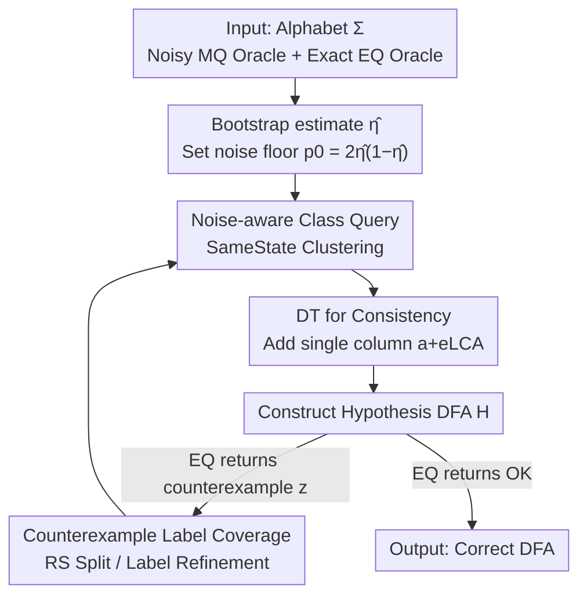

# Towards Persistent Noise-Tolerant Active Learning of Regular Languages with Class Query

**Conference**: ICLR 2026  
**OpenReview**: [https://openreview.net/forum?id=1XMUe2dGRr](https://openreview.net/forum?id=1XMUe2dGRr)  
**Code**: https://github.com/lkwargs/CAPAL  
**Area**: Learning Theory / Automata Learning / Neuro-symbolic  
**Keywords**: DFA Active Learning, Persistent Noise, Class Query, Discrimination Tree, LLM as Oracle

## TL;DR
This paper proposes the pMAT (Probabilistic Minimally Adequate Teacher) formal framework to capture the scenario where an LLM serves as a persistent noisy Membership Query (MQ) Oracle and a simulator/checker serves as an exact Equivalence Query (EQ) Oracle. It introduces the CAPAL algorithm—which replaces blind trust in single MQ labels with statistical "homomorphical class queries" and uses discrimination trees to compress the set of distinguishing suffixes—enabling the provable learning of correct DFAs under persistent noise while significantly reducing LLM calls (requiring only a single call for code-based oracles).

## Background & Motivation

**Background**: Formal languages (Regular languages, LTL, Reward Machines) are powerful tools for aligning human intent with neural network behavior in a precise and verifiable manner. DFAs serve as the core carrier for "formal alignment" due to their interpretability, expressiveness, and learnability. The classic paradigm for learning DFAs is Angluin's $L^\star$ active learning: a learner interacts with an Oracle via **Membership Queries (MQ: asking if a word is in the target language)** and **Equivalence Queries (EQ: submitting a hypothesis DFA to be verified or receiving a counterexample)**, iteratively refining the hypothesis.

**Limitations of Prior Work**: When LLMs are used as the Oracle (e.g., judging if a trajectory satisfies a natural language rule), robustness collapses. Existing approaches—treating LLMs as noisy MQ Oracles (often requiring human demonstrations for bootstrapping) or direct LLM synthesis of DFA transitions—provide no correctness guarantees because hallucinatory labels are difficult to detect and correct systematically. Worse, classic algorithms like $L^\star$ and TTT are extremely fragile under MQ noise; a single systematic mislabeling can make recovery nearly impossible.

**Key Challenge**: LLM errors are **persistent**—repeatedly sampling the same query $\pi$, using majority voting, or self-consistency only causes the empirical distribution to converge to the **biased label**. If the correct probability for a word is $p^\star(\pi)<\tfrac12$, resampling reduces variance but **cannot eliminate bias**, and majority voting almost certainly converges to the **incorrect** answer. This means the most natural denoising method—"voting over multiple queries"—fails against persistent noise.

**Goal**: To design a DFA active learning algorithm that **requires no human demonstrations**, has **theoretical correctness guarantees**, and is **LLM-efficient** under the setting where MQs are persistently noisy but EQs are exact.

**Key Insight**: The authors observe that since individual MQ labels are untrustworthy, one should **not trust single labels** at all. Instead, noisy MQs should be used as statistical evidence to answer a more robust question: "Do two prefixes $u,v$ belong to the same Myhill–Nerode equivalence class?" As long as the accuracy of each MQ is $p^\star>\tfrac12$, aggregating evidence over a small set of suffixes can provide statistically reliable class determinations, while final error correction is handled by exact EQ counterexamples.

**Core Idea**: Replace the blind trust in single MQ labels found in $L^\star$ with "noise-tolerant statistical homomorphical class queries + discrimination trees + counterexample label coverage," transforming the problem of "unremovable persistent bias" into a learnable problem suppressed by statistical aggregation and exact EQ.

## Method

### Overall Architecture

CAPAL (Class-query Active, Persistent-noise-Aware Learning) operates under the pMAT setting: the learner faces a **persistently noisy Membership Oracle** $O_{MQ}$ (where the cached label $C_{MQ}[w]$ for word $w$ equals the ground truth with probability $1-\eta$ and is flipped with probability $\eta<\tfrac12$, with **repeated queries returning the same cached value**) and an **exact Equivalence Oracle** $O_{EQ}$ (which returns either OK or a noiseless counterexample $z$ such that $H(z)\neq M(z)$).

The process wraps a "noise-aware" layer around the classic $L^\star$ observation table loop: it first estimates the noise rate $\hat\eta$ using a small bootstrap budget and sets a noise floor $p_0=2\hat\eta(1-\hat\eta)$. Then, each round performs four tasks: ① Uses the noise-aware `SameState` test to cluster prefixes in the set $S$ using a Disjoint Set Union; ② Checks for **closedness** and adds missing prefixes; ③ Uses a **Discrimination Tree (DT)** to ensure **consistency**, adding only one derived column at a time; ④ Constructs a hypothesis $H$ for $O_{EQ}$. If a counterexample is returned, its **noiseless label** is used to override state acceptances, and a Rivest–Schapire split determines whether to add a suffix or merely record the label.

### Key Designs

**1. pMAT Formalization and Persistent Errors: Why resampling cannot save an LLM Oracle**

The authors formalize the scenario as pMAT: the Membership Oracle is stochastic, returning $X\sim P(\cdot\mid\pi)$ for a query instance $\pi$. For a single instance, the accuracy is $p^\star(\pi)=\Pr_{X\sim P(\cdot\mid\pi)}[X=M(w(\pi))]$. A **persistent error** occurs when the mode of the Oracle distribution differs from the true label:

$$\operatorname{mode}_{x\in\{0,1\}}P(x\mid\pi)\neq M(w(\pi))\iff p^\star(\pi)<\tfrac12.$$

This identifies the core issue: given $m$ i.i.d. samples, any aggregator $A_m$ returning the empirical mode will, by the Law of Large Numbers, converge to the biased mode as $m \to \infty$. Thus, if $p^\star(\pi)<\tfrac12$, then $\Pr[A_m\neq M(w(\pi))]\to1$. **Resampling reduces variance but not bias**.

**2. Noise-aware Homomorphic Class Queries: Statistical aggregation over single labels**

Instead of trusting single labels, CAPAL determines if "two prefixes belong to the same Myhill–Nerode class." Given an estimate $\hat\eta$, the noise floor $p_0=2\hat\eta(1-\hat\eta)$ represents the upper bound probability that two prefixes appear different on a suffix purely due to noise. For $u,v\in S$, the empirical disagreement rate over a suffix set $E$ is:

$$D(u,v)=\frac{1}{m}\bigl|\{\,e\in E:\widetilde y(ue)\neq\widetilde y(ve)\,\}\bigr|.$$

`SameState`$(u,v;p_0,\alpha)$ returns true if and only if $D(u,v)\le p_0+\tau$, where $\tau$ is a Hoeffding tolerance. If two prefixes are truly in the same class, their disagreement is expected to be $\le p_0$. If they are in different classes, at least one suffix will likely distinguish them, causing $D$ to exceed the threshold.

**3. DT-driven Consistency Repair: Suppressing $|E_{core}|$ with derived suffixes**

Classic $L^\star$ repairs consistency by adding suffixes to the table, which increases width and necessitates re-querying fragile MQs. CAPAL uses a **Discrimination Tree**: internal nodes store distinguishing suffixes $e\in E_{core}$, and leaves store disjoint classes. When a class $C$ under symbol $a$ transitions to two different classes $C_1\neq C_2$, the algorithm takes their **Lowest Common Ancestor (LCA)** in the tree. The suffix $e_{LCA}$ is used to derive a **single** new column $a+e_{LCA}$ to repair consistency. This keeps the number of core suffixes strictly bounded by $|E_{core}|\le n-1$, reducing query volume and exposure to noise on long words.

**4. Counterexample Label Coverage and Gating: Ground truth from EQ**

Labels from EQ counterexamples $z$ are **noiseless and trustworthy**. CAPAL uses them in two ways. First, **Acceptance Coverage**: when constructing $H$, if a class $C$ has stored counterexamples with a common gold label $\ell$, the acceptance of $C$ is set to $\ell$, overriding noisy MQ votes. Second, **Rivest–Schapire Gating**: the algorithm scans $z=uae$ for the first transition mismatch. If found, $e$ is added to $E_{core}$ (structural error). If no mismatch is found, $z$ is likely just a **labeling error**, and it is recorded without adding a new column unless it reappears, preventing a cycle of new MQs.

### Loss & Training

This is a non-gradient learning algorithm. Its "training strategy" is reflected in its convergence guarantee: **Theorem 1 (Query Complexity)** Under an exact EQ and persistent noise $\eta<\tfrac12$, CAPAL terminates with high probability and returns the **exact** language with:

$$\#EQ=O(n),\qquad \#MQ=O\!\bigl(|\Sigma|\,n^2\rho+nL_{CE}\bigr)+O\!\bigl(m\,|\Sigma|\,n\rho\bigr),$$

where $n$ is the number of states, $\rho$ is the reachability diameter, and $m$ is the suffix budget per class query. For fixed noise/confidence, $m$ is constant, making the asymptotic complexity consistent with classic $L^\star$.

## Key Experimental Results

Experiments used LearnLib on 200 human-interpretable DFAs (2–50 states). Default Oracle: gpt-4o, temperature 0.9.

### Main Results

Effect of prompt strategy on MQ error rate $\epsilon$ and LLM calls (LA = LearnAnyway):

| Oracle Type | LA Calls | CAPAL Calls | $\epsilon$ |
|------|------|------|------|
| Baseline (Direct True/False) | 46.07 (±33.0) | 43.75 (±30.2) | 0.156 |
| CoT | 52.64 (±37.3) | 30.93 (±16.5) | 0.068 |
| Verification & CoT | 51.57 (±36.5) | 28.96 (±19.7) | 0.044 |
| Discriminator & CoT | 51.82 (±40.1) | 29.14 (±15.8) | 0.047 |
| Code-based (Executable Checker) | 1 (±0) | 1 (±0) | 0.013 |

Learning Accuracy (ratio of tasks where the exact target DFA was learned):

| Oracle Type | TTT | $L^\star$ | LA | CAPAL |
|------|------|------|------|------|
| Baseline | 0.107 | 0.071 | 0.107 | **0.250** |
| CoT | 0.429 | 0.393 | 0.500 | **0.571** |
| Verification & CoT | 0.464 | 0.429 | **0.714** | 0.679 |
| Discriminator & CoT | 0.571 | 0.536 | 0.714 | **0.821** |
| Code-based | 0.750 | 0.678 | 0.786 | **0.928** |

### Key Findings
- **Stronger prompts lead to higher CAPAL advantages**: With Discriminator & CoT, CAPAL achieves 0.821 accuracy vs LA's 0.714.
- **Code-based Oracles are a game-changer**: Using the LLM only once to synthesize an executable predicate reduces $\epsilon$ to 0.013 (−92% relative to Baseline) and slashes LLM costs by ≥97%.
- **CAPAL is more MQ-efficient than LA**: It does not require polynomially more counterexamples as noise increases.
- **Classic learners fail under noise**: TTT and $L^\star$ cannot recover from systematic mislabeling, resulting in very low accuracy (0.07–0.57).

## Highlights & Insights
- **Defining "Persistent Error"**: Formalizing $p^\star(\pi)<\tfrac12$ as the condition where self-consistency exacerbates bias provides a rigorous explanation for why simple denoising fails for LLMs.
- **Class Query as a Paradigm Shift**: Moving from "trusting labels" to "statistical inference of homomorphic classes" effectively dilutes unremovable bias into manageable statistical error.
- **Negative Caching + Early Stopping**: By conservatively setting $p_0$, negative caching (storing "DIFFERENT" results) becomes safe and monotonic, avoiding redundant queries.
- **Extrapolability**: The combination of class queries, DT repair, and CE label coverage can naturally be extended to Mealy machines and Symbolic Automata.

## Limitations & Future Work
- **Dependency on Exact EQ**: Theoretical guarantees rely on the Equivalence Oracle being perfect. If the EQ is approximate, the theory requires extension.
- **$\hat\eta$ Underestimation**: If the noise rate is underestimated, negative caching could theoretically lock in false state splits.
- **Contextual Drift**: The error profile $\epsilon(\pi)$ may vary with prompt context; long-term operation might need adaptive re-calibration.
- **Task Scale**: Evaluation is limited to small human-interpretable DFAs; performance on massive, complex specifications remains to be seen.

## Related Work & Insights
- **vs $L^\star$ / TTT**: Classic learners trust individual MQs and fail to recover from persistent noise. CAPAL is significantly more accurate under identical Oracle conditions.
- **vs LearnAnyway (LA)**: LA relies on long counterexamples to fix errors, but longer words increase the likelihood of LLM mislabeling. CAPAL uses DT to bound core suffixes to $\le n-1$, ensuring better efficiency and stability.
- **vs LLM-Direct Synthesis**: Direct synthesis assumes reliable "Natural Language to DFA" translation, which is prone to undetectable hallucinations. CAPAL treats the LLM as a provably correctable noisy Oracle.

## Rating
- **Novelty**: ⭐⭐⭐⭐⭐ First algorithm to provably learn DFAs under persistent noise by formalizing LLM bias.
- **Experimental Thoroughness**: ⭐⭐⭐⭐ Comprehensive scanning of noise and prompt strategies, though limited to small DFAs.
- **Writing Quality**: ⭐⭐⭐⭐⭐ Excellent articulation of the "persistent error" problem and its theoretical implications.
- **Value**: ⭐⭐⭐⭐ Provides a robust path for neuro-symbolic pipelines to synthesize certifiable formal artifacts using fallible LLMs.
<!-- RELATED:START -->

## Related Papers

- [\[ICLR 2026\] Noise Tolerance of Distributionally Robust Learning](noise_tolerance_of_distributionally_robust_learning.md)
- [\[ICLR 2026\] The Lie of the Average: How Class Incremental Learning Evaluation Deceives You?](the_lie_of_the_average_how_class_incremental_learning_evaluation_deceives_you.md)
- [\[ICML 2026\] Active Learning with Low-Rank Structure for Data Selection](../../ICML2026/learning_theory/active_learning_with_low-rank_structure_for_data_selection.md)
- [\[ICLR 2026\] Revisiting Active Sequential Prediction-Powered Mean Estimation](revisiting_active_sequential_prediction-powered_mean_estimation.md)
- [\[ICML 2026\] Efficiently Learning Drifting Halfspaces with Massart Noise](../../ICML2026/learning_theory/efficiently_learning_drifting_halfspaces_with_massart_noise.md)

<!-- RELATED:END -->
## Related Papers

- [\[ICLR 2026\] Noise Tolerance of Distributionally Robust Learning](noise_tolerance_of_distributionally_robust_learning.md)
- [\[ICLR 2026\] The Lie of the Average: How Class Incremental Learning Evaluation Deceives You?](the_lie_of_the_average_how_class_incremental_learning_evaluation_deceives_you.md)
- [\[ICML 2026\] Active Learning with Low-Rank Structure for Data Selection](../../ICML2026/learning_theory/active_learning_with_low-rank_structure_for_data_selection.md)
- [\[ICLR 2026\] Revisiting Active Sequential Prediction-Powered Mean Estimation](revisiting_active_sequential_prediction-powered_mean_estimation.md)
- [\[ICML 2026\] Efficiently Learning Drifting Halfspaces with Massart Noise](../../ICML2026/learning_theory/efficiently_learning_drifting_halfspaces_with_massart_noise.md)

<!-- RELATED:END -->
