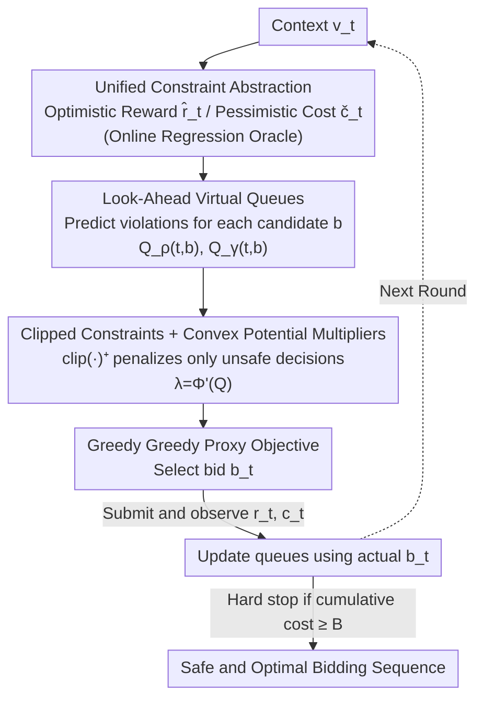

# Towards Safe and Optimal Online Bidding: A Modular Look-Ahead Lyapunov Framework

**Conference**: ICLR 2026  
**OpenReview**: [https://openreview.net/forum?id=AtbRCnvcrZ](https://openreview.net/forum?id=AtbRCnvcrZ)  
**Area**: Learning Theory / Online Learning / Constrained Optimization  
**Keywords**: Online Bidding, Budget Constraints, ROI Constraints, Virtual Queues, Lyapunov Stability

## TL;DR
This paper proposes L2FOB, a modular framework for online bidding under simultaneous budget and ROI constraints. By employing optimistic reward/pessimistic cost estimation, **look-ahead virtual queues**, and multipliers shaped by convex potential functions, the framework provides adaptive regret and anytime ROI violation bounds **without relying on the Slater condition**. It achieves or exceeds state-of-the-art results across various auction and feedback settings.

## Background & Motivation

**Background**: Autobidding is a core component of online advertising, where advertisers maximize cumulative returns within daily or weekly budget limits. Most existing work focuses solely on **budget constraints** (e.g., Balseiro, Wang), which are relatively easy to handle because costs are non-negative and feasibility reduces to one-sided control of cumulative resource consumption.

**Limitations of Prior Work**: Modern advertising markets also demand **profitability control**, expressed as ROI (return-on-investment) constraints: $\sum_t r(v_t,b_t)\ge\gamma\sum_t c(v_t,b_t)$. ROI constraints possess both packing and covering properties: a violation in a single step can be compensated for in subsequent rounds, necessitating long-horizon planning. This introduces two complications: (1) Castiglioni et al. (2022) used appropriate violation metrics but their analysis depends on the **Slater condition** (existence of a strictly feasible strategy), which is difficult to verify for ROI and incompatible with "hard stops" upon budget depletion. (2) Castiglioni et al. (2025) included both budget and ROI, but their metric only counts the **number of violations** rather than the **magnitude**, failing to properly trade off revenue against violation levels.

**Key Challenge**: Online bidding essentially requires walking a tightrope between volume and profitability—spending too fast sacrifices later opportunities, spending too slow wastes inventory, and chasing volume indiscriminately drives down ROI. Addressing this requires a unified framework capable of **precisely controlling violation magnitudes** without **Slater dependency**, adaptable to various auctions and feedback types (first/second-price, full/partial information), whereas current methods are tailored to specific environments.

**Goal**: Design a unified, modular safe bidding framework that provides adaptive provable guarantees for **dual budget and ROI constraints** without requiring the Slater condition.

**Key Insight**: The authors abstract bidding as a general **constrained online learning** problem, treating reward $r(v,b)$ and cost $c(v,b)$ as general functions of context $v$ and bid $b$. As long as an **online regression oracle** (industry standard) for rewards and costs is provided, the framework applies to any environment. It draws on **Lyapunov drift analysis and virtual queues** from control theory to model constraint violations as queues that need to be stabilized.

**Core Idea**: Use **look-ahead virtual queues** to predict the violation magnitude of every candidate bid before bidding. Combined with a "clipped" mapping that only tracks unsafe decisions and time-varying multipliers shaped by convex potential functions, feasibility is "internalized" at the decision moment, achieving safe and optimal bidding without assuming Slater.

## Method

### Overall Architecture

L2FOB (Look-ahead Lyapunov Framework for Online Bidding) is a primal–dual framework executed round-by-round. Each round $t$: observe context $v_t$ → use online regression oracles to construct an **optimistic reward estimate** $\hat r_t$ and a **pessimistic cost estimate** $\check c_t$ → calculate two **look-ahead virtual queues** $Q_\rho(t,b)$ (budget) and $Q_\gamma(t,b)$ (ROI) for **every candidate bid $b$** → greedily maximize a "reward − constraint penalty" proxy objective to select $b_t$ → submit the bid, observe actual $r_t,c_t$, and update queues with the actual bid $b_t$ → if cumulative cost reaches budget $B$, trigger a **hard stop**.

Key definitions:

- Optimistic/Pessimistic Estimates: Under high-probability events, $\hat r_t(v,b):=\bar r_t(v,b)+\varepsilon^r_t$ is an upper confidence bound for rewards (encouraging exploration), and $\check c_t(v,b):=\bar c_t(v,b)-\varepsilon^c_t$ is a lower confidence bound for costs (conservative billing). $\varepsilon^r_t, \varepsilon^c_t$ are oracle errors satisfying $|\bar r_t-r|\le\varepsilon^r_t$ and $|\bar c_t-c|\le\varepsilon^c_t$ (Assumption 1).
- Virtual Queues $Q_\rho, Q_\gamma$: Track real-time feasibility for budget and ROI respectively; these are modeled as stochastic/Markov processes representing the states to be "stabilized" in Lyapunov analysis.
- Potential Function $\Phi(\cdot)=(\cdot)^2$: Maps queue lengths to time-varying multipliers $\lambda_\rho(t):=\Phi'(Q_\rho(t,b))$ and $\lambda_\gamma(t):=\Phi'(Q_\gamma(t,b))$, using derivatives as Lagrange multipliers.

### Key Designs

**1. Unified Constrained Online Learning Abstraction + Interpolated Estimates: One framework for all auctions and feedback**

Existing methods are often customized for specific settings (e.g., first/second-price, bandit/convex, full/partial information). L2FOB formulates bidding as a general constrained optimization (Eq. 1):

$$\max_{\{b_t\}}\sum_{t=1}^T r(v_t,b_t)\quad\text{s.t.}\quad\sum_t c(v_t,b_t)\le B,\quad\sum_t r(v_t,b_t)\ge\gamma\sum_t c(v_t,b_t),$$

deliberately **not specifying** the form of $v, r, c$. $v$ can be private values or features like pCTR; $r, c$ can be user-defined. The framework requires only a mild oracle assumption (Assumption 1): estimates are bounded by $\varepsilon^r_t, \varepsilon^c_t$, with cumulative errors $E_r(T,p):=\sum_t\varepsilon^r_t$ and $E_c(T,p):=\sum_t\varepsilon^c_t$. High-probability optimistic/pessimistic bounds satisfy $0\le\hat r_t-r\le 2\varepsilon^r_t$ and $0\le c-\check c_t\le 2\varepsilon^c_t$. This cleanly transfers "estimation uncertainty" to the cumulative error term, allowing theoretical guarantees to be functions of $E_r$ and $E_c$.

**2. Look-Ahead Virtual Queues: Predicting violations before bidding**

This is the core differentiator of L2FOB. Traditional primal–dual or virtual queue methods update dual variables **after observing cost feedback**, meaning queues record only past violations (post-hoc reactive). L2FOB calculates a look-ahead queue for **every candidate bid $b$** first:

$$Q_\rho(t,b)=Q_\rho(t-1)+\eta_\rho\big(\mathbb{E}_v[\check c_t(v,b)]-\rho\big)^+,\quad Q_\gamma(t,b)=Q_\gamma(t-1)+\eta_\gamma\big(\mathbb{E}_v[\gamma\check c_t(v,b)-\hat r_t(v,b)]\big)^+.$$

Queues act as **dynamic pacing variables**. By incorporating "predicted violations" into the queues, the algorithm internalizes feasibility during decision-making rather than just looking at history. This is analogous to **one-step Model Predictive Control (MPC)**, where a Lyapunov function serves as a proxy for long-term performance.

**3. Clipped Constraints + Convex Potential Multipliers: Lyapunov stability without Slater**

When selecting $b_t$, L2FOB maximizes the following proxy objective (Eq. 8):

$$\hat r_t(v_t,b)-\Phi'(Q_\rho(t,b))\,\eta_\rho\big(\mathbb{E}_v[\check c_t(v,b)]-\rho\big)^+-\Phi'(Q_\gamma(t,b))\,\eta_\gamma\big(\mathbb{E}_v[\gamma\check c_t(v,b)-\hat r_t(v,b)]\big)^+.$$

This resembles an approximate Lagrangian with three distinctions. **First, the clipping operator $(\cdot)^+$**: penalties activate only when estimated constraints are violated. **Second, the mean-field approach**: constraints are imposed by taking the expectation over the context distribution $\mathbb{E}_v[\cdot]$, focusing penalties on systemic risks rather than per-context noise. **Third, convex potential functions**: dual multipliers are $\lambda=\Phi'(Q)$. Quadratic potential $\Phi(x)=x^2$ is sufficient, but this design remains flexible. Together, these allow the analysis (Lemma 1→2) to prove queue stability $\mathbb{E}[Q_\rho(t)],\mathbb{E}[Q_\gamma(t)]=O(\sqrt T)$ **without assuming the Slater condition**.

### Loss & Training

No neural network training is required. The core is a round-by-round primal–dual online update. Key hyperparameters are dual step sizes $\eta_\rho, \eta_\gamma$ (theoretically $\sqrt T$, but flexible between $\Theta(1)$ and $\Theta(T)$ due to clipping; $0.6$ is used in experiments). Potential function defaults to $\Phi(x)=x^2$.

## Key Experimental Results

Main Theorem: Under Assumption 1, L2FOB achieves:

$$\text{Regret}(T)=O\!\Big(E_r(T,p)+\tfrac{\nu^\*}{\rho}E_c(T,p)\Big),\qquad V_{\text{ROI}}(t)=O\big(E_r(T,p)+E_c(T,p)\big),\ \forall t\in[T],$$

where $\rho$ is the average budget per round and $\nu^*$ is the offline optimal average reward. This is the **first** adaptive guarantee for safe online bidding that simultaneously addresses regret and ROI violations, where ROI violations are **anytime** (previous works only provided end-of-horizon $T$ guarantees).

### Main Results (Theoretical Comparison)

| Setting | Baseline | L2FOB Regret / Violation | Gain |
|------|---------|----------------------|---------|
| 1st-price + Budget | Wang et al. (2023) | $\tilde O\big((1+\nu^\*/\rho)\sqrt T\big)$, anytime ROI $\tilde O(\sqrt T)$ | Improved from $\tilde O\big((1+\nu^\*/\rho^2)\sqrt T\big)$ by factor of $1/\rho$; meaningful for small budgets |
| 2nd-price + Budget + ROI | Castiglioni et al. (2025) | sublinear regret + sublinear violation with hard stop | baseline lacks ROI magnitude metric and hard stop consideration |
| Constrained Contextual Bandit | Guo et al. (2025) | Matches best-known; can be tighter with better oracle | Comparable to SOTA; tightens with stronger oracles |

### Numerical Experiments

| Experiment | Setup | Result |
|------|------|------|
| 1st-price Auction (Fig.1) | $T=10^4, B=100, \rho=0.01, \gamma=1.8$ | L2FOB significantly outperforms Wang et al. (2023) in reward and ROI; ROI consistently hits target 1.8. |
| Constrained Bandit / MSLR-WEB30k (Fig.2) | $T=5000, B=1000, \rho=0.2, \gamma=1.3$, GBDT oracle | L2FOB consistently outperforms Guo et al. (2025) in reward and ROI maintenance. |

### Ablation Study ($\eta_\gamma$ sensitivity, Fig.3)

| $\eta_\gamma$ | Observation | Explanation |
|---------------|------|------|
| 0.06 / 0.6 / 6 | Smooth tradeoff between reward and ROI violation | Larger step sizes lean towards conservative constraint satisfaction. |
| 60 | Nearly identical to $\eta_\gamma=6$ | Clipping ensures large step sizes do not lead to over-conservatism. |

## Highlights & Insights
- **Brings Lyapunov drift and virtual queues from control theory to bidding**, innovating with "look-ahead" queues. Moving from "post-hoc accountability" to "pre-emptive internalization" is a significant transition.
- **Removal of the Slater Condition**: The combination of clipping $(\cdot)^+$ and convex potential functions removes the dependency on strictly feasible strategies, which is highly valuable for real-world ROI scenarios where budget hard stops are incompatible with Slater.
- **Modular Oracle Abstraction**: All guarantees are functions of cumulative errors $E_r, E_c$. This decoupling of analysis from the specific environment allows the framework to be easily ported to other constrained online decision problems.

## Limitations & Future Work
- **No strict zero violation**: The authors acknowledge that strict zero violation is only possible if Slater exists and the problem is additionally tightened (e.g., replacing $\gamma$ with $\gamma+\delta$).
- **Gap between Mean-Field theory and implementation**: Theory assumes access to context distributions; practice uses a single-point $v_t$ approximation. While robust in practice, a theoretical characterization is missing.
- **Synthetic/Small-scale experiments**: 1st-price experiments use synthetic distributions; bandits use MSLR-WEB30k. Further verification on large-scale real-world autobidding traffic with partial information is needed.

## Related Work & Insights
- **vs Wang et al. (2023)**: They only handle budget and 1st-price. Their regret of $\tilde O((1+\nu^\*/\rho^2)\sqrt T)$ fails for small budgets. Ours improves this to $\tilde O((1+\nu^\*/\rho)\sqrt T)$ and adds ROI guarantees.
- **vs Castiglioni et al. (2025)**: They include budget and ROI but only count the number of violations. Ours controls the magnitude of violations and explicitly considers hard stops.
- **vs Guo et al. (2025)**: They use mean-field to bypass Slater but only for contextual bandits. Ours generalizes this to dual constraints (Budget + ROI) and multiple auction environments.

## Rating
- Novelty: ⭐⭐⭐⭐⭐ Look-ahead virtual queues + Lyapunov without Slater; first dual adaptive guarantee for safe bidding.
- Experimental Thoroughness: ⭐⭐⭐⭐ Strong theoretical instantiation, but numerical experiments remain relatively small-scale/synthetic.
- Writing Quality: ⭐⭐⭐⭐⭐ Extremely clear motivation; well-structured progression from theory to practice.
- Value: ⭐⭐⭐⭐⭐ Directly addresses the dual budget + profitability constraints of real-world autobidding with a deployment-friendly modular design.

<!-- RELATED:START -->

## Related Papers

- [\[AAAI 2026\] A Switching Framework for Online Interval Scheduling with Predictions](../../AAAI2026/learning_theory/a_switching_framework_for_online_interval_scheduling_with_pr.md)
- [\[ICLR 2026\] Online Decision-Focused Learning](online_decision-focused_learning.md)
- [\[ICLR 2026\] Online Learning and Equilibrium Computation with Ranking Feedback](online_learning_and_equilibrium_computation_with_ranking_feedback.md)
- [\[ICLR 2026\] Oracle-Efficient Hybrid Online Learning with Constrained Adversaries](oracle-efficient_hybrid_learning_with_constrained_adversaries.md)
- [\[ICLR 2026\] Online Conformal Prediction with Adversarial Semi-bandit Feedback via Regret Minimization](online_conformal_prediction_with_adversarial_semi-bandit_feedback_via_regret_min.md)

<!-- RELATED:END -->
