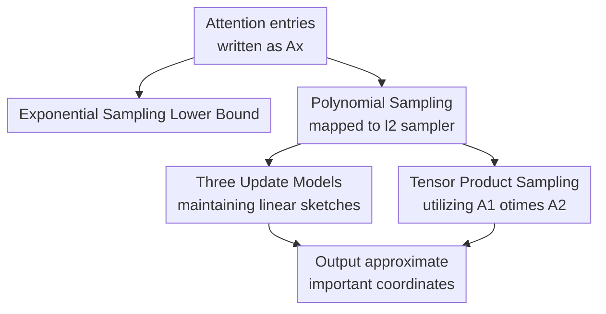

# Towards Sampling Data Structures for Tensor Products in Turnstile Streams

**Conference**: ICLR2026  
**OpenReview**: [https://openreview.net/forum?id=ZgLEEp7AwL](https://openreview.net/forum?id=ZgLEEp7AwL)  
**Code**: None  
**Area**: Learning Theory / Streaming Algorithms / Randomized Data Structures  
**Keywords**: Attention Sampling, turnstile stream, tensor product, $\ell_2$ sampler, sketching  

## TL;DR

This paper formalizes the identification of "important coordinates" in attention matrices as a streaming sampling problem. It proves that softmax/exponential sampling inevitably encounters a quadratic space barrier in general turnstile streams, while providing $\ell_2$ samplers for polynomial attention and specialized data structures for tensor products.

## Background & Motivation

**Background**: The attention mechanism in Transformers essentially processes pairwise interaction matrices such as $QK^\top$. For a sequence length $n$, the full attention matrix contains $n^2$ entries. In scenarios involving long contexts, streaming generation, online retrieval, or dynamic KV caches, explicitly maintaining all entries quickly becomes a bottleneck for space and update time. Theoretically, recent works on fast attention, sparse attention, kernel attention, and sketching aim to avoid the full quadratic matrix.

**Limitations of Prior Work**: Many sparse attention methods first identify a set of the most important entries in the attention matrix and then use these entries to construct masks or approximations. However, "finding important entries" is often treated as an offline operation: if the full matrix is available, one can directly calculate weights for each entry. The real difficulty arises when input matrices or weight vectors are continuously updated in a data stream—where updates can involve both additions and deletions—and the algorithm must report important coordinates using space much smaller than $n^2$.

**Key Challenge**: Softmax attention uses $\exp(\cdot)$ weights, where a few large entries are exponentially amplified, resulting in a very sharp sampling distribution. Meanwhile, streaming algorithms can only retain sketches or summaries and cannot store all entries. This paper addresses not whether attention values can be approximated, but specifically whether important coordinates can be sampled according to attention weights under streaming updates. This problem is more closely aligned with the construction of sparse attention masks and highlights the disparity between softmax and polynomial attention in terms of data structure requirements.

**Goal**: The authors decompose the problem into three layers. The first layer defines a general attention sampler: given an implicit vector $Ax$, sample coordinates according to a distribution induced by some function $g((Ax)_i)$. The second layer investigates the exponential function $g(z)=\exp(z)$ and the polynomial/squared function $g(z)=|z|^2$ separately, showing that the former has a strong lower bound while the latter can be handled with $\ell_2$ sampler techniques. The third layer returns to the tensor product form $A=A_1\otimes A_2$ for attention matrices, seeking to avoid explicit maintenance of an $n^2 \times d^2$ tensor matrix when only $A_1$ or $A_2$ is updated.

**Key Insight**: A key observation is that linear attention matrices can be written as the product of a tensor product matrix and a vector. If $X=W_QW_K^\top$ and $x=\mathrm{vec}(X)$, then $\mathrm{vec}(A_1XA_2^\top)=(A_1\otimes A_2)x$. Thus, sampling attention entries can be transformed into a streaming algorithm problem of "sampling from an implicit vector $Ax$ or $(A_1\otimes A_2)x$ based on coordinate weights."

**Core Idea**: This work re-examines attention sparsification from the perspective of streaming samplers. It demonstrates that exponential sampling for softmax requires near-quadratic space in general cases, whereas the $\ell_2$ distribution corresponding to polynomial attention can be efficiently maintained in turnstile streams using linear sketches, AMS estimators, and CountSketch.

## Method

### Overall Architecture

Rather than proposing a trainable model, the paper provides a theoretical data structure framework. The input consists of a dynamically updated matrix $A$ and vector $x$, or more structured $A_1, A_2, x$; the output is a coordinate $i$ sampled at any time with probability approximately proportional to certain weights of the attention entries. The authors first define the attention sampler, prove the inefficiency of softmax/exponential weights in streaming via lower bounds, convert polynomial attention into $\ell_2$ sampling, and provide space and update time guarantees across three update models and one tensor product model.

The branches in this diagram correspond to the argumentative structure of the paper: the negative result for exponential sampling shows the difficulty of simulating the softmax distribution, while the positive result for polynomial sampling demonstrates that classical $\ell_2$ samplers can be adapted to the tensor structure of attention if weights are replaced with squared magnitudes.

### Key Designs

**1. Attention Sampler: Formalizing the "Search for Heavy Entries" as a Provable Distribution**

The paper defines the attention sampler as follows: given $A\in\mathbb{R}^{n^2\times d^2}$, $x\in\mathbb{R}^{d^2}$, and a distribution function $g$, the probability of sampling coordinate $i$ is $p_i=g((Ax)_i)/\sum_j g((Ax)_j)$. This definition converts the heuristic "picking heavy entries" in attention sparsification into a clear data structure objective: the algorithm does not need to recover the entire attention matrix, only to return a coordinate according to the correct distribution.

Furthermore, $Ax$ is not an arbitrary vector. For linear cross-attention, $QK^\top=A_1W_QW_K^\top A_2^\top$; letting $X=W_QW_K^\top$ and $x=\mathrm{vec}(X)$, we get $\mathrm{vec}(QK^\top)=(A_1\otimes A_2)x$. Thus, the target for the sampling data structure is the implicit attention entry induced by the tensor product, rather than a generic dense vector. This step translates the quadratic matrix bottleneck of LLM attention into a well-known implicit vector sampling problem in streaming algorithms.

**2. Exponential Sampling Lower Bound: Sharpness of Softmax Amplifies Space Requirements**

For the exponential sampler where $g(z)=\exp(z)$, the paper proves that even if sampling probabilities are allowed a polynomial distortion factor $n^C$ and $\|Ax\|_\infty=O(\log n)$, any algorithm still requires $\Omega(n^2)$ space. The proof is based on the communication complexity of set-disjointness: Alice and Bob each hold a set, encoded into a vector after streaming updates; if the two sets have a unique intersection, the corresponding coordinate value will be $\Theta(\log n)$ larger than others, and the exponential function amplifies this gap such that the sampler must return the intersection with constant probability. This construction implies that a small-space sampler would solve set-disjointness with limited communication, contradicting its $\Omega(n)$ lower bound.

**3. Polynomial Sampling Upper Bound: Reducing to $\ell_2$ Sampler Sketching**

The positive result stems from changing the sampling weight to $g(z)=|z|^2$, i.e., sampling according to $p_i\propto |(Ax)_i|^2$. This exactly matches classical $\ell_2$ sampling: given $y=Ax$, the goal is to output $I$ such that $\Pr[I=j]=(1\pm\epsilon)|y_j|^2/\|y\|_2^2+1/\mathrm{poly}(n)$. Since many polynomial or softmax-free attention variants already approximate softmax, this choice provides a provable interface between theoretical tractability and attention approximation.

The paper handles three streaming update models:
- If $A$ is updated and $x$ is fixed, the algorithm maintains a linear sketch $\Phi y=\Phi Ax$. Updating $A_{ij}$ by $\Delta$ requires updating the sketch via $\Phi e_i e_j^\top\Delta x$, taking $d\log n+\mathrm{poly}(1/\epsilon,\log n)$ space.
- If $A$ is fixed and $x$ is updated, $\Phi A$ is maintained in advance. Changing a single coordinate of $x$ results in an $O(1)$ update time with $d\cdot\mathrm{poly}(1/\epsilon,\log n)$ space.
- If both $A$ and $x$ are updated, $\Phi A$ and $x$ are maintained simultaneously. The update time becomes $\mathrm{poly}(1/\epsilon,\log n)$, while space remains linearly dependent on the sketch size of $d$.

**4. Tensor Product Sampling: CountSketch and Tail Estimation without Explicit Expansion**

The final part addresses the true tensor product form $y=(A_1\otimes A_2)x\in\mathbb{R}^{n^2}$. Specifically for autoregressive attention scenarios, the paper considers $x$ fixed while either $A_1$ or $A_2$ is updated. Instead of $O(n^2d^2)$ expansion, the algorithm stores the original $O(nd)$ information. The sampling mechanism follows the "random scaling and max" approach of $\ell_2$ samplers: random numbers $u_i$ are used to construct $w_i=y_i/\sqrt{u_i}$. By estimating $\|y\|_2$ and the norm of the tail vector $z$ using CountSketch to approximate each $w_i$ within $\epsilon\|z\|_2$ error, coordinates are returned according to $y_i^2/\|y\|_2^2$.

### Mechanism Logic Example

Consider a streaming retrieval-augmented model. The system has $n$ static knowledge base vectors serving as keys ($A_2$), while the conversation continuously updates the query side ($A_1$). In turnstile streams, entries can be negatively updated if a user request is retracted. While the full attention matrix contains $n^2$ interaction entries, sparse attention only needs to know which coordinates are worth retaining. Under the softmax view, the lower bound suggests that sampling is too hard for small space. Under the polynomial view, by assigning random scales $u_i$ and using sketches to estimate the amplified candidates $w_i$, the algorithm identifies the most dominant query-key pair as the sample.

## Key Experimental Results

### Main Results

The paper provides theoretical complexity comparisons rather than real-world dataset experiments. The core theorems are summarized below:

| Setting | Target Distribution | Space Complexity | Update Time | Main Conclusion |
| :--- | :--- | :--- | :--- | :--- |
| Exp Sampling, $A$ or $x$ updates | $p_i\propto \exp((Ax)_i)$ | $\Omega(n^2)$ bits | N/A (Lower Bound) | Infeasible for small space even with large distortion |
| $A$ updates, $x$ fixed | $p_i\propto |(Ax)_i|^2$ | $d^2\log n+\mathrm{poly}(1/\epsilon,\log n)$ | $\mathrm{poly}(1/\epsilon,\log n)$ | Efficiently maintains $\Phi Ax$ |
| $A$ fixed, $x$ updates | $p_i\propto |(Ax)_i|^2$ | $d^2\mathrm{poly}(1/\epsilon,\log n)$ | $O(1)$ | Very cheap per-coordinate update to $x$ |
| Both $A$ and $x$ update | $p_i\propto |(Ax)_i|^2$ | $d^2\mathrm{poly}(1/\epsilon,\log n)$ | $\mathrm{poly}(1/\epsilon,\log n)$ | Sublinear dependency on $n$ maintained |
| Tensor, $A_1$ or $A_2$ update | $p_i\propto |((A_1\otimes A_2)x)_i|^2$ | $O(nd)+\mathrm{poly}(1/\epsilon,\log n)$ | $O(n)$ | Avoids explicit $O(n^2)$ entry storage |

### Ablation Study

Complexity variations across different functions and models:

| Configuration | Key Metric | Description |
| :--- | :--- | :--- |
| Softmax / Exp Sampler | Space $\Omega(n^2)$ | Exponential amplification encodes hard communication problems |
| Polynomial / $\ell_2$ Sampler | Sublinear space in $n$ | Squared weights allow use of $\ell_2$ sketching techniques |
| Updating $x$ only | Update time $O(1)$ | Pre-computing $\Phi A$ optimizes streaming updates |
| Updating both $A, x$ | Lower bound $\Omega(d^2)$ | Must store information related to the square of feature dimensions |
| Explicit Kronecker | Space $O(n^2)$ | Baseline that fails for long sequence scenarios |
| Structured Tensor Sampler| Space $O(nd)$ | Exploits $A_1\otimes A_2$ instead of dense treatment |

### Key Findings

- The difficulty of softmax attention sampling arises from the sharpness of exponential weights, not just the matrix size; the lower bound holds even for bounded entries.
- Polynomial attention matches $\ell_2$ samplers naturally, allowing the use of linear sketches and CountSketch.
- The update model determines the constant overhead: fixing one side of the interaction significantly reduces update time.
- The tensor version's value lies in preserving the $A_1\otimes A_2$ structure, reducing $O(n^2)$ storage to $O(nd)$.

## Highlights & Insights

- Formalizing the selection of sparse attention masks as a sampling data structure provides a rigorous framework to discuss probability distributions and space complexities.
- The softmax lower bound is instructive: it suggests that if the goal is to sample heavy coordinates according to softmax weights, even coarse approximations are difficult in streaming environments.
- The transfer of classical $\ell_2$ samplers to the implicit matrix context of attention is a practical theoretical bridge.
- The tensor product approach correctly targets the reduction of $O(n^2)$ overhead to $O(nd)$ by exploiting Kronecker structure.

## Limitations & Future Work

- **Experimental Thoroughness**: There is a lack of experiments on real models. While polynomial samplers are theoretically feasible, their actual gains in latency or memory for Transformers are not shown.
- The exponential lower bound applies to the worst case; whether $o(n^2)$ softmax sampling is possible under structured assumptions (e.g., low rank, locality) remains open.
- The stability of replacing softmax with polynomial attention depends on the specific task and training procedure.
- The tensor version currently covers limited update scenarios; general dynamic weights and multi-head complexities require further design.

## Related Work & Insights

- **vs. Classical $\ell_p$ Samplers**: Traditional algorithms sample from explicit vectors; this work addresses implicit vectors where updates occur on factor matrices or vectors.
- **vs. Sparse/Long-context Attention**: While prior work focuses on model architecture, this paper studies the underlying data structure boundaries of sampling "important entries."
- **vs. Softmax Complexity Bounds**: Extends offline lower bound discussions to the streaming sampling context.
- **vs. PolySketchFormer**: Complements empirical polynomial attention work by explaining why squared weights are easier to maintain via $\ell_2$ sketches.

## Rating

- Novelty: ⭐⭐⭐⭐☆
- Experimental Thoroughness: ⭐⭐☆☆☆
- Writing Quality: ⭐⭐⭐⭐☆
- Value: ⭐⭐⭐⭐☆

<!-- RELATED:START -->

## Related Papers

- [\[ICML 2025\] Maximum Coverage in Turnstile Streams with Applications to Fingerprinting Measures](../../ICML2025/learning_theory/maximum_coverage_in_turnstile_streams_with_applications_to_fingerprinting_measur.md)
- [\[ICLR 2026\] Nearly Space-Optimal Graph and Hypergraph Sparsification in Insertion-Only Data Streams](nearly_space-optimal_graph_and_hypergraph_sparsification_in_insertion-only_data_.md)
- [\[ICLR 2026\] Characterizing Pattern Matching and Its Limits on Compositional Task Structures](characterizing_pattern_matching_and_its_limits_on_compositional_task_structures.md)
- [\[ICLR 2026\] Subspace Kernel Learning on Tensor Sequences](subspace_kernel_learning_on_tensor_sequences.md)
- [\[ICLR 2026\] How to Square Tensor Networks and Circuits Without Squaring Them](how_to_square_tensor_networks_and_circuits_without_squaring_them.md)

<!-- RELATED:END -->
