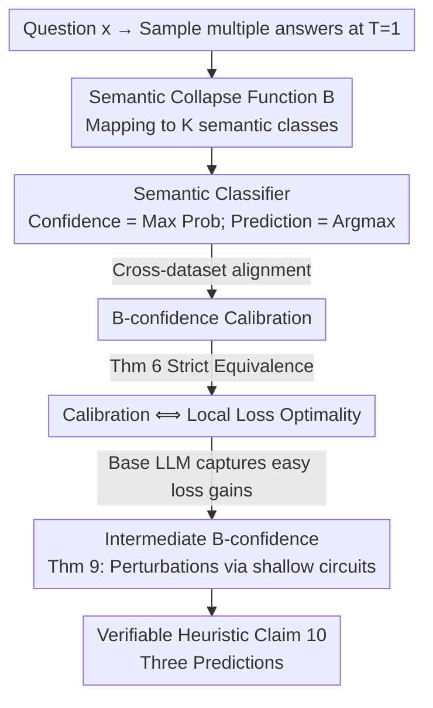

# Trained on Tokens, Calibrated on Concepts: The Emergence of Semantic Calibration in LLMs

**Conference**: ICLR 2026  
**OpenReview**: [https://openreview.net/forum?id=0sCyk9Tr5J](https://openreview.net/forum?id=0sCyk9Tr5J)  
**Code**: None  
**Area**: Learning Theory / Calibration / LLM Uncertainty  
**Keywords**: Semantic Calibration, Confidence, Local Loss Optimality, B-calibration, Emergence

## TL;DR
This paper discovers that base LLMs trained solely on next-token prediction are also well-calibrated at the **semantic level** (the confidence in the "meaning" of their answers matches the actual accuracy). It provides a theoretical mechanism based on the equivalence between "calibration and local loss optimality" to explain this emergence, predicting that instruction-tuning and chain-of-thought (CoT) disrupt this calibration—all three predictions are empirically verified.

## Background & Motivation

**Background**: To determine if an LLM is reliable, a common standard is **calibration**—a model should be 80% accurate on questions where it claims 80% confidence. Extensive evidence shows that base LLMs (pre-trained with maximum likelihood) are calibrated at the **next-token level**. This next-token confidence is directly applicable to tasks like True/False or multiple-choice, where a single token encodes the entire answer.

**Limitations of Prior Work**: Answers in open-ended QA are long-form text. "Paris is the capital" and "It's Paris" carry the same meaning but consist of entirely different token sequences. The real interest lies in the model's confidence regarding the **semantics** of the answer, which next-token calibration does not characterize. While many semantic confidence measures exist (verbalized confidence, semantic entropy, etc.), empirical data has not yet confirmed whether LLMs are naturally calibrated to these semantic measures without specific calibration training.

**Key Challenge**: A priori, standard maximum likelihood pre-training has no reason to produce semantic calibration as a byproduct. The training objective is a token-level syntactical goal, whereas calibration is a sequence-level semantic property—two concepts that are fundamentally distant. Empirically, calibration appears influenced by many factors (test distribution, post-training methods like RLHF/DPO, inference methods like CoT/few-shot, model size), creating a complex landscape.

**Goal**: ① Define an appropriate concept of semantic calibration and measure it; ② provide a **principled mechanism** to explain why and when it emerges; ③ use this mechanism to predict which settings will disrupt calibration.

**Key Insight**: The authors treat the LLM as a **multi-class classifier** by "collapsing" semantically identical outputs into the same class. This transforms open-ended QA into a standard K-class classification problem, allowing the application of recent results from classifier calibration theory regarding the equivalence between "calibration and local loss optimality" (Błasiok et al. 2023/2024).

**Core Idea**: Using a "semantic collapse function $B$" to transform the LLM into a semantic classifier, the authors prove that **B-calibration $\iff$ local loss optimality with respect to a specific family of perturbations $\mathcal{W}_B$**. Since base LLMs target test loss during pre-training without leaving "easily learnable loss improvements," they automatically achieve semantic calibration if they "know" their own semantic class distribution.

## Method

### Overall Architecture

The paper focuses on two tasks: **how to measure** semantic calibration and **why** it emerges.

On the measurement side: Given a question $x$, multiple answers are sampled at temperature $T=1$. A semantic collapse function $B$ (implemented using a strong LLM to extract a "one-word answer") maps each response to one of $K$ semantic classes (e.g., Paris / Rome / Berlin). This yields an empirical distribution over semantic classes, treated as the classifier output: **Semantic Confidence = maximum class probability**, and **Semantic Prediction = argmax class**. If the confidence matches the accuracy across the dataset, the model is considered semantically calibrated.

The mechanism side is the core contribution: The authors argue via a logical chain why base LLMs satisfy this property. From right to left: Can the LLM "know" its semantic class distribution $\to$ If so, the perturbation family $\mathcal{W}_B$ is easily representable $\to$ Base LLMs are locally loss-optimal against easily learned perturbations $\to$ Therefore, B-confidence is calibrated. The first link (calibration $\iff$ loss optimality) is strictly proven, while the subsequent links have principled justifications supported by experiments.

The following diagram illustrates the "measurement pipeline $\to$ theoretical mechanism chain":

### Key Designs

**1. B-calibration: Parameterizing "Semantics" as a Collapse Function**

Next-token calibration is meaningless for long-form text, and previous definitions of "semantic confidence" were fragmented. The authors introduce a collapse function $B: V^* \times V^N \to [K]$ that assigns "Question + Answer" to one of $K$ classes. By pushing forward the LLM's output distribution through $B$, they obtain a distribution over semantic classes:

$$(B_x \sharp p_x)(k) = \Pr_{z\sim p_\theta(\cdot|x)}[B_x(z)=k] = \sum_{z:\,B_x(z)=k} p_\theta(z\mid x).$$

Thus, $(x,y)$ is transformed into a standard "predicted distribution + true label" pair $(B_x\sharp p_x,\, B_x(y))$. **B-confidence calibration** is defined as this K-class classifier satisfying standard confidence calibration. This framework accommodates both next-token calibration (where $B$ selects a token) and semantic calibration (where $B$ collapses meanings).

**2. Calibration $\iff$ Local Loss Optimality: Mapping Optimization to Statistics**

Theorem 6 is the theoretical anchor. Intuition: A **miscalibrated** model must have a "simple" post-processing perturbation that can reduce its test loss. For instance, if a model is only 60% accurate at 70% confidence (overconfident), shifting probability mass away from the majority semantic class reduces cross-entropy. The authors use **exponential tilting** to define perturbation operators:

$$(f \star w)[z] := \mathrm{softmax}\big(w[z] + \log f[z]\big),$$

and construct a family of perturbations $\mathcal{W}_B$ targeting the probability of the most likely semantic class. Theorem 6 proves that a model is perfectly B-confidence calibrated **if and only if** it is locally loss-optimal with respect to $\mathcal{W}_B$.

**3. Intermediate B-confidence: Why Autoregressive Models "Know" the Distribution**

While $\mathcal{W}_B$ is defined over the **entire sequence** distribution, LLMs modify probabilities token-by-token. The authors define **intermediate B-confidence**:

$$g_i(z_{\le i}; x) := \Pr_{z\sim p_\theta(\cdot|x,z_{\le i})}[B_x(z)=k^*],$$

representing the probability assigned to the most likely semantic class given prefix $z_{\le i}$. Theorem 9 proves that if the model "knows" these $g_i$ (calculable by a small circuit atop the LLM), then the next-token distribution under any $w\in\mathcal{W}_B$ perturbation can be written as a simple reweighting of the original distribution. Crucially, the model does not need to know the correct answer; it only needs to predict **its own** likely semantic outcome before generation.

**4. Three Verifiable Predictions: Translating Theory to Heuristics**

Ours concludes (Claim 10): Base LLMs will be semantically calibrated **if and only if** the mapping $G: x \mapsto B_x\sharp p_x$ (question $\to$ semantic distribution) is "easily learnable" for the LLM. This leads to three falsifiable predictions: (1) **Semantic calibration emerges from standard pre-training** for most common questions; (2) **Instruction-tuning disrupts calibration**—since RLHF/DPO/RLVR objectives are not proper losses, Theorem 6 no longer applies; (3) **CoT disrupts calibration**—in reasoning tasks, the model doesn't know its final answer until it "finishes thinking," making $G$ hard to learn.

## Key Experimental Results

Experiments used 6 open-ended QA datasets (GSM8K, OpenMathInstruct-2, MATH500, TriviaQA, SimpleQA, TruthfulQA) and the Qwen / Gemini / Mistral / Llama series (0.5B~72B, base vs instruct), with 3 answer styles (concise / sentence / cot), totaling **650+ experiment groups**. Calibration error was measured using SmoothECE (smECE).

### Main Results

Base models in concise / sentence styles are generally well-calibrated (smECE in the 0.03~0.05 range):

| Dataset | Model | Style | smECE |
| :--- | :--- | :--- | :--- |
| TriviaQA | Mistral-7B-v0.1 | sentence | 0.036 |
| TriviaQA | Qwen2.5-7B | sentence | 0.030 |
| SimpleQA | Llama-3.1-70B | sentence | 0.031 |
| GSM8K | Qwen2.5-7B | concise | 0.047 |
| GSM8K | gemma-3-27b-pt | concise | 0.031 |
| OpenMathInstruct | Qwen2.5-Math-72B | concise | 0.038 |

### Ablation Study

| Configuration | Calibrated? | Description |
| :--- | :--- | :--- |
| base-concise / base-sentence | ✅ Yes | Predicted and confirmed calibration |
| base-cot | ❌ No (Underconfident) | Answer unknown until completion; $G$ hard to learn |
| instruct-* | ❌ No (Overconfident) | RL objectives are not proper losses |
| Mistral-7B-v0.1 (base) | ✅ Yes | Proper loss |
| zephyr-7b-sft-full (SFT only) | ✅ Mostly | SFT remains cross-entropy (proper loss) |
| zephyr-7b-dpo-full (SFT+DPO) | ❌ Significantly no | DPO is not a proper loss; breaks calibration |

### Key Findings

- **Semantic calibration is largely independent of model size**: Even small base models ($\le$1B) are quite calibrated across sentence and concise styles.
- **Controlled comparisons are decisive**: In the Mistral-7B lineage, base and SFT-only versions (proper loss) are calibrated, while the DPO version is significantly miscalibrated.
- **Learnability probes validate the mechanism**: Training rank-8 LoRA adapters to predict $B_x\sharp p_x$ shows a positive correlation between prediction error and calibration error—models that find it easier to predict their own semantic distribution are more calibrated.
- **TruthfulQA is an expected exception**: It targets common human misconceptions, violating the "in-distribution" assumption; thus, theory does not apply and calibration fails.

## Highlights & Insights
- **Mathematization of Semantic Confidence**: Using an arbitrary collapse function $B$ unifies various calibration concepts into a single framework.
- **The Power of "Calibration $\iff$ Loss Optimality"**: This translates "why a model is calibrated" into "whether the model has left easy loss gains on the table."
- **Paradox of CoT**: The very thing that makes CoT powerful (not knowing the answer until reasoning is complete) is exactly what causes the calibration mechanism to fail.
- **LoRA Probes as Diagnostic Tools**: To estimate if a model will be calibrated on a task, one can measure how easily it can predict its own semantic distribution.

## Limitations & Future Work
- **Ours only proposes one possible mechanism**; other reasons for the emergence of calibration (e.g., verbalized calibration) may exist.
- Theoretical gaps: Link 1 (Thm 6) is a strict proof, but links 2 and 3 rely on heuristics and empirical support.
- **Reliance on "in-distribution" data**: Fails on OOD data or adversarial misconceptions like TruthfulQA.
- The semantic collapse function $B$ relies on a teacher LLM; its noise/bias could affect measurements.

## Related Work & Insights
- **Vs. Semantic Entropy (Farquhar et al. 2024)**: While both use semantic clustering, the current work provides a mechanistic explanation for **why** this is calibrated.
- **Vs. Błasiok et al. (2023/2024)**: This paper extends the general "proper loss" calibration theory to the specific sequence-level semantics of autoregressive LLMs.
- **Vs. Next-token studies (OpenAI 2023)**: While prior work showed calibration at the token/multiple-choice level, this work elevates it to the **semantic** level and explains why post-training disrupts it.

## Rating
- Novelty: ⭐⭐⭐⭐⭐ First mechanistic explanation for the emergence of LLM semantic calibration with falsifiable predictions.
- Experimental Thoroughness: ⭐⭐⭐⭐ Extensive cross-model/data experiments; lacking systematic OOD verification.
- Writing Quality: ⭐⭐⭐⭐⭐ Clear connection between theory, intuition, and formal results.
- Value: ⭐⭐⭐⭐⭐ Provides a solid theoretical foundation for LLM uncertainty research.

<!-- RELATED:START -->

## Related Papers

- [\[ICLR 2026\] Robust Decision Making with Partially Calibrated Forecasts](robust_decision-making_with_partially_calibrated_forecasters.md)
- [\[ICLR 2026\] Practical Estimation of the Optimal Classification Error with Soft Labels and Calibration](practical_estimation_of_the_optimal_classification_error_with_soft_labels_and_ca.md)
- [\[ICLR 2026\] The Softmax Bottleneck Does Not Limit the Probabilities of the Most Likely Tokens](the_softmax_bottleneck_does_not_limit_the_probabilities_of_the_most_likely_token.md)
- [\[ICLR 2026\] CLEAR: Calibrated Learning for Epistemic and Aleatoric Risk](clear_calibrated_learning_for_epistemic_and_aleatoric_risk.md)
- [\[ICLR 2026\] Intrinsic Entropy of Context Length Scaling in LLMs](intrinsic_entropy_of_context_length_scaling_in_llms.md)

<!-- RELATED:END -->
