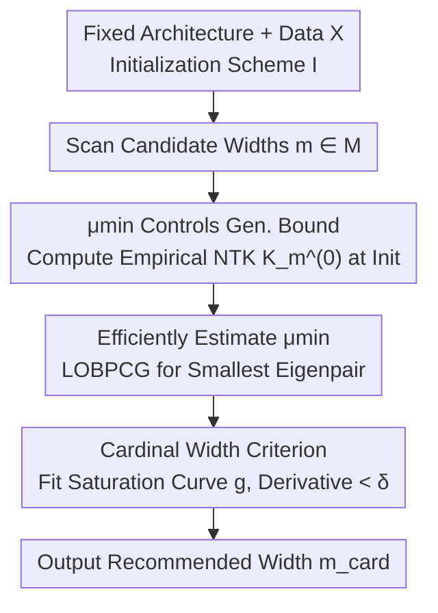

# Training-Free Determination of Network Width via Neural Tangent Kernel

**Conference**: ICLR 2026  
**OpenReview**: [https://openreview.net/forum?id=0elvad3gEu](https://openreview.net/forum?id=0elvad3gEu)  
**Code**: https://github.com/Suna-D/cardinal-width  
**Area**: Learning Theory / Neural Tangent Kernel / Network Width Selection  
**Keywords**: Neural Tangent Kernel, minimum eigenvalue, generalization error bound, network width, training-free

## TL;DR
This paper uses the **minimum eigenvalue** $\mu_{\min}$ of the Neural Tangent Kernel (NTK) to theoretically bound the test error of infinite and finite-width networks. Based on this, it proposes a **training-free** metric: scanning $\mu_{\min}$ at different widths during initialization to find the inflection point where growth saturates, defined as the "cardinal width"—the point beyond which further widening yields no additional generalization benefit.

## Background & Motivation

**Background**: In the overparameterized regime, widening a network typically reduces generalization error, but this improvement saturates once the width is sufficiently large—further widening simply wastes computation. Determining a "sufficiently wide" width under computational constraints is a fundamental problem. Existing approaches include supernets adjusted during training (network slimming, once-for-all, etc.), training-free NAS scoring metrics (NASWOT, TE-NAS, etc.), and scaling laws (Kaplan, Chinchilla).

**Limitations of Prior Work**: While these methods can rank candidate architectures or constrain search spaces, they **lack a theoretically grounded "stopping rule"**—none can explicitly state "stop increasing the width here." Even works like TE-NAS (Chen et al. 2021) that utilize NTK as a scoring tool provide no explicit theory linking NTK to model performance. Consequently, width selection remains a matter of ad hoc trial-and-error.

**Key Challenge**: Although generalization theory for Kernel Ridge Regression (KRR) is mature, classical conclusions require the **full eigenspectrum** to characterize risk, which is computationally expensive. Furthermore, while the NTK literature has long recognized the importance of the minimum eigenvalue $\mu_{\min}$ for optimization and generalization (it controls the kernel condition number), it has **never directly linked $\mu_{\min}$ to the generalization error**—prior work only proved the positive definiteness of NTK or bounded $\mu_{\min}$ itself, stopping at the level of "it is important."

**Goal**: (1) Theoretically reduce the test error upper bound to a **single scalar** $\mu_{\min}$; (2) Generalize this theory from infinite to finite width; (3) Design a training-free width selection criterion computable at initialization based on these findings.

**Key Insight**: In the infinite-width limit, gradient training with squared loss is equivalent to **kernel ridgeless regression** using the NTK as the kernel (Jacot 2018; Lee 2019). Starting from the closed-form KRR risk expression by Canatar et al. (2021), the authors utilize the monotonicity of the spectral filter function with respect to $\mu_k$ to **relax** the summation over the full spectrum into an upper bound depending only on the minimum eigenvalue.

**Core Idea**: Use the **saturation inflection point of the minimum eigenvalue $\mu_{\min}$** of the NTK at initialization as a training-free proxy for the "test loss saturation inflection point," thereby identifying the cardinal width in a single pass without training.

## Method

### Overall Architecture

This work combines theory with a theory-derived algorithm. It addresses the question of "how wide is wide enough" in two stages: **first, theoretically proving that $\mu_{\min}$ controls the test error upper bound** (Theorem 3.2 for infinite width → Theorem 3.7/3.8 for finite width), and **then translating this into an executable algorithm**—since test error is dominated by $\mu_{\min}$ and $\mu_{\min}$ saturates as width increases experimentally, the saturation point of $\mu_{\min}$ serves as a proxy for the test loss saturation point. The algorithm only requires computing the minimum eigenvalue of the empirical NTK for a range of candidate widths at **initialization**, fitting a saturation curve, and identifying the minimum width where the derivative flattens as the cardinal width.

### Key Designs

**1. Minimum Eigenvalue Controls Generalization Upper Bound: From Infinite to Finite Width**

This is the theoretical core, addressing the limitation that prior KRR risks required the full spectrum and $\mu_{\min}$ was not directly linked to generalization. In the **infinite-width** case, the authors decompose the closed-form KRR risk from Canatar et al. (2021) into bias-variance components $E_g=\frac{1}{1-\gamma}(B+V)$, involving spectral filters $\mu_k/(\kappa+\mu_k)^2$, bias terms $\kappa^2 w_k^2$, and variance terms $\sigma^2\mu_k$. The key relaxation is: since $x\mapsto(\kappa/(\kappa+x))^2$ is monotonically decreasing on $[0,\infty)$, the bias term can be uniformly controlled by the minimum eigenvalue, $B\le \frac{\kappa^2}{(\kappa+\mu_{\min})^2}\|f^*\|^2$. Combined with Assumption 3.1 (staying away from the double-descent interpolation peak, ensuring $1-\gamma=\Theta(1)$), they obtain:

$$E_g \le C_1\,\mu_{\min}^{-2} + C_2\,\sigma^2 n\,\mu_{\min}^{-2}.$$

For a fixed dataset, $n$ and $\sigma$ are constants, yielding $E_g\le C\,\mu_{\min}^{-2}$—a **single scalar** $\mu_{\min}$ provides the worst-case upper bound for the test error. This is effective because estimating one extreme eigenvalue is far cheaper than full spectral decomposition.

For the **finite-width** case (Theorem 3.7), the difference between a finite-width network $f_m(T)$ and the infinite-width NTK regressor $f_\infty$ is decomposed into three parts via the triangle inequality: (G1) difference between the network and its own empirical NTK regressor, (G2) difference between empirical kernel regressors before and after training, and (G3) difference between the initialized empirical kernel and the infinite-width kernel. Using Duhamel's principle and KRR closed-form solutions for relaxation:

$$E^{(m)}_g \le E^{(\infty)}_g + C_3\,\frac{\sup_u\|K^{(u)}_m-K^{(0)}_m\| + \|K^{(T)}_m-K^{(0)}_m\| + \|K^{(0)}_m-K_\infty\|}{\mu_{\min}(K^{(0)}_m)^2}.$$

Intuitively: under lazy training, the kernel remains almost constant (numerator is small); under feature learning, $\|K^{(T)}_m-K^{(0)}_m\|$ increases, making the gap significant. Under lazy training (Assumption 3.6, kernel drift $\le C\phi(m)$ where $\phi(m)=m^{-1/2}$), this simplifies to Theorem 3.8:

$$E^{(m)}_g \le \frac{C_4}{\mu_{\min}(K^{(0)}_m)^2} + C_5\,\frac{\phi(m)}{\mu_{\min}(K^{(0)}_m)^2},$$

meaning the **minimum eigenvalue of the empirical NTK at initialization** simultaneously controls the generalization of both infinite and finite widths, with the correction term $\phi(m)$ vanishing as $m\to\infty$. To the authors' knowledge, this is the first work to **directly** link the minimum eigenvalue of the finite-width empirical NTK to a generalization error upper bound.

**2. Cardinal Width: Using the Saturation Point of $\mu_{\min}$ as a Training-Free Width Proxy**

Based on Theorem 3.8, the authors translate the theory into an operational criterion. Since $E^{(m)}_g$ is dominated by $\mu_{\min}(K^{(0)}_m)^{-2}$, and experiments show that $\mu_{\min}$ **monotonically increases and saturates** with width $m$, $E^{(m)}_g$ similarly saturates. Thus, **cardinal width** is defined as the width where generalization performance saturates, using the saturation point of $\mu_{\min}$ as its training-free proxy.

Algorithm (Algorithm 1): Given architecture, data $X$ (**no labels needed**), initialization $I$, and a width grid $M$, compute the empirical NTK $(K^{(0)}_m)_{ij}=\nabla_\theta f_{\theta_0}(x_i)^\top\nabla_\theta f_{\theta_0}(x_j)$ at initialization for each $m$, and estimate its minimum eigenvalue $\hat\mu_{\min}(m)$. Fit the points $\{(m,\hat\mu_{\min}(m))\}$ to a simple saturation curve using least squares:

$$g(x) = -\frac{a x}{b+x} + c,$$

The **minimum width** where the derivative $\frac{d}{dm}\hat g(m)<\delta$ (a threshold) is taken as $m_{\text{card}}$. This allows model designers to determine the point of diminishing returns without training any models or using labels.

**3. Efficient Estimation: LOBPCG + Subset Sampling for Minimum Eigenpairs**

Full NTK decomposition is expensive. The authors use **LOBPCG** (Locally Optimal Block Preconditioned Conjugate Gradient) to minimize the Rayleigh quotient on a small subspace, extracting only the extreme eigenpair. This **estimates only the minimum eigenvalue** rather than the full spectrum. For California Housing (~20K samples), estimating $\mu_{\min}$ per width takes about one minute. Furthermore, computing $\mu_{\min}$ on a **subset** of data further reduces cost while maintaining the relative saturation trend across widths, ensuring the criterion is practically viable.

### Loss & Training
The theory is based on squared loss + gradient flow training with weights initialized using Lee et al.'s NTK parametrization. The method itself is **training-free**: cardinal width depends only on the empirical NTK at initialization. Validation experiments use actual SGD training (LR 0.001, batch 32, 1000 epochs) to plot "test loss vs. width" curves for comparison with predicted inflection points.

## Key Experimental Results

### Main Results

Theoretical validation on a two-layer network (Synthetic regression, 2000 samples × 20 features, noise std=10, width $\{16,32,\dots,1024\}$):

| Validation Item | Observation | Relation to Theory |
|-----------------|-------------|--------------------|
| Test Loss vs. Width | Decreases and saturates | Consistent with $E_g$ decreasing as $\mu_{\min}$ increases |
| $\mu_{\min}$ vs. Width | Increases and saturates | Saturation point aligns with test loss saturation |
| $E_g$ vs. $\mu_{\min}^{-2}$ | All empirical points fall **below** dashed line with slope 1 | Satisfies the $O(\mu_{\min}^{-2})$ worst-case bound in Theorem 3.8 |
| Actual Slope | Closer to $O(1/\sqrt{\mu_{\min}})$ | Real dependency is much milder than the worst-case bound |

Cardinal width prediction (Multiple architectures × Multiple datasets):

| Architecture | Dataset | Result |
|--------------|---------|--------|
| DNN | UCI Diabetes / California Housing | Width where $g' < \delta$ aligns with the test loss plateau |
| CNN | MNIST / CIFAR-10 | $\mu_{\min}$ saturation point aligns with test loss saturation |
| ResNet | MNIST / CIFAR-10 | Same as above |

> All $\mu_{\min}$ and test loss values are averaged over 5 independent runs.

### Ablation Study

| Configuration / Analysis | Key Finding | Description |
|-------------------------|-------------|-------------|
| Lazy training vs. Feature learning | Aligned in feature learning regime | Theorem 3.8 formally holds for lazy training, but saturation still aligns without lazy constraints |
| Training Recipe Perturbation | Cardinal width varies little | Recommended width is stable against actual hyperparameters (Appendix D.1) |
| Subset Sampling for $\mu_{\min}$ | Relative saturation trend remains stable | Further reduces computational cost (Appendix D.2) |

### Key Findings
- **Worst-case Bound vs. Reality**: While theory gives an $O(\mu_{\min}^{-2})$ bound, the empirical relationship is milder ($\approx 1/\sqrt{\mu_{\min}}$), suggesting $\mu_{\min}$ is even more effective as an indicator than the bound implies.
- **Effective Beyond Lazy Training**: Despite Theorem 3.8 technically covering lazy training, $\mu_{\min}$ saturation still aligns with test loss saturation in feature learning regimes. The authors argue via DMFT (Bordelon & Pehlevan 2023) that kernel drift converges to a **small constant** under feature learning, preserving the core insight.
- **Per-recipe Definition**: Since NTK depends on architecture/data/init, cardinal width is specific to these components but remains robust across various training recipes.

## Highlights & Insights
- **Compressing the Spectrum into a Scalar**: Instead of full eigenspectrum coefficients, using the monotonicity of spectral filters allows the bound to depend solely on $\mu_{\min}$. This reduces complexity from full decomposition to extreme eigenpair estimation—an elegant shift that enables engineering feasibility.
- **Theoretical Inflection = Engineering Stopping Rule**: Translating the abstract "$\mu_{\min}$ controls generalization" into "monitor $\mu_{\min}$ saturation" provides the first theoretically backed stopping rule for width selection.
- **First Connection Between Finite-width Empirical NTK and Generalization Error**: The triangle decomposition (G1)/(G2)/(G3) provides a reusable paradigm for controlling gaps between a network, its empirical kernel regressor, and the infinite-width regressor.
- **Label-free Width Selection**: Cardinal width depends only on the initialized NTK and inputs, requiring no labels, making it ideal for early-stage architecture design.

## Limitations & Future Work
- **Theoretical Constraints**: Theory is limited to lazy training + squared loss + gradient flow; it does not formally cover strong feature learning or other loss functions, though experiments show empirical effectiveness.
- **Limited to Regression**: While NTK can be computed for classification, there is currently **no theoretical guarantee** presented for those tasks.
- **Assumption of Staying Away from Interpolation Peaks**: Near double-descent peaks, $1-\gamma \to 0$, causing the bound to explode and the criterion to potentially fail.
- **Non-uniqueness of Fitting**: The saturation curve $g(x)$ and threshold $\delta$ are specific choices; different functions or thresholds might affect the identified cardinal width.

## Related Work & Insights
- **vs. In-training Structure Adjustment**: Methods like network slimming or once-for-all have high training costs; ours is training-free and works at initialization.
- **vs. Training-free NAS Metrics**: NASWOT/TE-NAS rank structures; while TE-NAS uses NTK, it lacks an explicit link to performance. Ours provides an **absolute stopping rule** rather than a relative ranking.
- **vs. Scaling Laws**: Scaling laws are empirical and focus on total resource scaling; ours provides a theoretical stopping rule for the specific dimension of width.
- **vs. NTK Eigenvalue Literature**: Prior works prove positive definiteness or bound $\mu_{\min}$, but stop there; this work is the first to **directly** link it to generalization error.

## Rating
- Novelty: ⭐⭐⭐⭐⭐ First work to directly link the minimum eigenvalue of the finite-width empirical NTK to generalization bounds and provide a theoretical stopping rule for width.
- Experimental Thoroughness: ⭐⭐⭐⭐ Covers DNN/CNN/ResNet across multiple datasets with thorough ablations; however, validation is primarily focused on regression.
- Writing Quality: ⭐⭐⭐⭐⭐ Theory derivation is clear, relaxation motivation is explicit, and the bridge from theory to algorithm is logical.
- Value: ⭐⭐⭐⭐ Provides a practical, cheap (training-free, label-free) criterion for "how wide is wide enough," highly useful for architecture design under resource constraints.

<!-- RELATED:START -->

## Related Papers

- [\[ICML 2026\] Finite-Width Neural Tangent Kernels from Feynman Diagrams](../../ICML2026/learning_theory/finite-width_neural_tangent_kernels_from_feynman_diagrams.md)
- [\[ICLR 2026\] Understanding the Dynamics of Forgetting and Generalization in Continual Learning via the Neural Tangent Kernel](understanding_the_dynamics_of_forgetting_and_generalization_in_continual_learnin.md)
- [\[ICLR 2026\] Parameterized Hardness of Zonotope Containment and Neural Network Verification](parameterized_hardness_of_zonotope_containment_and_neural_network_verification.md)
- [\[ICLR 2026\] Tractability via Low Dimensionality: The Parameterized Complexity of Training Quantized Neural Networks](tractability_via_low_dimensionality_the_parameterized_complexity_of_training_qua.md)
- [\[ICLR 2026\] Convergence Analysis of Tsetlin Machines under Noise-Free and Noisy Training Conditions: From 2 Bits to k Bits](convergence_analysis_of_tsetlin_machines_under_noise-free_and_noisy_training_con.md)

<!-- RELATED:END -->
