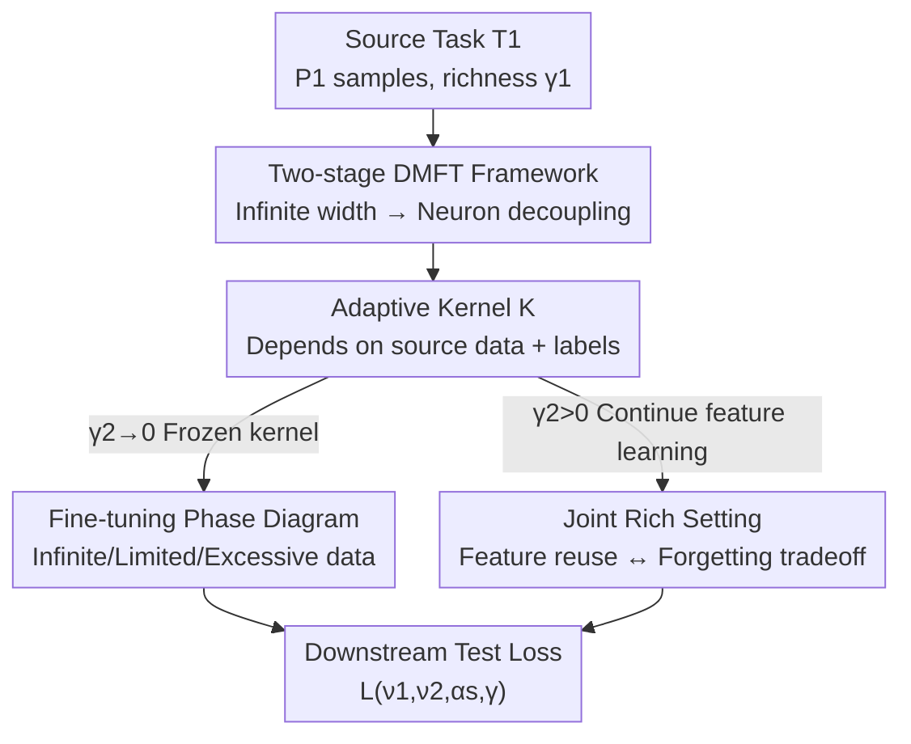

# Transfer Learning in Infinite Width Feature Learning Networks

**Conference**: ICLR 2026  
**OpenReview**: [https://openreview.net/forum?id=Oox4QOhmi9](https://openreview.net/forum?id=Oox4QOhmi9)  
**Area**: Learning Theory / Infinite Width Networks / Transfer Learning  
**Keywords**: Infinite Width Neural Networks, Feature Learning, Transfer Learning, Dynamical Mean-Field Theory (DMFT), Adaptive Kernels

## TL;DR
Under mean-field/µP parameterization, the authors use Dynamical Mean-Field Theory (DMFT) to derive a transfer learning theory for infinite-width MLPs trained with gradient flow. They quantify the utility of pre-training as closed-form functions of source/target task alignment $\alpha_s$, data sizes $\nu_1, \nu_2$, and feature learning strengths $\gamma_1, \gamma_2$, while providing a phase diagram for positive and negative transfer.

## Background & Motivation

**Background**: Transfer learning alleviates data bottlenecks in downstream tasks by leveraging representations learned from data-rich source tasks, achieving immense practical success (pre-training + fine-tuning is the default paradigm). However, a quantitative theory predicting "when and why it works" has long been lacking.

**Limitations of Prior Work**: Existing infinite-width theories mostly remain in the "lazy" limit (NTK/NNGP), where networks are equivalent to **fixed** kernels and representations do not change during training. In reality, the value of pre-training lies precisely in its ability to **modify representations**. Fixed-kernel theories inherently fail to characterize how features are shaped by the source task and reused by the target task.

**Key Challenge**: To analyze transfer, infinite-width networks must **retain feature learning**. However, once feature learning is preserved, the predictor dynamics become highly non-linear with history dependence, making them difficult to solve. The lazy limit is analytically tractable but lacks feature learning, while the rich limit has feature learning but is mathematically daunting—this is the fundamental tension in transfer learning theory.

**Goal**: In the infinite-width limit that preserves feature learning, quantitatively answer three sub-questions: (1) What does the "adaptive kernel" learned during pre-training look like, and which source task properties does it depend on? (2) How many samples can be saved when fine-tuning on a downstream task with this kernel, and when does it perform worse? (3) What happens if feature learning is also enabled downstream (joint rich)?

**Key Insight**: The authors adopt mean-field/µP (also known as $\mu$P) parameterization. Its key property is that feature learning does not vanish even as width $N\to\infty$, provided the richness parameter $\gamma>0$. By using DMFT to reduce the "coupled dynamics of infinite neurons" into a "single-neuron stochastic process + a set of deterministic kernel evolution equations," the complex rich limit becomes analytically tractable.

**Core Idea**: Transfer learning is viewed as a "two-stage gradient flow." The source task shapes an **adaptive kernel dependent on source data and labels**, which the downstream task then utilizes. By solving for the spectral structure of the adaptive kernel (signal spike + finite-sample noise spike + crosstalk terms) via DMFT, transfer success can be expressed as a closed-form function of data volume, alignment, and feature strength.

## Method

### Overall Architecture

Consider an MLP of width $N$ and depth $L$, where $f(x)=\frac1N w_L\cdot\phi(h_L(x))$ and hidden layers are $h_{\ell+1}=\frac1{\sqrt N}W_\ell\phi(h_\ell)$. Training occurs in two stages: first on source task $T_1$ ($P_1$ samples) with richness $\gamma_1$ to obtain parameters $\theta_1$, then continuing on target task $T_2$ ($P_2$ samples) with richness $\gamma_2$ using $\theta_1$ as the initial value. The richness parameter $\gamma$ controls the "lazy $\leftrightarrow$ feature learning" transition: $\gamma\to0$ is lazy/kernel learning (fixed representation), while $\gamma>0$ enables feature learning. The special case where downstream $\gamma_2\to0$ is defined as **fine-tuning**.

The theoretical framework is: **Pre-training shapes an adaptive kernel on the source task → This kernel carries source information to the downstream task → Downstream training either freezes the kernel for lazy fine-tuning or continues rich training.** Under $N\to\infty$ and µP parameterization, all macroscopic quantities (especially the predictor) are characterized by deterministic DMFT equations, allowing accurate predictions for "wide but finite" real networks.

### Key Designs

**1. DMFT Framework for Two-Stage Gradient Flow: Reducing Infinite-Width Rich Dynamics to Solvable Single-Point Stochastic Processes**

The difficulty in analyzing transfer learning lies in the fact that hidden representations change drastically in the rich limit, and predictor dynamics are highly non-linear with history dependence across two stages. DMFT solves this: in the $N\to\infty$ limit, interactions between neurons asymptotically **decouple**. Population averages $\frac1N\sum_i g(h_i)$ converge to expectations over the limit distribution $\langle g(h)\rangle$ by the Law of Large Numbers. Thus, the macroscopic quantities of the network (including the two-stage predictors $f_1, f_2$) follow a set of **deterministic equations**. For general deep networks, these equations involve non-Markovian history dependence and are complex; however, the authors prove that **two-layer networks ($L=1$) have Markovian dynamics in the feature space**. All dependence of the downstream task on pre-training is passed through a set of initial random variables $\{h(t_1), z(t_1)\}$. Specifically, the predictor $f(x,t)=\gamma_1^{-1}\langle z(t)\phi(h(x,t))\rangle$, where pre-activations $h$ and readouts $z$ evolve as single-point stochastic processes:

$$h(x,t)=\chi(x)+\gamma_1\!\int_0^{t_1}\!\!ds\!\sum_{\mu\in T_1}\!\Delta_\mu(s)g_\mu(s)K_x(x,x_\mu)+\gamma_2\!\int_{t_1}^{t}\!\!ds\!\sum_{\nu\in T_2}\!\Delta_\nu(s)g_\nu(s)K_x(x,x_\nu)$$

The error signal is $\Delta_\mu(t)=-\partial_{f_\mu}\ell(f_\mu,y_\mu)$. The two integral terms clearly separate the contributions of "source task shaping" and "target task shaping." This Markovian structure allows 2-layer networks to be further analyzed, while it does not hold for deep networks (see Appendix B).

**2. Adaptive Kernel: The True Carrier of Transfer, with Spectral Structure Determined by Source Data and Labels**

Unlike lazy theories where the kernel is fixed at initialization, pre-training here induces an **adaptive feature kernel** $K(t)=\langle h(t)h(t)^\top\rangle$. It **depends on both source data $x$ and source labels $y$**, serving as the carrier of "pre-trained knowledge." In a solvable two-layer linear model (source task $y_s=\frac{1}{\sqrt D}\beta_s\cdot x$), the authors identify three typical spectral structures:

When data is infinite ($P_1\to\infty$), the kernel converges to a **rank-one signal spike** along the source direction:
$$K_\ell(X,X')=X\Big(I+\tfrac{\chi_\ell}{D}\beta_s\beta_s^\top\Big)X'^\top,$$
where $\chi_\ell$ strictly increases with $\gamma_1$ (for $L=1$, $\chi=\sqrt{1+\gamma_1^2}-1$). Richer pre-training leads to greater "gain" along the source direction. When data is limited ($P_1=\nu_1 D$), the kernel gains a **noise spike** $gg^\top$ and a **crosstalk term** $g\beta_s^\top+\beta_s g^\top$, where the Gaussian vector $g$ captures finite-sample fluctuations and is uncorrelated with $\beta_s$. The relative magnitudes of the "signal-noise-crosstalk" terms determine whether transfer helps or hinders.

**3. Fine-tuning Phase Diagram: Clarifying Positive vs. Negative Transfer via Data/Richness Regimes**

By freezing the source adaptive kernel and performing kernel regression fine-tuning on $T_2$ ($\gamma_2\to0$), the authors derive three conclusions based on pre-training regimes (alignment $\alpha_s=\frac{1}{D}\beta_s\cdot\beta_t$, target data ratio $\nu_2=P_2/D$):

(i) **Abundant Source Data Always Yields Positive Transfer**: In the population limit, the downstream test loss is:
$$L(\nu_2,\alpha_s,\chi_\ell)=(1-\nu_2)\Big[1-\tfrac{2\chi_\ell\alpha_s^2\nu_2}{1+\chi_\ell\nu_2}+\tfrac{(\chi_\ell)^2\alpha_s^2\nu_2^2}{(1+\chi_\ell\nu_2)^2}\Big]\le 1-\nu_2,$$
Meaning as long as $\chi_\ell>0$ and $\alpha_s\neq0$, fine-tuning is strictly better than the random initialization baseline $1-\nu_2$.
(ii) **Limited Source Data Can Cause Negative Transfer**: Loss is determined by coefficients $c_1, c_2, c_3$. Higher signal $c_2$ is better; crosstalk $c_1$ is always harmful (it rotates high-gain directions toward noise); the noise term $c_3$ acts like high-dimensional ridge regularization when noise is uncorrelated with the target. If crosstalk/noise overwhelms the signal, transfer loss exceeds the baseline, appearing as negative transfer, especially when downstream data $\nu_2$ is larger.
(iii) **Excessively Rich Pre-training is Harmful**: As $\gamma_1\to\infty$, weights collapse to rank-one $W=wv^\top$. The adaptive kernel degrades to a single direction, and only the **projection of the target within the source-spanned subspace** can be learned. The asymptotic loss:
$$L(\nu_1,\alpha_s,\alpha_g)=1-(\sqrt{\nu_1}\,\alpha_s+\sqrt{1-\nu_1}\,\alpha_g)^2,$$
This **no longer depends on target data volume $\nu_2$** because only one scalar coefficient remains in the rank-one feature. If $\alpha_g=0$, the best reachable loss is $1-\alpha_s^2$. Perfect interpolation occurs only if $\alpha_s=1$. Conclusion: infinitely rich pre-training is theoretically detrimental.

**4. Joint Rich Setting: The "Reuse ↔ Forgetting" Tradeoff When Downstream also Learns Features**

When $\gamma_2>0$, the adaptive kernel continues to absorb features from $T_2$. A core tradeoff emerges: a larger $\gamma_2$ results in faster early gains on the downstream task but causes more severe **forgetting of source features**. Thus, an **intermediate $\gamma_2$** exists that minimizes both target loss and catastrophic forgetting. This setting explains why transfer from simple (low-degree polynomial) to complex (high-degree) tasks yields gains, while the reverse (hard $\to$ easy) does not, as pre-training biases representations toward high-frequency components irrelevant to simple tasks.

### Loss & Training
Both source and target tasks use gradient flow on squared loss (synthetic tasks) or regression loss (real images). Lazy fine-tuning corresponds to kernel regression dynamics $\frac{d}{dt}f_2(x)=k(x)^\top K(y-f_2)$. DMFT predictions are numerically verified using Monte Carlo approximations of the single-point stochastic process (Euler discretization + population averaging), compared against finite-width (e.g., $N=20000$ 2-layer ReLU) networks.

## Key Experimental Results

### Main Results
The theory is validated on linear/polynomial synthetic tasks and CIFAR-10. Key qualitative conclusions align with predictions:

| Setting | Phenomenon | Related Theory |
|------|------|----------|
| Infinite Source Data ($\nu_1\to\infty$) | Test loss decreases monotonically with alignment $\alpha_s$; always positive transfer. | Result 2 |
| Limited Source + Noise/Target Alignment ($\alpha_g\neq0$) | Negative transfer occurs at high $\nu_2$. | Result 3 |
| Excessively Rich Pre-training ($\gamma_1\to\infty$) | Loss depends only on $\nu_1, \alpha_s, \alpha_g$; bound at $1-\alpha_s^2$. | Result 4 |
| CIFAR-10 Fine-tuning ({0,1}→{0,9} regression) | Large $\gamma_1$ yields lower loss at small $P_2$; curves converge as $P_2$ increases. | Result 1/Lazy FT |

### Ablation Study

| Configuration | Key Findings |
|------|---------|
| Polynomial Easy→Hard (Linear $\to$ Quadratic) | Pre-training reduces target loss. |
| Polynomial Hard→Easy (High-deg He5 $\to$ Low-deg He2) | Transfer yields no gain over no pre-training. Representations bias toward high frequencies. |
| CIFAR-10 Joint Rich ({1,2}→{8,9}, $P_2=200$) | Transfer reduces loss for any $\gamma_2$, with optimal early stopping. |
| Varying Downstream Data $P_2$ | Source feature learning is critical at small $P_2$; transfer gain is marginal when $P_2$ is large. |

### Key Findings
- Transfer success is determined by a joint phase diagram of (data volumes $\nu_1, \nu_2$, alignment $\alpha_s$, feature strengths $\gamma_1, \gamma_2$). The competition between "signal spike vs. noise spike vs. crosstalk" is the underlying mechanism.
- An optimal feature strength exists: $\gamma_1^\star(\nu_2)$ is larger for small $\nu_2$ (variance reduction dominates) and decreases as $\nu_2$ grows (feature drift bias begins to hurt).
- Under joint rich, a larger $\gamma_2$ causes the target pre-activation distribution $p(h)$ to deviate further from Gaussian—a "fingerprint" of true feature learning that does not occur in the lazy limit.

## Highlights & Insights
- **Closed-form Loss for Transfer Utility**: Eq.8/13/15 express transfer gain directly as functions of data, alignment, and richness, providing an interpretable and predictive phase diagram that NTK/NNGP theories cannot provide.
- **Insightful Adaptive Kernel Decomposition**: Precising defining the harm of finite samples as "noise spikes + crosstalk terms" allowed a fine-grained explanation of representation quality.
- **"Infinite Richness is Harmful" is Counter-intuitive**: While it is often assumed that more feature learning is better, Result 4 proves that excessively rich pre-training causes kernels to collapse to rank-one, losing learnability in all but the source direction.

## Limitations & Future Work
- Linear toy models rely on strong assumptions like isotropic data, which simplifies closed-form solutions but limits quantitative prediction range for structured/heavy-tailed data.
- Analytical conclusions focus on two-layer networks where feature space dynamics are Markovian; deep networks involve complex history dependence.
- Future work: Studying which hidden layers should be kept during transfer and connecting the framework to curriculum learning to explain task sequencing effects.

## Related Work & Insights
- **vs. NTK/NNGP Fixed Kernel Theory (Canatar 2021, Jacot 2020)**: These obtain fixed kernels where representations do not change. Ours preserves feature learning via µP, where kernels adapt to data.
- **vs. Bayesian Multi-task Transfer (Ingrosso 2025, Shan 2025)**: These regularize the target model toward source posterior weights. Ours uses gradient flow + DMFT to characterize how fluctuations in finite source data hurt fine-tuning.
- **vs. Deep Linear Fine-tuning (Tahir 2024)**: Previous works only analyzed infinite source data and low-rank kernels. Ours covers finite data fluctuations and extends to non-linear networks and joint rich settings.

## Rating
- Novelty: ⭐⭐⭐⭐⭐ First theory to provide a closed-form phase diagram for transfer success in an infinite-width feature learning limit.
- Experimental Thoroughness: ⭐⭐⭐⭐ Synthetic tasks and CIFAR-10 validate the theory well, though large-scale real-world datasets are limited.
- Writing Quality: ⭐⭐⭐⭐ Clear structure and progressive results, though high formula density may be a barrier for non-theory readers.
- Value: ⭐⭐⭐⭐⭐ Provides an interpretable theoretical guide for "when to pre-train" and "when negative transfer occurs."

<!-- RELATED:START -->

## Related Papers

- [\[ICLR 2026\] Scaling Laws and Spectra of Shallow Neural Networks in the Feature Learning Regime](scaling_laws_and_spectra_of_shallow_neural_networks_in_the_feature_learning_regi.md)
- [\[ICLR 2026\] Residual Feature Integration is Sufficient to Prevent Negative Transfer](residual_feature_integration_is_sufficient_to_prevent_negative_transfer.md)
- [\[ICLR 2026\] Mitigating the Curse of Detail: Scaling Arguments for Feature Learning and Sample Complexity](mitigating_the_curse_of_detail_scaling_arguments_for_feature_learning_and_sample.md)
- [\[ICLR 2026\] Feature Compression is the Root Cause of Adversarial Fragility in Neural Networks](feature_compression_is_the_root_cause_of_adversarial_fragility_in_neural_network.md)
- [\[ICLR 2026\] Infinite Horizon Markov Economies](infinite_horizon_markov_economies.md)

<!-- RELATED:END -->
