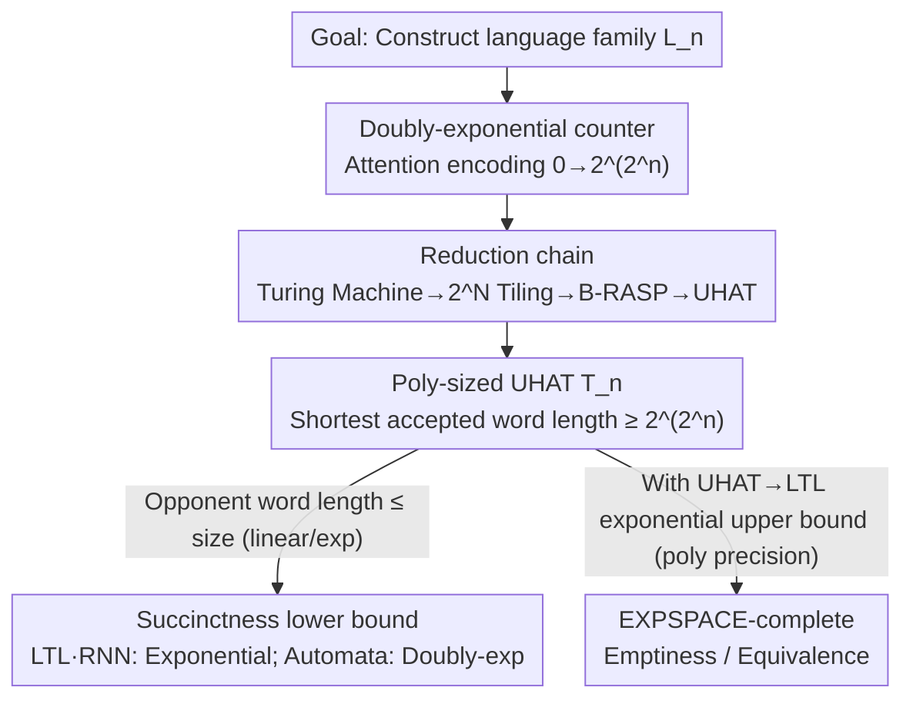

# Transformers Are Inherently Succinct

**Conference**: ICLR 2026  
**OpenReview**: [https://openreview.net/forum?id=Yxz92UuPLQ](https://openreview.net/forum?id=Yxz92UuPLQ)  
**Code**: None (Theoretical)  
**Area**: Learning Theory / Transformer Expressivity  
**Keywords**: Transformer Expressivity, Succinctness, Formal Languages, UHAT, EXPSPACE

## TL;DR
This paper evaluates Transformer capabilities using a different metric: instead of asking "which languages it can recognize," it asks "how concisely it can describe a language." The results prove that fixed-precision Transformers (UHAT) are extremely "succinct," describing certain languages exponentially more concisely than LTL and RNNs, and doubly-exponentially more than finite automata. The trade-off is that its emptiness/equivalence verification problem is EXPSPACE-complete (impossible to solve efficiently in the worst case).

## Background & Motivation

**Background**: Recent theoretical works have characterized the "expressive capacity" of Transformers. Fixed-precision Transformers (the setting closest to actual hardware) have been proven to recognize only certain subclasses of **subregular languages**, specifically **star-free languages** (equivalent to LTL and counter-free automata). For example, $a^*b^*$ is star-free, while $(aa)^*$ is not.

**Limitations of Prior Work**: From the perspective of "which languages can be recognized," Transformers appear to **lose** to RNNs—RNNs can recognize all regular languages under fixed precision, making them strictly more powerful than Transformers. However, empirically, Transformers are clearly more effective. This suggests that "expressive capacity" is the wrong metric: it only answers "can it recognize," but fails to explain "why Transformers are so powerful."

**Key Challenge**: Two formal systems with equal expressive capacity can differ vastly in the **scale** required to describe the same language. Logic and automata theory provide a precedent: LTL and counter-free automata have identical expressive capacity, but LTL can be **exponentially more succinct** than automata (certain languages have polynomial-sized LTL formulas but require exponential-sized automata). The cost is that the decision problem for LTL is correspondingly harder. This refines "expressive capacity" into a complexity-level nuance.

**Goal**: This paper brings the perspective of "succinctness" to Transformers—measuring how concisely a Transformer can describe a language, to what extent it saves space, and the verification cost of this efficiency.

**Key Insight**: The authors select a widely used abstraction of self-attention—the **Unique-Hard Attention Transformer (UHAT)**—where attention at each position only selects the position with the highest score (breaking ties using leftmost/rightmost). Existing results show that expressive capacity bounds for UHAT translate to fixed-precision softmax Transformers, placing the conclusions in a setting close to real-world implementations.

**Core Idea**: Prove that a poly-sized UHAT can use attention to **encode a doubly-exponential counter** (counting from 0 to $2^{2^N}$), thereby recognizing languages where the "shortest accepted word is doubly-exponentially long." Since LTL/RNN/automata must grow significantly to recognize the same language, this establishes both the exponential/doubly-exponential succinctness gap and the EXPSPACE-completeness of the verification problem.

## Method

### Overall Architecture

The entire paper is a proof machine that "leverages a single construction to drive two conclusions." The core problem is: **how to prove Transformers are more succinct than other models?** The strategy is to construct a family of languages $L_n$ such that the UHAT $T_n$ recognizing it is only poly($n$) in size, but the **shortest word** accepted by $T_n$ is at least $2^{2^n}$ long. Once achieved, two things follow immediately: (1) Any competitor model (LTL/RNN/automata) accepting a non-empty language has its shortest word length capped by its own scale (automata $\le$ linear, LTL $\le$ exponential); thus, they must be massive to recognize $L_n$—establishing the succinctness gap. (2) Deciding if a UHAT is empty is equivalent to searching for this potentially doubly-exponentially long shortest word, making verification naturally difficult.

The engine is connected through four components (see diagram below): First, a **doubly-exponential counter** is built using attention as a foundation; then, a **reduction chain** (Turing Machine → Tiling Problem → B-RASP → UHAT) maps a known EXPSPACE-complete problem to the UHAT emptiness problem; this yields a poly-sized $T_n$ that accepts hyper-long words; finally, this converges into two results—a **succinctness lower bound** and (combined with a new UHAT→LTL exponential **upper bound**) an **EXPSPACE-complete** result.

### Key Designs

**1. Replacing "Expressive Capacity" with "Succinctness"**

Addressing the limitation that the binary "can/cannot recognize" expressive capacity metric ranks Transformers below RNNs, contradicting empirical evidence. The authors ask about scale—the succinctness of a language $L$ relative to a model class $C$ is defined as the size $|R|$ of the **minimal** representation in $C$ that recognizes $L$ (minimal binary encoding length). To rigorously "bracket" the gap between two model classes, the paper provides dual definitions. One is an existential **lower bound**—$C^{(1)}$ is "$f$-more succinct" than $C^{(2)}$ if there exists a family of languages $\{L_n\}$ where $C^{(1)}$ has a representation of size $R^{(1)}_n$, while any representation in $C^{(2)}$ satisfies

$$|R^{(2)}_n| \ge f(|R^{(1)}_n|).$$

The other is a universal **upper bound** ($g$-bounded expansion): for **every** language and every $C^{(2)}$ representation, $C^{(1)}$ has an equivalent representation of size $\le g(|R^{(2)}|)$. When $f$ is exponential and $g$ is polynomial, the gap is pinned down: "at least $f$ difference on a witness family, at most $g$ difference on all languages." (For fairness, RNN precision $k$ is counted in unary in its size to avoid advantage over "low-precision Transformers.")

**2. Encoding Doubly-Exponential Counters with Attention**

This is the technical core, solving "how to force a poly-sized model to produce a hyper-long shortest word." Key observation: The **strict masking + tie-breaking** mechanism of UHAT can naturally "find the most recent occurrence of the same value." The authors demonstrate this with **B-RASP**, which is equivalent to UHAT (Ex. 2): accepting words like $0000\,a_1\#\,0001\,a_2\#\,\dots\#\,1111\,a_{16}\#$, where a 4-bit binary counter increments and adjacent symbols satisfy constraint set $H$. Checking "correct counter increment" uses one attention operation (Eq. 7): current $\#$ at position $i$ uses **strict future masking + rightmost tie-breaking** to select its nearest $\#$ to the left at position $j$, then uses value predicates to check bit-by-bit if $b^i_{1..4}$ equals $b^j_{1..4}$ plus one. An $N$-bit counter forces the shortest word to $2^N$ length.

To jump from exponential to **doubly-exponential**, the authors stack these "single-line" counters **vertically into 2D**: multiple rows and columns (separated by $\#$), adding vertical inter-row constraints to the horizontal intra-row $H$ constraints. Rightmost tie-breaking attention can compare both "adjacent tiles in the same row" and "tiles in the same column of the previous row (the most recent occurrence of the same counter value)." Thus, the program can force words of length $2^{2^n}$. Intuition: the first exponent comes from the bit-width of a single counter, and the second comes from stacking exponentially many such rows.

**3. Reduction from $2^N$-Tiling for EXPSPACE-completeness**

Simply "creating long words" is not enough; it must be anchored to a known hard problem. The authors use the **$2^N$-tiling problem** as the source—requiring tiles in a $2^N \times M$ grid such that adjacent edges match, boundaries are 0, and the top-right corner is a specific terminal tile (known to be **EXPSPACE-complete** per Schwarzentruber 2019). The reduction involves two steps: Lem. 8 encodes any $2^N$-tiling instance into a B-RASP program in poly($N$) time, such that its language is non-empty **if and only if** the tiling instance has a solution; Lem. 9 proves this B-RASP can be translated in **polynomial time** to an equivalent UHAT—each B-RASP attention operation corresponds to a UHA layer, with bit-wise checks handled by a scoring function that maximizes attention when two binary numbers are equal. Together (Prop. 10), UHAT non-emptiness is EXPSPACE-hard.

**4. Matching Exponential UHAT→LTL Upper Bound**

To tighten EXPSPACE-hard to **EXPSPACE-complete**, a matching upper bound is required—a significant improvement over prior work. The challenge is that rational values in UHAT appear complex. The authors first prove Prop. 12: for any UHAT $T$ on any input, the rational numbers appearing in calculations require only poly($|T|$) bits of precision. This implies the set of possible values is **finite, enumerable, and each value has polynomial bit-length** (cardinality at most $2^{\text{poly}(|T|)}$). Thus, when translating to LTL, the formula only needs to simulate the **position-wise behavior** of attention (masking + selecting which position), without simulating actual numerical calculations. Prop. 13 then provides a "UHAT → exponential size LTL formula" construction, improving the **doubly-exponential** translation from Yang et al. (2024). Since LTL non-emptiness is in PSPACE, this provides an EXPSPACE upper bound for UHAT, matching Thm. 4.

### A Complete Example
Using Ex. 2 ($N=4$) to trace the Design 2 counter mechanism: Alphabet $\Sigma=\{0,1,\#,a,b,c\}$, constraints $H=\{(a,b),(b,c),(b,a),(c,b)\}$. The program must accept
$$0000\,a_1\#\,0001\,a_2\#\,0010\,a_3\#\dots\#\,1111\,a_{16}\#,$$
where a 4-bit counter runs from $0000$ to $1111$ (16 segments), and symbols $a_n$ satisfy $(a_n,a_{n+1})\in H$. For each $\#$ at $i$: attention (strict future mask, rightmost tie-break) locks the nearest left $\#$ at $j$, and value predicates check that the 4-bit string at $i$ is indeed the string at $j$ plus one. Simultaneously, another attention checks the symbol adjacency in $H$. With boundary checks (all 0s at leftmost $\#$, all 1s at rightmost $\#$), the program size is polynomial in $N$, but its **shortest** accepted word length is $\Theta(2^N)$. Stacking this into 2D tiling pushes the shortest word to $2^{2^n}$—succinct description, doubly-exponential witness.

## Key Experimental Results

This is a pure theory paper with no numerical experiments. The tables below summarize core theorem findings.

### Main Results: Succinctness Gaps (and Matching Upper Bounds)

| Opponent Model | UHAT Succinctness Advantage (Lower Bound) | Back-translation Upper Bound | Source |
| :--- | :--- | :--- | :--- |
| LTL | Exponentially | LTL→UHAT Poly (poly bounded expansion) | Thm. 15 / Prop. 16 |
| Finite Automata | **Doubly exponentially** | Counter-free automata→UHAT Exponential | Thm. 17 |
| RNN (Fixed Precision) | Exponentially | — (By Prop. 1: RNN→ $2^{kD}$ state automata) | Cor. 18 |
| SSM / State Space Models | Exponentially (generalized via RNN) | — | §1, Cor. 18 |

Key point: The witness family $\{L_n\}$ uses the same construction—poly($n$) sized UHAT $T_n$ with shortest word length $\ge 2^{2^n}$. Automata word length is linear to size $\rightarrow$ automata must be doubly-exponential; LTL word length is exponential to formula size $\rightarrow$ LTL must be exponential.

### Verification Complexity

| Problem | Model | Complexity | Source |
| :--- | :--- | :--- | :--- |
| Non-emptiness | UHAT / B-RASP | EXPSPACE-complete | Thm. 4 |
| Equivalence | Two UHATs | EXPSPACE-complete | Thm. 19 |
| Non-emptiness (Restricted: only strict future + leftmost tie-break) | UHAT | NEXP (Upper bound improvement) | Cor. 14 |
| Non-emptiness | LTL | PSPACE-complete (Known comparison) | Sistla & Clarke 1985 |
| Non-emptiness / Equivalence | DFA | Polynomial time (Known comparison) | Kozen 1997 |

### Key Findings
- **"Succinctness" and "Verification Hardness" are two sides of the same coin**: UHAT describes languages an exponent more concisely than LTL and two exponents more than automata; accordingly, its verification jumps from polynomial time for automata to EXPSPACE-complete—succinctness comes at a price.
- **Doubly-exponential counters drive all conclusions**: The succinctness lower bound (Thm 15/17) and EXPSPACE-hardness (Thm 4) share the same $L_n$ construction; only the derived corollary differs.
- **Specific improvements**: UHAT→LTL translation is compressed from doubly-exponential to single-exponential (Prop 13), relying on the "polynomial precision" observation (Prop 12).
- **Applicability to real settings**: Lower bounds hold for stronger fixed-precision integers, and upper bounds hold for arbitrary rational weights, making them valid for hardware-realistic fixed-precision arithmetic.

## Highlights & Insights
- **Shifting Perspective**: Refining the binary "expressive capacity" question into a "succinctness" complexity question resolves the paradox of "weaker expressivity but better performance"—Transformers may recognize fewer language classes but are extremely efficient at describing them.
- **Attention as a Counter**: Using "strict future mask + rightmost tie-break = find nearest occurrence" to turn attention into a stackable counter/comparison primitive is insightful for understanding how Transformers handle long-range structure.
- **Dual Definitions for Rigor**: Pairing "$f$-more succinct" (existential lower bound) with "$g$-bounded expansion" (universal upper bound) avoids common "one-sided proof" pitfalls, providing a reusable paradigm for expressivity/succinctness proofs.

## Limitations & Future Work
- **Abstraction (UHAT vs. Real Transformers)**: Unique-hard attention with position masks (no arbitrary PE, no softmax) is a simplified abstraction. While Jerad et al. (2025) suggest bounds transfer to fixed-precision softmax, the succinctness of softmax/average-hard attention remains an open question.
- **Worst-case Complexity vs. Practicality**: EXPSPACE-completeness is a worst-case bound. The authors propose applying symbolic methods/simulation for Transformer verification and searching for subclasses that cannot encode large counters.
- **Learnability**: Whether these "succinct" Transformers can actually be learned remains debated (Garg 2022, Huang 2025); the paper does not address training.
- **Language Family Dependency**: Hardness relies on an artificial language family encoding large counters; there is no direct assertion on the succinctness of Transformers in natural language tasks.

## Related Work & Insights
- **vs. Yang et al. (2024)**: They established UHAT↔B-RASP↔LTL equivalence and gave a **doubly-exponential** UHAT→LTL translation; this paper compresses it to **single-exponential** (Prop 13) and derives succinctness and complexity results.
- **vs. Sälzer et al. (2025)**: They proved fixed-precision Transformers are at least NEXP-hard, suggesting exponential succinctness over automata; this paper provides stronger results (**doubly-exponential** over automata, exponential over LTL/RNN) with a simpler model and formalizes verification as EXPSPACE-complete.
- **vs. Classical LTL Succinctness (Sistla & Clarke 1985)**: LTL is exponentially more succinct than automata, making it harder to decide—this paper mirrors that "succinctness $\rightleftarrows$ hardness" narrative for Transformers with steeper gaps.

## Rating
- Novelty: ⭐⭐⭐⭐⭐ Systematically introduces "succinctness" to Transformers with robust improvements.
- Experimental Thoroughness: ⭐⭐⭐⭐ Pure theory with a complete, self-consistent theorem chain (lower + matching upper bounds).
- Writing Quality: ⭐⭐⭐⭐⭐ Logical progression from motivation to definition, construction, and corollaries.
- Value: ⭐⭐⭐⭐⭐ Resolves the "expressivity paradox," provides verification hardness, and improves translation bounds.

<!-- RELATED:START -->

## Related Papers

- [\[ICLR 2026\] Probability Distributions Computed by Autoregressive Transformers](probability_distributions_computed_by_autoregressive_transformers.md)
- [\[ICLR 2026\] Softmax Transformers are Turing-Complete](softmax_transformers_are_turing-complete.md)
- [\[ICLR 2026\] Efficient Turing Machine Simulation with Transformers](efficient_turing_machine_simulation_with_transformers.md)
- [\[ICLR 2026\] Quantitative Bounds for Length Generalization in Transformers](quantitative_bounds_for_length_generalization_in_transformers.md)
- [\[ICLR 2026\] Understanding and Relaxing the Limitations of Transformers for Linear Algebra](understanding_and_relaxing_the_limitations_of_transformers_for_linear_algebra.md)

<!-- RELATED:END -->
