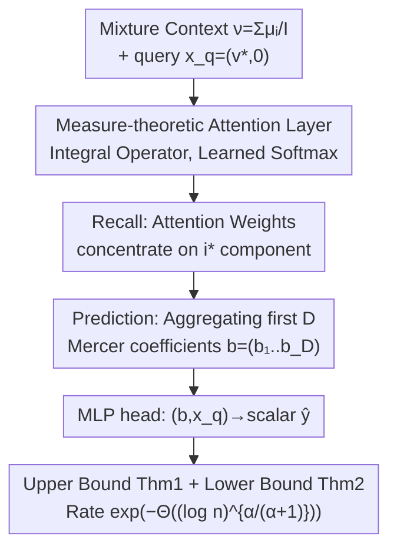

# Transformers as Measure-Theoretic Associative Memory: A Statistical Perspective and Minimax Optimality

**Conference**: ICLR 2026  
**OpenReview**: [https://openreview.net/forum?id=2JilrTRyhh](https://openreview.net/forum?id=2JilrTRyhh)  
**Code**: To be confirmed  
**Area**: Learning Theory / Transformer Theory  
**Keywords**: Associative Memory, Measure Theory, Softmax Attention, Minimax Optimality, Generalization Bounds

## TL;DR
This paper re-models the "associative memory" of Transformers at the level of probability measures—where the context is a mixture of token distributions and attention is an integral operator acting on measures. It proves that a shallow (depth 2) "Measure-theoretic Transformer + MLP" trained via Empirical Risk Minimization (ERM) can learn the mapping of "recalling the distribution of relevant components and then predicting scalars." The generalization error converges at a sub-polynomial rate of $\exp(-\Theta((\log n)^{\alpha/(\alpha+1)}))$, and a minimax lower bound with a matching exponential term is provided, demonstrating that this convergence order is optimal.

## Background & Motivation

**Background**: The effectiveness of Transformers is widely attributed to two properties: "content-addressable retrieval"—where attention selects relevant information from the context given a query, functioning as classical associative memory (akin to Hopfield networks); and the ability to process theoretically arbitrary and variable context lengths. Existing theoretical work follows two lines: one studies how associative memory emerges in Transformers and its capacity (Bietti, Cabannes, Nichani, etc.); the other formalizes "long context" as probability measures over tokens, yielding results independent of sequence length and viewing attention as a mapping over distributions (Vuckovic, Sander, Geshkovski, Furuya, etc.).

**Limitations of Prior Work**: These two lines rarely intersect. Statistical analyses treating context as measures either assume the attention kernel is **frozen and unlearnable** (e.g., distribution regression in Liu & Zhou 2025) or only analyze **linear attention** (e.g., sequential in-context learning in Kim et al. 2024). Frozen kernels cannot explain how learned attention retrieves relevant measures; linear attention essentially performs averaging and fails to achieve the sharp, near one-hot weight distribution of softmax attention, forcing researchers to assume strict orthogonality or relaxed sparsity among recall candidates. In other words, **the question of whether a learned softmax attention can perform recall and prediction at the infinite-dimensional measure level with provable generalization guarantees has remained unanswered**.

**Key Challenge**: To characterize associative memory, the attention must be a **learned softmax** to generate sharp recall. however, the statistical analysis of softmax over infinite-dimensional measures is significantly more difficult than for linear or frozen kernels—which is precisely why previous works avoided it.

**Goal**: To answer the central question Q—Can a learned softmax-attention Transformer recall an infinite-dimensional (measure-valued) context and predict from it with provable generalization guarantees? This is decomposed into: (i) providing a rigorous mathematical framework for the "recall + prediction" task at the measure level; (ii) proving a generalization upper bound for shallow measure-theoretic Transformers; and (iii) proving a matching minimax lower bound.

**Key Insight**: The empirical distribution of tokens in a document is viewed as a probability measure $\mu^{(i)}_0$ in the infinite-length limit. The entire corpus is a mixture of these component measures $\nu=\frac1I\sum_i \mu^{(i)}_{v^{(i)}}$. The query specifies which document to recall via a document-level feature $v^{(i^\star)}$. Utilizing kernel methods, it is assumed that each content density resides in an RKHS ball where the Mercer eigenvalues of the kernel exhibit **exponential decay** $\lambda_j\asymp\exp(-cj^\alpha)$, implying the distribution is very smooth and its effective dimension is small. This "effective dimension" determines the learning rate.

**Core Idea**: Softmax attention is characterized as an "integral operator on measures." The "prediction from infinite-dimensional measures" is **compressed after recall into "learning a finite-dimensional Lipschitz function regarding the first $D$ Mercer coefficients."** Thus, the spectral decay $\alpha$ of the kernel characterizes both the upper and lower bounds.

## Method

### Overall Architecture

Rather than proposing a new network for benchmarking, this paper establishes a statistical learning framework for "measure-theoretic Transformers" and proves that a specific construction optimally completes "recall + prediction." First, the task is defined: each token is written as $x=(v,z)\in\mathbb{R}^{d_1}\times\mathbb{R}^{d_2}$, where $v$ is a document-level feature (e.g., topic) and $z$ is token-level content. The content of document $i$ follows $\mu^{(i)}_0$, and its token distribution is the product measure $\mu^{(i)}_{v^{(i)}}=\delta_{v^{(i)}}\otimes\mu^{(i)}_0$. The context is a uniform mixture of $I$ documents $\nu=\frac1I\sum_{i=1}^{I}\mu^{(i)}_{v^{(i)}}$. Given a query $x_q=(v^{(i^\star)},\mathbf{0})$ (document feature provided, content padded with zeros), the ground-truth mapping $F^\star(\nu,x_q)=\tilde F^\star(\mu^{(i^\star)}_0,x_q)$ assumes a critical structure: **the output depends on $\nu$ only through the single component $\mu^{(i^\star)}_0$ selected by the query.** The task naturally splits into two steps:

$$
(\nu,x_q)\ \xrightarrow{\ \text{Recall } i^\star\ }\ \mu^{(i^\star)}_0\ \xrightarrow{\ \text{Predict}\ }\ \tilde F^\star(\mu^{(i^\star)}_0,x_q).
$$

Statistically, $n$ i.i.d. samples $(\nu_t,x_{qt},y_t)$ are observed, where $y=F^\star(\nu,x_q)+\xi$, $\xi\sim\mathcal{N}(0,\sigma^2)$. The goal is ERM $\hat F=\arg\min_{F\in\mathcal{F}}\hat{\mathbb{E}}_n(y-F(\nu,x_q))^2$, measured by $L^2$ risk $R(F^\star,\hat F)$. The pipeline is as follows:

The framework identifies four contributing components: **Measure-theoretic attention (writing attention as an integral operator on measures)**, **Learned softmax recall mechanism**, **Effective dimension compression via Mercer truncation**, and **Minimax lower bounds**.

### Key Designs

**1. Measure-theoretic Attention: Attention as an Integral Operator on Distributions**

To analyze variable or infinite context lengths, the discrete sum $\sum_\ell$ cannot directly handle infinite-dimensional statistics. Following Furuya et al. (2025), the permutation equivariance of unmasked attention is exploited—since it is equivariant to token index permutations, the input can be represented by the empirical measure of tokens. In the $w\to\infty$ limit, the sum is replaced by an integral. A measure-theoretic attention layer is defined as:

$$
\mathrm{Attn}_\theta(\nu,x)=Ax+\sum_{h=1}^{H}W^h\int \mathrm{Softmax}(\langle Q^h x,K^h y\rangle)\,V^h y\,\mathrm{d}\nu(y),
$$

where $\mathrm{Softmax}(\langle Qx,Ky\rangle)=\exp(\langle Qx,Ky\rangle)/\int\exp(\langle Qx,Kz\rangle)\mathrm{d}\nu(z)$. When $\nu$ reduces to an empirical mixture measure $\nu_X$, this recovers standard discrete attention. The student model is a Transformer class consisting of such attention layers and MLP layers (where MLP does not depend on the measure $\mu$) stacked using "measure-theoretic composition" $\Gamma_2\diamond\Gamma_1$. **Crucially, this analyzes learned softmax (not frozen kernels or linear attention)**, which enables sharp recall.

**2. Recall Mechanism: Softmax weights concentrate near one-hot on the query-selected component**

This is the core of "associative memory." The construction involves the first MLP embedding each token $y=(v^{(i)},z)$ into a vector containing the first $D$ Mercer features $(e_j(z))_{j=1}^{D}$. The softmax score $\langle Q h(x_q),K h(y)\rangle$ is parameterized such that it is large when the document label $v^{(i)}$ matches the query $v^{(i^\star)}$ and small otherwise. Assumption 2 (context vector separation: $\langle v^{(i)},v^{(i')}\rangle\le0$ and $I\le d_1$) ensures different documents are distinguishable. The normalized weight $w_{x_q}(y)$ concentrates almost entirely on samples from $\mu^{(i^\star)}_{v^{(i^\star)}}$, providing a query-dependent filtering that frozen kernels and linear attention cannot achieve.

**3. Mercer Effective Dimension: Compressing Infinite-Dimensional Measures into $D$-Dimensional Descriptors**

Post-recall, $\mu^{(i^\star)}_0$ remains an infinite-dimensional object. The spectral assumption $\lambda_j\asymp\exp(-cj^\alpha)$ implies only the first few Mercer modes carry significant signals. The value path of the attention computes:

$$
\hat b_j\approx\int e_j(z)\,w_{x_q}(y)\,\mathrm{d}\nu(y)\approx\int e_j(z)\,\mathrm{d}\mu^{(i^\star)}_0(z),\quad j=1,\dots,D,
$$

yielding a $D$-dimensional descriptor $b=(\hat b_1,\dots,\hat b_D)$. A final MLP maps $(b,x_q)$ to a scalar prediction. Thus, "prediction from an infinite-dimensional measure" is simplified to "learning a Lipschitz function of $D$ statistics," behaving like a $D$-dimensional problem (error $\approx n^{-\Theta(1/D)}\simeq\exp(-\Theta((\log n)/D))$); truncation to $D$ modes introduces a bias of approximately $\exp(-cD^\alpha)$. Balancing these yields the **effective dimension** $D_{\mathrm{eff}}(n)\asymp(\log n)^{1/(\alpha+1)}$, leading to the sub-polynomial rate in Theorem 1.

**4. Minimax Lower Bound: Proving the Convergence Rate is Unimprovable**

The paper proves that in a structured setting (Setting 2, where density is generated by random Mercer coefficients $\mathrm{d}\mu_0/\mathrm{d}\lambda=\sum_j\lambda_j^{\Theta(1)}Z_j e_j$ following Lanthaler 2024), any estimator $\hat F$ satisfies:

$$
\sup_{\tilde F^\star\in\mathcal{F}^\star} R(\hat F,F^\star)\ \gtrsim\ \exp\!\big(-O((\ln n)^{\alpha/(\alpha+1)})\big).
$$

The reduction goes from "estimating from mixture $\nu$" to "estimating from pure measure $\mu^{(i^\star)}_0$," followed by Mercer coefficient truncation and anisotropic rescaling to embed a classical $d$-dimensional Lipschitz class. Combined with Yang & Barron (1999), this yields a rate matching the upper bound. This implies that **ERM-over-Transformer achieves the minimax rate in the exponential term, and softmax attention provides the correct inductive bias for "measure-level recall."**

## Key Experimental Results

As a theoretical paper, Appendix D provides "sanity check" synthetic experiments.

### Main Results (Risk Scaling with Spectral Decay $\alpha$)

$\log L(n)$ is fitted as $A_\alpha-C_\alpha(\log n)^{\alpha/(\alpha+1)}$.

| Configuration | Observation | Consistent with Theory |
|------|------|----------------|
| Large $\alpha$ (Fast spectral decay) | Empirical risk $L(n)$ decays significantly faster with $n$ | Yes |
| Small $\alpha$ (Heavy-tailed spectrum) | $L(n)$ decay is visibly slower | Yes |

Conclusion: The spectral decay parameter $\alpha$ systematically affects the convergence speed, qualitatively matching the prediction $L^\star(n)\approx\exp(-c(\log n)^{\alpha/(\alpha+1)})$.

### Key Findings
- **Observable Recall Mechanism**: Two out of four attention heads concentrate quality almost entirely on tokens matching the query label. The average Net bias shows tag-conditioned retrieval.
- **Query Necessity**: Randomly shuffling query tokens across samples in a batch caused validation MSE to jump from $1.44\times10^{-2}$ to $7.75\times10^{-1}$, proving non-trivial query dependency.
- **Spectral Decay Dominance**: Larger $\alpha$ leads to faster recall, confirming the intuition that a smaller effective dimension $D_{\mathrm{eff}}(n)$ makes the problem easier to learn.

## Highlights & Insights
- **Measure-Theoretic Context**: Characterizing variable context length via probability measures decouples the results from sequence length, which is a key abstraction for infinite-dimensional statistical analysis.
- **Recall as Dimensionality Reduction**: Softmax recall reduces an infinite-dimensional measure to $D_{\mathrm{eff}}(n)\asymp(\log n)^{1/(\alpha+1)}$ Mercer coefficients. The "Bias vs. Variance" balance between $\exp(-cD^\alpha)$ and $\exp(-(\log n)/D)$ drives the rate.
- **Minimax Optimality**: Proving matching lower bounds establishes that softmax attention is the "optimal" inductive bias for this problem, not just a "feasible" one.
- **Learned Softmax vs. Alternatives**: Explicitly demonstrates why learned softmax is superior to linear attention (which averages) and frozen kernels (which can't perform query-dependent sharp recall).

## Limitations & Future Work
- **Strong Spectral Assumption**: Only covers exponentially decaying spectra $\lambda_j\asymp\exp(-cj^\alpha)$ (very smooth kernels). Extension to polynomial decay is a natural next step.
- **Setting Discrepancy**: The upper bound uses Setting 1 (probabilistic) while the lower bound uses Setting 2 (structural density). The "matching" refers to the order of the exponential term, and constants may differ.
- **Recall Candidate Constraints**: Requires $I\le d_1$ and specific separation conditions for context vectors, which may not hold in massive real-world corpora.
- **Limited Empirical Scope**: Experiments are small-scale synthetic sanity checks; the theory's applicability to large-scale Transformers remains an open empirical question.

## Related Work & Insights
- **vs. Liu & Zhou (2025)**: They use frozen kernels; Ours uses learned softmax to explain query-dependent retrieval.
- **vs. Kim et al. (2024)**: They use linear attention; Ours shows softmax is necessary for sharp one-hot recall without assuming strict orthogonality.
- **vs. Furuya et al. (2025)**: They focus on universal approximation (expressivity); Ours provides statistical generalization results (sample complexity and minimax optimality).

## Rating
- Novelty: ⭐⭐⭐⭐⭐ 
- Experimental Thoroughness: ⭐⭐⭐ 
- Writing Quality: ⭐⭐⭐⭐ 
- Value: ⭐⭐⭐⭐ 

<!-- RELATED:START -->

## Related Papers

- [\[ICLR 2026\] Dynamical properties of dense associative memory](dynamical_properties_of_dense_associative_memory.md)
- [\[ICLR 2026\] A Biologically Plausible Dense Associative Memory with Exponential Capacity](a_biologically_plausible_dense_associative_memory_with_exponential_capacity.md)
- [\[ICLR 2026\] Adaptive Hopfield Network: Rethinking Similarities in Associative Memory](adaptive_hopfield_network_rethinking_similarities_in_associative_memory.md)
- [\[ICLR 2026\] An evolutionary perspective on modes of learning in Transformers](an_evolutionary_perspective_on_modes_of_learning_in_transformers.md)
- [\[ICLR 2026\] Curse of Slicing: Why Sliced Mutual Information is a Deceptive Measure of Statistical Dependence](curse_of_slicing_why_sliced_mutual_information_is_a_deceptive_measure_of_statist.md)

<!-- RELATED:END -->
