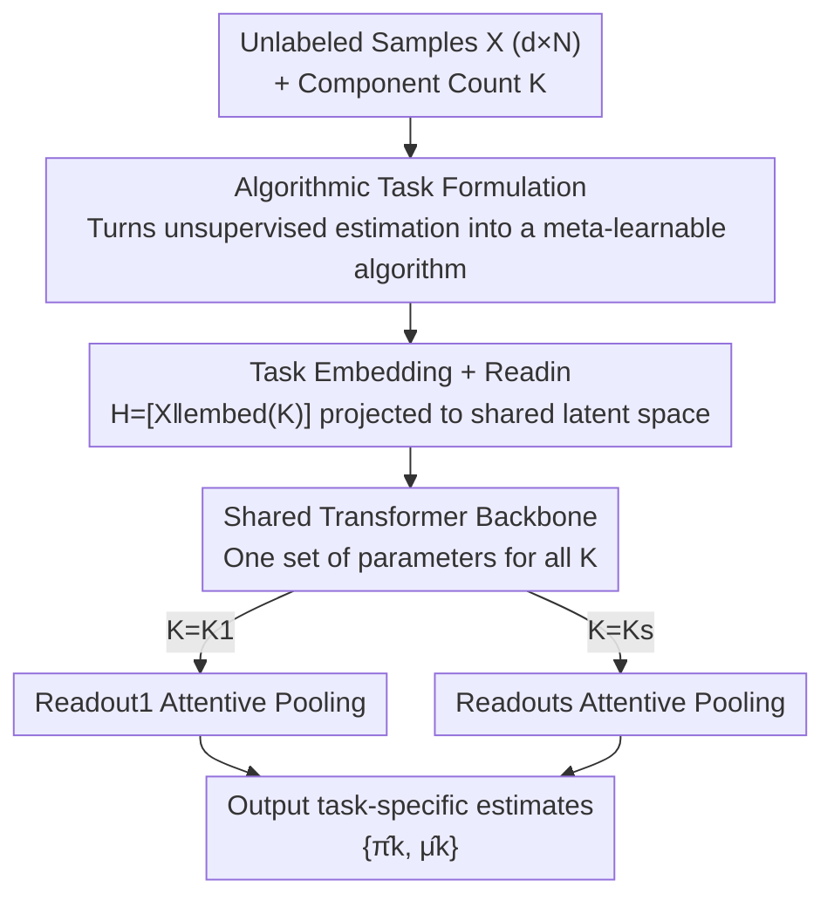

# Transformers as Unsupervised Learning Algorithms: A study on Gaussian Mixtures

**Conference**: ICLR2026  
**OpenReview**: [https://openreview.net/forum?id=4hKNGmjXVQ](https://openreview.net/forum?id=4hKNGmjXVQ)  
**Code**: https://github.com/Rorschach1989/transformer-for-gmm  
**Area**: Learning Theory  
**Keywords**: Transformer, Gaussian Mixture Models, Unsupervised Learning, EM Algorithm, Spectral Methods, in-context learning

## TL;DR
This paper uses meta-learning to train a shared transformer (TGMM) to simultaneously estimate parameters for Gaussian Mixture Models (GMM) with varying numbers of components. Experimentally, it overcomes the respective weaknesses of EM and spectral methods. Theoretically, it is the first to prove that transformers can approximate both the EM algorithm and the core of spectral methods—third-order tensor power iteration.

## Background & Motivation
**Background**: A mainstream approach to understanding "why transformers are powerful" is viewing them as a toolbox that can **implicitly run algorithms** during inference—existing work has proven they can implement gradient descent, Newton's method, UCB, etc., in-context. However, these studies focus almost entirely on **supervised learning** (regression, classification), as supervised tasks have ready-made labels to feed into the context.

**Limitations of Prior Work**: Unsupervised learning remains largely untouched from a theoretical perspective. The reason is straightforward: Transformers are trained in a supervised manner, while unsupervised tasks **lack labels**, making it difficult even to define "what the model should learn." However, since unlabeled data constitutes the vast majority of real-world data, the question of "whether and how transformers can perform unsupervised learning" is of significant practical value but remains unresolved.

**Key Challenge**: To study unsupervised learning, one must find a clean task with a deep statistical foundation and a clear "standard algorithm." Gaussian Mixture Models (GMM) serve as such a benchmark. However, the two classic classes of GMM solvers have fatal flaws: the **EM algorithm** easily falls into local optima and is extremely sensitive to initialization; **spectral methods** (based on moments/tensor decomposition) do not rely on initialization but require the number of components $K$ to be smaller than the data dimension $d$, failing directly in "low-dimensional, multi-component" scenarios. Both methods have regimes where they are ineffective.

**Goal**: (i) Can transformers **provably** solve GMM in-context? (ii) Can they **empirically** bypass the respective limitations of EM and spectral methods?

**Key Insight**: The authors do not treat GMM as a "prediction task" (the standard in-context learning setting where the context contains features and labels). Instead, they reformulate it as "learning an **estimation algorithm**"—the transformer ingests a set of unlabeled samples $X$ and a component configuration $K$, directly outputting parameter estimates $\hat\theta$. In this way, the absence of labels in unsupervised learning is no longer an obstacle, as the supervision signal comes from the ground truth $\theta$ known during meta-training.

**Core Idea**: By meta-training a transformer with a shared backbone on a large number of synthetic GMM tasks, a GMM solver that "generalizes across different $K$" is learned. They theoretically prove that this backbone can approximate both EM and the tensor power iteration of spectral methods, explaining why it can interpolate between and improve upon classic methods.

## Method

### Overall Architecture
TGMM (Transformer for Gaussian Mixture Models) aims to solve: **a single model with one set of parameters to simultaneously estimate GMM parameters for various component counts $K$**. The pipeline: concatenate the unlabeled sample matrix $X\in\mathbb{R}^{d\times N}$ and the component configuration $K$ → project to a shared latent space → pass through a shared transformer backbone → decode the corresponding $\{\hat\pi_k,\hat\mu_k\}$ for that $K$ using a "task-specific" Readout module. The entire model is obtained via meta-training on massive randomly synthesized GMM tasks.

GMM is defined as a mixture of $K$ isotropic Gaussians:

$$p(x\mid\theta)=\sum_{k=1}^{K}\pi_k\,\phi(x;\mu_k),\qquad \phi(x;\mu)=\frac{1}{(2\pi)^{d/2}}\exp\!\Big(-\tfrac12\|x-\mu\|^2\Big),$$

where parameters are $\theta=\pi\cup\mu$. A GMM task is defined as a triplet $T=(\theta,X,K)$, and solving it involves an algorithm $\mathcal A$ outputting $\hat\theta=\mathcal A(X;K)$. TGMM formulates the forward pass as:

$$\text{TGMM}_\Theta(X;K)=\text{Readout}_{\Theta_{out}}\big(\text{TF}_{\Theta_{TF}}(\text{Readin}_{\Theta_{in}}([X\,\|\,\text{embed}(K)]))\big).$$

### Key Designs

**1. Algorithmic Task Formulation: Turning "label-less-ness" from an obstacle into a meta-learnable goal**

The core difficulty of unsupervised learning is the lack of labels. Conventional in-context learning requires (feature, label) pairs in the context, which do not exist in GMM. The authors break through this by **learning estimation instead of prediction**: the learning objective is changed from "labeling new samples" to "outputting parameters $\hat\theta=\mathcal A(X;K)$." Thus, the supervision signal comes from the meta-training phase—the ground truth $\theta$ for each synthetic task is known, and the model is simply learning an **algorithm** that maps unlabeled samples to parameters. Another difficulty is that the **structure of GMM targets varies with $K$** ($K$ mean vectors, $K$ weights). The authors treat $K$ as an explicit task configuration, allowing one model to serve a family of tasks $\mathcal K=\{K_1,\dots,K_s\}$.

**2. Shared Backbone + Task Embeddings + Task-specific Readouts: Multi-$K$ support and parameter efficiency**

Training a separate model for each $K$ would be wasteful and prevent the sharing of statistical regularities. TGMM encodes the component count as a task embedding $P=\text{embed}(K)$, concatenates it with data $H=[X\,\|\,P]$, and uses a linear Readin for the shared latent space. In the middle is a **backbone shared across all $K$**, producing "task-aware" latent representations. Finally, **task-specific Readouts** decode the results using one layer of attentive pooling:

$$O=(V_oH)\,\text{SoftMax}\big((K_oH)^\top Q_o\big)\in\mathbb{R}^{(d+K)\times K},$$

Mixing weights $\hat\pi$ are taken from the average pooling of the first $K$ rows of $O$, and mean vectors $\hat\mu$ from the last $d$ rows. The "efficiency" lies in introducing only $O(sdD)$ additional parameters beyond the backbone ($s$ tasks, dimension $d$, latent dim $D$), meaning the cost of multi-task support is just a few lightweight Readouts.

**3. Meta-training: Using random synthetic tasks to force the model to learn "algorithms" rather than memorizing distributions**

TGMM is trained purely on synthetic tasks. Each step, a TaskSampler picks tasks: first the component count $K\sim p_K$ (uniformly from $\{2,3,4,5\}$), then the ground truth $\theta=(\mu, \pi)$ (means uniformly from $[-5,5]^d$, filtered by a max pairwise cosine similarity of 0.8), then the sample size $N\sim p_N$ and data $X$. The training objective uses squared loss for means and cross-entropy for weights:

$$\hat L_n(\Theta)=\frac1n\sum_{i=1}^n \ell_\mu(\hat\mu_i,\mu_i)+\ell_\pi(\hat\pi_i,\pi_i).$$

Since distributions and sample sizes vary per task, the model cannot succeed by "memorizing a fixed distribution" and must learn an estimation **algorithm** robust to task distribution shifts.

**4. Dual Approximation Theorem: Approximating EM and Spectral Method's Tensor Power Iteration**

This is the theoretical core, answering why TGMM can simultaneously leverage the strengths of EM and spectral methods.

*Theorem 1 (Approximating EM)*: There exists a $2L$-layer transformer that, for any $d\le d_0$, $K\le K_0$, and tasks $T$ satisfying regularity conditions, can approximate $L$ steps of EM with suitable embeddings. The intuition is that **the weighted average property of softmax attention naturally corresponds to the update structure of EM**: the E-step (calculating responsibilities $\{w_k(X_i)\}$) is essentially a softmax weighting, and the M-step (recalculating $\{\pi_k,\mu_k\}$) is another weighted average. Thus, "one attention layer + one MLP layer" implements one step of EM. This result is "sharper" than prior work (He et al. 2025b): the number of layers is $O(L)$ instead of $O(KL)$; attention heads are $M=O(1)$ instead of infinite; and the approximation bound is **polynomial** rather than exponential in dimension $d$.

*Theorem 2 (Approximating Tensor Power Iteration)*: Since implementing the entire spectral algorithm inside a transformer is complex, the authors prove it can precisely implement the core computational step—third-order tensor power iteration:

$$v^{(j+1)}=T\big(I,\,v^{(j)},\,v^{(j)}\big),$$

rewritten as $v^{(j+1)}=\sum_{j,m\in[d]} v_jv_m\,T_{:,j,m}$. The proof **relies heavily on the multi-head structure**: $d$ attention heads handle one dimension of the tensor each, using the Q/K/V structure to calculate $\sum_j \sigma(\langle Q_mh_i,K_mh_j\rangle)V_mh_j$ (where $\sigma$ is ReLU), reconstructing the 2D summation. This is the **first** proof that transformers can perform high-order tensor operations. Together, these theorems explain why the learned algorithm can interpolate between EM and spectral methods, filling the gaps where classic methods fail.

## Key Experimental Results

Experiments address three questions: RQ1 Effectiveness, RQ2 Robustness, RQ3 Flexibility. The default backbone is a GPT-2 style encoder (12 layers, 4 heads, latent dim 128), trained for $10^6$ steps with AdamW. Evaluation uses $\ell_2$-error (comparing $\hat\mu, \hat\pi$ after optimal permutation).

### Main Results (RQ1 Effectiveness)
Dimensions $d\in\{2,8,32,128\}$, component counts $K\in\{2,3,4,5\}$, comparing EM, Spectral Methods, and TGMM ($\ell_2$-error, lower is better).

| Scenario | EM | Spectral Method | TGMM |
|------|----|--------|------|
| $K=2$ (Simple) | ≈0 | ≈0 | ≈0 (all perform well) |
| $K$ increases (Difficult) | Poor (local optima) | Better | Comparable to Spectral, much better than EM |
| $K>d$ (Low-dim, Multi-comp) | Functional but poor | **Fails directly** (requires $K<d$) | Works well, superior to EM |

Conclusion: TGMM remains robust in scenarios where EM fails (local optima) and spectral methods fail ($K>d$), making it the only consistent method across all settings.

### Robustness & Flexibility (RQ2 / RQ3)

| Configuration | Key Phenomenon | Explanation |
|------|---------|------|
| Sample size shift $N_{train}\!\to\!128$ | 32→128 / 64→128 shows "graceful degradation" | OOD tests are only slightly worse than in-domain |
| Dist. shift (Mean perturbation $\sigma_p\in[0,10]$, $d=8$) | Still outperforms EM when $K>2$ | Proves it learns an algorithm, not overfits training distributions |
| Switching backbone to Mamba2 | Non-trivial effect but overall worse than Transformer | Linear attention works, but is less efficient at the same complexity |
| Extension to Anisotropic GMM | Trends consistent with Isotropic; better than EM | TGMM is extensible to more complex tasks |

### Key Findings
- **The value of TGMM lies in "filling gaps" rather than "total dominance"**: At $K=2$, the three methods are equal. Real separation occurs when EM hits local optima or spectral methods fail due to $K>d$. TGMM appears to interpolate between classic methods, consistent with the dual approximation theorem.
- **Robustness under shift = Learnt Algorithms**: OOD tests on sample sizes and distributions show only "graceful degradation," confirming that meta-training learns an estimation algorithm rather than memorizing the training set.
- **Architecture matters**: The multi-head structure is key to approximating tensor power iteration (Theorem 2). Experimentally, Mamba2 backbones are inferior to transformers, supporting the suitability of attention for these computations.

## Highlights & Insights
- **"Translating" unsupervised learning into meta-learnable algorithm learning**: Instead of worrying about "no labels," the task is redefined to "outputting parameter estimates." This reformulation is the pivot of the paper and can be transferred to other unsupervised tasks (clustering, density estimation).
- **Elegant correspondence between Softmax Attention and EM updates**: The E-step responsibility calculation and M-step weighted estimation are both essentially softmax weighted averages. The "Attention layer + MLP layer = one step of EM" logic provides a clean intuition.
- **First proof of high-order tensor operations in Transformers**: Using $d$ attention heads to share the burden of tensor dimensions upgrades "multi-head" from an engineering trick to a provable computational resource.
- **Tighter theoretical bounds**: Reducing layers from $O(KL)$ to $O(L)$, heads from $M\to\infty$ to $O(1)$, and dimension dependence from exponential to polynomial makes the theory meaningful for real-scale, high-dimensional settings.

## Limitations & Future Work
- **Tasks limited to (primarily isotropic) GMM**: While extended to anisotropic GMM, the focus remains on synthetic GMMs, far from real-world unsupervised tasks (structured high-dimensional data, non-Gaussian mixtures).
- **Theoretical "existence" approximation vs. training outcome**: The theorem proves a transformer *can* approximate these algorithms, but there is no guarantee that gradient descent will find such a solution. Empirical consistency is indirect evidence.
- **Partial approximation of Spectral Methods**: Theorem 2 implements the core tensor power iteration step rather than the full spectral algorithm; whether a transformer can implement the entire pipeline end-to-end remains an open question.
- **Scale and Fairness**: Experiments involve relatively small backbones. While the authors argue TGMM only gains distributional information via meta-training, the comparison between meta-training and single-task classic algorithms requires careful interpretation of scope.

## Related Work & Insights
- **vs. In-context Learning (Bai et al. 2023 / Von Oswald et al. 2023)**: These works prove transformers can run **supervised** algorithms (Regression/Classification). This paper completes the paradigm by moving to **unsupervised** learning and shifting from "learning to predict" to "learning to estimate."
- **vs. He et al. (2025b) (GMM clustering with transformers)**: Closest in setting, but they focus on **clustering** whereas this work focuses on **parameter estimation**. Crucially, this paper provides tighter bounds ($O(L)$ vs $O(KL)$ layers, $O(1)$ vs $M\to\infty$ heads).
- **vs. He et al. (2025a) / Jin et al. (2024)**: Previous theoretical constructions were often limited to **two-component** cases; this work covers general $K$. 
- **Key Insight**: Treating classic statistical algorithms (EM, spectral/tensor methods) as the "target for transformers to approximate" and using structural properties of attention to explain that capability is a replicable methodology for theoretical transformer analysis. This could be extended to HMMs, variational inference, and moment matching.

## Rating
- Novelty: ⭐⭐⭐⭐⭐ First systematic theoretical and experimental study of transformer-based unsupervised GMM; first proof of tensor operations.
- Experimental Thoroughness: ⭐⭐⭐⭐ Solid investigation of effectiveness/robustness/flexibility, though limited to synthetic tasks.
- Writing Quality: ⭐⭐⭐⭐⭐ Clear comparison between theory and experiments; well-articulated improvements over prior bounds.
- Value: ⭐⭐⭐⭐ Opens a theoretical gap for "transformers as unsupervised learning algorithms" that can be generalized to broader latent variable models.

<!-- RELATED:START -->

## Related Papers

- [\[ICLR 2026\] Continuum Transformers Perform In-Context Learning by Operator Gradient Descent](continuum_transformers_perform_in-context_learning_by_operator_gradient_descent.md)
- [\[ICLR 2026\] Decision-Theoretic Approaches for Improved Learning-Augmented Algorithms](decision-theoretic_approaches_for_improved_learning-augmented_algorithms.md)
- [\[ICLR 2026\] Transformers with Endogenous In-Context Learning: Bias Characterization and Mitigation](transformers_with_endogenous_in-context_learning_bias_characterization_and_mitig.md)
- [\[ICML 2026\] Robustness of Mixtures of Experts to Feature Noise](../../ICML2026/learning_theory/robustness_of_mixtures_of_experts_to_feature_noise.md)
- [\[ICLR 2026\] Transformers Are Inherently Succinct](transformers_are_inherently_succinct.md)

<!-- RELATED:END -->
