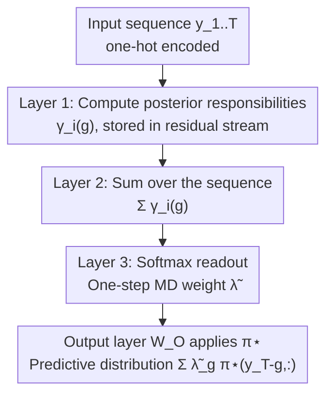

# Transformers Learn Latent Mixture Models In-Context via Mirror Descent

**Conference**: ICLR 2026  
**OpenReview**: [https://openreview.net/forum?id=SHidELLSVt](https://openreview.net/forum?id=SHidELLSVt)  
**Code**: None  
**Area**: Learning Theory / In-Context Learning / Mechanistic Interpretability  
**Keywords**: in-context learning, mirror descent, mixture of transition distributions, attention mechanism, latent variable inference

## TL;DR
This paper proposes an in-context learning task based on the "Mixture of Transition Distributions (MTD)," requiring a transformer to infer the causal importance (mixture weight $\lambda$) of each historical token within the context. The authors provide an explicit construction of a three-layer disentangled transformer and prove that it **precisely implements one-step Mirror Descent (MD)**, with this one-step estimator being a first-order approximation of the Bayes-optimal predictor. Transformers trained from scratch align closely with this construction in terms of predictive distributions, attention patterns, and learned transition matrices.

## Background & Motivation
**Background**: Mechanistic interpretability has explained certain in-context learning (ICL) phenomena—finding that transformers "implement" known algorithms internally. For instance, in linear regression tasks, they learn preconditioned gradient descent; in Markov chains, they learn counting-based estimators. These works clarify what algorithms transformers execute during forward propagation.

**Limitations of Prior Work**: Such successes are limited to problems with **fixed causal structures**. In linear regression, the model only needs to know that "every even token depends on the preceding odd token"; in Markov chains, it only needs to know that the next token depends solely on the previous one. In other words, dependency relationships between tokens are **static and pre-defined**, requiring no inference of "who affects whom" from the context.

**Key Challenge**: Real sequence data (especially language) violates this simplicity. The meaning of a sentence is not a fixed concatenation of word meanings but arises from **dynamic causal links inferred from context**. As shown in Figure 1, given "The dog that saw the bird threw the ball, and then ran to ___", to predict "fetch," the model cannot rely on proximity but must infer latent structure: the dog is the agent, the ball is the relevant object, and the bird is a distractor. The influence of a historical token is not a function of its position, but of its **inferred role**. This ability to infer unobserved latent variables (syntactic roles, speaker intent, topic) is a hallmark of intelligence, yet prior ICL theories fail to cover it.

**Goal**: To formalize "estimating historical token importance" as a latent variable ICL problem and answer the core question: **Can transformers infer latent structures in-context? What algorithm do they learn?**

**Key Insight**: The authors introduce the "Mixture of Transition Distributions (MTD)" model from statistics as a synthetic task. MTD defines the distribution of the next token as a mixture of several historical lags, where each lag is associated with the same transition matrix $\pi^\star$, and the **mixture weights $\lambda$ determine the relative influence of each historical position**. The key insight is that $\pi^\star$ is static and can be stored in weights during pre-training (in-weight learning), while $\lambda$ varies per sequence and must be inferred on-the-fly (in-context learning). This captures the two learning modes of LLMs simultaneously.

**Core Idea**: To prove that transformers infer the mixture weights $\lambda$ by "implementing one-step Mirror Descent" to dynamically determine which historical tokens are causally relevant—extending gradient-based ICL explanations from regression to sequence modeling with discrete tokens.

## Method

### Overall Architecture
The task setup is as follows: fix a $q \times q$ row-stochastic transition matrix $\pi^\star$. For each sequence, a mixture weight vector $\lambda$ is sampled from $\mathrm{Dirichlet}(\alpha=1)$, and a token sequence $y=(y_1, \dots, y_T)$ is generated according to an MTD model of order $m$. The predictive distribution of MTD is:

$$P(Y_t=y_t \mid y_1^{t-1}, \lambda) = \sum_{g=1}^{m} \lambda_g\,\pi(y_{t-g}, y_t),$$

where $\pi$ is applied to each of the $m$ previous lags and weighted by $\lambda$. The goal is to predict the next token, which is equivalent to **estimating the sequence-specific latent weights $\lambda$ in-context**.

The optimal solution is the Bayesian predictive distribution, where weights are posterior means $\hat\lambda^{\text{Bayes}}_g=\mathbb{E}[\lambda_g\mid y_1^t,\alpha]$. However, since the Dirichlet prior and MTD likelihood are **not conjugate**, the posterior lacks a closed form. This necessitates point estimation via iterative optimization. Since $\lambda$ resides on the probability simplex $\Delta^{m-1}$, the authors use **Mirror Descent (MD)**: under a negative entropy potential, it becomes the Exponentiated Gradient algorithm with multiplicative updates. Rather than iterating to convergence, the authors start from the simplex center $\lambda^{(0)}=(1/m,\dots,1/m)$ and **take only one step**, yielding a non-iterative, regularized MLE approximation.

The methodology framework is: **to construct a three-layer disentangled transformer that precisely implements this "one-step MD estimator"**, where each layer computes a specific component of the formula, and the output matrix applies $\pi^\star$.

### Key Designs

**1. MTD In-Context Learning Task: Turning "Token Importance" into a Controllable Testbed**

Prior ICL theories ignored cases where dependency structures must be inferred. MTD uses a latent switching variable $Z_t \in \{1, \dots, m\}$ to select which lag $Y_{t-g}$ generates the current token $Y_t$, with $P(Z_t=g)=\lambda_g$. Marginalizing $Z_t$ yields the mixture distribution. It requires only $m-1+q(q-1)$ parameters, far fewer than the $q^m(q-1)$ parameters of a full $m$-th order Markov chain, yet expresses diverse "effective contexts." The design explicitly decouples the two learning modes: $\pi^\star$ is globally shared (in-weight learning), while $\lambda$ is sequence-specific (in-context learning). This mirrors the reality of LLMs—failing to memorize full high-order n-grams but storing low-order statistics and dynamically reweighting them.

**2. One-Step Mirror Descent Estimator: Approximating Intractable Posteriors via Exponentiated Gradient**

Since the posterior mean is intractable, the authors use a point estimate. Since MLE/MAP are also non-analytic, they use iterative methods. Mirror Descent under a negative entropy potential $\Psi(\lambda)=-H(\lambda)$ gives the multiplicative update:

$$\lambda_g^{(k+1)}=\frac{\lambda_g^{(k)}\exp(\eta\,\nabla_\lambda \ell(\lambda^{(k)})_g)}{\sum_{h}\lambda_h^{(k)}\exp(\eta\,\nabla_\lambda \ell(\lambda^{(k)})_h)}.$$

Starting from uniform initialization and taking one step yields the closed-form estimator:

$$\hat\lambda^{\text{MD}}_g=\frac{\exp\!\big(\eta m\sum_{k=m+1}^{t}\gamma_k(g)\big)}{\sum_{j}\exp\!\big(\eta m\sum_{k=m+1}^{t}\gamma_k(j)\big)},\quad \gamma_k(g)=\frac{\pi(y_{k-g},y_k)}{\sum_{h}\pi(y_{k-h},y_k)}.$$

Here $\gamma_k(g)$ is the **posterior responsibility**—the probability that lag $g$ generated token $k$ under a uniform prior. Summing these responsibilities and applying a softmax (with learning rate $\eta$ controlling sharpness) yields the estimate. This "calculate responsibility $\to$ sum $\to$ softmax" structure matches the three-layer transformer construction.

**3. Three-Layer Transformer Construction: Information Routing via Relative Position Encodings**

The technical core is a single-head, $d_0=q$, $d_R \ge m$ three-layer disentangled transformer that **precisely** implements the one-step MD estimator. The model omits MLPs, uses concatenation instead of summation in the residual stream, and uses a single attention matrix instead of $Q/K$ separation to ensure transparency. Relative Position Encodings (RPE) are used for routing:

- **Layer 1 (Responsibility)**: Set the attention matrix $W_A^{(1)}=(\log\pi^\star)^\top$. Given one-hot inputs, attention scores $e_{ij}=\log\pi^\star(y_j,y_i) + \text{bias}$. RPE table $R_A^{(1)}$ restricts attention to the **first $m$ lags** via a large constant $\delta_1$. After softmax, attention weights equal responsibilities $A^{(1)}_{ij}=\gamma_i(i-j)$. $R_V^{(1)}$ then copies "responsibility of lag $g$" into specific dimensions, outputting $\hat h^{(1)}_i=\sum_g \gamma_i(g)\,\mathrm{Concat}(e_{y_{i-g}}, e_g)$.
- **Layer 2 (Summation)**: Content attention ($W_A^{(2)}=0$) and value-RPE ($R_V^{(2)}=0$) are disabled. Position biases enable **uniform attention** over positions $m+1 \dots T$ for the final query, resulting in $\frac{1}{T-m}\sum_{j=m+1}^T\Gamma_j$ in the residual stream, which is the average responsibility required for one-step MD.
- **Layer 3 (Readout)**: $R_A^{(3)}$ is constructed as a "scaled one-hot" selector aligned with the average responsibility sub-blocks. Dot products extract the $g$-th average responsibility as attention scores $\propto \beta\sum_i\gamma_i(g)/(T-m)$. After softmax, attention weights are exactly the MD weights $\tilde\lambda_g$, where $\beta$ is a learnable scaling. Finally, the output layer $\widetilde W_O$ applies $\pi^{\star\top}$ to yield the predictive distribution $\sum_g\tilde\lambda_g\,\pi^\star(y_{T-g},:)$.

### Loss & Training
Models are trained from scratch using Adam with MSE loss on the **last token prediction** for $5\times10^5$ steps (batch size $B=128$). In analysis, $\eta$ for $\hat\lambda^{\text{MD}}$ and $\beta$ for the construction are grid-searched to minimize KL divergence with the ground truth. Theory supports two points: ① One-step MD is first-order equivalent to the Bayesian posterior mean at the "no-evidence point" when $\eta=\frac{1}{m+1}$ (Theorem 1); ② A stable step size scaling law $\eta=\Theta(1/T)$ derived from relative smoothness constants (Theorem 2) matches transformer behavior.

## Key Experimental Results

### Main Results
On the synthetic MTD task, the KL divergence is compared between "trained disentangled/standard transformers," "theoretical construction $\tilde T_{\text{constr}}$," "one-step MD estimate $\hat\lambda^{\text{MD}}$," and "Bayes optimal $\hat\lambda^{\text{Bayes}}$ (via MCMC)."

| Comparison | Short Sequence Performance | Long Sequence Performance | Key Conclusion |
|----------|-----------|-----------|----------|
| Trained Transformer (Disentangled / Standard) | Matches one-step MD and construction | Becomes sub-optimal synchronously | Trained models learn the constructed solution |
| One-step MD $\hat\lambda^{\text{MD}}$ | Good proxy for Bayes | Diverges from Bayes | Validates Theorem 1 first-order equivalence |
| Attention Maps / $\mathrm{softmax}(W_A^{(1)})$ | Aligns with construction; first-layer attention approximates $\pi^\star$ | — | Internal mechanism of trained model = construction mechanism |

### Multi-step MD and Deeper Models

| Configuration | Comparison | Key Finding |
|------|------|---------|
| 5-layer Trained Transformer $\tilde T_{\text{train}}$ | Multi-step MD $\hat\lambda^{\text{MD},k}$ | Performance closely tracks **2-step MD** ($k=2$) |
| Long sequences / Multiple seeds | — | Occasionally exceeds 2-step performance, suggesting learned estimators may use additional structures |

The authors emphasize this is a **performance comparison rather than an optimality assertion**: they do not claim transformers converge to the 2-step MD solution, only that deeper models can implement estimators at least as accurate as multi-step MD.

### Key Findings
- **Realizability**: The three-layer construction is not just theoretical; transformers trained from scratch converge to the constructed solution in terms of prediction, attention, and weights.
- **Sequence Length Dependency**: One-step MD quality depends on sequence length. In short sequences, gradients are small and the first-order approximation is accurate; in long sequences, higher-order terms cause divergence.
- **Implicit Regularization**: Iterating MD to convergence results in sub-optimal MLE, whereas "early stopping" (taking few steps) stays closer to the Bayesian mean, equivalent to selecting a good regularization point on the entropic path $\min_\lambda -\ell(\lambda)+\gamma H(\lambda)$.

## Highlights & Insights
- **Mapping Algorithms to Layers**: The construction uses RPE for routing, assigning Layer 1 to responsibility, Layer 2 to summation, and Layer 3 to softmax readout—a reusable paradigm for "layerized algorithm implementation."
- **In-weight vs In-context Decoupling**: Storing $\pi^\star$ in weights and inferring $\lambda$ from context provides a clean testbed to study how these two learning modes collaborate.
- **Theoretical/Empirical Alignment**: The step size scaling $\eta=\Theta(1/T)$ derived from relative smoothness matches the behavior of trained transformers.
- **Generalizing Gradient-based ICL**: This work extends "transformers as optimizers" from continuous regression to discrete sequence modeling with latent variables.

## Limitations & Future Work
- **Synthetic Constraint**: The task assumes a known and fixed transition matrix $\pi^\star$ and fixed order $m$, which differs from real language where structures are unknown and dependencies vary.
- **Single-step Focus**: Explicit construction for multi-step MD is "non-trivial" and left for future work.
- **Future Directions**: Extending the construction to unknown $\pi^\star$, exploring implicit regularization in real LLMs, and verifying if intermediate representations are reused across steps.

## Related Work & Insights
- **vs. ICL for Linear Regression**: Prior works show transformers implement (preconditioned) GD in regression, but with fixed dependency structures. This work uses **Mirror Descent** on the simplex for discrete sequences.
- **vs. ICL for Markov Chains**: Prior works found transformers learn counting estimators for first-order transitions. This work scales to high-order dependencies and involves **dynamic inference** of responsibility.
- **vs. Latent HMM/Mixture Models**: While previous works used mixture models to study ICL, they did not reveal the specific layer-wise mechanism. This work provides an explicit, matrix-level algorithm explanation.

## Rating
- **Novelty**: ⭐⭐⭐⭐⭐ First precise construction of "transformer = one-step MD" for discrete latent variable tasks.
- **Experimental Thoroughness**: ⭐⭐⭐⭐ Solid validation on synthetic tasks across multiple metrics, though limited to known $\pi^\star$.
- **Writing Quality**: ⭐⭐⭐⭐⭐ Clear progression from motivation to theoretical construction and empirical verification.
- **Value**: ⭐⭐⭐⭐⭐ Provides a new algorithmic perspective on latent variable inference in attention mechanisms.

<!-- RELATED:END -->

## Related Papers

- [\[ICLR 2026\] In-Context Algorithm Emulation in Fixed-Weight Transformers](in-context_algorithm_emulation_in_fixed-weight_transformers.md)
- [\[ICLR 2026\] Continuum Transformers Perform In-Context Learning by Operator Gradient Descent](continuum_transformers_perform_in-context_learning_by_operator_gradient_descent.md)
- [\[ICLR 2026\] Transformers with Endogenous In-Context Learning: Bias Characterization and Mitigation](transformers_with_endogenous_in-context_learning_bias_characterization_and_mitig.md)
- [\[ICLR 2026\] Adversarially Pretrained Transformers May Be Universally Robust In-Context Learners](adversarially_pretrained_transformers_may_be_universally_robust_in-context_learn.md)
- [\[ICLR 2026\] Critical Attention Scaling in Long-Context Transformers](critical_attention_scaling_in_long-context_transformers.md)

<!-- RELATED:END -->

<!-- RELATED:START -->

## Related Papers

- [\[ICLR 2026\] Transformers Trained via Gradient Descent Can Provably Learn a Class of Teacher Models](transformers_trained_via_gradient_descent_can_provably_learn_a_class_of_teacher_.md)
- [\[ICLR 2026\] Continuum Transformers Perform In-Context Learning by Operator Gradient Descent](continuum_transformers_perform_in-context_learning_by_operator_gradient_descent.md)
- [\[ICLR 2026\] In-Context Algorithm Emulation in Fixed-Weight Transformers](in-context_algorithm_emulation_in_fixed-weight_transformers.md)
- [\[ICLR 2026\] Transformers with Endogenous In-Context Learning: Bias Characterization and Mitigation](transformers_with_endogenous_in-context_learning_bias_characterization_and_mitig.md)
- [\[ICLR 2026\] Adversarially Pretrained Transformers May Be Universally Robust In-Context Learners](adversarially_pretrained_transformers_may_be_universally_robust_in-context_learn.md)

<!-- RELATED:END -->
