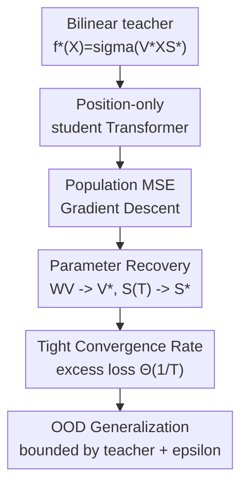

# Transformers Trained via Gradient Descent Can Provably Learn a Class of Teacher Models

**Conference**: ICLR 2026  
**OpenReview**: [https://openreview.net/forum?id=ukiRIdgoIF](https://openreview.net/forum?id=ukiRIdgoIF)  
**Code**: None  
**Area**: Learning Theory / Transformer Theory / Provable Optimization  
**Keywords**: Transformer theory, Gradient Descent, teacher-student learning, bilinear structure, OOD generalization

## TL;DR
This paper proves that a one-layer Transformer with position-only attention, when trained via gradient descent on population risk, can learn a large class of teacher models sharing a bilinear structure at a tight $\Theta(1/T)$ rate and inherits the teacher's out-of-distribution (OOD) generalization under mild second-moment conditions.

## Background & Motivation
**Background**: The empirical success of Transformers spans NLP, vision, and reinforcement learning. However, theoretical explanations often focus on single simplified tasks, such as in-context linear regression, patch association, sparse token selection, or group-sparse linear models. While insightful, these results struggle to explain why the same self-attention mechanism can learn across seemingly disparate structured tasks.

**Limitations of Prior Work**: Existing works often couple the task, data distribution, and simplified Transformer structure too tightly. For instance, theories for sparse token selection analyze how query-specified target tokens are identified, while theories for group-sparse linear classification analyze how labels are determined by feature groups. These settings provide clear learning dynamics, but the conclusions do not easily transfer to adjacent tasks like convolutional average pooling, graph convolutions, or regressive group-sparse predictors.

**Key Challenge**: Transformer theory must be sufficiently simplified to prove convergence, but oversimplification risks failing to explain the ability of Transformers to reuse the same attention mechanism across multiple classes of structured models. The commonality identified in this paper is that many teacher outputs can be expressed in a bilinear form: a value matrix acting on input features, followed by a sparse averaging score matrix that mixes tokens.

**Goal**: The authors aim to establish a unified teacher-student framework to prove that a student Transformer does not merely approximate the teacher's function values but recovers the teacher's core parameter blocks, including the value matrix and attention/softmax score patterns. Furthermore, they seek to show that the trained student performs no worse than the teacher on non-training distributions.

**Key Insight**: The paper formulates the teacher as $f^*(X)=\sigma(V^*XS^*)$, where $V^*$ corresponds to linear filters for each output channel, and $S^*$ represents sparse averaging relationships between tokens, patches, nodes, or feature groups. Consequently, convolutional layers with average pooling, graph convolutions on regular graphs, sparse token selection with fixed target sets, and group-sparse linear regression all fall under this unified form.

**Core Idea**: Use a one-layer position-only attention Transformer as a student to fit the bilinear teacher via gradient descent on population mean squared error (MSE), and prove that the training trajectory simultaneously recovers $V^*$ and $S^*$.

## Method

### Overall Architecture
The paper does not propose a new practical training algorithm; rather, it explains what Transformers can learn, how they learn, and to what extent within a clean theoretical model. The framework defines a class of bilinear teacher models, simplifies a one-layer Transformer into two trainable blocks (value matrix $W_V$ and key-query matrix $W_{KQ}$), and analyzes the trajectory of gradient descent on population loss.

The teacher receives an input matrix $X\in\mathbb{R}^{d\times D}$ and outputs

$$
f^*(X)=\sigma(V^*XS^*),
$$

where each column of $S^*\in\mathbb{R}^{D\times D}$ has exactly $K$ non-zero entries with values $1/K$. This implies each output token averages several relevant input positions, followed by a channel transformation by $V^*$. The student Transformer concatenates input features $X$ with fixed positional encodings $P$ to form $Z$, uses $W_{KQ}$ to generate attention scores based solely on positional encodings, and applies $W_V$ only to features.

The training objective is the population MSE:

$$
L(W_V;W_{KQ})=\frac{1}{2}\mathbb{E}_{X,Y}\|Y-\mathrm{TF}(Z;W_V,W_{KQ})\|_F^2,
$$

where labels are given by $Y=f^*(X)+E$ ($E$ is zero-mean noise). Optimization uses standard gradient descent starting from $W_V^{(0)}=0, W_{KQ}^{(0)}=0$. The theoretical proof focuses on showing that despite the non-linearity of softmax attention, the training trajectory maintains a low-dimensional structure, allowing the problem to be reduced to the convergence analysis of a few scalar dynamics.

### Key Designs
**1. Bilinear Teacher Class: Mapping diverse structured tasks to $V^*XS^*$**

The first key move is transforming "Transformers can learn different tasks" into "Transformers can learn the same algebraic structure." In $f^*(X)=\sigma(V^*XS^*)$, $V^*$ manages how each channel reads input features, and $S^*$ manages which tokens, patches, nodes, or feature groups are averaged. Since $S^*$ has $K$ entries of $1/K$ per column, it can represent local patch groups in CNNs, neighborhood aggregation in cycle graphs, fixed target token selection, or label-relevant groups.

**2. Position-only attention: Concentrating attention learning on positional structure**

Standard self-attention uses both input features and positional encodings. Analyzing the full trajectory is difficult. The paper adopts position-only attention: $W_V$ multiplies input features $X$, and $W_{KQ}$ generates scores exclusively through fixed positional encodings $P$. The student model is:

$$
\mathrm{TF}(Z;W_V,W_{KQ})=\sigma(W_V X S(W_{KQ})),
$$

where $S(W_{KQ})$ is the attention score from $\mathrm{softmax}(P^\top W_{KQ}P/\sqrt{D})$. This aligns the student with the teacher: $W_V$ corresponds to $V^*$, and $S(W_{KQ})$ corresponds to $S^*$. Empirical observations of parameter heatmaps in full Transformers justify this simplification, as updates concentrate on these specific blocks.

**3. GD Trajectory Invariants: Reducing matrix training to scalar dynamics**

The proof shows that $W_V^{(t)}$ and $W_{KQ}^{(t)}$ maintain specific decompositions during training. Specifically, $W_V^{(t)}=C_1(t)V^*$, and $W_{KQ}^{(t)}$ can be written as positive terms in target position directions minus negative terms in non-target directions. If $G_i$ is the set of non-zero positions in column $i$ of $S^*$:

$$
W_{KQ}^{(t)}=C_2(t)\sum_i\sum_{i'\in G_i}p_{i'}p_i^\top-C_3(t)\sum_i\sum_{i'\notin G_i}p_{i'}p_i^\top.
$$

This structure explains why attention quality improves: logits for target positions are raised while non-target logits are suppressed. Parameter recovery reduces to analyzing the evolution of $C_1(t), C_2(t), C_3(t)$.

**4. From Parameter Recovery to OOD Generalization**

Theorem 3.2 addresses stability when the test distribution is non-Gaussian or labels are not generated by the teacher. If OOD input and response columns have bounded second moments, then after sufficient training:

$$
L_{\mathrm{OOD}}(W_V^{(T)},W_{KQ}^{(T)})\leq \frac{1}{2}\mathbb{E}\|\widetilde{Y}-f^*(\widetilde{X})\|_F^2+\epsilon.
$$

This indicates the student is at most $\epsilon$ worse than the teacher on OOD data. It connects structural parameter recovery to actual distribution-shift risk.

### Loss & Training
The objective is the population mean squared error:

$$
L(W_V;W_{KQ})=\frac{1}{2}\mathbb{E}_{X,Y}\|Y-\mathrm{TF}(Z;W_V,W_{KQ})\|_F^2.
$$

With $Y=f^*(X)+E$, the irreducible noise is $L_{\mathrm{opt}}=\frac{1}{2}\mathbb{E}\|E\|_F^2$. The analysis focuses on the excess loss $L(W_V;W_{KQ})-L_{\mathrm{opt}}$. Gradient updates follow:

$$
W_V^{(t+1)}=W_V^{(t)}-\eta\nabla_{W_V}L(W_V^{(t)};W_{KQ}^{(t)}),
$$

$$
W_{KQ}^{(t+1)}=W_{KQ}^{(t)}-\eta\nabla_{W_{KQ}}L(W_V^{(t)};W_{KQ}^{(t)}),
$$

initialized at zero. Under conditions $D\geq\Omega(\mathrm{poly}(M,K))$ and $\eta\leq O(M^{-1}D^{-5/2})$, Theorem 3.1 provides joint convergence guarantees for attention scores, value matrices, and excess loss.

## Key Experimental Results

### Main Results
| Task / Setting | Key Observation | Theoretical Link | Conclusion |
|:---|:---|:---|:---|
| Synthetic CNN + avg pooling, (Leaky) ReLU | Excess loss slope $\approx -1$ on log-log plot | $\Theta(1/T)$ rate in Theorem 3.1 | Transformer recovers $S^*$ (pooling) and $V^*$ (filters) |
| Synthetic GCN on cycle graph | Circulant tri-diagonal heatmap tokens $\approx 1/3$ | $K=3$ neighborhood entries in $S^*$ | Position-only attention learns graph aggregation |
| Sparse token selection | Significant attention only on target tokens | Recovery of sparse $S^*$ | Student learns selection without explicit target indices |
| Group-sparse linear predictor | Significant attention on label-relevant groups | Group-sparse regression teacher | Generalizes prior classification-heavy theory |
| MNIST teacher CNN | Cosine similarity between $W_V$ and $V^* > 0.9$ | Empirical parameter block recovery | Learns teacher structures under real hidden supervision |

### Ablation Study
| Configuration | Key Metric | Explanation |
|:---|:---|:---|
| Training Loss Curve | Late-stage slope $\approx -1$ | Supports tight $\Theta(1/T)$ convergence guarantee |
| OOD Loss Curve | Late-stage slope $\approx -0.5$ | Consistent with $O(1/\sqrt{T})$ OOD error from param noise |
| $W_V$ Alignment | Persistent high cosine similarity with $V^*$ | Value matrix learning is structural, not accidental |
| Attention Heatmap | Task-specific patterns (block-diagonal, tri-diagonal) | Directly validates $S^{(T)} \approx S^*$ |
| MNIST Boundary Patches | Learning failure at borders | Background patches lack signal for supervision |

### Key Findings
- The experiment verifies three simultaneous phenomena: loss convergence, $W_V$ alignment, and attention pattern recovery.
- The unified teacher class covers CNN, GCN, selection, and group-sparse predictors.
- MNIST experiments provide external validity despite non-Gaussian inputs.
- OOD results support the "student inherits teacher performance" view rather than claiming universal robustness.

## Highlights & Insights
- **Unified Representation**: $V^*XS^*$ elegantly splits the Transformer's value path (features) and attention path (structure).
- **Structural Recovery**: Proving convergence of $W_V$ and $S^{(T)}$ to internal teacher parameters is far stronger than simple function approximation.
- **Tight Lower Bound**: The excess loss $\Theta(KD^4/(\eta T))$ lower bound proves the $D^4$ dependency is inherently tied to the Frobenius loss and $W_{KQ}$ gradients.
- **Realistic OOD Bounds**: The OOD theorem accurately characterizes Transformers as "imitation machines" regarding distribution shifts.

## Limitations & Future Work
- **Strong Simplifications**: Position-only attention is simplified; multi-layer, residual, LayerNorm, and MLP blocks are not currently in the theory.
- **Population vs. Empirical**: Analysis uses population loss; finite-sample generalization and batch size effects are not fully covered.
- **Fixed Sparsity**: The teacher class assumes fixed $K$ non-zeros per column, whereas real attention involves content-dependent token routing.
- **Dimension Dependency**: The $D^4$ dependency suggests long sequences require many iterations; architectural improvements to reduce this are open questions.
- **MNIST Supervision**: Experiments use hidden-output supervision; end-to-end classification for large-scale tasks remains a gap.

## Related Work & Insights
- **vs. Wang et al. (2024)**: Wang et al. study sample-dependent selection via query; this paper studies fixed structural recovery with a tight $\Theta(1/T)$ rate.
- **vs. Zhang et al. (2025c)**: Complements group-sparse classification by covering regression and unified parameter recovery.
- **vs. ICL Theory**: While ICL explains *how* a Transformer acts as an algorithm, this work explains how GD *recovers* the algorithm's structure.
- **vs. ViT Theory**: Generalizes patch association into the abstract $S^*$ matrix, allowing for comparisons between CNN pooling and GCNs.

## Rating
- Novelty: ⭐⭐⭐⭐☆ (Unified bilinear teacher class is a significant theoretical integration).
- Experimental Thoroughness: ⭐⭐⭐⭐☆ (Verifies mechanisms across synthetic and real data).
- Writing Quality: ⭐⭐⭐⭐☆ (Clear main path; well-explained theorem implications).
- Value: ⭐⭐⭐⭐☆ (Strong foundation for future learning theory on architectural structures).

<!-- RELATED:START -->

## Related Papers

- [\[ICLR 2026\] Transformers Learn Latent Mixture Models In-Context via Mirror Descent](transformers_learn_latent_mixture_models_in-context_via_mirror_descent.md)
- [\[ICLR 2026\] Continuum Transformers Perform In-Context Learning by Operator Gradient Descent](continuum_transformers_perform_in-context_learning_by_operator_gradient_descent.md)
- [\[ICLR 2026\] Interactive Learning of Single-Index Models via Stochastic Gradient Descent](interactive_learning_of_single-index_models_via_stochastic_gradient_descent.md)
- [\[ICLR 2026\] Can Transformers Really Do It All? On the Compatibility of Inductive Biases Across Tasks](can_transformers_really_do_it_all_on_the_compatibility_of_inductive_biases_acros.md)
- [\[ICLR 2026\] Two-Layer Convolutional Autoencoders Trained on Normal Data Provably Detect Unseen Anomalies](two-layer_convolutional_autoencoders_trained_on_normal_data_provably_detect_unse.md)

<!-- RELATED:END -->
