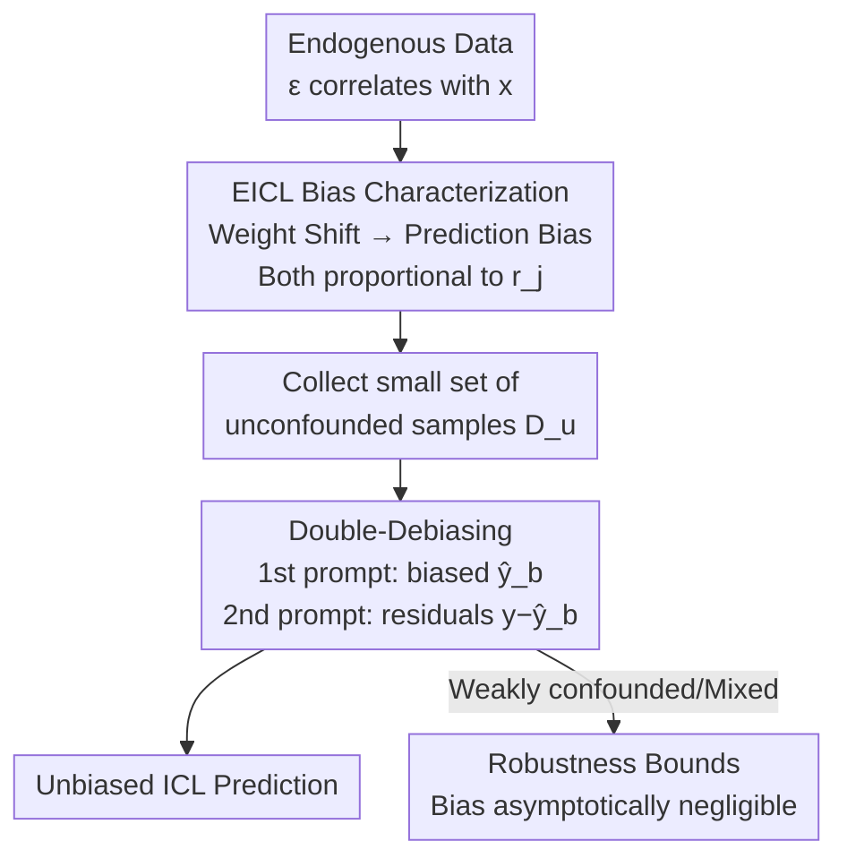

# Transformers with Endogenous In-Context Learning: Bias Characterization and Mitigation

**Conference**: ICLR 2026  
**OpenReview**: [https://openreview.net/forum?id=guKWBA2HWf](https://openreview.net/forum?id=guKWBA2HWf)  
**Area**: Learning Theory / In-Context Learning  
**Keywords**: In-context learning, hidden confounding, endogeneity, prediction bias, gradient-free debiasing  

## TL;DR
This work introduces Endogenous In-Context Learning (EICL), a setting where label noise $\epsilon$ correlates with features $X$ due to hidden confounding. It theoretically proves that Transformers pretrained on such data exhibit ICL prediction bias proportional to the confounding strength and proposes Double-Debiasing (DDbias): a fine-tuning-free method that "prompts the model twice" (once for the original label and once for the residual) using a few unconfounded samples to correct the bias.

## Background & Motivation

**Background**: Recent theoretical work on ICL has established that "gradient-free ICL inference $\approx$ implicit gradient descent (GD)." Feeding $(x,y)$ pairs into a pretrained linear Transformer is equivalent to performing an implicit GD step on a "meta-weight" during the forward pass. Analysis based on this equivalence typically characterizes the convergence conditions for pretrained weights.

**Limitations of Prior Work**: Existing theories rely on the assumption of **causal sufficiency** (Assumption 1): noise $\epsilon$ in the label generation process $y = \langle x, w_\star\rangle + \epsilon$ is independent of features $x$ ($\epsilon \perp\!\!\!\perp X$). However, hidden confounders are prevalent in real-world tasks where unobserved factors influence both $x$ and $y$, leading to endogeneity ($\epsilon \not\perp\!\!\!\perp X$). Existing ICL theories fail to capture these data structures.

**Key Challenge**: While mature theories for endogeneity bias exist for classic regressions (OLS/Instrumental Variables IV), they **cannot be directly applied to ICL**. ICL pretraining involves sequence-wise forward prediction, and inference relies on few-shot attention aggregation. This differs fundamentally from OLS, which solves for $w_\star$ globally, in terms of loss functions, representation dynamics, and inference mechanisms.

**Goal**: This work aims to answer: (1) Does a Transformer pretrained on endogenous data produce biased ICL predictions? (2) If so, can a low-cost, fine-tuning-free strategy using limited prompt samples be designed to correct it?

**Key Insight**: An analytical framework using linear self-attention and implicit GD is employed, but the data generation mechanism is modified to be endogenous ($\epsilon \not\perp\!\!\!\perp X$). The propagation of bias from "weight shift" to "ICL prediction bias" is traced through pretraining dynamics.

**Core Idea**: Bias is theoretically characterized as being "proportional to confounding strength $r_j = \mathbb{E}[X_j\epsilon]$." Methodologically, since bias originates from confounding, the model is prompted twice with a small set of **unconfounded** samples. The second prompt performs implicit GD on "residuals" to cancel out the bias—remaining gradient-free without altering model parameters.

## Method

### Overall Architecture

This work combines theoretical characterization with a practical solution in two stages: **problem identification followed by bias mitigation**.

In the first stage (Bias Characterization), two levels of bias propagation are traced under the EICL setting. The problem (Problem 1) allows hidden confounding to influence both $x^{(i)}$ and $y^{(i)}$, with $r_j = \mathbb{E}[X_j\epsilon]$ measuring confounding strength on the $j$-th feature dimension. A set of "grounded parameters" (U_weights) $S_u, T_u$ is constructed as an unbiased baseline (Lemma 1). **Theorem 1** proves that parameters $S_b, T_b$ pretrained on confounded data deviate from $S_u, T_u$ proportional to $r_j$. **Theorem 2** further proves that this weight shift propagates to ICL inference via the "meta-weights," resulting in a prediction bias proportional to $r_j$.

In the second stage (Bias Mitigation), **DDbias** is proposed: a few unconfounded samples are collected to prompt a frozen Transformer twice. The first prompt yields a biased prediction $\hat y_b$, and the second prompt replaces the labels with residuals $y - \hat y_b$. **Theorem 3** proves the second prompt is equivalent to implicit GD on residuals. **Proposition 1** shows its limit is an unbiased ICL prediction. **Propositions 2/3** provide robustness bounds for cases where "unconfounded samples" are weakly confounded or contain biased outliers.

### Key Designs

**1. EICL Setting: Introducing Hidden Confounding to ICL Data Generation**
Existing ICL theories assume $\epsilon \perp\!\!\!\perp X$. This work relaxes this (Problem 1), allowing an unobserved factor to drive both $x^{(i)}$ and $y^{(i)}$. Assumption 2 provides an operational structure: $X_j = r_j\epsilon + \kappa_j$, where $\kappa_j$ is pure noise and $r_j = \mathbb{E}[X_j\epsilon]$ is the **confounding strength**. Combined with Assumption 3 (SUTVA), this allows for tractable attention analysis while introducing endogeneity into Transformer pretraining theory for the first time. This demonstrates why ICL bias must be derived specifically for attention mechanisms rather than relying on OLS/IV.

**2. Two-level Bias Propagation: From Weight Shift to Prediction Bias**
Theorem 1 identifies the parameter shift during pretraining:
$$\Delta^j_{\text{pre}}(S,T) = U\left(r_j K + R\right)U^\top,$$
where $K, R$ are constants related to features and $w_\star$. The shift is **proportional to $r_j$**. Theorem 2 introduces **ICL Gradient Divergence** (Def 2) to translate weight shifts into prediction bias $\Delta y^{(i)} = \sum_j (w_u - w_b)[j]\, x^{(i)}[j]$, showing the bias lower bound is also proportional to $r_j$:
$$\Delta w_{\text{est}}[j] \;\geq\; r_j \cdot O_n\!\Big(\textstyle\sum_l r_l \sum_v w_\star[v]\,\sigma^2\Big) + O\!\Big(\kappa_Z\textstyle\sum_l \tfrac{r\kappa_Z}{q_l}\Big).$$
Remark 2 highlights two **essential differences** from OLS: (a) **Bias cancellation**—global bias depends on the sum $\sum_l r_l$, meaning opposing confounding effects can cancel out; (b) **Attention geometry dependency**—confounding interacts with attention to contribute extra bias terms absent in OLS/IV.

**3. Double-Debiasing: Gradient-free Correction via Residual Prompting**
DDbias introduces a few unconfounded samples $D_u = \{x_{rc}^{(i)}, y_{rc}^{(i)}\}$. First, $D_u$ is fed to the biased frozen model to obtain $\hat y_b^{(i)}$. Second, labels are replaced with the **residual** $y_{rc}^{(i)} - \hat y_b^{(i)}$ for a new prompt. Theorem 3 proves the second prompt is equivalent to implicit GD on the residual loss:
$$L_{\text{deb}}(w) = \frac{1}{2n}\sum_{i=1}^n \big(y^{(i)} - \hat y_b^{(i)} - w^\top x_{rc}^{(i)}\big)^2,$$
and Proposition 1 proves this converges to an **unbiased** ICL prediction. The method requires **no parameter updates, auxiliary labels, or instrumental variables**, fitting the "inference-only" nature of ICL.

**4. Robustness Bounds under Weak/Mixed Confounding**
Proposition 2 and 3 provide guarantees when "unconfounded samples" are imperfect (residual correlation) or contaminated (proportion $\rho$ of the batch is biased). The DDbias estimation error is bounded:
$$\mathbb{E}[y_{GT} - \hat y_{DEB}] \leq C'\left(\frac{1}{\sqrt{(1-\rho)\,n_b\,\lambda^*}} + \rho\,\bar r\right).$$
The bias becomes asymptotically negligible as sample size $n_b \to \infty$ or contamination $\rho \to 0$.

### Loss & Training
Pretraining follows the standard ICL regression loss $L_{\text{icl}}(S,T) = \mathbb{E}_{(M,w_\star)}\big[(\text{TF}^{\text{pred}}_{S,T}(M) + y^{(n+1)})^2\big]$. DDbias **introduces no additional training**; it consists of two forward passes where the second implicit optimization of $L_{\text{deb}}$ is performed automatically by the attention mechanism.

## Key Experimental Results

Experiments validate the theory and DDbias effectiveness across linear ($d=5$, context length 20, varying $r_j$ as Conf@x), IV comparisons, non-linear/partially confounded settings, and real NLP data (Yelp sentiment tasks RPI/ROR).

### Main Results

On real NLP datasets, DDbias consistently reduces MAE as the number of ICL samples increases (15→30→60), outperforming strong causal baselines:

| Dataset/Metric | Vanilla LLaMA | DMCEE | SC | DDbias(15) | DDbias(30) | DDbias(60) |
|------|------|------|------|------|------|------|
| RPI (MAE) | 23.8 | 21.2 | 22.5 | 22.8 | 19.4 | **16.7** |
| ROR (MAE) | 0.46 | 0.28 | 0.24 | 0.36 | 0.18 | **0.16** |

For non-linear/deep Transformers (L=5/7 with ReLU/Softmax), DDbias halves the prediction error across confounding intensities:

| Configuration | Conf@0.5 | Conf@1.0 | Conf@1.5 | Conf@2.0 |
|------|------|------|------|------|
| L=5 Biased (Ours) | 0.280 | 0.370 | 0.475 | 0.600 |
| L=5 DDbias (Ours) | **0.115** | **0.150** | **0.200** | **0.260** |
| L=7 Biased (Ours) | 0.320 | 0.450 | 0.600 | 0.750 |
| L=7 DDbias (Ours) | **0.135** | **0.175** | **0.225** | **0.290** |

### Ablation Study

Robustness to partial confounding (Weak Conf@0.10): The sample proportion required to reach a specific ICL error is small for both oracle and weak confounding scenarios, verifying Proposition 2/3:

| ICL Prediction Error | 0.090 | 0.092 | 0.095 | 0.100 |
|------|------|------|------|------|
| Sample Ratio (oracle, ×10⁻³) | 6.4 | 3.2 | 2.4 | 1.6 |
| Sample Ratio (weak, ×10⁻³) | 8.6 | 7.2 | 6.3 | 3.5 |

### Key Findings
- **Confounding strength is the universal metric**: Weight deviation and prediction bias both scale with $r_j$, confirming Theorem 1/2.
- **Few unconfounded samples are sufficient**: A very small ratio of unbiased samples effectively eliminates bias.
- **Robustness to contamination**: DDbias remains effective even if unconfounded samples are "dirty," with only a slight increase in required sample size.
- **Wider applicability than IV**: DDbias does not rely on valid instrumental variables and succeeds where IV fails due to weak/null instruments.

## Highlights & Insights
- **First introduction of endogeneity to ICL theory**: Addresses the gap where prior theoretical works assumed causal sufficiency, disregarding real-world hidden confounding.
- **Elegant "prompt twice" design**: Correcting bias via residuals is gradient-free and requires no parameter updates, making it a natural fit for ICL.
- **Bias cancellation property**: The discovery that global ICL bias is the sum of confounding across dimensions suggests that certain structures might be naturally "self-debiasing."
- The residual prompting concept is transferable to other scenarios involving "frozen LLMs + small clean samples" beyond linear regression.

## Limitations & Future Work
- **Theoretical reliance on linear self-attention**: While experiments cover non-linear models, closed-form theorems depend on linear simplifications (no softmax).
- **Dependence on unconfounded samples**: Assumes availability of $\epsilon \perp\!\!\!\perp x$ samples (e.g., from A/B tests), which may be difficult in non-randomized domains.
- **Scale of real-world evaluation**: NLP experiments are limited to sentiment regression tasks; performance on high-dimensional labels or large-scale LLM classification is unverified.

## Related Work & Insights
- **vs ICL = Implicit GD (Ahn et al. 2023 / Von Oswald et al. 2023)**: This work extends their framework by relaxing independence assumptions and characterizing the resulting endogeneity bias.
- **vs IV-based ICL (Liang et al. 2024)**: Approaches using IV require valid instruments; DDbias avoids this by using small sets of unconfounded data.
- **vs Data Fusion (Kallus et al. 2018)**: Traditional deconfounding requires fine-tuning on unbiased data, whereas DDbias follows the "inference-only" paradigm of ICL.

## Rating
- Novelty: ⭐⭐⭐⭐⭐ 
- Experimental Thoroughness: ⭐⭐⭐⭐ 
- Writing Quality: ⭐⭐⭐⭐ 
- Value: ⭐⭐⭐⭐ 

<!-- RELATED:START -->

## Related Papers

- [\[ICLR 2026\] In-Context Algorithm Emulation in Fixed-Weight Transformers](in-context_algorithm_emulation_in_fixed-weight_transformers.md)
- [\[ICLR 2026\] Continuum Transformers Perform In-Context Learning by Operator Gradient Descent](continuum_transformers_perform_in-context_learning_by_operator_gradient_descent.md)
- [\[ICLR 2026\] Adversarially Pretrained Transformers May Be Universally Robust In-Context Learners](adversarially_pretrained_transformers_may_be_universally_robust_in-context_learn.md)
- [\[ICLR 2026\] Transformers Learn Latent Mixture Models In-Context via Mirror Descent](transformers_learn_latent_mixture_models_in-context_via_mirror_descent.md)
- [\[ICLR 2026\] Critical Attention Scaling in Long-Context Transformers](critical_attention_scaling_in_long-context_transformers.md)

<!-- RELATED:END -->
