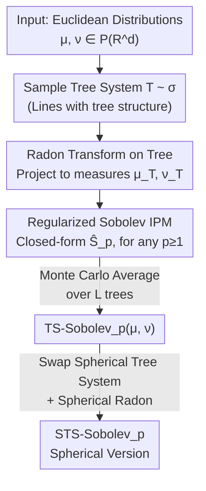

# Tree-sliced Sobolev IPM

**Conference**: ICLR 2026  
**OpenReview**: [https://openreview.net/forum?id=HHNQSXaLkF](https://openreview.net/forum?id=HHNQSXaLkF)  
**Code**: https://github.com/thanhquangtran/TS-Sobolev  
**Area**: Optimal Transport / Probability Metrics / Representation Learning  
**Keywords**: Integral Probability Metrics, Sobolev IPM, Tree-Sliced Wasserstein, High-order Optimal Transport, Spherical Distributions

## TL;DR
This paper replaces the 1-Wasserstein—which only has a closed-form solution for $p=1$—within the Tree-Sliced Wasserstein (TSW) kernel with a "regularized Sobolev IPM solvable in closed-form on trees." This yields TS-Sobolev: a family of tree-sliced metrics efficiently computable for any order $p \ge 1$. When $p=1$, it reduces exactly to TSW; for $p>1$, its computational complexity remains identical to $p=1$ TSW. It comprehensively outperforms the SW/TSW series in downstream tasks such as gradient flow, diffusion models, self-supervised learning, and topic modeling.

## Background & Motivation

**Background**: Comparing two probability distributions is a fundamental operation in machine learning (e.g., point clouds, bag-of-words documents). While Optimal Transport (OT) provides distances that respect geometric structures, its $O(n^3 \log n)$ complexity renders it unusable for large data. Sliced Wasserstein (SW) projects high-dimensional distributions onto random 1D directions, utilizes the closed-form solution of 1D OT, and averages across slices, reducing complexity to the sorting level of $O(n \log n)$. Recent **Tree-Sliced Wasserstein (TSW)** goes further: it projects distributions onto "tree metric spaces" rather than 1D lines. Since 1-Wasserstein on trees also has a closed-form solution, it can express more complex topologies than a single line, leading to better downstream performance.

**Limitations of Prior Work**: The efficiency of TSW relies entirely on the fact that "1-Wasserstein on trees has a closed-form solution"—but this analytical solution **only holds for $p=1$**. For general $p>1$, $p$-Wasserstein on trees lacks a known closed-form solution and is expensive to compute, effectively locking TSW into the $p=1$ case.

**Key Challenge**: However, in gradient-based learning, high-order metrics ($p>1$) are often preferred. $p>1$ Wasserstein distances possess strict convexity, smoother gradients, and friendlier optimization landscapes. In contrast, $p=1$ gradients are constant (independent of the error magnitude), leading to instability during training. This creates a fundamental tension between the "desire for the optimization advantages of $p>1$" and the "computational intractability of $p>1$ on trees."

**Key Insight & Core Idea**: The authors bypass the dead end of "directly computing $p$-Wasserstein on trees" and return to the **Integral Probability Metric (IPM)** framework. IPM defines distance by finding a "critic function" that best distinguishes two distributions within a certain function class. **Sobolev IPM** constrains the critic to the unit ball of the Sobolev norm, which has excellent theoretical properties but historically lacked closed-form solutions. A key breakthrough from Le et al. (2025) proved that **regularized Sobolev IPM on trees has closed-form solutions for any $p \ge 1$**. This paper embeds this closed-form Sobolev IPM into the tree-slicing framework. In short, it "replaces 1-Wasserstein with the closed-form regularized Sobolev IPM as the tree kernel," thereby unlocking arbitrary order $p$.

## Method

### Overall Architecture

The birds-eye view of TS-Sobolev is clear: it follows the TSW three-stage pipeline—"project Euclidean distributions to random trees, calculate a closed-form distance on trees, average across many trees." **The only change is replacing the tree distance from 1-Wasserstein to regularized Sobolev IPM.**

Specifically, given two distributions in Euclidean space $\mu, \nu \in \mathcal P(\mathbb R^d)$: ① Sample a **tree system** $\mathcal T$ from a sampling distribution $\sigma$ (a set of lines with a tree structure); ② Use the **Radon transform on tree systems** $R^\alpha_{\mathcal T}$ to project the densities of $\mu, \nu$ into measures $\mu_{\mathcal T}, \nu_{\mathcal T}$ on the tree; ③ Compute the **regularized Sobolev IPM** $\hat S_p(\mu_{\mathcal T}, \nu_{\mathcal T})$ on the tree (closed-form for any $p$); ④ Perform Monte Carlo averaging over $L$ random tree systems to obtain the final distance. Formally:

$$\text{TS-Sobolev}_p(\mu, \nu) := \left( \int_{\mathbb T} \hat S_p(\mu_{\mathcal T}, \nu_{\mathcal T})^p \, d\sigma(\mathcal T) \right)^{1/p}.$$

Since the tree system, sampling distribution $\sigma$, and splitting map $\alpha$ reuse the mature configurations of Db-TSW, and $\hat S_1$ exactly equals 1-Wasserstein on trees when $p=1$, TS-Sobolev is a **strict generalization and plug-and-play replacement** for TSW.

### Key Designs

**1. Regularized Sobolev IPM: A closed-form and optimization-friendly kernel for $p>1$ on trees**

This is the engine of the paper, directly addressing the lack of closed-form $p>1$ solutions on trees. Standard Sobolev IPM is defined by finding a critic $f$ in the Sobolev unit ball $B(p')$ to maximize the expectation difference $S_p(\mu, \nu) = \sup_{f \in B(p')} |\int f \, d\mu - \int f \, d\nu|$ ($p'$ is the conjugate exponent), which is generally unsolvable. The authors adopt the **regularized** version from Le et al. (2025), which has an explicit integral solution for continuous measures on trees:

$$\hat S_p(\mu, \nu)^p = \int_{\mathcal T} \hat w(x)^{1-p} \, \big| \mu(\Lambda(x)) - \nu(\Lambda(x)) \big|^p \, \omega(dx),$$

where $\Lambda(x)$ is the subtree rooted at $x$, and $\hat w(x) := 1 + \omega(\Lambda(x))$ is a weighting function. For discrete measures on nodes, the integral simplifies to an efficient sum over tree edges $E$: $\hat S_p(\mu, \nu)^p = \sum_{e \in E} \beta_e \, | \mu(\gamma_e) - \nu(\gamma_e) |^p$, where coefficients $\beta_e$ can be precomputed (for $p=2$, $\log(1 + \frac{w_e}{1 + \omega(\gamma_e)})$; otherwise, $\frac{(1 + \omega(\gamma_e) + w_e)^{2-p} - (1 + \omega(\gamma_e))^{2-p}}{2-p}$).

This form is not only computable in closed-form but offers two optimization advantages: First, for $p>1$, gradients scale with the error magnitude $|\mu(\Lambda(x)) - \nu(\Lambda(x))|$ (rather than being constant as in $p=1$), leading to smoother optimization. Second, the term $\hat w(x)^{1-p}$ **downweights global gradients near the root**, forcing optimization to focus on fine-grained local structures at leaf ends—this is the theoretical source for preserving image details in diffusion models and a unique benefit over standard $p$-Wasserstein.

**2. Tree-Slicing Framework: Moving high-dimensional distributions to trees**

Sobolev IPM is only effective for "measures supported on trees," while real data lives in $\mathbb R^d$. The authors reuse the tree-slicing mechanism of Db-TSW: a single line is an element of $\mathbb R^d \times S^{d-1}$, and $k$ lines endowed with a tree structure form a **tree system** $\mathcal T$. The **Radon transform on tree systems** $R^\alpha_{\mathcal T}f(x, l_i) = \int_{\mathbb R^d} f(y) \, \alpha(y, \mathcal T)_i \, \delta(t_x - \langle y - x_i, \theta_i \rangle) \, dy$ projects Euclidean densities into tree measures. This operator is **injective**, ensuring information is not lost during projection. Using an $E(d)$-invariant (invariant to translation and orthogonal transformation) splitting map $\alpha$ is critical—the paper proves (Theorem 3.2) that this invariance **ensures TS-Sobolev is a valid metric on $\mathcal P(\mathbb R^d)$**, which is more fundamental than 2-Wasserstein merely "possessing" such invariance. Meanwhile, Theorem 3.3 shows $\text{TS-Sobolev}_p^p \le \text{TSW}$ and equality at $p=1$, theoretically confirming that "TS-Sobolev is a generalization of TSW."

**3. Monte Carlo Aggregation and Complexity Alignment: High-order metrics without extra cost**

The integral expectation in Eq. (9) is approximated via Monte Carlo estimation using $L$ sampled tree systems: $\widehat{\text{TS-Sobolev}}_p = (\frac{1}{L} \sum_{i=1}^L \hat S_p(\mu_{\mathcal T_i}, \nu_{\mathcal T_i})^p)^{1/p}$. The approximation error converges at $O(L^{-1/2})$ (Theorem 3.5). Most importantly, the total complexity is $O(Lkn \log n + Lkdn)$ ($k$ is lines per tree, $d$ is dimension), **identical to first-order Db-TSW**, because precomputing $\beta_e$ only adds a negligible $O(Lkn)$. This means users gain $p>1$ optimization advantages at zero runtime cost.

**4. Spherical Extension STS-Sobolev: The same mechanism for hyperspheres**

Many representation learning tasks normalize features to a hypersphere (e.g., uniformity term in SSL). The authors extend the framework to $\mu, \nu \in \mathcal P(S^{ d})$. This involves replacing Euclidean tree systems with **spherical tree systems** and Radon transforms with **spherical Radon transforms**, while keeping the rest symmetric: $\text{STS-Sobolev}_p(\mu, \nu) := (\int_{\mathbb T} \hat S_p(\mu_{\mathcal T}, \nu_{\mathcal T})^p \, d\sigma(\mathcal T))^{1/p}$. Since the implementation follows the splitting maps and sampling of STSW, STS-Sobolev exactly reduces to spherical TSW (STSW) when $p=1$.

### Loss & Training

TS-Sobolev is a distance that can be inserted into various downstream objectives. For example, in self-supervised learning, it replaces the uniformity term: $L = \frac{1}{n} \sum_i \|z_i^A - z_i^B\|_2^2 + \frac{\lambda}{2}(\text{STS-Sobolev}_p(z^A, \nu) + \text{STS-Sobolev}_p(z^B, \nu))$, where $\nu = U(S^d)$ is the uniform distribution. In topic modeling, it replaces the KL regularization term in VAEs. Experiments primarily use $p \in \{1.2, 1.5, 2\}$.

## Key Experimental Results

### Main Results

**Euclidean Gradient Flow (Table 1, Wasserstein Distance, lower is better)**: On 8 Gaussians and Gaussian 30d, the convergence of TS-Sobolev outperforms all SW/TSW baselines.

| Dataset | Metric (2500 iter) | TS-Sobolev$_{1.2}$ | Best Baseline Db-TSW | TSW-SL |
| :--- | :--- | :--- | :--- | :--- |
| 8 Gaussians | W Distance | **8.88e-7** | 2.50e-6 | 1.17e-6 |
| Gaussian 30d | W Distance (×10⁻¹) | **1.40** | 1.78 | 1.93 |

**Diffusion Models (Table 2, CIFAR-10 Unconditional, FID lower is better)**: Integrating TS-Sobolev into the AGME loss of DDGAN.

| Model | FID ↓ | Time/epoch (s) |
| :--- | :--- | :--- |
| Db-TSW-DD$^\perp$ (Best Baseline) | 2.53 | 85 |
| **TS-Sobolev$_{1.5}$-DD** | 2.302 ± 0.004 | 84 |
| **TS-Sobolev$_2$-DD** | **2.277 ± 0.003** | 84 |

FID decreased by 0.228 / 0.253 compared to the strongest baseline, with training time remaining consistent with other tree-sliced variants—performance gains do not come at the expense of efficiency.

**Spherical SSL (Table 3, CIFAR-10 + ResNet18 Linear Eval, Accuracy higher is better)**: STS-Sobolev$_2$ achieved 80.6% (Encoded) / 77.65% (Projected), surpassing the direct competitor STSW (80.53 / 76.78) and the SSW/S3W series.

**Topic Modeling (Table 5, Topic Coherence $C_V$ higher is better)**:

| Setting | Method | BBC | M10 |
| :--- | :--- | :--- | :--- |
| Euclidean | Best Baseline (TSW-SL/EBRPSW) | 0.796 / 0.490 | — |
| Euclidean | **TS-Sobolev$_2$** | **0.805** | **0.497** |
| Spherical | Best Baseline (SSW/STSW) | 0.755 | 0.408 |
| Spherical | **STS-Sobolev$_2$** | **0.776** | **0.423** |

### Key Findings

- **Optimal range for order $p$**: For Euclidean gradient flow, TS-Sobolev$_{1.2}$ was best, whereas TS-Sobolev$_2$ degraded on Gaussian 30d (final 3.68 vs 1.40 for $p=1.2$), suggesting $p$ can be too large. However, in complex tasks like diffusion or SSL, $p=2$ is often optimal. $p$ is a task-dependent hyperparameter.
- **Root downweighting via $\hat w(x)^{1-p}$ is key for detail**: The authors attribute FID improvements in diffusion models to this term, which focuses optimization on local structures at the leaves, preserving image details.
- **High-order without added cost**: Empirical tests confirm runtime is nearly identical to first-order Db-TSW.

## Highlights & Insights
- **Elegant generalization via "Kernel Swapping"**: Instead of solving the hard problem of "closed-form $p$-Wasserstein on trees," the authors swap it for a different metric that characterizes distribution differences but happens to have a closed-form solution (Sobolev IPM).
- **$p=1$ exact reduction + complexity alignment**: This makes it a true drop-in replacement. Any code using Db-TSW can switch to TS-Sobolev without cost, gaining a $p$ hyperparameter.
- **Root downweighting weight $\hat w(x)^{1-p}$**: This is a transferable insight. In any hierarchical distance, downweighting global root differences and amplifying local leaf differences may aid fine-grained tasks.

## Limitations & Future Work
- **Limitations**: TS-Sobolev only compares **balanced measures** (equal total mass) and cannot handle Unbalanced OT (UOT). The authors list extending this to UOT as future work.
- **Observations**: The order $p$ lacks an automatic selection mechanism. Since $p=2$ performed worse on Gaussian 30d, it is task-sensitive. Also, regularized Sobolev IPM is a **biased** proxy for the standard Sobolev IPM.

## Related Work & Insights
- **vs TSW (Db-TSW / TSW-SL)**: Both share the tree-slicing + Radon framework. The difference lies in the kernel: TSW uses 1-Wasserstein (closed-form only for $p=1$), while this paper uses regularized Sobolev IPM (closed-form for $p \ge 1$).
- **vs Standard Sobolev IPM**: Standard version is theoretical but lacks closed-form solutions. The regularized version on trees provides a practical implementation.
- **vs Sliced Wasserstein (SW / MaxSW / SWGG)**: SW projects to 1D lines, limited in expressivity. This paper projects to tree metric spaces, capturing complex topologies.

## Rating
- Novelty: ⭐⭐⭐⭐ Not a completely new framework, but the shift to Sobolev IPM to unlock $p$ is clean and effective.
- Experimental Thoroughness: ⭐⭐⭐⭐ Covers gradient flow, diffusion, SSL, and topic modeling across Euclidean and spherical settings. 
- Writing Quality: ⭐⭐⭐⭐ Motivation is clear; complexity is well-explained.
- Value: ⭐⭐⭐⭐ Drop-in replacement, zero extra cost, adds a useful $p$ parameter for all TSW applications.

<!-- RELATED:START -->

## Related Papers

- [\[ICLR 2026\] Revisiting Tree-Sliced Wasserstein Distance through the Lens of the Fermat–Weber Problem](revisiting_tree-sliced_wasserstein_distance_through_the_lens_of_the_fermatweber_.md)
- [\[ICLR 2026\] Data-Aware and Scalable Sensitivity Analysis for Decision Tree Ensembles](data-aware_and_scalable_sensitivity_analysis_for_decision_tree_ensembles.md)
- [\[ICLR 2026\] Curse of Slicing: Why Sliced Mutual Information is a Deceptive Measure of Statistical Dependence](curse_of_slicing_why_sliced_mutual_information_is_a_deceptive_measure_of_statist.md)
- [\[ICLR 2026\] Better Learning-Augmented Spanning Tree Algorithms via Metric Forest Completion](better_learning-augmented_spanning_tree_algorithms_via_metric_forest_completion.md)
- [\[ICML 2026\] Tree-Structured Orthonormal Decomposition of the Aitchison Simplex](../../ICML2026/learning_theory/tree-structured_orthonormal_decomposition_of_the_aitchison_simplex.md)

<!-- RELATED:END -->
