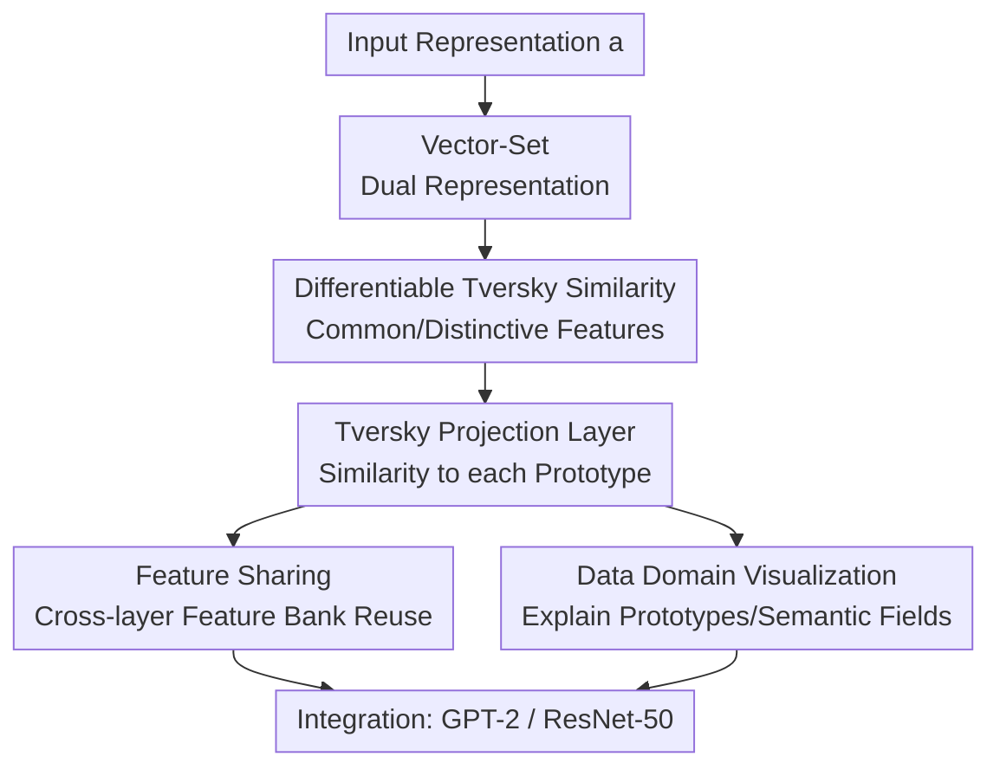

# Tversky Neural Networks: Psychologically Plausible Deep Learning with Differentiable Tversky Similarity

**Conference**: ICLR 2026  
**OpenReview**: [https://openreview.net/forum?id=koKWoKaMrE](https://openreview.net/forum?id=koKWoKaMrE)  
**Code**: https://github.com/mdoumbouya/tversky-networks-iclr2026  
**Area**: Learning Theory / Interpretable Neural Networks  
**Keywords**: Tversky Similarity, Psychological Similarity, Prototype Learning, Interpretable Neural Networks, Language Modeling  

## TL;DR
This paper reformulates Tversky's "common features + distinctive features" psychological similarity theory into a neural network layer trainable via gradient descent. By replacing linear projections with Tversky Projections, it demonstrates stronger expressivity, parameter efficiency, and improved interpretability across GPT-2 language modeling and ResNet-50 image classification.

## Background & Motivation
**Background**: In modern deep learning, "similarity" is almost by default geometric similarity. Linear layers compute the dot product between input vectors and weight columns; attention mechanisms use scaled dot products between queries and keys; classification heads compare representations with category prototypes before applying softmax. This approach implicitly assumes concepts reside in a vector space where dot products, cosines, or distances measure proximity. While engineering-wise successful, this has become the underlying syntax of neural network modules.

**Limitations of Prior Work**: Psychology has long noted that human similarity judgments do not always satisfy geometric axioms. A classic example is asymmetry: it is more natural to say "a son resembles his father" than "a father resembles his son." If a similarity function is forced into a symmetric distance or inner product, it struggles to express human judgments where the referent is more salient and the subject more specific. Existing Tversky losses or semantic similarity networks have applied Tversky’s ideas only to specific tasks, lacking a general-purpose differentiable module to replace linear projection layers.

**Key Challenge**: Tversky's original theory is set-theoretic: objects consist of feature sets, and similarity is determined by shared vs. unique features. In neural networks, objects and features are typically continuous vectors. Set intersections, differences, and "the presence of a feature" are inherently non-differentiable. Without converting these set operations into trainable representations, Tversky similarity remains confined to cognitive psychology explanations rather than mainstream architecture.

**Goal**: The authors aim to construct a universal, differentiable, and learnable Tversky similarity function and introduce a fundamental module analogous to the linear layer. This module should integrate into existing architectures (e.g., ResNet-50 classification heads or GPT-2 language model heads) while preserving the interpretability of Tversky theory regarding common features, distinctive features, and semantic fields.

**Key Insight**: A key observation is that objects can retain vector representations while being interpreted as feature sets defined by "which learnable feature vectors yield a positive dot product." Thus, an object $x$ is both a vector in $\mathbb{R}^d$ and a set $X=\{f_k\in\Omega\mid x\cdot f_k>0\}$. This dual representation allows set operations to be formulated using dot products, indicator gating, and aggregation functions, making them differentiable in a piecewise sense for gradient-based training.

**Core Idea**: Replace the "weight matrix dot product" of linear layers with a "learnable feature bank + prototype bank + Tversky contrastive formula." This allows the network to go beyond measuring geometric angles to explicitly compare which features are shared and which are unique to the input or the prototype.

## Method

### Overall Architecture
The Tversky Neural Network does not redesign the entire architecture but replaces the ubiquitous projection layers. Given an input $a\in\mathbb{R}^d$, the Tversky Projection Layer calculates Tversky similarities between $a$ and a set of learnable prototypes $\Pi_i$, outputting a score for each. To achieve this, the model learns an additional feature bank $\Omega=\{f_k\}_{k=1}^{|\Omega|}$. It uses positive dot products to determine the presence of features and combines common features, input-unique features, and prototype-unique features into a final score.

The core contributions include: converting continuous vectors into trainable feature sets, defining differentiable Tversky similarity, encapsulating it as a projection layer, and utilizing set representations for feature sharing and interpretability. The "Data Domain Visualization" demonstrates why this representation is more interpretable than standard linear layers.

### Key Designs
**1. Vector-Set Dual Representation: Bridging Psychological Features and Continuous NNs**  
Original Tversky theory assumes objects $a$ and $b$ correspond to feature sets $A$ and $B$. This paper parameterizes "features" as vectors. For a feature bank $\Omega$, the intensity of feature $f_k$ in object $x$ is $x\cdot f_k$; if $x\cdot f_k > 0$, the feature belongs to set $X$. This eliminates the need for manual feature annotations (e.g., "has yellow legs"), allowing the network to learn the feature bank during training. Object saliency is defined as the sum of intensities: $f(A)=\sum_k a\cdot f_k\cdot \mathbf{1}[a\cdot f_k>0]$, aligning with the psychological hypothesis that more salient stimuli are preferred referents.

**2. Differentiable Tversky Similarity: Replacing Dot Products with Contrastive Matching**  
The Tversky contrast model is expressed as $S(a,b)=\theta f(A\cap B)-\alpha f(A-B)-\beta f(B-A)$.  
Here, $A\cap B$ represents shared features, while $A-B$ and $B-A$ represent features unique to the input and prototype, respectively. Each term is an aggregation over trainable vectors. Common features are activated only when $a\cdot f_k>0$ and $b\cdot f_k>0$, with intensities combined via $\Psi$ (e.g., min, max, product). Difference sets come in two versions: *ignorematch* (punishing features present only in one set) and *substractmatch* (punishing intensity differences). Since $\alpha, \beta, \theta$ are learnable, the model weights shared vs. unique features dynamically. If $\alpha \ne \beta$, similarity is inherently asymmetric.

**3. Tversky Projection Layer: A Drop-in Replacement for Linear Layers**  
While a linear layer outputs the dot product of $a$ with weight columns, the Tversky Projection Layer outputs $S_{\Omega,\alpha,\beta,\theta}(a,\Pi_i)$. It can replace linear layers in classification heads, LM heads, or attention projections. The layer's expressivity exceeds that of a single linear layer. For instance, a single Tversky layer can solve the XOR problem (which is not linearly separable) by using set matching: $[0,1]$ and $[1,0]$ share features with a "positive" prototype, while $[0,0]$ and $[1,1]$ are rejected due to empty sets or distinctive feature penalties.

**4. Feature Sharing and Interpretability: Efficient and Semantic**  
The Tversky layer utilizes a prototype bank $\Pi$ (output dimension) and a feature bank $\Omega$ (comparison basis). These can be shared across semantically compatible layers. In GPT-2, the attention output projection and the LM head can share the same feature bank. This design explains how the model reduces parameters while maintaining or improving performance. Furthermore, set algebra allows for "semantic field" expressions: $A\cap B-C$ can represent features shared by A and B but absent in C, capturing relationships like antonyms or visual attributes (e.g., "shorebird" features shared by two birds but distinct from a third).

### A Full Example
In the XOR task, input points are $x_0=[0,0], x_1=[0,1], x_2=[1,0], x_3=[1,1]$. A linear layer fails because the classes are not linearly separable. A Tversky layer learns two features $f_0, f_1$ and prototypes $p_0, p_1$. $p_1$ contains two features associated with the positive class. $x_1$ shares $f_1$ with $p_1$, increasing $S(x_1, p_1)$. $x_2$ shares $f_0$ with $p_1$. While $x_3$ has "more" geometric features, the Tversky model can penalize the mismatch relative to $p_1$, correctly classifying it as negative.

### Loss & Training
The Tversky Projection Layer is a plug-and-play module. In ResNet-50, it replaces the final FC layer and is trained with Cross-Entropy. In GPT-2, it is used for the LM head or attention projections, trained with standard next-token prediction loss. Parameters include $\Omega, \Pi,$ and scalars $\alpha, \beta, \theta$. Because feature activation uses dot-product gating, the implementation is piecewise differentiable, similar to ReLU, and trainable via standard backpropagation.

## Key Experimental Results

### Main Results
Evaluation spans GPT-2 on PTB and ResNet-50 on NABirds/MNIST.

| Task | Configuration | Baseline | Tversky Version | Gain |
|------|---------------|----------|-----------------|------|
| PTB Language Modeling | GPT-2 Scratch, prototype tying | 112.81 PPL / 124.44M Params | 103.99 PPL / 81.14M Params | PPL -7.8%, Params -34.8% |
| PTB Language Modeling | GPT-2 Scratch, no tying | 111.79 PPL / 163.04M Params | 98.22 PPL / 116.59M Params | PPL -12.1%, Params -28.5% |
| PTB Language Modeling | GPT-2 Fine-tune, head only | 30.52 PPL / 163.04M Params | 28.33 PPL / 175.62M Params | PPL -7.2%, Params +7.7% |
| NABirds Classification | ResNet-50 Scratch | 62.84 ± 0.45 | 65.20 ± 0.26 | +2.36 pp |
| NABirds Classification | ImageNet Fine-tune | 82.37 ± 0.25 | 82.96 ± 0.07 | +0.59 pp |
| MNIST Classification | ResNet-50 Scratch | 99.54 ± 0.04 | 99.56 ± 0.06 | Comparable |

### Ablation Study

| Config / Observation | Key Metric | Note |
|----------------------|------------|------|
| GPT-2 Replace Head Only | 30.52 → 28.33 PPL | Replacing just the output layer improves PPL but adds params. |
| GPT-2 Attention + LM Head | 112.81 → 103.99 PPL | Feature sharing improves performance and parameter efficiency. |
| GPT-2 Fine-tuned tying | 18.31 → 18.62 PPL | Slight decrease when inheriting pre-trained embeddings while Tversky params are random. |
| ResNet-50 Frozen Backbone | 40.25 → 38.73 | If only the projection layer is trained, Tversky is not always better. |
| XOR Task | Single layer solves XOR | Product and substractmatch work best; feature count isn't monotonic. |

### Key Findings
- **Ours works best when trained from scratch**: Gains are highest for GPT-2 and ResNet-50 when not constrained by pre-trained linear embeddings.
- **Parameter efficiency via feature sharing**: Significant parameter reduction in GPT-2 requires sharing the feature bank across layers.
- **Superior interpretability**: MNIST prototype visualizations show Tversky prototypes resembling human-recognizable strokes, whereas linear weights appear as noisy textures.
- **Semantic Field Analysis**: Set expressions ($A \cap B$, $A - B$) allow direct retrieval of visual or linguistic concepts, moving beyond simple heatmaps.

## Highlights & Insights
- **Psychological theory to NN block**: Successfully translates a cognitive theory into a drop-in architectural primitive.
- **Reinterpreting Linear Layers**: Views linear layers and Tversky layers under a unified framework of "similarity to prototypes," where the difference lies in the similarity function (geometry vs. sets).
- **Asymmetric Similarity**: Enables the network to model "a is similar to b" with different weights than "b is similar to a," a property hard to capture with standard dot products.
- **Algebraic Explanations**: Shifts interpretability from "looking at neurons" to "writing set expressions" to identify commonalities and differences.

## Limitations & Future Work
- **Computational Overhead**: Maintaining a feature bank and performing set-matching increases training time and memory usage as the bank grows.
- **Hyperparameter Complexity**: Bank size, aggregation functions, and tying strategies require extensive tuning.
- **Dead Feature Risk**: Gating mechanisms may lead to inactive features, similar to dead experts in MoE.
- **Scalability**: While promising on GPT-2 and ResNet-50, performance on larger models and datasets remains to be confirmed.
- **Psychological Validation**: While qualitatively plausible, more rigorous comparison with human similarity judgment datasets is needed.

## Related Work & Insights
- **vs. Linear Layers**: Replaces geometric dot products with feature-set matching for higher expressivity and asymmetry.
- **vs. Tversky Loss**: Moves beyond using Tversky similarity solely as a training objective for segmentation to using it as a general network layer.
- **vs. ProtoPNet**: While prototype networks explain classification via patches, this work explains the parameters of projections across any depth.
- **vs. Word Vector Algebra**: Provides a more flexible set-theoretic basis for semantic analysis compared to simple vector addition/subtraction.

## Rating
- **Novelty**: ⭐⭐⭐⭐⭐ High. Systematically adapts Tversky's theory into differentiable NN layers.
- **Experimental Thoroughness**: ⭐⭐⭐⭐ Solid coverage across XOR, GPT-2, and ResNet-50, though scale is moderate.
- **Writing Quality**: ⭐⭐⭐⭐⭐ Clear progression from motivation to mechanisms and interpretability.
- **Value**: ⭐⭐⭐⭐ Potentially a significant alternative to linear layers for researchers focused on XAI and cognitive-inspired AI.

<!-- RELATED:START -->

## Related Papers

- [\[ICLR 2026\] Random Label Prediction Heads for Studying Memorization in Deep Neural Networks](random_label_prediction_heads_for_studying_memorization_in_deep_neural_networks.md)
- [\[ICLR 2026\] On Universality of Deep Equivariant Networks](on_universality_of_deep_equivariant_networks.md)
- [\[ICLR 2026\] Implicit bias produces neural scaling laws in learning curves, from perceptrons to deep networks](implicit_bias_produces_neural_scaling_laws_in_learning_curves_from_perceptrons_t.md)
- [\[ICLR 2026\] The Logical Expressiveness of Topological Neural Networks](the_logical_expressiveness_of_topological_neural_networks.md)
- [\[ICLR 2026\] Scaling Laws and Spectra of Shallow Neural Networks in the Feature Learning Regime](scaling_laws_and_spectra_of_shallow_neural_networks_in_the_feature_learning_regi.md)

<!-- RELATED:END -->
