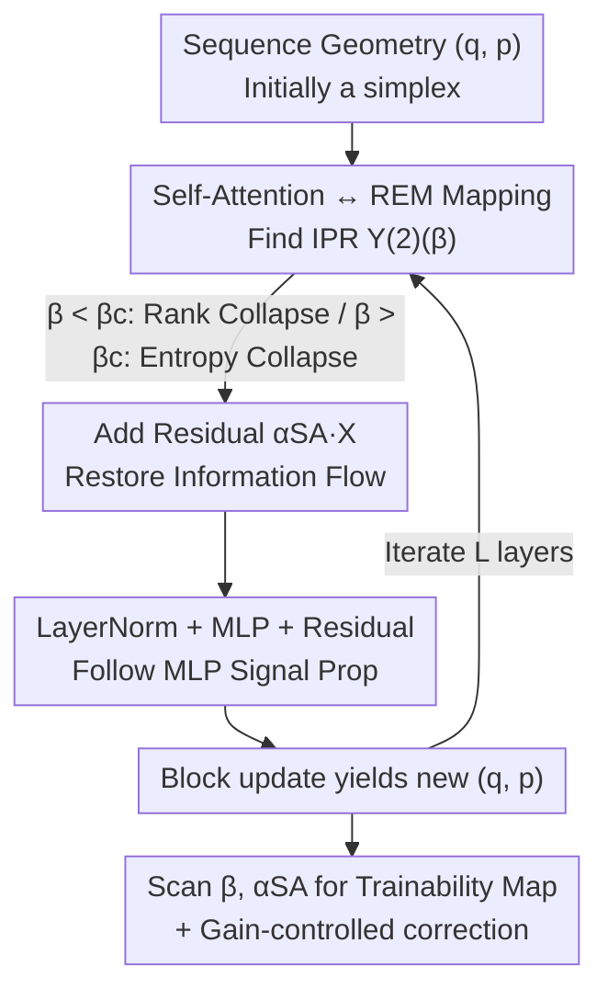

# Two Failure Modes of Deep Transformers and How to Avoid Them: A Unified Theory of Signal Propagation at Initialisation

**Conference**: ICLR 2026  
**OpenReview**: [https://openreview.net/forum?id=utSqpxQHXq](https://openreview.net/forum?id=utSqpxQHXq)  
**Area**: Learning Theory / Transformer Signal Propagation  
**Keywords**: Initialization, Signal Propagation, Rank Collapse, Entropy Collapse, Random Energy Model

## TL;DR
This paper leverages the Random Energy Model (REM) from statistical physics to provide an asymptotically exact theory of signal propagation in deep Transformers at initialization. It unifies "rank collapse" and "entropy collapse" as a single phase transition controlled by the query/key initialization variance $\beta$. Based on this, it derives an algorithm to generate "trainability maps," guiding practitioners on selecting residual strength and initial weights to ensure trainability in deep models.

## Background & Motivation

**Background**: In fully connected networks (FCNs), signal propagation theory is well-established—by tracking the evolution of similarity between two inputs during forward propagation, researchers identified the optimal "edge of chaos" initialization. However, in Transformers, where fully connected and self-attention layers alternate, the key metric for information flow shifts from "similarity between two inputs" to "similarity between tokens within a single sequence." Self-attention introduces complications absent in FCNs.

**Limitations of Prior Work**: Self-attention suffers from two notorious initialization failure modes. **Rank collapse**: Attention maps all tokens to nearly identical representations, causing the output matrix to degrade to rank-one, erasing sequence information and inducing vanishing gradients; Dong et al. proved that pure attention networks collapse at a doubly exponential rate relative to depth. **Entropy collapse**: Queries focus on a tiny set of fixed tokens determined at initialization, resulting in extremely low Shannon entropy in the attention distribution and leading to training instability. Previous works either studied only one mode or utilized overly strong approximations—such as assuming uniform attention (Noci et al.) or using "annealing" approximations that take expectations of the softmax numerator and denominator separately (Cowsik et al.), the latter of which misses the critical behavior of entropy collapse triggered by large initial weights.

**Key Challenge**: There is a lack of a **quantitative and unified** description that explains the origins of both failure modes while providing precise initialization prescriptions "up to the constant level." The difficulty lies entirely in the self-attention layer, which involves highly non-linear softmax and normalization operations that are hard to treat exactly.

**Goal**: Establish a complete signal propagation theory for the Transformer block (including self-attention, LayerNorm, residual connections, and MLP) to answer: "Given an architecture, what initial weight scales and residual strengths ensure trainability?"

**Key Insight**: The authors observe that the mathematical structure of a single row of attention $A_{tt'}=e^{a_{tt'}}/\sum_\tau e^{a_{t\tau}}$ is **identical** to the Boltzmann distribution $p(s)=e^{-\beta E(s)}/Z$ in the Random Energy Model (REM) from statistical physics—both are exponentiated random parameters followed by normalization. Thus, self-attention in the infinite-sequence limit can be solved exactly as an REM.

**Core Idea**: By mapping self-attention to the REM and using large deviation tools from statistical physics, the authors derive a critical temperature $\beta_c$. $\beta < \beta_c$ corresponds to rank collapse, while $\beta > \beta_c$ corresponds to entropy collapse, unifying both failures into a single phase transition.

## Method

### Overall Architecture

The paper proposes a set of **analytical tools** rather than a new model: at initialization (where parameters are i.i.d. random), it tracks the evolution of geometric relationships between tokens in a sequence across depths to predict trainability.

The core approach compresses sequence geometry into two scalar order parameters: the mean squared norm $q=\mathbb{E}\langle q_{tt}\rangle$ and the mean overlap $p=\mathbb{E}\langle q_{ts}\rangle$ (where $q_{ts}=\frac1d X_t\cdot X_s$); the mean cosine similarity is $\rho=p/q$. A key observation is that at initialization, tokens approximately lie on the vertices of a high-dimensional simplex ($q_{tt}\approx 1,\ q_{ts}\approx 0$), and this simplex structure is **preserved layer-by-layer** in the infinite-sequence limit, with only the values of $(q,p)$ changing. By deriving how a Transformer block maps $(q,p)$ to $(q',p')$, one can iterate this mapping to track similarity across depth.

The block update chain is as follows: Self-Attention (with REM-solved updates) → Add Residual → LayerNorm → MLP → Add Residual → LayerNorm. By iterating this $L$ times and scanning different $\beta$ (query/key variance) and $\alpha_{SA}$ (attention residual strength), a trainability map is generated, identifying three regions: rank collapse, entropy collapse, and a "trainable blue zone" characterized by small initial weights and strong residuals.

### Key Designs

**1. Mapping Self-Attention to REM: Solving Softmax via Statistical Physics**

The difficulty lies in the strong non-linearity of softmax. Previous approaches either assumed uniform attention or took expectations of the numerator and denominator separately, both of which fail at large initial weights. The breakthrough here is recognizing that a row of attention weights $A_{tt'}=e^{a_{tt'}}/Z$ shares the same structure as the Boltzmann state probability $p(s)=e^{-\beta E(s)}/\mathrm{Tr}\,e^{-\beta E(s)}$ in the REM, where the denominator $Z(\beta)=\sum_\tau e^{a_{t\tau}}$ is the partition function. At initialization, attention scores $a_{tt'}=\frac1{\sqrt d}(W_QX_t)^\top(W_KX_{t'})$ are Gaussian with mean 0 and variance $\sigma_a^2$, corresponding to the random energies in REM. The difference is that attention scores are **correlated**: $\mathbb{E}[a_{ts}a_{\tau\sigma}]=\sigma_a^2 q_{t\tau}q_{s\sigma}$. This paper generalizes REM to account for this geometric correlation, making the critical temperature dependent on $(q,p)$.

This also leads to a **new initialization scaling law**: While MLP weight variances are $O(1/d)$ to keep pre-activations $O(1)$, the REM analogy suggests that self-attention score variance should scale as $O(\log T)$ ($T$ being sequence length) to match an REM with $N$ degrees of freedom and $O(e^N)$ partition terms. Since attention sums over $T$ tokens, scores should scale as $O(\sqrt{\log T})$, controlled by a constant "inverse temperature" $\beta$:

$$\sigma_Q^2=\sigma_K^2=\sigma_a/d,\qquad \sigma_a=\beta\sqrt{\log T}.$$

This scaling law for "infinite sequences" is an independent supplement to the infinite-width literature.

**2. Unifying Failures via Phase Transition: The Critical $\beta_c$ Boundary**

The unification relies on Result 1. Defining a critical initialization scale $\beta_c(q,p)\equiv\sqrt{\tfrac{2}{q(q-p)}}$, under the limit $d\to\infty,\ T\to\infty$, the update of mean cosine similarity by a single layer of self-attention is:

$$\Phi_S(\rho)=\frac{\rho}{(1-\rho)Y^{(2)}(\beta)+\rho}=\begin{cases}1,&\beta<\beta_c\\[4pt]\dfrac{\rho}{1-\beta^{-1}\sqrt{2(1-\rho)}},&\beta>\beta_c\end{cases}$$

Entropy collapse is diagnosed by the Inverse Participation Ratio (IPR) $Y^{(2)}_t=\sum_s A_{ts}^2$, which satisfies:

$$\lim_{T\to\infty}\mathbb{E}\,Y^{(2)}_t=Y^{(2)}(\beta)=\begin{cases}0,&\beta<\beta_c\\[2pt]1-\beta_c/\beta,&\beta>\beta_c\end{cases}$$

The physical meaning: when $\beta<\beta_c$, attention "spreads out," effectively averaging all tokens, causing cosine similarity to saturate to 1 and the output to degrade to rank-one—this is **rank collapse** (recoverable via residuals). When $\beta>\beta_c$, token diversity is maintained, but the non-zero IPR indicates attention is "localized" on a few tokens determined by initialization rather than learning—this is **entropy collapse**, and it **cannot be saved by residuals**. $\beta_c$ marks a sharp phase transition.

**3. Gradient Analysis: Explaining Vanishing Gradients at Small Initialization**

Result 2 provides the Frobenius norm of query/key weight gradients ($T\to\infty$):

$$\frac{T}{d^2\sqrt{\log T}}\,\mathbb{E}\Big\|\frac{\partial L}{\partial W_Q}\Big\|_F^2=C\beta\,\sigma_v^2\,q(q-p)\Big[(q-p)\big(Y^{(2)}-2Y^{(3)}\big)+p\,(Y^{(2)})^2\Big].$$

It reveals vanishing gradients in two cases: first, $q=p$ (uniform attention, all tokens mapped to the same point), recovering the conclusion of Noci et al.; second, even if tokens are diverse ($p\neq q$), if $\beta<\beta_c$, then $Y^{(2)}, Y^{(3)}\to 0$, and gradients still vanish. This creates a paradox: $\beta < \beta_c$ yields vanishing gradients, and $\beta > \beta_c$ trapped in entropy collapse. The resolution: Result 2 depends on the initial simplex geometry; residual connections inject non-zero gradients into embeddings during the **first backprop** (independent of $\beta$), breaking the simplex assumption and allowing training to proceed even if gradients technically vanish at exactly $t=0$.

**4. Complete Block Algorithm & Gain-Controlled Correction**

Combining self-attention results with LayerNorm and MLP yields the iterative block update (e.g., Post-Norm BERT in Algorithm 1). The order parameters evolve as $q_S=\sigma_v^2[p+(q-p)Y^{(2)}]$, $p_S=\sigma_v^2 p$; residuals add as $q\leftarrow q_S+q\,\alpha_{SA}^2,\ p\leftarrow p_S+p\,\alpha_{SA}^2$; MLPs follow standard FCN results; LayerNorm sets $p\leftarrow p/q,\ q\leftarrow 1$. Scanning $(\beta,\alpha_{SA})$ produces the trainability map. Three applications emerge: ① Predicting BERT similarity evolution; ② Proving Pre-LN is more stable against rank collapse than Post-LN; ③ Proposing **gain-controlled attention**—subtracting the sequence-wise mean from attention outputs—which, combined with LN, mitigates both collapse modes.

## Key Experimental Results

### Main Results
Theoretical predictions align closely with empirical measurements, correctly predicting the success or failure of a 60-layer BERT on TinyStories.

| Scenario | Theory vs. Empirical | Conclusion |
|----------|-------------|------|
| BERT mean cosine similarity evolution | Empirical points track theoretical curves | Large $\alpha_{SA}$ prevents saturation to 1 (prevents rank collapse). |
| 60-layer BERT test loss | Matches trainability map | Initializations in rank/entropy collapse zones fail; blue zone succeeds. |
| Query gradient Frobenius norm | Matches Result 2 scaling | Gradients vanish at $\beta < \tilde\beta_c$. |

### Ablation Study

| Configuration | Key Phenomenon | Explanation |
|------|---------|------|
| Single layer, scan $\beta$ | Small $\beta$ (blue): entropy spreads/learnable; large $\beta$ (red): entropy hits zero. | Two phases show distinct training behaviors; $\beta_c(\rho=0)=\sqrt 2$. |
| Pre-LN vs. Post-LN | Pre-LN $\langle\rho\rangle\to 1$ occurs much later. | Confirms Pre-LN is more stable. |
| Vanilla vs. Gain-controlled | Gain-controlled succeeds where vanilla fails. | Subtracting the mean mitigates rank collapse. |

## Highlights & Insights
- **REM analogy is the "Aha!" moment**: Mapping the difficult softmax to a well-understood model from statistical physics provides exact tools for phase transitions.
- **Failures are two sides of the same transition**: Rank and entropy collapse are unified onto a single phase map via $\beta_c$.
- **Actionable Prescription**: Trainability maps provide "Residual Strength × Weight Scale" regions, allowing practitioners to select hyperparameters without trial and error.
- **Gain-controlled attention**: A simple architectural modification (mean subtraction) effectively wards off both collapse modes.

## Limitations & Future Work
- The theory relies on **infinite sequence + infinite width** limits and initial simplex geometry. Finite-size corrections are needed.
- Primarily focused on **non-causal (encoder)** Transformers; causal models are only approximately handled.
- Analysis is strictly for **initialization**; once the simplex structure is destroyed by training, the conclusions may not directly extrapolate to late-stage training.
- Gain-controlled attention requires larger-scale verification beyond the 30-layer preliminary tests.

## Related Work & Insights
- **vs. Noci et al. (2022)**: They assumed the model is always in the rank-collapse phase (uniform attention), missing entropy collapse entirely. This paper unifies them.
- **vs. Cowsik et al. (2024)**: Their "annealing" approximation fails to capture large deviation behaviors (entropy collapse) at large initial weights.
- **vs. Pre-LN/Post-LN literature**: This framework confirms that Pre-LN significantly delays rank collapse and demonstrates that LayerNorm is vital for preventing entropy collapse.

## Rating
- Novelty: ⭐⭐⭐⭐⭐ REM mapping + $O(\sqrt{\log T})$ scaling is a fresh perspective.
- Experimental Thoroughness: ⭐⭐⭐⭐ Solid matching for BERT/TinyStories and gradient scaling.
- Writing Quality: ⭐⭐⭐⭐⭐ Clear transition from physical intuition to mathematical derivation.
- Value: ⭐⭐⭐⭐⭐ Provides "constant-level" prescriptions for deep Transformer initialization.

<!-- RELATED:START -->

## Related Papers

- [\[ICLR 2026\] An evolutionary perspective on modes of learning in Transformers](an_evolutionary_perspective_on_modes_of_learning_in_transformers.md)
- [\[ICLR 2026\] How to Square Tensor Networks and Circuits Without Squaring Them](how_to_square_tensor_networks_and_circuits_without_squaring_them.md)
- [\[ICLR 2026\] UniCon: Unified Framework for Efficient Contrastive Alignment via Kernels](unicon_unified_framework_for_efficient_contrastive_alignment_via_kernels.md)
- [\[ICLR 2026\] On the Computational Limits of AI4S-RL: A Unified $\varepsilon$-$N$ Analysis](on_the_computational_limits_of_ai4s-rl_a_unified_varepsilon-n_analysis.md)
- [\[ICLR 2026\] Critical Attention Scaling in Long-Context Transformers](critical_attention_scaling_in_long-context_transformers.md)

<!-- RELATED:END -->
