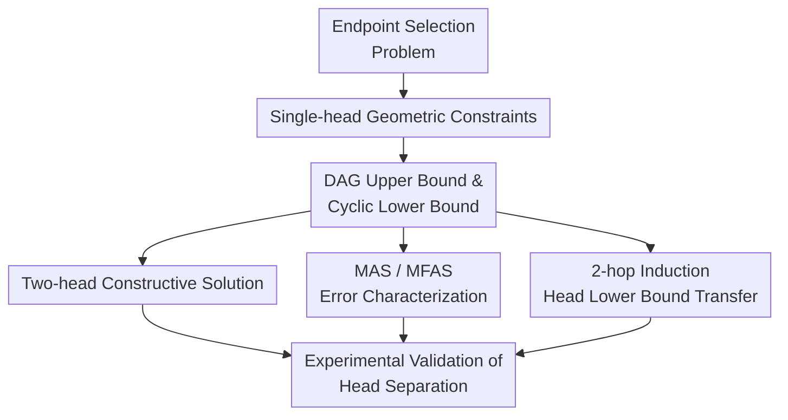

# Two (narrow) heads are better than (an arbitrarily wide) one

**Conference**: ICLR2026  
**OpenReview**: [https://openreview.net/forum?id=RRmPbbZsvl](https://openreview.net/forum?id=RRmPbbZsvl)  
**论文**: OpenReview  
**Code**: supplementary material  
**Area**: Learning Theory / Transformer Expressivity  
**Keywords**: Transformer theory, multi-head attention, expressivity lower bounds, Endpoint Selection Problem, induction heads  

## TL;DR
Using the Endpoint Selection Problem, this paper proves that a single-head attention-only Transformer of arbitrary width and precision cannot perform endpoint selection on cyclic directed graphs, whereas two narrow heads can solve it with zero error on all directed graphs, providing a clear separation in the expressivity of multi-head attention.

## Background & Motivation
**Background**: The success of Transformers largely stems from the attention mechanism, particularly multi-head attention, which handles tasks like selection, copying, routing, and information combination in large models. However, the scale of full LLMs, their training data, and optimization trajectories are too complex to directly prove why a specific real-world model possesses certain capabilities. Therefore, theoretical research often scales models down to one or two attention-only layers with few heads and uses algorithmic or graph tasks to characterize the boundaries of different architectures.

**Limitations of Prior Work**: Existing lower bounds often depend on joint constraints of width, precision, or the number of heads (e.g., a task is unsolvable if $H(d+1)p$ is less than a certain value). While valuable, these conclusions do not answer the sharper question: if a single attention head can be infinitely wide and numerically precise, does it still have fundamental weaknesses? If so, multi-head attention is not just a simple increase in parameters but provides structural computational power.

**Key Challenge**: Single-head attention can only form one softmax-weighted average at a query position. While it can blend multiple tokens into a single context vector, all selection conditions must be satisfied simultaneously through the same geometric direction and the same convex combination. For selection tasks on directed graphs with cycles, this single convex combination encounters cyclic constraints: traversing a cycle requires the model to maintain consistent endpoint preferences while flipping selection directions based on the selector, which is geometrically impossible to satisfy simultaneously.

**Goal**: The authors aim to construct a task simple enough to expose differences in attention head expressivity. This task should prove the unconditional impossibility for a single head, demonstrate the constructive solvability for two heads, and ideally connect to broader Transformer reasoning phenomena like induction heads and graph traversal.

**Key Insight**: The paper proposes the Endpoint Selection Problem (ESP): given a directed edge $(u,v)$, a selector token $1$ or $2$, and a fixed query token `#`, the model must output the endpoint specified by the selector. Although it appears to be a simple selection between two tokens, since edges come from a directed graph where all edges share the same token embeddings and attention parameters, the cycle structure of the graph converts local selection constraints into global contradictions.

**Core Idea**: Use ESP to transform "one convex combination from one head" into a half-space satisfiability problem on graphs, proving it unsolvable when cycles exist. Then, use two heads to align with the two endpoint positions separately, showing that adding a single narrow head bypasses the global geometric bottleneck of a single head.

## Method
### Overall Architecture
The method of this paper is not a new training algorithm but the construction of a theoretical testbed around which upper/lower bounds and experimental validations are established. The roadmap is: define ESP and attention-only models; prove that a single head is solvable on DAGs but unsolvable on any cyclic graph; then construct a two-head model to solve all directed graphs; finally, relate the optimal single-head error to the Maximum Acyclic Subgraph and observe via training experiments whether optimizers can find theoretically permitted solutions.

The input sequence for ESP is fixed as $(u, v, i, \#)$, where $(u,v)$ is a directed edge of graph $G=(V,E)$ and $i \in \{1,2\}$ is the selector. If $i=1$, the correct output is $u$; if $i=2$, the correct output is $v$. The input distribution is uniform over all edges and both selectors, totaling $2m$ samples. The model is a single-layer attention-only Transformer that looks only at the output at the final `#` position and selects the token corresponding to the maximum logit as the temperature approaches $0$.

The focus is on expressivity rather than generalization: does a set of parameters exist to solve all ESP samples on a given graph with zero error? This perspective separates training failure from the question of solution existence. Theoretical results prove: the structure of a DAG allows a single head to encode vertices in topological order, enabling consistent control of endpoint preferences by the selector; once a directed cycle exists, the inequalities required by the single head conflict along the cycle. Two heads can focus on positions $1$ and $2$ respectively, allowing the selector to suppress the incorrect position and amplify the correct one, bypassing the single convex combination bottleneck.

### Key Designs
**1. ESP: Transforming Endpoint Selection into a Minimal Stress Test for Attention Expressivity**

The elegance of ESP lies in its minimal components. Inputs include only two vertices, a selector, and a fixed query; the output is one of the two vertices. Treating it as a simple index lookup misses the point; the fixed query token `#` severs the direct query-key alignment between the selector and the endpoint positions. The model must synthesize the "two endpoints of the edge" and the "meaning of the selector" into a single context vector through the same terminal query.

This design makes the task simple enough for proof while expressive enough regarding graph structure to distinguish between DAGs and cyclic graphs. For every edge $(u,v)$, the model must satisfy $(u,v,1,\#) \mapsto u$ and $(u,v,2,\#) \mapsto v$ simultaneously. When these edges form a directed cycle, endpoint preferences propagate along the cycle and eventually return to the start, creating a contradiction. ESP tests whether the same set of attention parameters can implement consistent conditional selection rules across the entire directed graph.

**2. Single-head Lower Bound: A Single Convex Combination Cannot Simultaneously Satisfy Half-space Constraints of a Cyclic Graph**

The context vector generated by single-head attention at the query position is essentially a softmax-weighted average of the input token embeddings. For an edge $(a,b)$, when the selector is $1$, the context vector must fall within the half-space for output $a$; when the selector is $2$, it must fall within the half-space for output $b$. If $x_a, x_b$ represent the output directions of the vertices, then correctly choosing $a$ is equivalent to the context vector $v$ satisfying $v \cdot (x_a-x_b) > 0$, and choosing $b$ requires $v \cdot (x_a-x_b) < 0$.

Ours abstracts these conditions into a set of inequalities. For the same edge, the selector token contributes one vector, and the weighted sum of non-selector tokens contributes another; the non-negative coefficients for these vectors come from softmax weights. For a 2-cycle $(a,b)$ and $(b,a)$, the four selection conditions require the same set of vectors to fall into conflicting half-spaces simultaneously. Lemma 1 proves this four-fold inequality is unsatisfiable; Lemma 2 generalizes the 2-cycle contradiction to directed cycles of any length by induction. Consequently, Theorem 2 provides the strongest conclusion: as long as a cycle exists in the graph, any single-layer single-head attention-only Transformer of arbitrary dimension and precision cannot solve ESP with zero error.

The strength of this lower bound is that it does not rely on "model narrowness" or "insufficient numerical precision." Even with infinite embedding dimensions, a single head still has only one attention distribution and one synthesized vector; this structural limitation remains. The "arbitrarily wide one" in the title does not refer to empirical training failure but to a geometric limitation that cannot be bypassed regardless of the width of the representation space.

**3. DAG Upper Bound and MAS Error: The Part a Single Head Can Accomplish is Equivalent to Extracting an Acyclic Subgraph**

A single head is not entirely powerless. For DAGs, the authors construct an $(n+1)$-dimensional embedding: each vertex is represented by a standard basis vector, vertices are numbered by topological order, and selectors $1$ and $2$ are designed as numerical slopes in opposite directions. Thus, when an input edge $(v_i,v_j)$ satisfies $i<j$, selector $1$ ensures the first endpoint wins, and selector $2$ ensures the second wins. The topological order of the DAG provides the single head with a globally consistent "direction," preventing local selections from cycling back to contradict themselves.

For general graphs, the authors show that if a graph contains an acyclic subgraph with $m'$ edges, the same construction allows the single head to be correct on all those edges while preserving at least half of the selector cases on the remaining edges. Thus, the error is at most $1/2 - m'/(2m)$. When $m'$ is the size of the Maximum Acyclic Subgraph (MAS), the optimal single-head error is exactly:

$$
\mathrm{err}_{1\text{-head}} = \frac{1}{2} - \frac{|\mathrm{MAS}|}{2m} = \frac{|\mathrm{MFAS}|}{2m}.
$$

This formula links Transformer expressivity with a classical graph optimization problem. Since MAS/MFAS is NP-hard and hard to approximate, an interesting corollary is obtained: not only is the single head unable to achieve zero error on cyclic graphs, but finding the optimal or approximately optimal single-head error rate inherits the hardness of combinatorial optimization.

**4. Two-head Construction: Two Narrow Heads Locking Positions Separately, Selector Deciding the Winner**

The two-head upper bound demonstrates the most intuitive separation: adding just one head solves ESP on any directed graph. In the construction, the attention matrices of the two heads allow the query `#` to read positional information from input positions $1$ and $2$, respectively. The selector token suppresses the incorrect position via a large negative value $-M$, such that when $i=1$, the weight of position $1$ exceeds position $2$, and vice versa for $i=2$. The value and output projections retain only vertex identities, assigning the final maximum logit to the selected endpoint.

This construction can be achieved with $O(n)$-dimensional standard bases or by embedding vertices on a 2D unit circle using a constant embedding dimension $d=5$ with $O(\log n)$ precision. The latter indicates that "two narrow heads" do not win through massive width but through the parallel structure of heads: two attention distributions can form two different perspectives that are summed and compared at the output. A single head has only one distribution and must process both endpoints and the selector within a single average; two heads can decouple position selection and are thus free from the inequality contradictions of cyclic structures.

**5. Transferring the Lower Bound to 2-hop Induction Heads: ESP is Not an Isolated Toy Task**

Ours embeds ESP into the 2-hop induction head problem. Intuitively, the ESP input $(a,b,i,\#)$ can be transformed into a sequence like $(1,a,2,b,\#,i,\#)$, where fixed tokens occupy certain positions while $a, b$, and selector $i$ remain the variables. Under this construction, the next-token prediction task is exactly equivalent to ESP: output $a$ when the selector is $1$ and $b$ when it is $2$.

Thus, the lower bound stating that a single head cannot solve cyclic ESP transfers to 2-hop induction heads: even without limits on dimension and precision, a single-layer single-head attention-only Transformer cannot complete this two-hop copying task. This result is significant because induction heads are core circuits in mechanistic interpretability and in-context learning research; ESP provides a more analyzable proxy task and demonstrates that the exposed limitations are not unique to artificial graph selection problems.

### Loss & Training
The theoretical part does not rely on a specific training loss but discusses parameter existence. The experimental part uses a decoder-only Transformer with causal self-attention and no feed-forward layers; it retains residual connections and layer normalization, tying input embeddings with output projections. Training is conducted using Adam. The authors do not limit hyper-parameters like embedding dimension, learning rate, batch size, or training iterations, as the goal is to observe if gradient optimization can find the theoretically possible solutions.

Datasets are generated from graphs: DAGs use transitive tournaments (vertices ordered $1,\dots,|V|$ with all edges $u<v$ added); cyclic graphs include graphs with varying MFAS sizes and complete digraphs. The evaluation metric is accuracy across all ESP sequences from the graph, checking if the model correctly outputs the specified endpoint for every edge and selector.

## Key Experimental Results

### Main Results
The experiments primarily verify whether the theoretical separation emerges during gradient training. The clearest comparison comes from transitive tournaments and complete digraphs: the former is a DAG, while the latter contains numerous directed cycles and bidirectional edges.

| Graph Type | Model | Theoretical Expectation | Experimental Observation | Conclusion |
|:---|:---|:---|:---|:---|
| Transitive tournament (DAG) | 1-head attention-only | Solvable with zero error | Most configs reach ~99%-100% | Single head is indeed sufficient for DAGs |
| Transitive tournament (DAG) | 2-head attention-only | Solvable with zero error | Most configs reach ~99%-100% | Two heads also solve DAGs stably |
| Complete digraph | 1-head attention-only | Unsolvable; optimal accuracy at least 75% | Best results often ~64.55%-72.40% | Optimizer struggles to reach theoretical optimal |
| Complete digraph | 2-head attention-only | Solvable with zero error | Most configs reach 100% | Two heads show clear advantage on cyclic graphs |

A notable detail is that the theoretical optimal for a single head on a complete digraph is not a random guess. A complete digraph has $m=n(n-1)$ edges, and a transitive orientation forms an MAS of $n(n-1)/2$ edges; thus, Theorem 1 gives an error of $1/4$ and an accuracy of at least $75\%$. However, trained single-head models often fall below this bound, suggesting a gap between the existence of an optimal single-head construction and the ability of gradient descent to find it.

### Ablation Study
Ours further compares performance across graph structures, head counts, and the inclusion of FFNs. This "ablation" is more an analysis of architecture vs. graph difficulty than standard module removal.

| Configuration | Key Metric | Description |
|:---|:---|:---|
| 1-head on DAG | Near or at 100% accuracy | Matches DAG upper bound; single head is not globally weak but restricted by cycles |
| 1-head on simple cyclic graphs | Near global optimal when $|\mathrm{MFAS}|=1$ | Simple cycles have less feedback; optimizer finds correct direction on MAS |
| 1-head on complete digraph | ~64.55%-72.40% best accuracy | Mass of cycles complicates global constraints; training fails to reach 75% theory limit |
| 2-head on complete digraph | 100% accuracy | One extra head is sufficient to break the single-head structural bottleneck |
| 1-head + bounded-width FFN | Matches 2-head attention-only with similar parameters | FFN provides non-linear expressivity, but this is beyond pure single-head attention capability |

### Key Findings
- Head count provides discrete computational resources rather than just a parameter gain. on complete digraphs, an arbitrarily wide single-head attention-only model remains unable to achieve zero error, while two narrow heads succeed.
- The distinction between DAGs and cyclic graphs is critical. A single head can leverage topological order to linearize edge directions; cycles prevent such global sorting, triggering geometric contradictions.
- Optimization difficulty differs from representation capability. Theoretically, a single head can reach 75% accuracy on a complete digraph, but actual training falls short, suggesting the optimal single-head solution is hard to find, echoing the NP-hardness of MAS/MFAS.
- FFNs change the narrative. A single-head model with an added bounded-width FFN can solve ESP on complete digraphs with comparable parameters, indicating the conclusions apply primarily to the pure attention expressivity boundary.

## Highlights & Insights
- The strongest point of this paper is that the lower bound does not depend on dimension or precision. Most Transformer lower bounds are weakened by the "what if I increase width?" argument; this paper proves a single head cannot pass the geometric contradiction of cyclic ESP regardless of width.
- ESP is an excellent "minimal counter-example." Unlike complex graph algorithms that hide difficulty in multi-step reasoning, it compresses difficulty into endpoint selection for four tokens, forcing the reader to recognize the structural limits of single-head attention.
- The MAS/MFAS connection adds depth. Ours does not just claim the single head fails; it precisely characterizes the maximum acyclic portion a single head can correctly process and links searching for optimal error to NP-hard graph optimization.
- The two-head construction is highly interpretable. Two heads aligning with two positions with a selector deciding the winner mirrors simplified分工 (division of labor) mechanisms in induction heads and copy circuits.
- The insight for mechanistic interpretability is that certain capabilities might not be attributable to "one very wide and strong head" but require multiple heads to form complementary geometric perspectives. Pruning or merging heads based solely on importance might underestimate these combinatorial structures.

## Limitations & Future Work
- The model setting is simplified. The theoretical core is a single-layer attention-only Transformer, excluding FFNs, residuals, layer norm, stacking, and complex positional encoding interactions. While experiments include some of these, the core proof remains an attention-only boundary.
- ESP is a synthetic task. While it captures the core structure of endpoint selection and two-hop induction, there remains a significant gap between it and real-world LLM reasoning, semantic composition, and task generalization.
- The two-head upper bound is a constructive existence proof, not a guarantee that training will always find it. Experiments show two heads easily learn ESP, but whether similar head division emerges stably in complex tasks requires further study.
- Single-head + FFN experiments remind us that Transformer expressivity has multiple sources. Future work could investigate finer-grained trade-offs between attention heads, FFN width, and layer count.
- The paper primarily discusses zero-error representation capability. Real-world models are concerned with OOD generalization, sample complexity, and training dynamics. The ESP framework could be extended to probabilistic edges, hypergraphs, multi-step traversal, or noisy selectors to see how these factors shift the head hierarchy.

## Related Work & Insights
- **vs Peng et al. 2024 (function composition lower bounds)**: Peng et al. provide lower bounds when the product of heads, dimension, and precision is insufficient; this paper provides an unconditional impossibility for a single head on cyclic ESP without limiting dimension or precision.
- **vs Sanford et al. (induction head lower bounds)**: Sanford et al. study scale requirements for one-layer Transformers to solve induction tasks; ours transfers a cleaner graph selection lower bound to the 2-hop induction head scenario.
- **vs Bhattamishra et al. (Index Lookup)**: In Index Lookup, models can use an index token to align directly with a position; ESP uses a fixed query token so that the selector cannot act as a simple query, revealing stronger limits of single-head conditional selection.
- **vs Wang et al. / Nichani et al. (graph/causal structures in small Transformers)**: These works show small models can learn paths or induction structures; this paper focuses on "boundary characterization," identifying where small models must fail and what structural units restore capability.
- **Future Inspiration**: Similar ESP-like "micro-tasks" could establish a finer hierarchy for Transformer architectures, e.g., identifying tasks solvable by $k$ heads or exploring provable trade-offs between depth and head count.

## Rating
- Novelty: ⭐⭐⭐⭐⭐ Beautifully designed极简 (minimalist) ESP task providing unconditional expressivity separation.
- Experimental Thoroughness: ⭐⭐⭐⭐ Adequate validation for a theory paper covering DAGs, complete digraphs, and FFNs; however, external task extrapolation is limited.
- Writing Quality: ⭐⭐⭐⭐ Clear main line and natural transitions; some dense derivations require familiarity with attention geometry.
- Value: ⭐⭐⭐⭐⭐ Provides a reusable analysis paradigm for Transformer theory and mechanistic interpretability.

<!-- RELATED:START -->

## Related Papers

- [\[ICLR 2026\] Better Bounds for the Distributed Experts Problem](better_bounds_for_the_distributed_experts_problem.md)
- [\[ICLR 2026\] Achieving Approximate Symmetry Is Exponentially Easier than Exact Symmetry](achieving_approximate_symmetry_is_exponentially_easier_than_exact_symmetry.md)
- [\[ICLR 2026\] Random Label Prediction Heads for Studying Memorization in Deep Neural Networks](random_label_prediction_heads_for_studying_memorization_in_deep_neural_networks.md)
- [\[ICLR 2026\] Learning the Inverse Temperature of Ising Models under Hard Constraints using One Sample](learning_the_inverse_temperature_of_ising_models_under_hard_constraints_using_on.md)
- [\[ICLR 2026\] On the Convergence of Two-Layer Kolmogorov-Arnold Networks with First-Layer Training](on_the_convergence_of_two-layer_kolmogorov-arnold_networks_with_first-layer_trai.md)

<!-- RELATED:END -->
