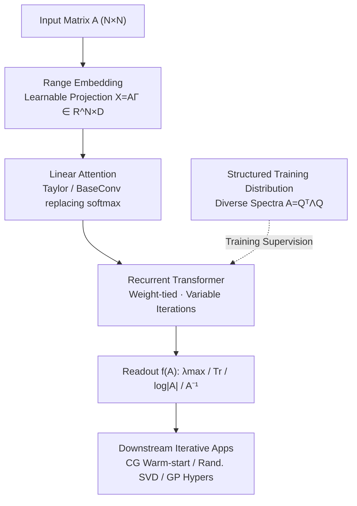

# Understanding and Relaxing the Limitations of Transformers for Linear Algebra

**Conference**: ICLR 2026  
**OpenReview**: [https://openreview.net/forum?id=GBkRMi3qjD](https://openreview.net/forum?id=GBkRMi3qjD)  
**Code**: Available (provided in paper, "release code here")  
**Area**: Learning Theory / Transformer Expressivity  
**Keywords**: Numerical Linear Algebra, Statistical Interpolation, Recurrent Transformer, Linear Attention, OOD Generalization

## TL;DR
This paper systematically reveals three acute failures of "using Transformers for matrix operations"—exploding computational overhead, catastrophic failure on out-of-distribution (OOD) matrices (even identity matrices), and the realization that models perform statistical interpolation rather than learning algorithms. Through four interventions—learnable projections, linear attention, recurrence, and structured training distributions—the authors propose RangeFormer, scaling Transformer matrix operations to $1000\times1000$ for the first time and successfully applying them to downstream iterative tasks like Gaussian Processes and randomized SVD.

## Background & Motivation

**Background**: Matrix operations (linear solving $A^{-1}b$, eigendecomposition, log-determinant $\log|A|$, trace estimation $\mathrm{Tr}(A)$, etc.) are foundational primitives for nearly all scientific computing pipelines, including Gaussian Processes, normalizing flows, and second-order optimizers. As Transformers transition from modality-specific architectures to a "Transformer-for-everything" paradigm, a natural question arises: can Transformers handle these core linear algebra primitives? Prior work is scarce (Charton 2022, Yang 2024, etc.), usually involving flattening a matrix $A$ into a sequence of real numbers or string tokens for Transformer mapping.

**Limitations of Prior Work**: The authors identify three alarming failure modes in this approach. First is the **explosion of computation and memory**—flattening results in a sequence length of $N^2$, leading a single Transformer block to require $O(N^4D+N^2D^2)$ compute and $O(N^4+N^2D)$ memory, causing OOM on 80GB A100 GPUs when $N>50$. Second is **poor OOD generalization**—models trained on standard Gaussian random matrices $A_{i,j}\sim\mathcal{N}(0,1)$ fail on "trivial" matrices like the identity $I$, diagonal, or Toeplitz matrices; even switching from $N=50$ training to $N=45$ testing can degrade error by nearly 10x. Third, and most fundamental, is that **models learn statistics rather than algorithms**.

**Key Challenge**: Why does this happen? The authors utilize random matrix theory for diagnosis. Symmetric Gaussian matrices have predictable eigenvalue distributions ($\mathbb{E}[\lambda_{\max}(A)]/\sqrt{N}\to 2\sigma$). A Transformer can achieve high scores on the same distribution by simply memorizing these statistical patterns—it learns "what a Gaussian spectrum looks like" rather than "how to compute eigenvalues." When input matrices have different spectral structures, memorization fails, and the model guesses blindly. In other words, the problem is not a lack of parameters, but rather that the training signal (single Gaussian distribution) concatenated with the architecture (lack of iterative bias) pushes the model toward **statistical interpolation** instead of **algorithmic discovery**.

**Goal**: To address these three sub-problems—reducing compute, improving OOD generalization, and injecting algorithmic bias—and verify if the improved model can be utilized in downstream applications requiring repeated iterative matrix operations.

**Key Insight**: The authors emphasize that the primary goal is "understanding the boundaries of Transformer capabilities in linear algebra," where methodological interventions serve that understanding. A key observation during diagnosis is that classical numerical linear algebra algorithms (Conjugate Gradient, Krylov subspace methods) are **iterative**, where difficulty dictates the number of iterations; conversely, flattened Transformers use a fixed forward pass. This contrast inspires a recurrent architecture.

**Core Idea**: By combining "learnable projections directly consuming the matrix range + linear attention + weight-tied recurrence + structured diverse spectral training distributions," the authors transform a "fundamentally broken" system into RangeFormer, which functions competently on real-world OOD matrices.

## Method

### Overall Architecture

The paper establishes a baseline before gradually introducing interventions. The baseline **NumFormer** (Numerical Transformer) flattens matrix $A$ into $\mathrm{vec}(A)$, where each scalar is embedded via a linear layer $W^{(I)}\in\mathbb{R}^{1\times D}$ to obtain $X\in\mathbb{R}^{N^2\times D}$. After passing through $L$ standard Transformer blocks (Eq. $X\leftarrow X+\mathrm{Attn}(X)$, $X\leftarrow X+\mathrm{MLP}(X)$), $Y$ is read out through a linear layer. Nuclear norm loss $\|Y-f(A)\|_*$ is used for $A^{-1}$, and $|Y-f(A)|$ for scalar targets. While an order of magnitude better than the string-based **STRFormer**, it remains limited by $O(N^4)$ memory.

RangeFormer overlays four interventions on NumFormer, transforming the data path from "flattened $N^2$ sequences" to "matrix rows as sequences and $D$ columns as embeddings," while injecting iterative bias and diverse training spectra. The following diagram illustrates the flow from input matrix to downstream applications:

The four interventions correspond to key designs; the structured training distribution provides supervision, while the recurrent structure acts as the carrier for iterative execution.

### Key Designs

**1. Range Embedding: Bypassing $N^2$ sequence length with learnable projections**

The fatal flaw of flattening is a sequence length of $N^2$, burdening attention layers with $O(N^4+N^2D)$ memory. This design adopts a learnable projection matrix $\Gamma\in\mathbb{R}^{N\times D}$, applying the matrix directly to it to obtain $X=A\Gamma\in\mathbb{R}^{N\times D}$. Rows are treated as the sequence dimension and columns as the embedding dimension. This reduces sequence length from $N^2$ back to $N$, and embedding complexity to $O(N^2+ND)$. It is termed "range" embedding because $A\Gamma$ probes the action of operator $A$ along a set of (learnable) directions, capturing its range information—more aligned with "operator" semantics than element-wise reading. This intervention yields slight performance gains even with fewer parameters.

**2. Linear Attention: Removing softmax non-linearity and further reducing complexity**

Even with shorter sequences, standard softmax attention is unfriendly to linear algebra primitives. Its scale normalization and non-linearity introduce approximation distortions to operations like matrix multiplication (as argued by Giannou 2023, Liu 2025), whereas matrix operations rely heavily on clean matrix multiplication. This design replaces softmax with linear attention—specifically Taylor attention (Arora 2023) or BaseConv (Liu 2025). This avoids softmax distortion and, by precluding the explicit construction of the full $S\times S$ attention matrix, compresses overall complexity to $O(ND^2)$ compute and $O(ND+D^2)$ memory. Combined with range embedding, it enables training on $N=1000$ matrices in less time than previous methods took for $N=50$.

**3. Recurrent Transformer: Hard-coding "Algorithmic Bias" into the architecture**

Diagnosis revealed that NumFormer error does not decrease monotonically across layers (Fig. 2), indicating it does not execute an iterative algorithm. This design **weight-ties** the layers in Eq. (1) into a recurrent Transformer. The same parameters are applied repeatedly, allowing the matrix to be processed for a variable number of iterations—matching the behavior of classical routines like Conjugate Gradient or randomized Lanczos quadrature. Post-tying, RangeFormer error **decreases monotonically** across layers on OOD Toeplitz $A^{-1}$ tasks, whereas NumFormer remains stagnant. Recurrence also provides a bonus: in randomized SVD applications, pushing noise $\Omega_0\sim\mathcal{N}(0,I)$ through layers to get $\Omega\sim NN_\theta(A)$ is formally similar to diffusion sampling.

**4. Structured Training Distribution: From statistical interpolation to generalizable algorithms**

The root of statistical interpolation lies in training solely on Gaussian random matrices. Appendix data show that spectra of different Gaussian matrices are nearly identical, effectively representing the same linear operator. This design constructs a data mixture of **structured matrices** and **matrices with diverse spectral decay**. The structured part uses the continuous Einsum parameterization from Potapczynski 2024 to sample Kronecker, low-rank, Tensor Train, Block Tensor Train, and Monarch structures (this sampling naturally avoids $I$, $0$, diagonal, and Toeplitz, leaving them for OOD testing). The spectral diversity part generates various spectra $\Lambda$ via functional forms and synthesizes $A=Q^\top\Lambda Q$ with random orthogonal bases $Q$. Even if matrix elements remain $\sim\mathcal{N}(0,1)$, the diversity of spectra forces the model to stop memorizing Gaussian patterns, increasing OOD performance by an order of magnitude.

### Loss & Training

A separate model is trained for each matrix operation. Loss functions are chosen by target type: absolute error $|Y-f(A)|$ for scalars ($\mathrm{Tr}$, $\log|A|$, $\lambda_{\max}$) and nuclear norm $\|Y-f(A)\|_*$ for matrices ($A^{-1}$). Training follows an LLM-style single-epoch approach—sampling new random matrices at every step. To solve size generalization issues (Fig. 4 shows fixed-size training fails on other sizes), **variable-sequence-length batching** is used, mixing sizes $\{N_1,\dots,N_R\}$ (e.g., $50/30/10$) so the model extrapolates to unseen sizes like $5/20/45$. For $N=1000$ scales (especially linear solving), **curriculum learning** is required: training starts with a checkpoint capable of solving $N=100$ before progressing to $N=1000$.

## Key Experimental Results

### Main Results

The evaluation uses two OOD sets: $\mathcal{S}$ containing canonical structures (Identity, Diagonal, Toeplitz) and $\mathcal{M}$ containing 100+ real matrices from Matrix Market (finite elements, structural engineering, fluids, power grids, etc.). The table below compares relative error magnitudes on Matrix Market.

| Task / Setting | STRFormer | NumFormer (Baseline) | RangeFormer | Key Finding |
|--------|------|------|----------|------|
| $\lambda_{\max},\mathrm{Tr},\log\|A\|,A^{-1}$ (MM, $N\le20$) | Frequent decoding failure | High error | ~1 order of magnitude lower | RangeFormer leads across the board |
| Max Scale | $\le50$ | $\le50$ (OOM if $>50$) | Up to $1000\times1000$ | Memory $O(N^4)\!\to\!O(ND+D^2)$ |
| Identity $I$ Least-squares | Failed decoding | Severe degradation | Significantly improved | Old methods fail even on trivial matrices |

### Ablation Study

Fig. 5 (left) shows the cumulative effect of stacking interventions on the relative error for $A^{-1}$ tasks on $20\times20$ Matrix Market data.

| Configuration | Relative Error (MM) Trend | Explanation |
|------|---------|------|
| Base (NumFormer + Gaussian) | Highest (≈0.9–1.0) | Statistical interpolation baseline |
| + Loop (Recurrence/Iterative Bias) | Decreasing | Injects algorithmic bias; error drops per layer |
| + Range (Range Embedding) | Further Decrease | Smaller parameter count with slight gain |
| + Attn (Linear Attention) | Further Decrease | Primary benefit in compute/memory |
| + Dist (Structured Training Dist.) | Lowest | Most significant OOD performance boost |

### Key Findings

- **Training Distribution (Dist) is the largest contributor**: Switching RangeFormer from Gaussian to structured data mixtures leads to massive OOD error drops across Identity, Toeplitz, and MM sets—confirming the "statistical interpolation" diagnosis.
- **Recurrence enables monotonic error reduction**: While NumFormer error fluctuates or stays flat across layers, RangeFormer error decreases monotonically, showing that recurrence drives iterative algorithmic behavior.
- **Size Robustness**: After training with multi-size batches ($50/30/10$), the model remains stable on unseen sizes like $5/20/45$, eliminating the fragility where $N=50\!\to\!45$ caused 10x error spikes.
- **Downstream Utility**: CG warm-started with $x_0=NN_\theta(A)$ converges significantly faster on bcsstk02; RFSVD ($D=16$) tracks true spectra better than standard RSVD; GP hyperparameters learned using RangeFormer yield a test RMSE of 0.87978 vs 0.87996 for Cholesky.

## Highlights & Insights

- **Elegant diagnosis of "Interpolation vs Discovery"**: The use of random matrix theory ($\mathbb{E}[\lambda_{\max}]/\sqrt N\to2\sigma$), masking probes (masking inputs to zero while observing outputs slide toward Gaussian means), and spectral prediction (applying Gaussian logic to Toeplitz) proves the model memorizes statistics rather than learning algorithms.
- **Range Embedding as the "aha" moment**: Moving from "reading numbers element-wise" to "probing operator range with $A\Gamma$" reduces sequence length $N^2 \to N$, which is the key to dropping memory from $O(N^4)$ to $O(ND+D^2)$ while fitting the semantic definition of a matrix as an operator.
- **Recurrence ≈ Iterative Methods ≈ Diffusion**: Analogizing weight-tied recurrence to Conjugate Gradient/Krylov iterations and comparing noise propagation in randomized SVD to diffusion sampling provides strong intuitive cross-field links.
- **Transferable Insight**: When sequence models fail OOD on structured problems, one should check if the training distribution allows the task to degenerate into memorizable statistics—a diagnostic paradigm applicable to in-context regression and symbolic regression.

## Limitations & Future Work

- **Not competing with classical solvers**: The goal is "exposing and relaxing Transformer limitations," not replacing LAPACK. Downstream experiments only prove the potential to complement classical methods.
- **Task-specific models**: Separate models are trained for $\lambda_{\max}$, $\mathrm{Tr}$, $\log|A|$, and $A^{-1}$; a "universal matrix Transformer" remains distant.
- **Scaling still requires curriculum learning**: $N=1000$ does not converge without $N=100$ warm-starting, suggesting ongoing fragility in scalability.
- **Future Directions**: Consolidating multiple operations into a single model, exploring adaptive iteration counts, and further expanding structured mixtures to cover more pathological spectra.

## Related Work & Insights

- **vs STRFormer (Charton 2022)**: They encode elements as string tokens; this paper shows string representations sacrifice precision and often fail decoding on OOD Matrix Market data.
- **vs NumFormer (Baseline)**: Replacing strings with linear embeddings and approximate loss is already an improvement over STRFormer, but still suffers from $O(N^4)$ complexity and interpolation issues.
- **vs In-context Regression (von Oswald 2023, Fu 2024)**: They argue Transformers naturally approximate gradient descent/Newton's method; this paper provides a counter-example where NumFormer does not naturally exhibit monotonic error reduction, necessitating explicit recurrence bias.
- **vs Recurrent Transformers (Giannou 2023, Yang 2024)**: While utilizing weight-tied recurrence, this paper combines it with range embedding, linear attention, and structured data specifically to address OOD generalization and scalability in numerical linear algebra.

## Rating
- Novelty: ⭐⭐⭐⭐⭐ First systematic diagnosis of "Transformer for LA = Statistical Interpolation" and first scaling to $1000\times1000$ for downstream pipelines.
- Experimental Thoroughness: ⭐⭐⭐⭐ Clever diagnostic designs and clear ablations, though more fine-grained absolute numerical tables would be beneficial.
- Writing Quality: ⭐⭐⭐⭐⭐ Clear "Diagnosis → Intervention → Downstream" narrative; convincing arguments with RMT and probes.
- Value: ⭐⭐⭐⭐⭐ Provides an honest characterization of Transformer boundaries and a viable path forward for Transformers as foundational primitives.

<!-- RELATED:START -->

## Related Papers

- [\[ICLR 2026\] Transformers Are Inherently Succinct](transformers_are_inherently_succinct.md)
- [\[ICML 2026\] Understanding the Parameter Space Geometry of Transformers Encoding Boolean Functions](../../ICML2026/learning_theory/understanding_the_parameter_space_geometry_of_transformers_encoding_boolean_func.md)
- [\[ICLR 2026\] Probability Distributions Computed by Autoregressive Transformers](probability_distributions_computed_by_autoregressive_transformers.md)
- [\[ICLR 2026\] Quantitative Bounds for Length Generalization in Transformers](quantitative_bounds_for_length_generalization_in_transformers.md)
- [\[ICLR 2026\] Efficient Turing Machine Simulation with Transformers](efficient_turing_machine_simulation_with_transformers.md)

<!-- RELATED:END -->
