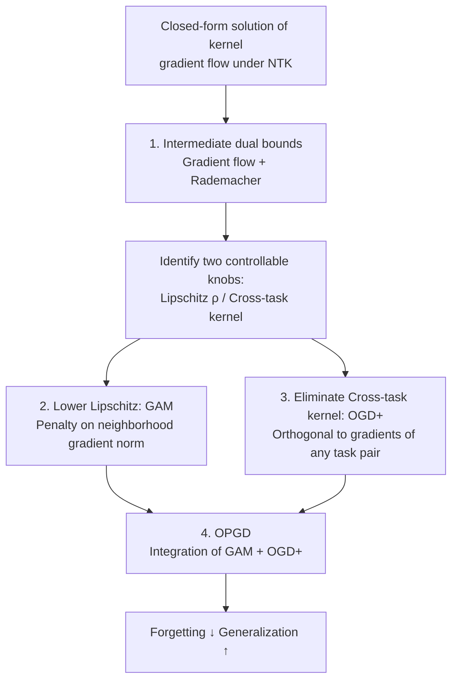

# Understanding the Dynamics of Forgetting and Generalization in Continual Learning via the Neural Tangent Kernel

**Conference**: ICLR 2026  
**OpenReview**: [https://openreview.net/forum?id=NE2yIxdo1w](https://openreview.net/forum?id=NE2yIxdo1w)  
**Code**: None  
**Area**: Continual Learning Theory / Learning Theory  
**Keywords**: Continual Learning, Neural Tangent Kernel (NTK), Catastrophic Forgetting, Generalization Bounds, Orthogonal Gradient Descent

## TL;DR
This paper characterizes the dynamic upper and lower bounds of forgetting and generalization error "during training" (rather than after convergence) under the NTK paradigm. It proves that **lowering the Lipschitz constant of the loss with respect to predictions** and **minimizing the cross-task kernel to zero** simultaneously mitigate forgetting and improve generalization. Based on this, OGD+ and OPGD algorithms are designed and validated on Permuted/Rotated MNIST and Split CIFAR-100.

## Background & Motivation

**Background**: Continual Learning (CL) requires maintaining performance across a sequence of tasks. The primary challenge is **catastrophic forgetting**, where learning new tasks overwrites knowledge from previous ones. While empirical methods (regularization, replay, gradient projection) are abundant, theoretical explanations have lagged.

**Limitations of Prior Work**: Existing CL theoretical analyses suffer from two main limitations. First, most studies focus on **linear models** and assume restricted data distributions (e.g., Gaussian), failing to cover general networks and non-stationary data streams. Second, the few NTK-based analyses (Bennani 2020, Doan 2021, Karakida & Akaho 2022) focus only on the **model after convergence**, failing to characterize how forgetting and generalization evolve alongside iterations during intermediate training stages.

**Key Challenge**: Establishing bounds for "forgetting" is inherently more difficult than for "generalization." Generalization bounds typically only require an **upper bound** on population loss. However, forgetting is defined as the difference between the "final model loss on an old task" and the "initial loss obtained when that task was first trained." This subtraction requires a **lower bound** of the population loss. Consequently, characterizing forgetting requires simultaneous **dual bounds (upper + lower)** for population loss, which remained unsolved in CL.

**Goal**: The paper addresses two sub-problems: (i) characterizing forgetting and generalization during **intermediate stages** (any iteration $t$) rather than just at convergence; (ii) obtaining simultaneous upper and lower bounds for the population loss of each task to derive forgetting bounds.

**Key Insight**: The authors work within the **NTK paradigm**. The training dynamics of infinitely wide networks reduce to a **kernel gradient flow**—an ordinary differential equation (ODE) regarding time $t$. The kernel $K_\tau$ remains constant throughout training and yields a closed-form solution. This transforms "intermediate model predictions" into analytic functions of $t$, allowing direct analysis of any iteration step. Combined with **Rademacher complexity**, this provides the necessary dual bounds.

**Core Idea**: Kernel gradient flow is used to characterize intermediate training dynamics, while Rademacher complexity provides the dual bounds for population loss. This allows forgetting/generalization bounds to be expressed with explicit dependence on the number of iterations $t_T$. Analysis identifies two controllable knobs—the **Lipschitz constant $\rho$ of the loss** and the **cross-task kernel $K_k(X_\tau, X_k)$**. Suppressing either simultaneously reduces forgetting and enhances generalization. These knobs are translated into the OGD+ and OPGD algorithms.

## Method

### Overall Architecture

This work follows a "theory-first, algorithm-secondary" structure: **derive intermediate bounds for forgetting and generalization under NTK (Theorem 1) → identify two controllable factors (Lipschitz constant, cross-task kernel) → provide a mechanism for each (GAM for Lipschitz, OGD+ for cross-task kernel) → combine both into the final OPGD algorithm**.

In the setting of $T$ sequential tasks, the model $f_\tau$ for task $\tau$ is initialized from the convergence parameters of the previous task ($\theta^0_{\tau+1}=\theta^*_\tau$). Using MSE loss, the training dynamics under the NTK paradigm reduce to kernel gradient flow:

$$\frac{d}{dt}f^t_\tau(x) = -\frac{1}{n_\tau}K_\tau(x,X_\tau)\big(f^t_\tau(X_\tau)-Y_\tau\big),$$

Since $K_\tau$ is fixed, this ODE has a closed-form solution. Forgetting $F_{t_T}$ and population generalization error $G_{t_T}$ are defined using **population loss**, making them applicable to any function class. Theorem 1 provides upper bounds with explicit dependence on $t_T$. Two key quantities are extracted from these bounds: $\rho$ and $K_k(X_\tau,X_k)$.

### Key Designs

**1. Intermediate Dual Bounds: Kernel Gradient Flow + Rademacher Complexity**

This design directly addresses the "Key Challenge." The authors define forgetting $F_{t_T}$ and generalization $G_{t_T}$ via population loss:

$$F_{t_T} = \frac{1}{T-1}\sum_{\tau=1}^{T-1}\Big(L_{D_\tau}(f^{t_T}_T) - L_{D_\tau}(f^*_\tau)\Big),\qquad G_{t_T} = \frac{1}{T}\sum_{\tau=1}^{T}L_{D_\tau}(f^{t_T}_T).$$

Under the NTK paradigm, the model prediction is $f^t_\tau(x)=\sum_{i=1}^{\tau-1}\tilde f^*_i(x)+\tilde f^t_\tau(x)$, where $\tilde f^t_\tau$ contains a time-varying factor $E_{\tau,t}=I-\exp(-\frac{t}{n_\tau}K_\tau(X_\tau,X_\tau))$. By incorporating **Rademacher complexity** to link empirical and population loss, the authors derive Theorem 1—the first bound for vanilla CL forgetting and generalization valid at **arbitrary intermediate iterations $t_T$**.

**2. Lowering Lipschitz Constant: Smoothing the Loss Surface via GAM**

Theorem 1 shows that terms involving $\rho$ (the Lipschitz constant of the loss relative to predictions) tighten the bound as they decrease. Lemma 1 proves that for a fixed $t_T$, smaller $\rho$ leads to smaller $F^{upper}_{t_T}$ and $G^{upper}_{t_T}$. Furthermore, if $\rho$ exceeds a threshold $\rho^*$, the bounds **monotonically increase** with $t_T$. To implement this, the authors utilize **GAM** (Gradient-norm Aware Minimization), which penalizes the maximum gradient norm within a parameter neighborhood:

$$L^{GAM}_{S_\tau}(\theta_\tau)=L_{S_\tau}(\theta_\tau)+\alpha_\tau b_\tau \max_{\theta'_\tau\in B(\theta_\tau,b_\tau)}\|\nabla_{\theta'_\tau}L_{S_\tau}(\theta'_\tau)\|^2,$$

This encourages **flat minima**, which is more robust than simple gradient norm penalties.

**3. Eliminating Cross-task Kernels: OGD+ for All-pair Orthogonality**

The cross-task kernel $K_k(X_\tau,X_k)$ measures interference between tasks. Ideally, this should be zero. Standard OGD projects the current gradient onto the orthogonal complement of the subspace spanned by gradients of all previous tasks. Lemma 2 shows OGD zeros out the kernel of **adjacent** tasks. 

The authors propose **OGD+**, redefining the gradient subspace as $E'_k:=\mathrm{span}\{\nabla_\theta f^*_k(x^m_l)\mid l\in[k],m\in[n_l]\}$. Lemma 3 proves that OGD+ zeros out the cross-task kernel for **any task pair** $\tau < k$. Unlike standard OGD which stores gradients permanently, OGD+ updates the stored gradients using all previous task samples on the current model and **discards** them after the next task.

**4. OPGD: Integrating Lipschitz Reduction and Kernel Elimination**

OGD+ enhances orthogonality but may harm plasticity. Lemma 4 proves that reducing $\rho$ on top of OGD+ strictly decreases $F^{upper+}_{t_T}$ and $G^{upper+}_{t_T}$. When $\rho$ is below a threshold $\rho'$, the generalization bound $G^{upper+}_{t_T}$ **monotonically decreases** with $t_T$, while the forgetting bound increases, revealing a fundamental trade-off. **OPGD (Orthogonal Penalized Gradient Descent)** combines both: gradients are first updated using the GAM loss and then subjected to the OGD+ orthogonal projection.

### Loss & Training
Training uses MSE loss. The single-step update for OPGD (Algorithm 1) involves: calculating the GAM gradient $g=(1-\alpha)g_1+\alpha g_2$, applying the orthogonal projection $g\leftarrow g-\sum_{v\in S_\tau}\mathrm{proj}_v(g)$, and updating parameters $\theta\leftarrow\theta-\eta g$. After a task, gradients on $S_\tau \cup M$ (current data + memory) are orthogonalized via Gram-Schmidt and stored, while the memory buffer $M$ is updated.

## Key Experimental Results

### Main Results
The method was evaluated on Permuted MNIST, Rotated MNIST, and Split CIFAR-100 (20 tasks). Metrics include Average Accuracy (ACC) and Backward Transfer (BWT).

| Method | PMNIST ACC | PMNIST BWT | RMNIST ACC | RMNIST BWT | CIFAR-100 ACC | CIFAR-100 BWT |
|------|-----------|-----------|-----------|-----------|---------------|---------------|
| SGD | 70.29 | −25.33 | 68.79 | −28.09 | 52.08 | −30.63 |
| GAM | 72.61 | −22.47 | 72.85 | −20.60 | 61.70 | −22.63 |
| OGD | 82.17 | −12.38 | 77.52 | −18.43 | 63.91 | −20.57 |
| OGD+ | 86.22 | −8.11 | 86.15 | −9.02 | 61.84 | −23.47 |
| **OPGD** | **86.27** | **−7.73** | **89.15** | **−3.69** | **68.17** | **−12.58** |

OPGD outperforms all baselines in ACC and BWT. While OGD+ is effective on MNIST, its performance drops slightly on CIFAR-100 due to over-orthogonality harming plasticity; OPGD mitigates this via Lipschitz reduction.

### Ablation Study
Incremental mechanism addition:

| Configuration | Mechanism | CIFAR-100 ACC | Note |
|------|------|---------------|------|
| SGD | None | 52.08 | Vanilla baseline |
| GAM | Lipschitz Only | 61.70 | Significant gain from smoothing |
| OGD | Adjacent Orthogonal | 63.91 | Basic kernel elimination |
| OGD+ | All-pair Orthogonal | 61.84 | Drops due to plasticity loss |
| OPGD | Combined | 68.17 | Optimal performance |

### Key Findings
- **Synergy of Two Knobs**: GAM and OGD provide complementary improvements. OPGD successfully combines them to achieve the best performance.
- **Over-orthogonality Penalty**: OGD+ provides large gains in simple distributions (MNIST) but can reduce the feasible gradient subspace in complex distributions (CIFAR-100), harming plasticity.
- **Visible Forgetting-Generalization Trade-off**: Experiments confirm that OPGD ACC increases with iterations while BWT decreases, matching theoretical predictions of the $t_T$ dependence.

## Highlights & Insights
- **Resolving the Dual-Bound Problem**: Using NTK closed-form solutions with Rademacher complexity provides a way to establish lower bounds for population loss, a necessary step for theoretical analysis of forgetting.
- **Theory-to-Algorithm Mapping**: The abstract parameters $\rho$ and $K$ map cleanly to existing algorithmic tools (GAM and OGD), creating a robust theoretical foundation for empirical practices.
- **OGD+ Storage Mechanism**: Modifying OGD to store gradients of the current model on all previous data (and discarding them periodically) enables all-pair task orthogonality without infinite memory accumulation.
- **Plasticity Warning**: The work explicitly identifies that excessive orthogonality can compressed the feasible gradient subspace, providing a caution for gradient-projection methods.

## Limitations & Future Work
- **NTK Assumptions**: The theory relies on the infinitely wide network assumption, constant kernels, and MSE loss. Extension to finite networks and cross-entropy loss remains unproven.
- **Benchmark Scale**: Experiments are limited to MNIST and Split CIFAR-100. Verification on larger-scale, blurry-boundary, or real-world CL scenarios is missing.
- **Persistence of Trade-offs**: The trade-off between generalization and forgetting is characterized but not eliminated. Adaptive selection of hyper-parameters $\alpha, b$ remains an empirical challenge.

## Related Work & Insights
- **vs Bennani et al. (2020)**: This work adds forgetting bounds and intermediate dynamic analysis, which Bennani lacked.
- **vs Doan et al. (2021)**: This work moves beyond discrete dataset definitions and convergence points to analyze population loss at any iteration $t$.
- **vs Standard OGD (Farajtabar 2020)**: OGD+ extends adjacent task orthogonality to any task pair, tightening the theoretical bound.

## Rating
- **Novelty**: ⭐⭐⭐⭐⭐ First intermediate forgetting/generalization dual bounds under NTK.
- **Experimental Thoroughness**: ⭐⭐⭐ Validates theory but benchmarks are relatively small.
- **Writing Quality**: ⭐⭐⭐⭐ Very clear progression from theory to controllable knobs to algorithms.
- **Value**: ⭐⭐⭐⭐ Provides a rigorous theoretical framework for gradient-projection CL methods.

## Related Papers

- [\[ICLR 2026\] Training-Free Determination of Network Width via Neural Tangent Kernel](training-free_determination_of_network_width_via_neural_tangent_kernel.md)
- [\[ICLR 2026\] Memory-Statistics Tradeoff in Continual Learning with Structural Regularization](memory-statistics_tradeoff_in_continual_learning_with_structural_regularization.md)
- [\[ICLR 2026\] Understanding In-Context Learning on Structured Manifolds: Bridging Attention to Kernel Methods](understanding_in-context_learning_on_structured_manifolds_bridging_attention_to_.md)
- [\[ICML 2026\] Catastrophic Forgetting is Low-Rank: A Function-Space Theory for Continual Adaptation](../../ICML2026/learning_theory/catastrophic_forgetting_is_low-rank_a_function-space_theory_for_continual_adapta.md)
- [\[ICLR 2026\] PAC-Bayes Bounds for Cumulative Loss in Continual Learning](pac-bayes_bounds_for_cumulative_loss_in_continual_learning.md)

<!-- RELATED:END -->

<!-- RELATED:START -->

## Related Papers

- [\[ICLR 2026\] Training-Free Determination of Network Width via Neural Tangent Kernel](training-free_determination_of_network_width_via_neural_tangent_kernel.md)
- [\[ICLR 2026\] Memory-Statistics Tradeoff in Continual Learning with Structural Regularization](memory-statistics_tradeoff_in_continual_learning_with_structural_regularization.md)
- [\[ICLR 2026\] Understanding In-Context Learning on Structured Manifolds: Bridging Attention to Kernel Methods](understanding_in-context_learning_on_structured_manifolds_bridging_attention_to_.md)
- [\[ICML 2026\] Catastrophic Forgetting is Low-Rank: A Function-Space Theory for Continual Adaptation](../../ICML2026/learning_theory/catastrophic_forgetting_is_low-rank_a_function-space_theory_for_continual_adapta.md)
- [\[ICLR 2026\] PAC-Bayes Bounds for Cumulative Loss in Continual Learning](pac-bayes_bounds_for_cumulative_loss_in_continual_learning.md)

<!-- RELATED:END -->
