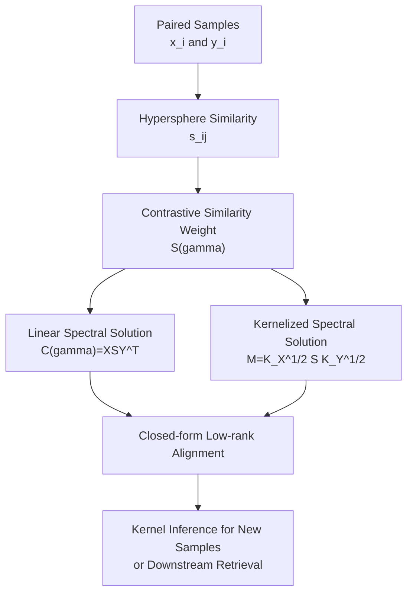

# UniCon: Unified Framework for Efficient Contrastive Alignment via Kernels

**Conference**: ICLR 2026  
**OpenReview**: [https://openreview.net/forum?id=BjL4CSNJug](https://openreview.net/forum?id=BjL4CSNJug)  
**Code**: https://github.com/suihangke/UniCon.git  
**Area**: Learning Theory / Contrastive Learning / Multimodal Alignment  
**Keywords**: Contrastive Learning, Kernel Methods, RKHS, Spectral Decomposition, Multimodal Alignment

## TL;DR
UniCon reformulates contrastive learning objectives, such as CLIP and InfoNCE, into a spectral problem driven by a contrastive similarity weight matrix $S(\gamma)$. By extending this to non-linear encoders via kernel methods, it replaces prolonged SGD training with closed-form spectral updates, delivering order-of-magnitude acceleration while maintaining or enhancing performance in multimodal retrieval.

## Background & Motivation
**Background**: Contrastive learning has become the core training paradigm for self-supervised representation learning and vision-language alignment. Methods like CLIP, InfoNCE, and Supervised Contrastive Learning pull positive pairs closer while pushing negative pairs apart, ensuring that images, text, or different augmented views reside in a shared representation space. In practical systems, this typically involves extracting features with deep encoders and iteratively optimizing contrastive losses on minibatches via backpropagation.

**Limitations of Prior Work**: While effective, this training approach is computationally expensive. Each gradient step of the contrastive loss utilizes only the local similarity structure of the current batch, requiring many epochs to converge to a stable alignment subspace. Existing theoretical work has pointed out connections between contrastive learning and spectral methods like SVD/PCA under specific linear settings, but these conclusions are difficult to extend to non-linear encoders, kernel spaces, or "many-to-many" alignment scenarios, such as one image corresponding to multiple text descriptions.

**Key Challenge**: On the surface, contrastive learning is a non-convex, iterative deep network training problem; however, its objective is to recover dominant paired structures across views or modalities. If this dominant structure can be explicitly expressed by a matrix operator, many SGD steps might simply be inefficiently tracking the same low-rank spectral subspace.

**Goal**: The authors aim to address three questions: first, whether a broad class of contrastive losses can be unified into a single analyzable objective; second, whether a global closed-form solution can be derived under linear encoders; and third, whether this spectral solution can be preserved for non-linear encoders or frozen pre-trained features using RKHS/kernel methods.

**Key Insight**: The paper starts from the gradient structure of the similarity matrix. Instead of designing a new contrastive loss, it constructs a contrastive similarity weight matrix $S(\gamma)$. This matrix records how positive and negative pairs should be weighted under the specific loss, thereby transforming "minimizing contrastive loss" into "maximizing a regularized trace objective."

**Core Idea**: Use $S(\gamma)$ to convert the contrastive learning objective into a spectral update problem, then lift the linear SVD solution to non-linear alignment in RKHS via kernel matrices $K_X$ and $K_Y$.

## Method
### Overall Architecture
The overall approach of UniCon is not to replace the semantic goals of CLIP/InfoNCE but to rewrite the solution method. Given paired samples $\{(x_i,y_i)\}_{i=1}^N$, the method first computes similarities $s_{ij}$ between two modalities or views on a unit hypersphere, then constructs $S(\gamma)$ based on the derivative of the specific contrastive loss. Subsequently, it performs low-rank SVD on $C(\gamma)=XS(\gamma)Y^\top$ for the linear case and spectral decomposition on $M=K_X^{1/2}S(\gamma)K_Y^{1/2}$ for the non-linear case. The resulting kernel coefficients are used for representation inference of both training and new samples.

The key to this pipeline is that while the loss function remains a familiar objective like CLIP/InfoNCE/triplet/SupCon, the optimization process no longer relies on long-term SGD, instead compressing the alignment problem into one or a few matrix spectral updates.

### Key Designs
**1. Contrastive Similarity Weight Matrix: Translating Loss Gradients into Spectrally Decomposable Structures**

The difficulty in standard contrastive learning lies in the diverse formulations of different losses: InfoNCE uses softmax temperature, triplet loss uses a margin, and SupCon involves multiple positives. UniCon first writes these objectives into a unified generalized contrastive loss, where $\phi, \psi, \nu, \epsilon_{ij}$ control the outer shape, similarity transformation, positive scaling, and pair participation, respectively. This unified form allows for a generic derivation of gradients.

Starting from this unified form, the paper defines $S(\gamma)$ to capture the gradient weights for each pair $(x_i, y_j)$. Intuitively, an element in $S(\gamma)$ represents the intensity with which a specific pair should drive the representation update under the current loss and similarity. The authors prove that the gradient of the contrastive loss with respect to encoder parameters is equivalent to the negative gradient of a trace objective: $\partial L/\partial \theta_k=-\partial \operatorname{tr}(F_{\theta_1}(X)S(\gamma)F_{\theta_2}(Y)^\top)/\partial \theta_k+\partial R/\partial \theta_k$. This step bridges iterative loss optimization and matrix-structure-driven problems.

**2. Linear Spectral Solution: Replacing Long SGD with Weighted Cross-modal Covariance**

Under linear encoders $f_{\theta_1}(x)=F_1x$ and $f_{\theta_2}(y)=F_2y$, the core of the trace objective becomes the matrix $C(\gamma)=XS(\gamma)Y^\top$. This can be interpreted as a weighted cross-modal covariance table where positive pairs, negatives, and specific loss derivatives are encoded into $S(\gamma)$. The optimization objective becomes maximizing $\operatorname{tr}(F_1C(\gamma)F_2^\top)$ while controlling the solution scale with $\rho \lVert F_1^\top F_2\rVert_F^2/2$.

The conclusion is direct: the optimal $F_1^\top F_2$ is determined by the top $r$ singular directions of $C(\gamma)$, i.e., $F_1^\top F_2=\frac{1}{\rho}\sum_{i=1}^r\sigma_i u_i v_i^\top$. This indicates that the small steps taken by SGD in contrastive loss are essentially tracking the dominant singular subspace of $C(\gamma)$. UniCon computes this subspace directly, achieving $100\%$ matching accuracy in approximately $0.02$ seconds in synthetic experiments, while SGD-CLIP requires hundreds of epochs to reach the same level.

**3. Kernelized RKHS Solution: Preserving Closed-form Spectral Structure for Non-linear Alignment**

Real-world vision-text relationships are often non-linear, especially when using frozen features from ResNet, SBERT, or CLIP backbones. UniCon handles this by placing the encoding functions into two RKHSs, expressed via the representer theorem as $f_{\theta_1}^{(a)}(\cdot)=\sum_i A_{ia}k_X(x_i,\cdot)$ and $f_{\theta_2}^{(a)}(\cdot)=\sum_j B_{ja}k_Y(y_j,\cdot)$. Representations on training samples then rely solely on Gram matrices $K_X, K_Y$ and coefficients $A, B$.

In this setup, the trace term becomes $\operatorname{tr}(A^\top K_XS(\gamma)K_YB)$, and the core spectral object is $M=K_X^{1/2}S(\gamma)K_Y^{1/2}$. Applying rank-$r$ SVD to $M$ yields the optimal low-rank alignment in the kernel space. Representation for new samples $x_*, y_*$ is inferred using kernel similarity vectors $\kappa_X(x_*), \kappa_Y(y_*)$ and the learned coefficients. The experiments use an angular kernel for its balance between speed and accuracy.

**4. Many-to-many and Batch Aggregation: Applying Theoretical Solutions to Real Retrieval Data**

Multimodal data is not always one-to-one; MSCOCO often has five captions per image, and SupCon involves multiple positives per category. UniCon introduces $P_X(i)$ and $P_Y(j)$ in its generalized loss to allow one anchor to correspond to multiple sets of positive samples. This allows $S(\gamma)$ to cover both one-to-one CLIP alignment and many-to-many retrieval.

To address scalability, the paper uses batch-level $S^{(b)}(\gamma)$ and aggregates closed-form solutions across multiple batches using quality weighting. For ill-conditioned Gram matrices, Tikhonov regularization ($K+\lambda I$) is applied, and randomized SVD or Nyström approximations are suggested to reduce memory and time complexity.

## Key Experimental Results

### Main Results
The paper validates UniCon through synthetic data, CIFAR-10 views, Flickr30k retrieval, and MSCOCO retrieval/zero-shot transfer. The primary conclusion is that it significantly reduces training time while maintaining or exceeding accuracy, particularly in frozen-feature retrieval scenarios.

| Setup | Method | Training Time | Key Metric | Conclusion |
|------|------|----------|----------|------|
| Linear Synthetic Matching | SGD-CLIP | 0.32 s / 400 epochs | 100% matching accuracy | Convergent but iterative |
| Linear Synthetic Matching | UniCon | 0.02 s | 100% matching accuracy | Reached in one spectral update |
| Non-linear Synthetic Matching | SGD-CLIP | 0.65 s / 500 epochs | 84% matching accuracy | Slower MLP backpropagation |
| Non-linear Synthetic Matching | UniCon | 0.04 s / 2 epochs | 86% matching accuracy | Faster and slightly higher |
| CIFAR-10 View Alignment | SGD-CLIP | 41.98 s | 62.21% linear probe accuracy | Slightly higher accuracy |
| CIFAR-10 View Alignment | UniCon | 23.38 s | 61.82% linear probe accuracy | Faster with comparable accuracy |

On Flickr30k, UniCon shows clear benefits with stronger frozen features. With RN-50+SBERT or CLIP ViT-B/32, UniCon improves both accuracy and speed significantly.

| Backbone | Method | Training Time | Avg R@1 | Avg R@10 | Observation |
|----------|------|----------|----------|-----------|----------|
| RN-18 + SBERT | SGD-CLIP | 45.6 s | 0.042 | 0.219 | Standard SGD is stable |
| RN-18 + SBERT | UniCon | 1.7 s | 0.054 | 0.253 | ~27× acceleration |
| RN-50 + SBERT | UniCon | 0.81 s | 0.161 | 0.515 | Extracts stronger structures |
| CLIP ViT-B/32 | SGD-CLIP | 45.3 s | 0.236 | 0.597 | Pre-trained features are strong |
| CLIP ViT-B/32 | UniCon | 0.76 s | 0.353 | 0.701 | ~60× acceleration with higher Acc |

### Ablation Study
The paper analyzes the method's properties through setting variations and data efficiency.

| Configuration | Key Metric | Description |
|------|----------|------|
| Linear UniCon | 0.02 s for 100% matching accuracy | Confirms $C(\gamma)$ spectral solution replaces long SGD |
| Non-linear UniCon | 0.04 s for 86% matching accuracy | Confirms kernelization handles non-linear latent transforms |
| MSCOCO RN-50+SBERT | 11.11 s, I→T R@10=0.388 | ~461× speedup vs SGD-CLIP (5121.72 s) |
| MSCOCO CLIP ViT-B/32 | 11.15 s, I→T R@10=0.685 | ~96× speedup vs SGD-CLIP |
| Only 200 MSCOCO Images | Average R@10=66.45% | Subspace can be recovered with minimal data |

### Key Findings
- **Training Efficiency**: UniCon reports 96× to 461× speedups on MSCOCO without sacrificing accuracy.
- **Spectral Discovery**: Linear and non-linear experiments validate that contrastive learning is approximately equivalent to low-rank spectral discovery.
- **Frozen Feature Synergy**: UniCon excels when the pre-trained features (like CLIP ViT-B/32) are already high-quality, as it only needs to recover the residual alignment subspace.
- **Subspace Transferability**: Subspaces learned on MSCOCO transfer effectively to Flickr30k, suggesting a robust underlying cross-modal structure.

## Highlights & Insights
- UniCon reinterprets "training a contrastive model" as "discovering a rank-$r$ alignment subspace." This explains why contrastive learning often learns structures similar to PCA/SVD.
- The matrix $S(\gamma)$ is a clever intermediate object that unifies various losses under a single matrix-weighting framework based on loss derivatives.
- The kernelized approach extends the theory beyond linear projections, allowing the use of the spectral solution for non-linear embeddings in RKHS.
- For practical multimodal systems, this suggests an efficient path: instead of full contrastive fine-tuning for frozen encoders, one can use spectral alignment as a fast adaptation or warm-start.

## Limitations & Future Work
- The theoretical optimality relies on a static input space. If encoders are training simultaneously, the spectral update is only a conditionally optimal solution for the current features.
- Scalability of the kernel matrix and $S(\gamma)$ can be a bottleneck. While batch aggregation and Nyström methods are proposed, they introduce estimation errors and new hyperparameters.
- Experiments focus on frozen features and retrieval. Validation on large-scale end-to-end pre-training with noisy data is needed to confirm stability.
- Since $S(\gamma)$ depends on current similarities, noisy positive/negative relationships in a batch could lead to the amplification of incorrect structures during spectral updates.

## Related Work & Insights
- **vs CLIP / InfoNCE**: UniCon retains the semantics of these objectives but replaces the iterative SGD optimization with a spectral update driven by $S(\gamma)$.
- **vs Nakada et al. (2023)**: Extends prior linear analysis to many-to-many alignment and non-linear RKHS settings.
- **vs Parameter-Efficient Fine-Tuning**: Unlike LoRA/adapters which still rely on backpropagation, UniCon provides an analytical alignment layer or warm-start module for rapid cross-modal calibration.

## Rating
- Novelty: ⭐⭐⭐⭐⭐ Unifying losses via $S(\gamma)$ and connecting them to kernel spectral solutions is theoretically elegant.
- Experimental Thoroughness: ⭐⭐⭐⭐ Covers various benchmarks and efficiency metrics, though massive-scale end-to-end pre-training is less explored.
- Writing Quality: ⭐⭐⭐⭐ Clear logic and dense but complete formulas.
- Value: ⭐⭐⭐⭐⭐ High value for efficiency-focused multimodal research and providing a spectral perspective on representation learning.

<!-- RELATED:START -->

## Related Papers

- [\[ICLR 2026\] "Noisier" Noise Contrastive Estimation is (Almost) Maximum Likelihood](noisier_noise_contrastive_estimation_is_almost_maximum_likelihood.md)
- [\[ICLR 2026\] On the Computational Limits of AI4S-RL: A Unified $\varepsilon$-$N$ Analysis](on_the_computational_limits_of_ai4s-rl_a_unified_varepsilon-n_analysis.md)
- [\[ICLR 2026\] Pretrain–Test Task Alignment Governs Generalization in In-Context Learning](pretraintest_task_alignment_governs_generalization_in_in-context_learning.md)
- [\[ICLR 2026\] Enabling Fine-Tuning of Direct Feedback Alignment via Feedback-Weight Matching](enabling_fine-tuning_of_direct_feedback_alignment_via_feedback-weight_matching.md)
- [\[ICLR 2026\] Efficient Turing Machine Simulation with Transformers](efficient_turing_machine_simulation_with_transformers.md)

<!-- RELATED:END -->
