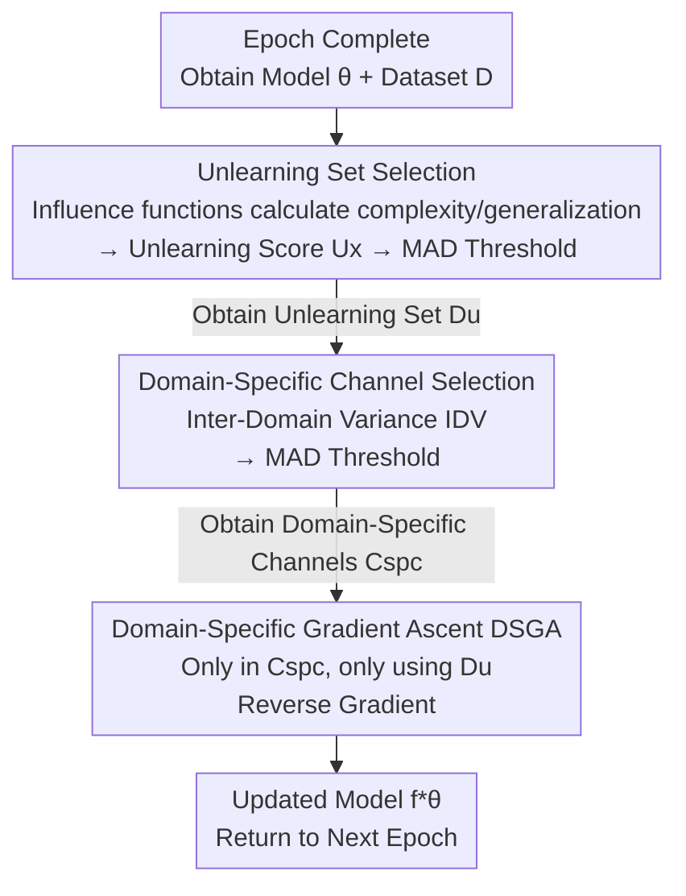

# Unlearning During Training: Domain-Specific Gradient Ascent for Domain Generalization

**Conference**: ICLR 2026  
**OpenReview**: [https://openreview.net/forum?id=9ufS5Jl0O0](https://openreview.net/forum?id=9ufS5Jl0O0)  
**Area**: Domain Generalization / Generalization Theory / Machine Unlearning  
**Keywords**: Domain Generalization, Machine Unlearning, Influence Function, Domain-Specific Channels, Gradient Ascent

## TL;DR
This paper proposes Identify and Unlearn (IU): a model-agnostic "in-training unlearning" module. After each epoch, influence functions are used to identify training samples that "increase model complexity while contributing little to generalization," and Inter-Domain Variance (IDV) is employed to precisely locate channels capturing domain-specific features. Domain-Specific Gradient Ascent (DSGA) is then performed on these channels using the identified samples to erase domain-specific dependencies while preserving domain-invariant features, achieving an average gain of up to 3.0% across 7 benchmarks and 15+ DG baselines.

## Background & Motivation

**Background**: Domain Generalization (DG) aims to train a model on multiple labeled source domains so that it can generalize to completely unseen target domains, avoiding the limitation of "requiring target domain data" in Domain Adaptation (DA/UDA). Mainstream approaches fall into three categories: data augmentation, representation learning (learning domain-invariant features), and training strategies (meta-learning, ensembles, curriculum learning, etc.).

**Limitations of Prior Work**: These methods essentially **add constraints to the training objective**, attempting to prevent the model from learning domain-specific features from the start. However, they lack a "post-hoc error correction" mechanism—once the model **already** captures certain domain-specific features during training, these methods have no means to delete them.

**Key Challenge**: Domain-specific dependencies are not generated all at once; they **emerge dynamically** at different stages of training. Focusing only on the training objective is equivalent to "defense without inspection," making it impossible to address biases that arise mid-training. This necessitates a **continuously running, adaptive correction** process.

**Goal**: Design a mechanism that can (i) identify training samples that are "introducing domain-specific bias," (ii) locate channels carrying domain-specific features, and (iii) erase the influence of these samples only on these specific channels while preserving domain-invariant features.

**Key Insight**: The authors leverage two existing principles—influence functions (Koh & Liang, 2017, capable of estimating the impact of a single sample on parameters/validation performance) and the principle that "models with lower complexity generalize better" (i.e., samples that make a model complex without helping generalization are likely feeding domain-specific bias). For the first time, Machine Unlearning (MU)—originally used to "delete data for privacy"—is adapted as a tool to **enhance DG generalization**.

**Core Idea**: Integrate "unlearning" into the training loop—after each epoch, select "high-complexity, low-generalization-contribution" samples and perform gradient ascent (inverse optimization, active unlearning) on them only within domain-specific channels to selectively "forget" domain-specific features.

## Method

### Overall Architecture

IU is a **post-hoc module** that can be appended to any DG baseline. After a normal training epoch, it performs a round of "identification + unlearning" before returning the updated model for the next epoch. A post-epoch intervention consists of three steps: first, use influence functions to calculate an unlearning score for each sample and apply a MAD threshold to identify the "unlearning set" $D_u$; second, use IDV to calculate the domain-specificity of each channel and apply a MAD threshold to identify the "domain-specific channel set" $C_{spc}$; finally, perform gradient ascent only on channels in $C_{spc}$ using samples in $D_u$ to obtain a new model $f^*_\theta$ with reduced domain-specific dependencies.

IU does not modify the baseline training objective or introduce new network structures; it is purely a "surgical intervention between training steps," making it naturally model-agnostic.

### Key Designs

**1. Unlearning Score: Identifying "Disturbing" Samples via Influence Functions**

The first step of "post-hoc correction" is knowing what to correct—identifying which samples are injecting domain-specific bias. The authors quantify this using two scores based on influence functions. The **complexity score** $C_x$ measures "how much parameters change if sample $x$ is removed," represented by the $\ell_2$ norm of the parameter change: $C_x = \lVert -H_\theta^{-1}\nabla_\theta L(x,\theta)\rVert_2$, where $H_\theta^{-1}$ is the inverse Hessian. Higher $C_x$ indicating a greater impact on model complexity. The **generalization score** $G_x$ measures the positive contribution of sample $x$ to the performance of the entire validation set $D_{val}$: $G_x = \sum_{z\in D_{val}} -\nabla_\theta L(z,\theta)^T H_\theta^{-1}\nabla_\theta L(x,\theta)$.

These are combined into a total unlearning score $U_x = (G_x)^\alpha / C_x$. A **lower** $U_x$ means the sample "hardly helps generalization but significantly increases complexity"—making it a candidate for unlearning. The exponent $\alpha$ mitigates Score Equivalence Bias, ensuring better discriminative power. The threshold is set using MAD (Median Absolute Deviation): $\tau_U = \tilde{U}_x - k\cdot\text{median}(|U_{x_i}-\tilde{U}_x|)$, where samples below $\tau_U$ enter $D_u$. MAD is chosen over Mean Absolute Deviation for its robustness to outliers ($k=2$ is fixed).

**2. Inter-Domain Variance (IDV): Precisely Distinguishing Domain-Specific Channels**

Identifying samples is insufficient—"total unlearning" would erase valuable domain-invariant features. Thus, it is necessary to lock onto **channels carrying only domain-specific features**. Existing methods use Aggregated Variance (AV), which blends activations of all source domains, assuming "domain-specific channels have high variance over all data." This assumption fails due to sensitivity to domain imbalance and its focus on **intra-domain** dispersion rather than **inter-domain** differences. The paper provides a counterexample: a texture channel sensitive to hair edges will have **high intra-domain variance** in photos, cartoons, oil paintings, and sketches alike; AV would misjudge it as domain-specific, even though its cross-domain behavior is consistent (domain-invariant).

IDV defines a channel as domain-specific if and only if its **intra-domain variance varies significantly across different source domains**. Formally, $\text{IDV}(c) = \text{Variance}\big(\{v_c^{(d)}\}_{d=1}^N\big)$, where $v_c^{(d)} = \frac{1}{N_d}\sum_i (x_{c}^{(d,i)} - \mu_c^{(d)})^2$ is the intra-domain activation variance of channel $c$ in domain $d$. It treats each domain as an independent unit, making it both domain-aware and domain-size agnostic, thus resisting domain imbalance. Channels exceeding the MAD threshold enter $C_{spc}$.

**3. Domain-Specific Gradient Ascent (DSGA): Reversing Gradients Only Where Necessary**

With $D_u$ and $C_{spc}$ identified, the final step is the actual "unlearning." DSGA performs **gradient ascent** only on parameters $\theta_c$ of domain-specific channels using samples in $D_u$: $\theta_c = \theta_c + \nabla_{\theta_c} L(x,\theta),\ x\in D_u,\ c\in C_{spc}$. The intuition is that actively increasing loss for these samples breaks the model's prediction confidence in domain-specific channels. Theoretical analysis splitting representations into domain-invariant $f_{inv}$ and domain-specific $f_{spc}$ proves that updating only $\theta_{spc}$ via gradient ascent increases conditional entropy $H(y\mid f_{spc})$, thereby reducing mutual information $D_{spc}=I(y;f_{spc})$ (model dependency on domain-specific features ↓) while keeping $D_{inv}$ stable.

### Loss & Training
IU does not modify the main training loss of the baseline; it only inserts the influence-function-based selection and DSGA update after each epoch. An optional enhancement involves using EMA (Exponential Moving Average) on unlearning scores, denoted as $\text{IUE}$, to smooth $U_x$ trajectories across epochs, reduce noise, and make unlearning set selection more stable.

## Key Experimental Results

### Main Results
Evaluated under the DomainBed protocol on 7 benchmarks across 15+ DG baselines. Representative average accuracy (%) results:

| Benchmark | ERM | ERM$_{IU}$ | ERM$_{IUE}$ | MMD | MMD$_{IUE}$ | EFDMix | EFDMix$_{IUE}$ |
|-----------|-----|-----------|------------|-----|------------|--------|---------------|
| PACS | 83.0 | 85.7 | 86.0 | 83.2 | 84.9 | 84.6 | 86.6 |
| OfficeHome | 68.2 | 69.8 | 70.0 | 67.7 | 70.4 | 71.2 | 73.1 |
| VLCS | 77.2 | 80.0 | 80.6 | 77.2 | 80.7 | 78.3 | 80.1 |
| Terra | 41.7 | 44.2 | 44.5 | 46.6 | 48.9 | 49.9 | 51.5 |
| DomainNet | 40.7 | 42.2 | 43.1 | 31.7 | 34.6 | 44.2 | 45.6 |
| Digits | 79.4 | 82.1 | 82.9 | 79.9 | 81.9 | 82.1 | 84.3 |
| NICO++ | 79.8 | 81.2 | 81.5 | 80.2 | 83.0 | 82.6 | 84.8 |

Observations: (1) IU improves all baselines regardless of their paradigm; (2) EMA (IUE) provides further stable gains; (3) even strong baselines like UDIM and VL2V see consistent improvements.

### Ablation Study
Breakdown of Unlearning Set Selection (USS) and Domain-Specific Channel Selection (DSCS):

| Config | PACS | OfficeHome | VLCS | Terra | DomainNet | Description |
|--------|------|-----------|------|-------|-----------|-------------|
| ERM | 83.0 | 68.2 | 77.2 | 41.7 | 40.7 | Baseline |
| ERM$_{USS}$ | 78.9 | 64.3 | 72.6 | 37.6 | 37.4 | USS only: Reversed gradient for all parameters of $D_u$ |
| ERM$_{DSCS}$ | 76.7 | 62.5 | 70.4 | 36.3 | 34.6 | DSCS only: Reversed gradient for all samples on $C_{spc}$ |
| ERM$_{IU}$ | 85.7 | 69.8 | 80.0 | 44.2 | 42.2 | Combined (Full IU) |

### Key Findings
- **Components are complementary**: USS alone (full parameter unlearning) erases domain-invariant knowledge, dropping PACS from 83.0 to 78.9. DSCS alone oversimplifies representations, dropping it to 76.7. Combined, they reach 85.7.
- **IDV signal is bimodal**: Most channels have low IDV (invariant), while a small tail has high IDV (specific), allowing MAD to cleanly separate them.
- **EMA enhances separability**: Smoothing scores across epochs raises the signal-to-noise ratio, making IUE superior to IU.

## Highlights & Insights
- **Repurposing "Machine Unlearning"**: Successfully transitions MU from a privacy tool to a generalization tool by selectively "forgetting" features that hinder OOD performance.
- **Elegant IDV definition**: The "variance of variances" avoids the pitfalls of AV by being domain-aware and size-agnostic, providing a robust pattern for identifying group-specific vs. group-common features.
- **Continuous In-training Intervention**: Performing unlearning per-epoch aligns with the dynamic emergence of domain-specific biases, making it more effective than a single post-training fix.

## Limitations & Future Work
- **Reliance on Influence Functions**: $C_x$ and $G_x$ require calculating $H_\theta^{-1}$, which is computationally expensive for large models and requires approximations.
- **Theoretical Assumptions**: Theorem 1 assumes clean decoupling of representations and parameters into invariant and specific sets, which is an idealization.
- **Hyperparameter Sensitivity**: Parameters like $\alpha$ and the MAD threshold $k$ must be set, though the main text uses fixed values.
- **Future Directions**: Refining IDV from the channel level to fine-grained feature subspaces or adapting unlearning frequency to the actual rhythm of bias emergence.

## Related Work & Insights
- **vs Representation Learning DG**: Methods like IRM or adversarial alignment attempt to **prevent** domain-specific learning. IU acts as a **post-hoc correction** that can be stacked on top of them.
- **vs Aggregated Variance (AV)**: AV is sensitive to domain imbalance and misidentifies invariant textures. IDV is domain-size agnostic and provides more accurate localization.
- **vs Traditional Machine Unlearning**: Traditional MU targets "forgetting specific data points for privacy"; IU targets "forgetting specific features for generalization," representing a fundamental shift in application.

## Rating
- Novelty: ⭐⭐⭐⭐⭐ Adapting machine unlearning for DG and the IDV definition are highly original.
- Experimental Thoroughness: ⭐⭐⭐⭐⭐ Comprehensive gains across 7 benchmarks and 15+ baselines.
- Writing Quality: ⭐⭐⭐⭐ Clear motivation and illustrative examples (e.g., the hair texture counterexample).
- Value: ⭐⭐⭐⭐ Model-agnostic and practical for squeezing gains out of strong baselines.

<!-- RELATED:START -->

## Related Papers

- [\[NeurIPS 2025\] How Many Domains Suffice for Domain Generalization? A Tight Characterization via the Domain Shattering Dimension](../../NeurIPS2025/learning_theory/how_many_domains_suffice_for_domain_generalization_a_tight_characterization_via_.md)
- [\[ICML 2026\] Semi-Supervised Noise Adaptation: Transferring Knowledge from Noise Domain](../../ICML2026/learning_theory/semi-supervised_noise_adaptation_transferring_knowledge_from_noise_domain.md)
- [\[ICLR 2026\] A Theoretical Analysis of Mamba's Training Dynamics: Filtering Relevant Features for Generalization in State Space Models](a_theoretical_analysis_of_mambas_training_dynamics_filtering_relevant_features_f.md)
- [\[ICLR 2026\] Memorizing Long-tail Data Can Help Generalization Through Composition](memorizing_long-tail_data_can_help_generalization_through_composition.md)
- [\[ICLR 2026\] From Predictors to Samplers via the Training Trajectory](from_predictors_to_samplers_via_the_training_trajectory.md)

<!-- RELATED:END -->
