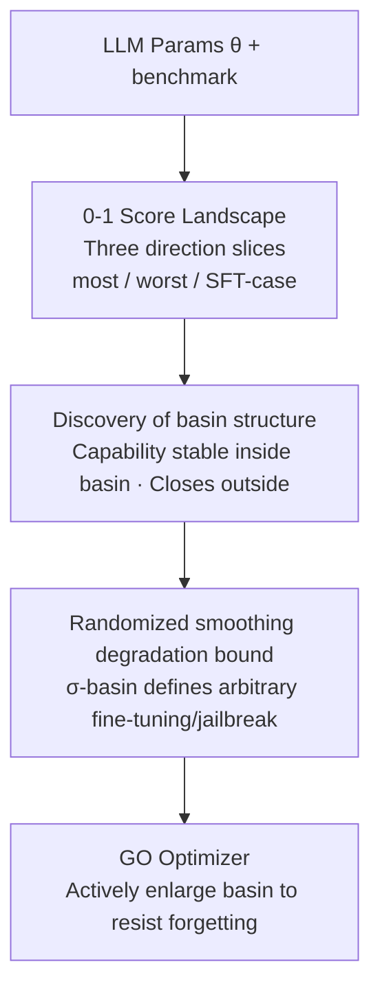

# Unveiling the Basin-like Loss Landscape in Large Language Models

**Conference**: ICLR 2026  
**OpenReview**: [https://openreview.net/forum?id=l4q2Zk2yfk](https://openreview.net/forum?id=l4q2Zk2yfk)  
**Area**: Learning Theory / Loss Landscape / LLM Safety  
**Keywords**: Loss Landscape, basin, randomized smoothing, catastrophic forgetting, alignment fragility

## TL;DR
This paper discovers that the loss landscape of LLMs presents "basins" as model scale increases—any perturbation of parameters within the basin preserves performance, while moving outside leads to a sudden collapse. Based on this, randomized smoothing is used to prove that performance degradation from arbitrary fine-tuning or jailbreaking is bounded by the basin radius. A GO optimizer is proposed to actively enlarge these basins to mitigate catastrophic forgetting.

## Background & Motivation

**Background**: LLMs generally follow the "Pre-training → Multi-stage Alignment (Safety, Math, Code)" paradigm. A persistent puzzle is the fragility of alignment: why does continued fine-tuning on seemingly benign data sometimes destroy previously aligned capabilities? Why can a few steps of fine-tuning on a dozen adversarial samples cause safety guardrails to collapse? Why are LLMs particularly vulnerable to jailbreaks in white-box settings?

**Limitations of Prior Work**: These three phenomena are usually explained separately (attributed to distribution shift, shallow alignment, or input-space attacks), lacking a unified geometric framework. Early works (Li et al. 2018) studied smooth loss landscapes regarding **likelihood**, which cannot directly characterize the discrete nature of "capability stability."

**Key Challenge**: Likelihood smoothness $\neq$ capability stability. While likelihood might change slowly in a certain direction, the "Correct/Incorrect" status on a benchmark might be a binary jump. To explain why capabilities collapse, one must examine the landscape defined by **task success rate (0-1 score)** rather than the likelihood surface.

**Goal**: (1) Identify a loss landscape that directly characterizes capability stability; (2) explain three types of vulnerabilities (benign fine-tuning, adversarial fine-tuning, and jailbreaking) within this landscape; (3) provide provable degradation bounds and design training methods to resist forgetting.

**Key Insight**: Define loss as the 0-1 flip value of "correct benchmark result/safety maintained" and observe one-dimensional slices along random directions (most-case), worst-case directions, and real fine-tuning directions (SFT-case). The authors observe that random directions are mostly flat, forming a "basin," while the worst-case direction is a cliff.

**Core Idea**: LLM capabilities are confined within **basins**—the larger the basin, the stronger the resistance to forgetting and jailbreaking. Benign fine-tuning stays within the basin and preserves capability, whereas adversarial fine-tuning precisely follows the worst-case direction to exit the basin. "Enlarging the basin" can simultaneously mitigate all three problems.

## Method

### Overall Architecture

This work is not just a "training pipeline" but a research chain from **observation to theory to optimization**: first, define the loss landscape using 0-1 benchmark scores and characterize the basin structure through slices in three directions (most/worst/SFT-case). Then, use randomized smoothing to translate the "basin radius $\sigma$" into degradation upper bounds for **arbitrary fine-tuning and jailbreaking**. Finally, following this bound, the GO optimizer is proposed to actively enlarge the basin during pre-training, empirically verifying that "Gaussian noise resistance = fine-tuning forgetting resistance."

Formally, for a language model $f_\theta$ with parameters $\theta\in\mathbb{R}^d$, the benchmark score functional on dataset $D$ is $S_{f,D}(\theta)=\mathbb{E}_{x\in D}[O(f_\theta(x))]$, where $O$ is an oracle judging the output as correct/safe = 1, otherwise 0. For visualization, a transformation $T$ (flip + min-max normalization) is applied so that lower "loss" is better and scores are comparable across tasks. A 1D slice along direction $\delta$ is $L(\alpha)=T\circ S_{f,D}(\theta+\alpha\delta)$.

### Key Designs

**1. Defining the loss landscape with 0-1 benchmark scores and slicing along three directions**

To address the limitation that "likelihood smoothness cannot characterize capability stability," the authors replace the smooth likelihood surface with success rates on generative benchmarks: MMLU for general knowledge, GSM8K for math, HumanEval for code, and AdvBench for safety. Each sample is scored 0 if correct/safe and 1 otherwise (standard 0-1 loss). Crucially, the high-dimensional landscape is sliced along **three types of directions**:

- **most-case (random direction)**: Taking $\delta\sim N(0,I)$. The authors found that different random directions yield nearly identical curves, making one random direction representative of the geometry of "most directions."
- **worst-case (worst direction)**: Solving $\delta=\arg\max_\delta L(\theta+\alpha\delta),\ \text{s.t.}\ \|\delta\|_2^2=\mathbb{E}[\|N(0,I)\|_2^2]$ using SGD and projecting the norm back to unit length at each step (Madry-style PGD). The norm is aligned with the most-case for fair comparison.
- **SFT-case (real fine-tuning direction)**: Taking $\delta=\frac{\theta_{sft}-\theta_0}{\|\theta_{sft}-\theta_0\|_2}\cdot\sqrt{\mathbb{E}[\|N(0,I)\|_2^2]}$, representing the displacement direction of actual fine-tuning, also normalized to the same norm.

The juxtaposition of these three perspectives forms the observational backbone: the most-case shows if most perturbations are safe, the worst-case shows how bad things can get, and the SFT-case shows where real fine-tuning falls between the two.

**2. Basin phenomenon: random directions are basins, worst-case directions are cliffs, and SFT is in between**

This is the core discovery. In the most-case landscape, every capability presents a **basin**: performance remains literally constant inside the basin (Table 1 shows benchmark values do not change), but once the boundary is crossed, all capabilities crash. The basin has a clear structure: pre-training first forms a broad "base capability basin," and subsequent alignment stages "dig" narrower "specialized capability basins" (safety/math/code) near it. Basin size is strongly correlated with models and data—the safety basin for Llama/Qwen is almost as large as the base basin, while the code basin is smaller (meaning code capability is more easily forgotten during benign fine-tuning). Crucially, **basins emerge with scale**: the landscape of Qwen-0.5B is continuous and smooth like small models, but basins become more pronounced as models grow. Using Clopper-Pearson intervals for hypothesis testing, the authors assert with 99% confidence for Qwen2.5-7B on AdvBench that more than 90% of directions constitute strict basins at a perturbation scale of $\sigma=0.01$.

In contrast, the worst-case landscape is always a **cliff**: moving just a small step along the worst-case direction results in immediate total loss of capability. This echoes the classic explanation for adversarial examples—in high-dimensional spaces, a direction that causes a sharp drop in performance almost certainly exists. As LLM parameter dimensions are much larger than early small models, the worst-case direction is more destructive. SFT-case falls between these extremes: benign fine-tuning (using data similar to the original training distribution) has a landscape approximating the most-case basin, preserving capability; normal fine-tuning with a distribution gap has a narrower and steeper landscape, leading to faster forgetting; adversarial fine-tuning follows the worst-case direction almost exactly, causing the safety guardrails to collapse instantly while other capabilities (math/code) are largely preserved.

**3. Degradation bounds from randomized smoothing: basin radius defines arbitrary fine-tuning and jailbreaking**

Observation requires a unified guarantee independent of datasets/hyperparameters. The authors soften the basin into a $\sigma$-basin definition: if performance remains largely unchanged after adding Gaussian noise,

$$S_{f,D}(\theta)-\mathbb{E}_{\epsilon\sim N(0,\sigma^2 I)}[S_{f,D}(\theta+\epsilon)]\le\tau,$$

then the model has a $\sigma$-basin on that benchmark ($\tau\to0$ implies a strict basin). The key move is to **transfer randomized smoothing from input space to parameter space**: since noise within the basin doesn't change performance, the smoothed model $\mathbb{E}_\epsilon[S_{f,D}(\theta+\epsilon)]$ is used as a proxy. Randomized smoothing theory guarantees this smoothed functional is at most $\tfrac{1}{\sqrt{2\pi}\sigma}$-Lipschitz (weak theorem). Thus, degradation from any fine-tuning is bounded by the displacement norm:

$$\mathbb{E}_\epsilon[S_{f,D}(\theta_{sft}+\epsilon)]\ge\mathbb{E}_\epsilon[S_{f,D}(\theta_0+\epsilon)]-\frac{1}{\sqrt{2\pi}\sigma}\|\theta_{sft}-\theta_0\|_2.$$

A tighter strong theorem using pointwise Lipschitz gives:

$$\mathbb{E}_\epsilon[S(\theta_{sft}+\epsilon)]\ge\Phi\!\Big(\Phi^{-1}\big(\mathbb{E}_\epsilon[S(\theta_0+\epsilon)]\big)-\tfrac{\|\theta_{sft}-\theta_0\|_2}{\sigma}\Big),$$

where $\Phi$ is the standard normal CDF. Conclusions: higher smoothed performance $p_A$ and larger basin radius $\sigma$ provide stronger guarantees for post-fine-tuning performance. The authors also **extend this to input space to explain jailbreaking**: as the embedding layer $W$ is full column rank, weight perturbation $\delta W\,x$ and input perturbation $W\,\delta x$ can produce the same activation. Robustness to weight perturbation implies local robustness to input perturbation (token replacement). Theorem 4.5 provides a degradation bound after replacing $k$ tokens—this explains why replacing tokens with tiny $\ell_2$ distances (e.g., BPE subwords with/without leading spaces) doesn't change the output, though it only covers "near-manifold" semantic-preserving replacements.

**4. GO Optimizer: Actively enlarging the basin to suppress catastrophic forgetting**

Theory suggests "larger basins provide stronger guarantees." Can they be actively enlarged? The authors decompose total SFT degradation into two terms: the term bounded by the strong theorem and the "vulnerability to Gaussian noise" term; both approach zero as $\mathbb{E}_\epsilon[S(\theta_0+\epsilon)]\to1$. Therefore, optimizing for good performance under Gaussian noise suppresses both sources of degradation. GO (Gaussian-augmented Optimizer) modifies the training loss to the expected cross-entropy under parameter noise:

$$L_{train}(x,\theta)=-\mathbb{E}_{\epsilon\sim N(0,\sigma^2 I)}[\log p(x\,|\,\theta+\epsilon)].$$

Implementation: at each step, add $\epsilon\sim N(0,\sigma^2 I)$ to parameters, perform forward pass, compute loss, backpropagate, and update with a standard optimizer (e.g., Adam). Its core philosophy is to **directly optimize average-case (Gaussian) robustness**, differing from SAM (worst-case sharpness) or Continuous Dropout (implicit proxy). The central premise is that "Gaussian degradation is an empirical upper bound for benign fine-tuning degradation"; thus, suppressing Gaussian degradation directly addresses capability preservation.

## Key Experimental Results

### Main Results: Landscape shapes along three directions (Qwen2.5-7B, etc.)

| Perspective | Direction Construction | Observed Geometry | Meaning |
|------|----------|--------------|------|
| most-case | $\delta\sim N(0,I)$ | Basin: stable performance inside, crash outside | Most perturbations are safe; basins emerge with scale |
| worst-case | PGD for worst-case (norm aligned) | Cliff: capability zeroed out with a small step | Destructive directions always exist in high dimensions |
| SFT-benign | Qwen2.5-7B → Official 1M displacement | Approximates most-case basin | Capability preserved in basin |
| SFT-normal | Alpaca 1 epoch | Narrower and steeper | Distribution gap accelerates forgetting |
| SFT-adversarial | AdvBench 10 steps only | Safety collapse, other capabilities preserved | Follows worst-case; learns "Sure, here is" |

Model/Capability dependence of basin size (Qualitative):

| Model | Safety Basin | Code Basin | Interpretation |
|------|----------|----------|------|
| Llama-3.1-8B | Large (≈Base) | Small | Code more easily forgotten than safety |
| Qwen-2.5-7B | Large | Small | Same as above |
| Mistral-8B | Significantly smaller | — | Higher risk of losing safety on new data |

### Ablation Study: GO vs. other landscape-aware optimizers

Using NanoGPT to pre-train GPT2-127M on OpenWebText for 8× Chinchilla steps (GO $\sigma=0.01$), then fine-tuning on Alpaca:

| Optimizer | Mechanism | Basin / SFT Degradation |
|--------|------|--------------------------|
| AdamW | Standard | Smallest basin, highest SFT degradation |
| SAM | Worst-case sharpness | Limited improvement |
| Continuous Dropout | Implicit proxy | Limited improvement |
| **GO (Ours)** | Explicit Avg-case Gaussian Robustness | **Largest basin, lowest SFT degradation** |

### Key Findings
- **"Gaussian noise resistance = fine-tuning forgetting resistance" has a strict correspondence**: lowering degradation under Gaussian noise translates directly into smaller forgetting during downstream fine-tuning.
- **Basins widen as training continues**: Basins are not static properties determined at initialization but emerge and widen during pre-training (Fig. 7), echoing the theory that SGD implicitly prefers flat minima.
- **Adversarial fine-tuning is directional**: It follows the worst-case direction almost perfectly, explaining why a few steps can specifically puncture safety while leaving other capabilities (math/code) unaffected.

## Highlights & Insights
- **Geometric unification of "alignment fragility"**: Benign fine-tuning (inside basin), adversarial fine-tuning (along worst-case), and jailbreaking (input perturbations equivalent to weight perturbations) are all explained via the most/worst-case landscape.
- **Parameter-space randomized smoothing**: While randomized smoothing usually certifies input robustness, here it provides a provable downstream meaning for "basin radius" across any fine-tuning.
- **Transferable trick**: GO is simply "adding Gaussian noise to parameters during forward passes," making it a plug-and-play addition for pre-training pipelines to maintain alignment.

## Limitations & Future Work
- **Small scale for GO**: Validation for GO was mainly on GPT2-127M; whether it scales to larger models remains to be seen.
- **Heuristic input space bound**: Theorem 4.5 only certifies near-manifold token replacements and does not cover all types of jailbreaking attacks.
- **Reliance on 0-1 metrics**: The basin phenomenon primarily appears on generative (0-1) benchmarks; landscapes remain smooth under likelihood-based metrics.
- **Slower early training**: Optimizing over a neighborhood makes GO slower than Adam in the early stages, though it catches up later due to over-parameterization.

## Related Work & Insights
- **vs. Li et al. 2018**: They visualized landscapes on small models; Ours focuses on LLMs, uses 0-1 scores, and identifies scale-emergent basins.
- **vs. SAM / Continuous Dropout**: SAM targets worst-case sharpness, while GO targets average-case Gaussian robustness, which is a tighter upper bound for benign fine-tuning degradation.
- **vs. Defense Methods**: While others provide specific defense layers, Ours provides a unified landscape-theoretical framework and suggests enlarging basins as an upstream solution.

## Rating
- Novelty: ⭐⭐⭐⭐⭐ Unifies basins, fragility, jailbreaking, and forgetting via randomized smoothing.
- Experimental Thoroughness: ⭐⭐⭐⭐ Slices for three models + hypothesis testing + GO verification, though GO scale is limited.
- Writing Quality: ⭐⭐⭐⭐⭐ Clear logic from observation to theory to optimization.
- Value: ⭐⭐⭐⭐⭐ Provides a provable geometric handle for understanding why alignment is fragile.

<!-- RELATED:START -->

## Related Papers

- [\[ICLR 2026\] Automata Learning and Identification of the Support of Language Models](automata_learning_and_identification_of_the_support_of_language_models.md)
- [\[ICLR 2026\] Theoretical Modeling of Large Language Model Self-Improvement Training Dynamics Through Solver-Verifier Gap](theoretical_modeling_of_large_language_model_self-improvement_training_dynamics_.md)
- [\[ICLR 2026\] Diffusion Language Models are Provably Optimal Parallel Samplers](diffusion_language_models_are_provably_optimal_parallel_samplers.md)
- [\[ICLR 2026\] FlowNIB: An Information Bottleneck Analysis of Bidirectional vs. Unidirectional Language Models](flownib_an_information_bottleneck_analysis_of_bidirectional_vs_unidirectional_la.md)
- [\[ICLR 2026\] Overparametrization bends the landscape: BBP transitions at initialization in simple Neural Networks](overparametrization_bends_the_landscape_bbp_transitions_at_initialization_in_sim.md)

<!-- RELATED:END -->
