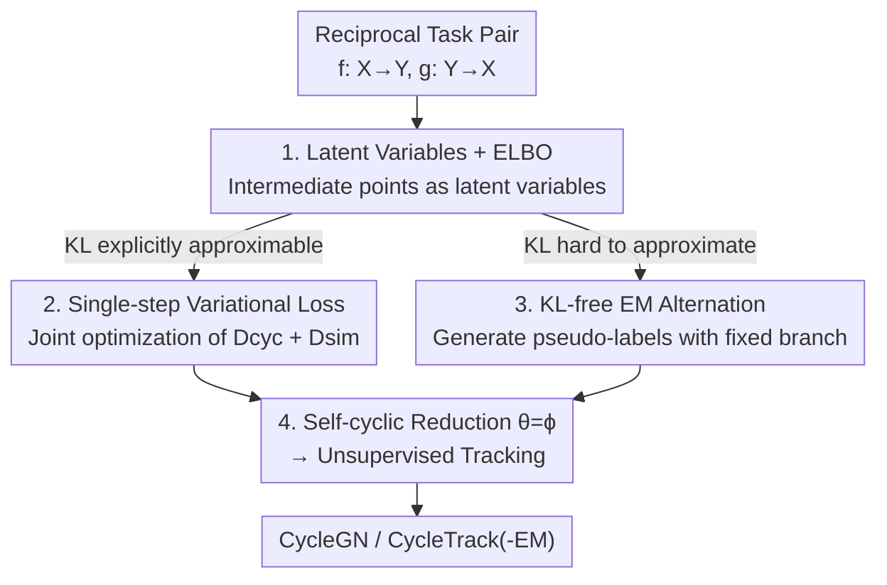

# Variational Inference for Cyclic Learning

**Conference**: ICLR 2026  
**OpenReview**: [https://openreview.net/forum?id=c1jWNZ1Zqg](https://openreview.net/forum?id=c1jWNZ1Zqg)  
**Code**: Yes (CycleGN and CycleTrack source code is public, though specific links are not provided in the paper)  
**Area**: Learning Theory / Weakly Supervised Learning / Variational Inference  
**Keywords**: Cyclic Consistency, Variational Inference, ELBO, EM Algorithm, Unsupervised Tracking

## TL;DR
This paper treats intermediate data points in cyclic learning as latent variables and formulates cross-domain mappings as conditional probabilities. By doing so, it derives the "cycle-consistency" objective as an Evidence Lower Bound (ELBO) using variational inference. Based on this, two general training strategies are proposed: single-step joint optimization and EM-based alternating optimization. This framework not only provides a theoretical explanation for CycleGAN (introducing CycleGN as a GAN-free alternative) but also achieves SOTA performance in unsupervised tracking with CycleTrack / CycleTrack-EM.

## Background & Motivation

**Background**: Cyclic learning is a powerful paradigm for weakly/self-supervised learning. It designs a pair of reciprocal tasks (A→B and B→A) and leverages the property that "a data point should return to itself after a full circle of processing" (cycle-consistency) to construct losses, thereby eliminating the need for manual annotations. Representative works include CycleGAN (unpaired image-to-image translation), CyCO / SC-Tune (REC-REG loops for referring expression comprehension/generation), and various unsupervised tracking methods (forward-backward trajectory consistency).

**Limitations of Prior Work**: These methods are mostly **domain-specific manual implementations** that lack a unified theory. Specifically, there are two major drawbacks: First, the loss functions are not easily transferable across domains—the loss for CycleGAN cannot be directly applied to video alignment tasks. Second, many methods still **rely on pseudo-labels**; for instance, unsupervised tracking often requires an initial trajectory from a base tracker, which is not truly "unsupervised."

**Key Challenge**: While the constraint of cycle-consistency is universal, existing works only "patch together" functional losses for specific tasks. **No one has abstracted it into a derivable and transferable probabilistic objective.** consequently, the potential of cyclic learning is obscured by task-specific engineering, requiring a redesign of the loss for every new task.

**Goal**: Establish a unified probabilistic framework that covers **pairwise cyclic tasks** (where A→B and B→A are implemented by two different functions $f, g$) and **self-cyclic tasks** (where A→B and B→A use the same function, $\theta=\phi$), and derive training strategies applicable to any cyclic task from it.

**Key Insight**: The author's key observation is that the intermediate points in the cycle (those that are neither the start nor the end) are essentially **latent variables**, and the cross-task transitions are **learnable conditional distributions**. From this perspective, maximizing the log-likelihood of "returning to the start after one loop" $\log p_\theta(x)$ allows for the introduction of a variational distribution and decomposition into an ELBO, similar to VAEs or the EM algorithm.

**Core Idea**: Reformulate cycle-consistency into "maximization of the ELBO after introducing latent variables," and then mechanically derive two optimizers. This upgrades cyclic learning from "hand-crafted losses" to a "unified paradigm with theoretical guarantees."

## Method

### Overall Architecture
The framework starts by viewing a generative task as learning a mapping $f:\mathcal{X}\to\mathcal{Y}$. When $y=f(x)$ is invertible, there exists a unique inverse mapping $x=g(y)=f^{-1}(y)$, which is a necessary condition for cycle-consistency. Given an observation $\hat{y}$, the distribution of $x$ collapses into a Dirac distribution centered at the single point $\hat{x}=g(\hat{y})$. Thus, the conditional probabilities are written as:

$$p_\theta(x|y)=\delta(x-g_\theta(y)),\qquad p_\phi(y|x)=\delta(y-f_\phi(x)).$$

With this probabilistic transition relationship, "starting from $x$ and returning to $x$" is equivalent to maximizing $\log p_\theta(x)$. Introducing a variational distribution $q_\phi(y|x)$, standard variational inference gives:

$$\log p_\theta(x)=\mathbb{E}_{q_\phi(y|x)}\!\left[\log\frac{p_\theta(x,y)}{q_\phi(y|x)}\right]+D_{KL}\big(q_\phi(y|x)\,\|\,p_\theta(y|x)\big),$$

where the first term is the ELBO, which can be further decomposed into "reconstruction expectation minus KL alignment with the prior":

$$\ell_{\theta,\phi}(x)=\int q_\phi(y|x)\log p_\theta(x|y)\,dy-D_{KL}\big(q_\phi(y|x)\,\|\,p(y)\big).$$

Considering the bidirectional case for "starting from $y$ and returning to $y$," adding both directions yields the bidirectional ELBO $\ell_{\theta,\phi}(x,y)$. The gap between this and the maximum log-likelihood is exactly two KL terms: $D_{KL}(q_\phi(y|x)\|p_\theta(y|x))+D_{KL}(q_\theta(x|y)\|p_\phi(x|y))$. Maximizing the ELBO implicitly pushes the variational distribution toward the prior and the model posterior, which precisely characterizes the essence of cyclic learning—learning a pair of stochastic mappings that are both consistent with the marginal structures of both domains and satisfy the cyclic reconstruction constraint.

Building on this unified objective, the authors provide two implementation paths: a VAE-style **single-step joint optimization** (approximating the ELBO as a directly back-propagatable loss) and an EM-style **alternating optimization** (using pseudo-label iteration when the KL cannot be explicitly approximated). Finally, reducing the pairwise cycle to $\theta=\phi$ yields the **self-cyclic** version, which is applied to unsupervised visual tracking.

### Key Designs

**1. Latent Variable Formulation: Writing Cycle-consistency as an ELBO**

This step directly addresses the pain point of task-specific loss engineering. Instead of treating the cyclic loss as an engineering trick, the authors treat the intermediate observation $y$ in the cycle as a latent variable and $f_\phi, g_\theta$ as parameterized conditional distributions $p_\phi(y|x), p_\theta(x|y)$. Thus, "returning to the self" is strictly formulated as maximizing $\log p_\theta(x)$. Using the variational identity, the objective is split into the ELBO and a KL gap. Maximizing the ELBO is equivalent to tightening the gap between $q_\phi(y|x)$ and the true posterior $p_\theta(y|x)$. The key difference from VAEs is that the latent variable $y$ here is not a free hidden variable used purely to model the distribution of $x$, but a **real observation existing in domain $\mathcal{Y}$**. It has its own structure and must satisfy a marginal prior $p(y)$ estimated from data—therefore, the learning goal is not just reconstructing $x$, but learning a pair of bidirectional mappings that are probabilistically self-consistent across both domains. This is the first variational probabilistic framework to unify pairwise and self-cyclic tasks.

**2. Single-step Variational Loss: Approximating ELBO as a Dcyc + Dsim Objective**

The ELBO contains integrals and KL terms that cannot be used directly as losses. Under the assumption of deterministic mappings ($q_\phi(y|x)$ collapses to $\delta(y-f_\phi(x))$), the authors implement the two terms. The reconstruction term simplifies to:

$$\int q_\phi(y|x)\log p_\theta(x|y)\,dy=\log\delta\big(x,g_\theta(f_\phi(x))\big),$$

maximizing which is equivalent to minimizing a cyclic distance $D_{cyc}(x,g_\theta(f_\phi(x)))$ (a distance function that is zero if and only if $x=\hat{x}$). The KL term simplifies to $-\log p(f_\phi(x))+\text{const}$, which encourages the mapping output to fall into the high-density region of the prior. When $p(y)$ is difficult to model explicitly, a domain similarity $D_{sim}(f_\phi(x),\mathcal{Y})$ (such as Wasserstein distance) is used. Summing both directions yields the single-step joint loss:

$$\mathcal{L}(x,y)=D^X_{cyc}(x,g_\theta(f_\phi(x)))+D^X_{sim}(f_\phi(x),\mathcal{Y})+D^Y_{cyc}(y,f_\phi(g_\theta(y)))+D^Y_{sim}(g_\theta(y),\mathcal{X}).$$

Its significance is that $D_{cyc}$ ensures the "return to self," while $D_{sim}$ ensures the intermediate product $\hat{y}$ actually falls within the target domain. Mapping this back to CycleGAN (see Table 1), the adversarial loss $L_{GAN}$ serves as $D_{sim}$ (the GAN discriminator implicitly minimizes the JS divergence, a symmetric variant of KL), and the $L_1$ cyclic loss serves as $D_{cyc}$. Thus, CycleGAN is proven to be a special case of Eq. 12 in this framework.

**3. KL-free EM Alternating Optimization: Iteration via Pseudo-labels when Dsim/KL is Unreliable**

The single-step method relies on $D_{sim}$ accurately approximating the KL, but in many tasks, the target distribution is too complex, leading to unstable training. The authors use an EM approach to bypass this: treating the two mappings as a coupled latent variable model and alternating between "fixing one branch to generate pseudo-labels for the other." Specifically (Algorithm 1), in the $E_\theta\text{-}M_\theta$ stage, the current forward $f_\phi$ generates $\hat{y}=f_\phi(x)$ from $x$ (E-step, stop-gradient), then $D_{cyc}(x,g_\theta(\hat{y}))$ is minimized to update the backward $g_\theta$ (M-step). Symmetrically, the $E_\phi\text{-}M_\phi$ stage samples $y$, generates $\hat{x}=g_\theta(y)$, and uses $D_{cyc}(y,f_\phi(\hat{x}))$ to update $f_\phi$. This is coordinate ascent under the "assumption that $q_\phi(y|x)$ has approached the true posterior, setting KL=0." The beauty is that **it eliminates the need for $D_{sim}$**. How is $\hat{y}=f_\phi(x)\in\mathcal{Y}$ guaranteed without $D_{sim}$? The answer lies in the alternating structure: the other M-step requires $f_\phi(g_\theta(y))\approx y$, which forces the output of $f_\phi$ to fall into $\mathcal{Y}$. Instantiating this for image translation results in the GAN-free CycleGN (Table 2).

**4. Self-cyclic Reduction (θ=ϕ): Unsupervised Tracking without Trivial Solutions**

When $f_\phi=g_\theta$ in a cyclic task, the framework reduces to self-cyclic. A trap exists: if one directly optimizes $g_\theta(g_\theta(x))=x$, the trivial solution $g_\theta(x)=x$ satisfies it. The authors break this via domain constraints—since $\hat{y}=g_\theta(x)$ must belong to $\mathcal{Y}$ and not $\mathcal{X}$, the objective is rewritten with conditional domains $g_\theta(g_\theta(x,X,Y),Y,X)=x$. This corresponds to the ELBO $\ell_\theta(x|Y,X)=\mathbb{E}_{q_\theta}[\log p_\theta(x|y,Y,X)]-D_{KL}(q_\theta(y|x,X,Y)\|p(y))$. In visual tracking, $X,Y$ are template and search frames, and $x$ is the target box. The tracker $T$ loss is derived from Eq. 16: the cyclic term $L_b(x,T(T(x,X,Y),Y,X))$ ensures forward-backward trajectory consistency, while the similarity term $L_b(T(x,X,Y),\tilde{y})$ pulls the predicted box toward the nearest neighbor box $\tilde{y}$ produced by a detector in frame $Y$. Since current trackers are not end-to-end differentiable for head-to-tail connection, the authors built CycleTrack from scratch: template boxes are converted to position tokens via MLP, concatenated with uncropped frame tokens, and processed by a ViT encoder + STARK feature enhancer + parallel FCOS heads.

### Loss & Training
- **Single-step**: Directly minimize the sum of four terms in Eq. 12 (bidirectional $D_{cyc}+D_{sim}$), updating $\theta, \phi$ end-to-end; CycleGAN follows this mode ($D_{sim}\!=\!$ adversarial loss).
- **EM**: Alternating updates per Algorithm 1/2. Every M-step uses only $D_{cyc}$, with pseudo-labels from the stop-gradient E-step. Self-cyclic ($\theta=\phi$) allows joint optimization within one EM process.
- In tracking, $L_b$ uses weighted L1 + GIoU as in STARK. CycleGN switches between $E_\theta\text{-}M_\theta$ and $E_\phi\text{-}M_\phi$ every 200 samples for 100 epochs.

## Key Experimental Results

### Main Results

Unpaired Image Translation (Cityscapes, FCN-score, higher is better):

| Task | Method | Use GAN | Per-pixel acc. | Per-class acc. | Class IOU |
|------|------|:---:|:---:|:---:|:---:|
| labels→photo | CycleGAN | ✓ | 0.52 | 0.17 | 0.11 |
| labels→photo | **CycleGN (ours)** | ✗ | 0.52 | 0.14 | 0.10 |
| photo→labels | CycleGAN | ✓ | 0.58 | 0.22 | 0.16 |
| photo→labels | **CycleGN (ours)** | ✗ | 0.51 | 0.16 | 0.10 |

CycleGN approaches the performance of CycleGAN **without using any adversarial discriminator**, merely by pushing the generative network's output toward target domain instances. This validates the feasibility of the "single-step paradigm = ELBO approximation" interpretation.

Unsupervised Visual Tracking (AUC / Precision, higher is better):

| Setting | Method | LaSOT AUC | LaSOT Prec. | TrackingNet AUC | TrackingNet Prec. |
|------|------|:---:|:---:|:---:|:---:|
| Unsupervised (Det. Labels) | ULAST*-on | 47.1 | 45.1 | 65.4 | 59.2 |
| Unsupervised | CycleTrack | 51.0 | 49.7 | 75.9 | 71.5 |
| Unsupervised | **CycleTrack-EM** | **56.5** | **57.9** | **77.3** | **74.4** |
| Strict Unsupervised (Flow) | ULAST-on | 43.3 | 40.7 | — | — |
| Strict Unsupervised | CycleTrack | 45.0 | 42.2 | 65.6 | 59.0 |
| Strict Unsupervised | **CycleTrack-EM** | **51.2** | **49.9** | **69.1** | **64.7** |

Under both settings, CycleTrack leads previous state-of-the-art unsupervised trackers by a large margin and **does not require pseudo-trajectories from a base tracker**.

### Ablation Study

| Configuration | Observation | Explanation |
|------|------|------|
| Full EM (with E-step stop-gradient) | Normal convergence | Standard CycleTrack-EM training |
| No E-step / Only $D_{cyc}$ | Trivial solution (Fig. 5) | Removing forward freezing removes the stop-gradient; $\hat{y}$ no longer constrained to target domain |
| CycleGAN without Adv Loss | Performance crash | Isomorphic to "Single-step without $D_{sim}$" |

### Key Findings
- **$D_{sim}$ / E-step is indispensable**: Using only the cyclic consistency loss $D_{cyc}$ is mathematically equivalent to removing the stop-gradient in the E-step of EM. The generated $\hat{y}$ drifts away from the target domain, and the model collapses to a trivial solution.
- **Single-step vs. EM depends on KL reliability**: In image translation, the GAN discriminator is a robust proxy for KL, so single-step CycleGAN outperforms EM-based CycleGN. In tracking, aligning with nearest detection boxes is unreliable, causing $D_{sim}$ to be estimated poorly; thus, EM-based CycleTrack-EM performs better.

## Highlights & Insights
- **Promoting engineering tricks to theory**: Cycle-consistency has long been a "patched together" loss. This paper connects it to the standard machinery of variational inference by simply stating "intermediate point = latent variable."
- **Two optimizers from one framework**: Single-step (VAE-style joint) and EM (coordinate ascent-style alternating) are not arbitrary; they branch naturally from the same ELBO based on whether the KL can be explicitly approximated.
- **The "Theoretical ID" of CycleGAN**: Table 1 maps the four losses of CycleGAN to Eq. 12, proving that the adversarial loss is just one implementation of $D_{sim}$. This mapping can be reused to provide theoretical grounding for other cyclic methods.

## Limitations & Future Work
- **Insufficiency of cycle-consistency**: The authors admit that without additional constraints, the learned mapping only satisfies the cycle and might not be the target mapping (e.g., poor quality intermediate images in photo↔map).
- **Risk of local optima in EM**: $g_\theta$ might learn to satisfy multiple modes simultaneously, leading to "mismatched pairs" like $X\!\leftrightarrow\!A$ and $B\!\leftrightarrow\!Y$.
- **Strong assumption of deterministic mappings**: The derivation of the single-step loss depends on $q_\phi(y|x)$ collapsing to a Dirac distribution, which may not hold for many-to-many mappings.

## Related Work & Insights
- **vs. CycleGAN**: CycleGAN is proven to be a special case (Adv Loss = $D_{sim}$). The authors show that "adversarial" training is not a requirement for cyclic translation but rather a robust implementation of $D_{sim}$.
- **vs. VAE**: Both lead to "reconstruction + KL alignment" objectives. The difference is that while VAE latent variables are free, the variable $y$ here is an observation with its own structure and prior $p(y)$.
- **vs. Pseudo-label-based Unsupervised Tracking**: Methods like USOT/ULAST require a base tracker for initial trajectories; CycleTrack implements the cyclic paradigm across whole images without needing pseudo-trajectories.

## Rating
- Novelty: ⭐⭐⭐⭐⭐ The first unified variational framework for both pairwise and self-cyclic tasks.
- Experimental Thoroughness: ⭐⭐⭐⭐ Validated across image translation and unsupervised tracking, though restricted to 1-2 datasets per task.
- Writing Quality: ⭐⭐⭐⭐ Clear derivation and convincing mapping tables, though notation can be dense.
- Value: ⭐⭐⭐⭐⭐ Provides a transferable theoretical template and optimizer selection criteria for cyclic learning.

<!-- RELATED:START -->

## Related Papers

- [\[ICLR 2026\] Diffusion Bridge Variational Inference for Deep Gaussian Processes](diffusion_bridge_variational_inference_for_deep_gaussian_processes.md)
- [\[ICLR 2026\] Variational Deep Learning via Implicit Regularization](variational_deep_learning_via_implicit_regularization.md)
- [\[ICLR 2026\] Learning Shrinks the Hard Tail: Training-Dependent Inference Scaling in a Solvable Linear Model](learning_shrinks_the_hard_tail_trainingdependent_inference_scaling_in_a_solvable.md)
- [\[ICLR 2026\] Multiple-Prediction-Powered Inference](multiple-prediction-powered_inference.md)
- [\[ICLR 2026\] Best-of-Majority: Minimax-Optimal Strategy for Pass@k Inference Scaling](best-of-majority_minimax-optimal_strategy_for_passk_inference_scaling.md)

<!-- RELATED:END -->
