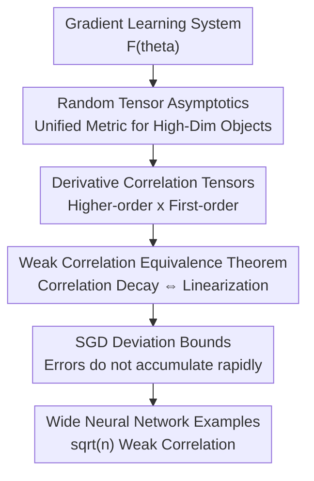

# Weak Correlations as the Underlying Principle for Linearization of Gradient-Based Learning Systems

**Conference**: ICLR2026  
**OpenReview**: [https://openreview.net/forum?id=vokk8t1gnp](https://openreview.net/forum?id=vokk8t1gnp)  
**Code**: Available (The paper states that the experimental code has been open-sourced)  
**Area**: Learning Theory / Training Dynamics  
**Keywords**: Weak Derivative Correlation, NTK Linearization, Random Tensor Asymptotics, Wide Neural Networks, SGD Dynamics

## TL;DR
This paper proposes that "weak derivative correlations" are the fundamental criterion for parameter-space linearization in gradient-based learning systems. As long as the correlation between first-order and higher-order derivatives at initialization decays with width, the training dynamics will approach the Neural Tangent Kernel (NTK) linear model. Furthermore, this deviation can be bounded by a width-dependent upper limit during SGD training.

## Background & Motivation
**Background**: Wide neural networks in the infinite-width limit are often described by the Neural Tangent Kernel (NTK). This perspective approximates the nonlinear network—which remains a complex function of its inputs—as a first-order Taylor model around its parameters. During training, the kernel essentially remains at its initial state, and function values evolve according to linear dynamics induced by a fixed kernel.

**Limitations of Prior Work**: While NTK theory has explained exponential convergence, kernel limits, and certain generalization phenomena in wide networks, it primarily describes "what happens after linearization occurs." A more fundamental question remains: why does a system composed of a large number of nonlinear parameters behave like a linear system under gradient descent? Existing work often proves this based on specific network architectures, the norm ratio of the Hessian to the gradient, or diagrammatic expansions of certain wide networks; these conclusions are useful but lack unification.

**Key Challenge**: Linearization is not simply a statement that parameters change very little, nor does it mean the model itself becomes a linear function. It requires that higher-order Taylor terms be systematically suppressed during training updates. Whether these higher-order terms are significant depends on how higher-order derivatives couple with the direction of the gradient update; simply looking at the magnitude of higher-order derivatives cannot directly explain whether they truly enter the learning dynamics.

**Goal**: The authors attempt to provide a more intrinsic criterion by viewing a gradient learning system as a general parameterized hypothesis function $F(\theta)$, defining correlation tensors between first-order and higher-order derivatives at initialization, and proving that "sufficiently weak correlations" are equivalent to "linearization of training dynamics" under appropriate conditions.

**Key Insight**: Each step of the gradient descent update is determined by the first-order derivative $\nabla F$. If the contraction of higher-order derivatives $\nabla^{D+d}F$ with several $\nabla F$ terms is weak, then even if higher-order Taylor terms exist, they are unlikely to accumulate into visible nonlinear deviations along the actual training path. This approach is closer to the true training trajectory than merely examining Hessian norms.

**Core Idea**: The NTK linearization is unified through "weak derivative correlations." The reason for linearization is not the absence of nonlinear terms, but rather that higher-order derivatives are approximately uncorrelated with the gradient driving direction at initialization, causing their contribution to the dynamics to vanish in the width limit.

## Method
### Overall Architecture
The paper does not propose a new optimizer but establishes an analytical framework. It first defines asymptotic notation for random tensors suitable for high-dimensional limits, rewrites the higher-order Taylor terms appearing in gradient descent as derivative correlation tensors, and finally proves that the decay rate of these correlation tensors is equivalent to the decay rate of the linearization error.

The logic can be summarized as follows: starting from a general gradient learning system, expand $F(\theta)$ along the training update direction; each higher-order term becomes a contraction of a "higher-order derivative and several first-order derivatives." If these contractions decay as the width $n$ increases, fixed-kernel dynamics of the NTK type are obtained. For wide neural networks, the authors further demonstrate that common architectures satisfy this weak correlation structure and use experiments to compare the width trends of linearization errors and correlation strengths.

### Key Designs
**1. Random Tensor Asymptotic Notation: Describing high-dimensional correlation via probabilistic norm bounds**

The paper first addresses a technical but crucial issue: derivative correlations are not scalars but random tensors with input, output, and parameter indices. Looking only at the expectation or variance of each element makes it difficult to guarantee stable asymptotic rules after multiplication, contraction, and summation. The authors thus use subordinate tensor norms and define $O(f)$ for random tensors: intuitively, if for any function $g(n)$ slightly larger than $f(n)$, the probability that $\|M_n\| \le g(n)$ approaches $1$, then $M=O(f)$.

The benefit of this definition is that it allows for algebraic operations similar to standard Big $O$ notation. Subsequent claims that "a certain correlation is $O(1/\sqrt{n})$" do not mean that the average of a coordinate is small, but that the entire correlation tensor is controlled in a high-probability sense. This is vital for objects like wide networks where the number of parameters grows with width, as linearization requires controlling the overall contraction along the training direction rather than individual coordinates.

**2. Derivative Correlation Tensors: Rewriting higher-order Taylor terms as correlation strength along training directions**

The core definition is the derivative correlation $C_{D,d}$. Omitting index details, its form can be written as:

$$
C_{D,d}(\theta)=\frac{\eta^{D/2+d}}{D!d!}\,\nabla^{D+d}F(\theta)^T(\nabla F(\theta))^{\times d}.
$$

Here, $d$ denotes the number of copies of the first-order derivative involved in the contraction, $D+d$ denotes the order of the higher-order derivative under inspection, and the power of $\eta$ is used to align with the learning rate scale. The most familiar special case is $D=0, d=1$, where $C_1=\eta \nabla F^T\nabla F$, which is exactly the NTK kernel $\Theta$. Thus, this paper does not replace the NTK but views it as the lowest-order member of the derivative correlation family.

Why does this definition capture linearization? The gradient descent update satisfies $\Delta\theta=-\eta\nabla F\,C'(F,\hat y)$. When $F(\theta+\Delta\theta)$ is Taylor-expanded around $\theta$, the second, third, and higher-order terms contain contractions of $\nabla^k F$ with several $\nabla F$ terms. In other words, what truly determines whether higher-order nonlinear terms affect training is not just the size of $\nabla^kF$, but its correlation with the gradient direction. Weak correlation formalizes this intuition.

**3. Linearization Equivalence Theorem: Elevating "Weak Correlation leads to Linearization" to a bidirectional criterion**

The most significant results of the paper are the two equivalence theorems. The first theorem discusses weak correlation under a fixed learning rate scale: if for some growth function $m(n)\to\infty$, higher-order correlations satisfy decay such as $C_d=O(1/m(n))$ and $C_{D,d}=O(1/\sqrt{m(n)})$, then within a fixed number of training steps, the gap between the true model $F(\theta(s))$ and the linearized model $F_{lin}(s)$ is $O(1/m(n))$, and the change in the derivative itself relative to initialization is also small.

The second theorem is stronger, allowing for learning rate rescaling $\eta\to r(n)\eta$. Under this setting, if derivative correlations other than the NTK itself decay as $C_{D,d}=O((1/\sqrt{m(n)})^d)$, then the linearization error is controlled by $O(r(n)/m(n))$. This form explains why external scales or learning rate scaling change the degree of lazy training: it does not mysteriously "make the model more linear" but multiplies different powers of $r(n)$ before different orders of correlation terms, thereby changing the rate at which higher-order terms enter the dynamics.

Notably, the authors prove equivalence, not just sufficiency. If a system exhibits linearization along these gradient learning paths, the corresponding derivative correlations must also be weak. The proof strategy involves expanding the difference $F-F_{lin}$ and the derivative change after one update as a series of $C_{D,d}$; since the target function and learning rate scale can be varied, terms of different orders cannot always rely on accidental cancellation to remain small, thus each order of correlation must itself decay.

**4. SGD Deviation Bounds and Wide Network Instances: Explaining why weak correlation is not limited to the first few steps**

Traditional NTK linearization results often focus on a fixed number of steps or deterministic gradient descent, whereas actual training uses SGD. Using the weak correlation framework, the paper derives upper bounds for the deviation from linearization during SGD training: under conditions of exponential weak correlation, a learning rate below the stability threshold, and the linearized solution exponentially approaching the target at time scale $T$ in the early stages, for $s=1,\dots,S$ we have:

$$
F(\theta(s))-F_{lin}(s)=O\left(\frac{s^0}{m(n)}\right).
$$

Here, $s^0$ indicates that the upper bound does not explode linearly with the number of training steps during the period considered. The intuitive meaning is that as long as the weak correlation structure holds, nonlinear deviations do not accumulate rapidly enough via the stochastic path of SGD to overwhelm the width-based decay.

In the wide neural network section, the authors rely on and extend tensor programs formalism to show that common wide networks possess a semi-linear structure, which leads to weak correlations on the order of $\sqrt n$. The growth of higher-order derivatives of the activation function also affects the linearization rate; for instance, the paper points out that in fully connected networks, a quantity like $\sup_n \phi^{[n]}/(n+1)!$ controls whether the correlation decay remains benign. This allows the framework to explain why architecture, parameterization, and activation functions change the speed at which the NTK limit is approached.

### Loss & Training
The theoretical setup adopts supervised learning with gradient-descent-style updates on a single input batch. Given input $x_s$ and label $\hat y(x_s)$, the parameter update is:

$$
\theta(s+1)-\theta(s)=-\eta\nabla F(\theta(s))(x_s)C'(F(\theta(s))(x_s),\hat y(x_s)).
$$

The linearized dynamics use the initial kernel $\Theta_0$:

$$
F_{lin}(s+1)=F_{lin}(s)-\Theta_0(\cdot,x_s)C'(F_{lin}(s)(x_s),\hat y(x_s)).
$$

The analysis requires proper normalization of the system at initialization: function values, the first-step change, kernel scales, and higher-order derivative scales must not go out of control in the width limit. For the SGD deviation bound, the learning rate must also be below the stability threshold of the correlation, and the linearized solution is assumed to approach the target at an exponential rate during early training. The experimental part uses fully connected networks, MSE loss, mini-batch SGD, and various width/learning rate scales to observe the difference between the real network and the first-order linearized model.

## Key Experimental Results

### Main Results
The authors performed two sets of validations. The first compared the relative error between the network and its linear approximation across different widths while estimating second- and third-order derivative correlations. The second set systematically swept widths and learning rate scales on MNIST to observe the power-law slope of the linearization error. As this is primarily a theoretical work, the goal was not to achieve SOTA classification accuracy but to verify whether "correlation decay" and "linearization error decay" move in the same direction.

| Experimental Setting | Data / Model | Observed Metric | Key Findings |
|----------|-------------|----------|----------|
| Appendix A.1 Width Experiment | MNIST / CIFAR10 / FMNIST, FCN, ReLU/Sigmoid/Erf, 1-3 layers | Relative loss between network and linear approx; 2nd/3rd order correlation estimates | As width increases, the true network and linear model become closer; derivative correlation estimates also decrease with width. |
| Appendix A.2 LR Scaling Experiment | MNIST, 2-hidden layer MLP, widths 2048 to 19484, 100 seeds | Log-log slope of $MSE_{test}(f,f_{lin})$ | When learning rate decreases with width, linearization error drops faster, consistent with the qualitative tactical conclusion that scale affects linearization. |
| Theory-Experiment Correspondence | NTK/Taylor 1st-order approx vs. Nonlinear Network | Width power-law trend | Experimental slopes do not perfectly match theoretical upper bounds but follow the same direction: wider, lazier settings are more linear. |

### Ablation Study
The paper does not have a traditional ablation of "removing module A/B." Instead, it tests the impact of external scale on linearization by varying the learning rate width-scaling exponent $\alpha$. Let $\eta(n)=\eta_0 n^\alpha$, with $\eta_0=0.1$; the experiments report the log-log slope of the linearization error relative to width for different values of $\alpha$.

| Configuration | Key Metrics | Description |
|------|----------|------|
| $\alpha=0$ | Slope approx. $-1.14$ | Under constant learning rate, increasing width still reduces linearization error. |
| $\alpha=-0.25$ | Slope approx. $-1.14$ | Slightly reducing learning rate shows trends similar to constant learning rate. |
| $\alpha=-0.5$ | Slope approx. $-1.30$ | Closer to the lazy regime; error decreases slightly faster. |
| $\alpha=-0.75$ | Slope approx. $-1.73$ | Learning rate scaling enhances linearization; width benefits are more pronounced. |
| $\alpha=-1.0$ | Slope approx. $-2.72$ | Learning rate scaled by $1/n$; linearization error decreases most rapidly. |

### Key Findings
- Larger widths lead to smaller differences between the outputs of the network and its first-order linearization, consistent with the theoretical picture of weak correlations decaying with width.
- Approximate calculations of second- and third-order derivative correlations show a downward trend as width increases, supporting the explanation that higher-order terms are weakened along the gradient direction.
- Learning rate scaling indeed changes the rate of linearization; this corresponds to the role of $r(n)$ in amplifying or suppressing higher-order correlation terms in Theorem 3.2.
- While the experimental slopes are more complex than theoretical expectations, the authors suggest this may be because the width has not yet entered the truly asymptotic regime, or that the theory provides upper bounds rather than exact equalities.
- The value of these experiments lies in verifying the theoretical mechanism rather than suggesting that NTK models are superior to finite-width networks in practical tasks.

## Highlights & Insights
- This work pushes the cause of NTK linearization one step further than "the kernel remains constant": the fact that the kernel remains constant itself requires explanation, and weak derivative correlation provides a more fundamental, testable structure.
- The definition of the derivative correlation $C_{D,d}$ is ingenious because it directly maps to the higher-order Taylor terms along the training update direction; this is more relevant to gradient learning dynamics than observing the Hessian norm in isolation.
- The equivalence theorem is the strongest selling point of the paper. While many theories only prove that a certain condition is sufficient for linearization, this paper attempts to show that weak correlation and linearization are two sides of the same coin, making it a criterion for general gradient learning systems.
- Although random tensor asymptotic notation is abstract, it resolves a common problem in wide-network analysis where "element-wise averaging does not equate to global control," serving as a tool for analyzing other high-dimensional random objects.
- The discussion on the NTK inferiority paradox is insightful: if complete linearization implies a lack of beneficial inductive bias, then the superiority of finite-width networks over infinite-width kernel models may stem from non-vanishing higher-order correlations.
- The paper offers a reverse perspective for model design: it is not necessarily the case that being closer to the NTK limit is better; truly useful systems may need to find a balance between the controllability brought by weak correlation and the feature learning bias brought by non-vanishing correlation.

## Limitations & Future Work
- Theoretical conditions are relatively strong, including analyticity, proper normalization, learning rate thresholds, and early-stage exponential convergence of the linearized solution; whether these conditions hold naturally in modern large model training needs further verification.
- The paper primarily handles supervised learning and gradient-descent-type updates. although an appendix discusses generalizability, the direct characterization of practical training components like Adam, momentum, normalization layers, residual paths, and attention modules is not yet sufficiently detailed.
- The experimental scale is small relative to the theoretical depth, primarily using MLPs and small-scale image classification; while it supports mechanistic trends, it cannot yet demonstrate that linearization in large-scale Transformers follows the same slopes.
- Estimating higher-order derivative correlations remains computationally expensive, necessitating sampling approximations in experiments. Improving the stability and lowering the cost of these estimates is necessary for them to become practical diagnostic tools.
- The equivalence theorem emphasizes weak correlation at initialization, but in reality, correlation structures may change during training. Future research could investigate how weak correlation is destroyed or reorganized in the feature learning regime.
- A valuable follow-up would be to use weak correlation as a design metric for architectures, initializations, or learning rates: systems intended to be lazy could strengthen weak correlation, while those intended to retain beneficial biases could allow specific non-vanishing correlations.

## Related Work & Insights
- **vs NTK (Jacot et al., 2018; Lee et al., 2019)**: NTK describes linear dynamics of wide networks under a fixed initial kernel. This paper explains *why* higher-order nonlinear terms vanish and incorporates the NTK itself as a lower-order special case within the family of derivative correlations.
- **vs Lazy Training (Chizat et al., 2019)**: Chizat et al. emphasize that external scales control whether a model enters the lazy regime. This paper further clarifies that scale changes the relative weights of different orders of derivative correlation terms, thus providing a more granular explanation of how learning rate/parameterization affects the linearization rate.
- **vs Hessian-gradient ratio (Liu et al., 2020)**: The ratio of indices of the Hessian to the gradient provides a sufficient condition for linearization; the derivative correlation in this paper is more like a spectral-norm-style contraction along the true training direction and requires higher-order correlations to decay at initialization.
- **vs Neural Tangent Hierarchy (Huang & Yau)**: The tangent hierarchy studies the slow time-scale evolution of higher-order kernels in wide networks. This paper uses more general correlation tensors to express similar time scales and generalizes the approach to gradient learning systems not restricted to specific wide-network architectures.
- **vs Feynman Diagram methods (Dyer & Gur-Ari)**: Feynman diagrams can compute the asymptotic average of correlation functions in wide networks. This paper emphasizes direct control over the asymptotic behavior of random tensors rather than just their averages, aiming for a more unified criterion suitable for equivalence proofs.
- **Insight**: If strong correlations are viewed as the source of a model's intrinsic bias, then analyzing training systems should not only ask "is it linearized?" but also "which correlations should vanish, and which are worth keeping?" This has potential value for understanding inductive bias in finite-width networks, feature learning, and large model pre-training.

## Rating
- Novelty: ⭐⭐⭐⭐⭐ Providing an equivalence criterion for linearization from weak derivative correlations is a highly distinct theoretical contribution.
- Experimental Thoroughness: ⭐⭐⭐⭐☆ Experiments verify core trends and learning rate scaling effects, but the scale is distant from modern models.
- Writing Quality: ⭐⭐⭐⭐☆ The main argument is clear, and the physical/random tensor tools are insightful, though some proofs rely on heavy formalization in the appendix.
- Value: ⭐⭐⭐⭐⭐ High foundational theoretical value for NTK, lazy training, feature learning boundaries, and wide network dynamics.

<!-- RELATED:START -->

## Related Papers

- [\[ICLR 2026\] Does Weak-to-strong Generalization Happen under Spurious Correlations?](does_weak-to-strong_generalization_happen_under_spurious_correlations.md)
- [\[ICLR 2026\] On learning linear dynamical systems in context with attention layers](on_learning_linear_dynamical_systems_in_context_with_attention_layers.md)
- [\[ICLR 2026\] A New Approach to Controlling Linear Dynamical Systems](a_new_approach_to_controlling_linear_dynamical_systems.md)
- [\[ICLR 2026\] Continuum Transformers Perform In-Context Learning by Operator Gradient Descent](continuum_transformers_perform_in-context_learning_by_operator_gradient_descent.md)
- [\[ICLR 2026\] Strong Correlations Induce Cause Only Predictions in Transformer Training](strong_correlations_induce_cause_only_predictions_in_transformer_training.md)

<!-- RELATED:END -->
