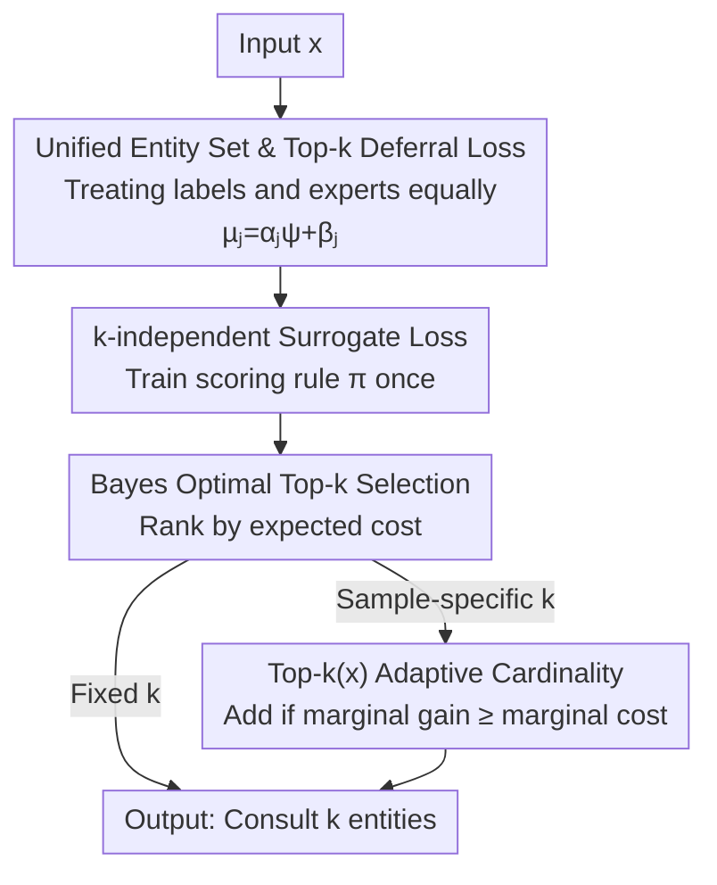

# Why Ask One When You Can Ask k? Learning-to-Defer to the Top-k Experts

**Conference**: ICLR 2026  
**Paper**: [OpenReview](https://openreview.net/) (⚠️ Refer to original text for link)  
**Code**: Yes (Authors claim release of all code and configs, ⚠️ Refer to original text for link)  
**Area**: Learning Theory / Learning-to-Defer / Surrogate Loss Consistency  
**Keywords**: Learning-to-Defer, Top-k Deferral, Surrogate Loss, Bayes Consistency, Adaptive Cardinality

## TL;DR
This paper generalizes the Learning-to-Defer (L2D) framework from "deferring to a single expert" to "consulting the $k$ most cost-effective entities." It introduces a **k-independent surrogate loss that can be trained once and switched to any $k$ during deployment**, proving its Bayes / H-consistency for both one-stage and two-stage paradigms. Furthermore, an adaptive cardinality function Top-k(x) is proposed based on sample difficulty, outperforming traditional single-expert methods in precision–cost trade-offs.

## Background & Motivation
**Background**: Learning-to-Defer allows a machine learning system to "defer samples to an external expert when it lacks confidence," explicitly balancing "prediction accuracy" and "expert consultation cost." It follows two main lines: **Two-stage** (base predictor and expert are pre-trained and fixed, with an additional rejector learned) and **One-stage** (jointly training the prediction task and deferral decision within an augmented classifier).

**Limitations of Prior Work**: Existing L2D frameworks are restricted to **single-expert deferral**, where each query is transferred to exactly one entity. However, high-stakes real-world decisions are naturally "consultative": oncology cases involve radiologists, pathologists, oncologists, and surgeons; fraud detection and judicial reviews also rely on opinion aggregation. Consulting only one expert loses collective intelligence and amplifies individual biases and errors.

**Key Challenge**: Extending single-expert rules to "consulting $k$ entities" is non-trivial. Existing L2D losses use exclusive indicator functions (e.g., $\mathbb{1}\{\hat h(x)\neq y\}\mathbb{1}\{\hat h(x)\le n\}$). If $k$ selections are allowed, the chosen set might **simultaneously** contain the true label and multiple experts with varying costs, rendering old losses invalid. A naive alternative $\mathbb{1}\{y\in\Pi_k(x)\}$ has three flaws: (i) it reduces "correctness" to simple inclusion, ignoring expert reliability; (ii) it fails to accumulate total consultation costs; and (iii) it generates non-decomposable set-level indicators, hindering surrogate loss design.

**Goal**: (1) Provide a Top-k deferral loss that unifies one/two-stage paradigms and reflects "multi-entity accuracy + cost"; (2) Identify an optimizable, consistent, and **k-independent** surrogate loss; (3) Allow the number of experts to adapt per sample.

**Key Insight**: Treat "class labels" and "experts" **equally as entities**, making the difference between one/two-stage paradigms merely a matter of entity set $\mathcal A$ construction. Then, leverage Top-k classification ideas to transform deferral into a set selection problem by "ranking by cost."

**Core Idea**: Instead of picking the "single most cost-effective" entity, use a "score each entity $\rightarrow$ pick $k$ entities with lowest expected cost" approach. The optimization objective for the surrogate loss is independent of $k$, allowing one set of weights to be deployed across any $k$.

## Method

### Overall Architecture
The system assigns scores to all "entities" (either predicting a class or deferring to an expert) for each input $x$ using a unified scoring rule $\pi(x,\cdot)$. During inference, entities are sorted by score to form the **selection set** $\Pi_k(x)$. During training, a $k$-independent surrogate loss is minimized. Top-k(x) further integrates a **cardinality function** $k_\theta(x)$ to determine the number of entities per sample.

### Key Designs

**1. Unified Entity Perspective + Top-k Actual Deferral Loss: Cumulative Cost Set Selection**

The exclusivity of old L2D losses stems from treating labels and experts differently. This work treats both as **entities**: One-stage entity set $\mathcal A_{1s}=\{1,\dots,n\}\cup\{n+1,\dots,n+J\}$ ($n$ classes, $J$ experts); Two-stage entity set $\mathcal A_{2s}=\{1,\dots,J+1\}$ (base predictor + $J$ experts). Each entity $j$ has an **augmented cost** $\mu_j(x,z)=\alpha_j\,\psi(\hat a_j(x),z)+\beta_j$, where $\psi$ is an error metric, $\alpha_j$ penalizes errors, and $\beta_j$ is a fixed fee. The Top-k actual loss sums the costs of selected entities:

$$\ell_{def,k}(\Pi_k(x),z)=\sum_{j=1}^{|\mathcal A|}\mu_j(x,z)\,\mathbb{1}\{j\in\Pi_k(x)\}.$$

This formula resolves prior issues: it **accumulates** errors and fees for all selected entities, it is decomposable for surrogate design, and it perfectly recovers classic L2D losses when $k=1$.

**2. k-independent Surrogate Loss: Train Once, Any k at Deployment**

The actual loss contains a hard sorting operator $\Pi_k$, which is non-continuous. The authors prove an upper bound (Lemma 4.3): utilizing the fact that the sum $\sum_j\mu_j$ is independent of $\pi$ and $\mathbb{1}\{j\in\Pi_k(x)\}\le\Phi^u_{01}(\pi,x,j)$, they derive:

$$\ell_{def,k}(\Pi_k(x),z)\le\sum_{j\in\mathcal A}\Big(\sum_{i\neq j}\mu_i(x,z)\Big)\Phi^u_{01}(\pi,x,j)-(|\mathcal A|-1-k)\sum_{j\in\mathcal A}\mu_j(x,z),$$

where $\Phi^u_{01}$ represents the cross-entropy family (comp-sum). Since the second term is independent of $\pi$, the surrogate family is:

$$\Phi^u_{def,k}(\pi,x,z)=\sum_{j\in\mathcal A}\Big(\sum_{i\neq j}\mu_i(x,z)\Big)\Phi^u_{01}(\pi,x,j).$$

**Crucially, this expression does not contain k.** This allows a scoring rule $\pi$ to be reused for any $k$ during inference without retraining.

**3. Bayes Optimal Top-k Selection & Unified Consistency**

The authors characterize the Bayes optimal strategy (Lemma 4.5): calculate expected cost $\mu_j^B(x)=\inf_{g}\mathbb E_{Z|x}[\mu_j(x,Z)]$ for each entity; the **optimal Top-k set consists of the k entities with the lowest expected costs**:

$$\Pi_k^B(x)=\arg\min_{|\Pi_k|=k}\sum_{j\in\Pi_k}\mu_j^B(x)=\{[1]^\uparrow_{\mu^B}, \dots, [k]^\uparrow_{\mu^B}\}.$$

This **unifies and generalizes** selective prediction (Chow's rule), cascades, and one/two-stage L2D. Theorem 4.7 provides the **first consistency bound for Top-k deferral**, establishing $\mathcal H$- and Bayes-consistency under moderate assumptions.

**4. Top-k(x): Sample-Adaptive Cardinality**

Fixed $k$ is sub-optimal as simple samples may only need one entity. Top-k(x) introduces a cardinality function $k_\theta:\mathcal X\to\mathcal A$. The marginal decision rule suggests adding a $(k+1)$-th entity if and only if:

$$-\delta D_x(k+1)\ge\lambda\big[\xi(S_{k+1})-\xi(S_k)\big],$$

meaning the "reduction in prediction error from an additional entity" outweighs its "marginal consultation cost."

### Loss & Training
The surrogate loss uses the comp-sum cross-entropy family: $\Phi^u_{01}(h,x,j)=\Psi_u\big(\sum_{j'}e^{h(x,j')-h(x,j)}-1\big)$. For two-stage L2D, base predictors/experts are pre-trained before training the rejector. For one-stage, the augmented classifier is trained jointly.

## Key Experimental Results

Results for California Housing (Regression, Two-stage) are reported here (RMSE$\times100$).

### Main Results (California Housing)

| Metric | Top-k(x) (Adaptive) | Top-k (Fixed k) | Description |
|------|------|------|------|
| RMSE_min | **6.23** @ β=0.156, k̄=4.77 | 6.21 @ β=0.2, k=6 | Top-k(x) matches Top-k's best with lower budget/entities |
| RMSE_avg | **8.53** @ β=0.095 | 10.08 (Suboptimal at same budget) | Top-k(x) excels when more entities might hinder performance |
| RMSE_w-avg | Best @ β=0.095 | Unattainable at this budget | Similar to above |
| Top-1 L2D Baseline | — | — | Outperformed by Top-k / Top-k(x) throughout |

### Key Findings
- **Top-k(x) primary value is budget efficiency**: It achieves fixed Top-k optimal accuracy using ~80% of the budget ($0.156$ vs $0.2$), avoiding over-consultation on simple samples.
- **When metrics are non-monotonic, more is less**: Aggregating too many entities can hurt performance. Here, Top-k(x) outperforms Top-k by ~1.5 RMSE points ($8.53$ vs $10.08$).
- **Consistency with $k=1$**: The framework never performs worse than single-expert baselines, validating its status as a strict generalization.

## Highlights & Insights
- **Engineering Advantage of k-independence**: Training once and adjusting $k$ on-the-fly for dynamic budget or risk scenarios is highly practical.
- **Elegant Abstraction**: Treating labels and experts as "entities" allows selective prediction, cascades, and L2D to be unified under one $(\alpha_j,\beta_j,\mathcal A)$ framework.
- **Explainable Marginal Rule**: The decision rule for increasing $k$ turns "how many experts to ask" from a hyperparameter into a learnable risk-benefit trade-off.

## Limitations & Future Work
- **Academic Benchmark Scale**: Experiments use artificial expert sets; real-world multi-expert scenarios (correlated experts, time-varying costs) remain for future validation.
- **Simple Aggregation**: The framework sums costs/errors; optimizing the **fusion** of $k$ outputs (rather than just accumulating costs) is a natural next step.
- **Linear Cost Model**: The $\mu_j = \alpha_j\psi + \beta_j$ model does not yet cover non-additive costs or expert synergies.

## Related Work & Insights
- **vs Single-expert L2D**: Prior works only handle $k=1$. This paper generalizes decision rules, objectives, and consistency to Top-k, recovering old results as special cases.
- **vs Top-k Classification**: While Top-k labels are well-studied, deferral adds complexity as costs depend on heterogeneous experts. This work provides specific Top-k deferral consistency analysis.
- **vs Cascades / Selective Prediction**: Proven to be strict special cases of the Top-k selection set, unifying cascade inference and multi-expert deferral.

## Rating
- Novelty: ⭐⭐⭐⭐⭐ First Top-k/adaptive L2D framework; k-independent surrogate; unified paradigms.
- Experimental Thoroughness: ⭐⭐⭐ Solid theory, but experiments are on academic benchmarks with artificial expert sets.
- Writing Quality: ⭐⭐⭐⭐ Clear abstraction, though high theoretical density requires appendix for full detail.
- Value: ⭐⭐⭐⭐ Highly practical for dynamic budget deployment; opens new directions for multi-expert L2D.

<!-- RELATED:START -->

## Related Papers

- [\[ICLR 2026\] The Lie of the Average: How Class Incremental Learning Evaluation Deceives You?](the_lie_of_the_average_how_class_incremental_learning_evaluation_deceives_you.md)
- [\[ICLR 2026\] When Shift Happens - Confounding is to Blame](when_shift_happens_-_confounding_is_to_blame.md)
- [\[ICLR 2026\] Why Less is More (Sometimes): A Theory of Data Curation](why_less_is_more_sometimes_a_theory_of_data_curation.md)
- [\[ICLR 2026\] When Bias Meets Trainability: Connecting Theories of Initialization](when_bias_meets_trainability_connecting_theories_of_initialization.md)
- [\[ICLR 2026\] Better Bounds for the Distributed Experts Problem](better_bounds_for_the_distributed_experts_problem.md)

<!-- RELATED:END -->
