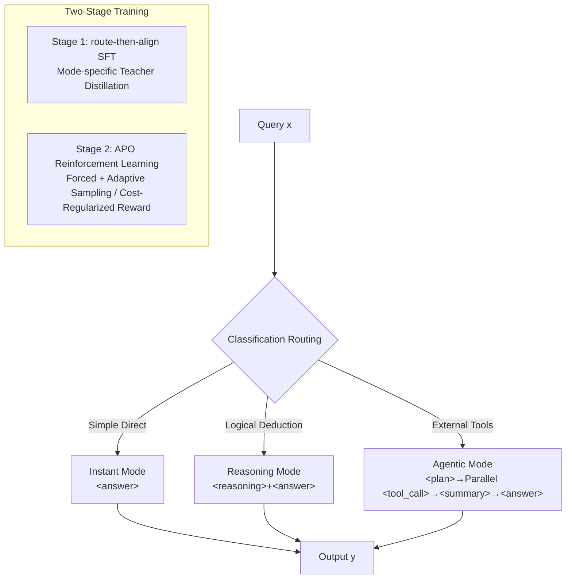

# A$^2$FM: An Adaptive Agent Foundation Model for Tool-Aware Hybrid Reasoning

**Conference**: ICLR 2026  
**OpenReview**: [https://openreview.net/forum?id=3kvV1nfWVq](https://openreview.net/forum?id=3kvV1nfWVq)  
**Code**: To be confirmed  
**Area**: LLM Agent / Hybrid Reasoning  
**Keywords**: Adaptive Routing, Tool-Use, Hybrid Reasoning, Reinforcement Learning, Cost-Efficiency  

## TL;DR
A2FM integrates three execution modes—instant, reasoning, and agentic—into a single backbone. It first learns the optimal routing path and then aligns mode-specific trajectories. By employing a cost-regularized reinforcement learning method (APO), the model avoids unnecessary computation for simple queries while maintaining accuracy for complex ones, reducing the cost per correct answer by approximately 45% on a 32B scale.

## Background & Motivation
**Background**: Current Large Language Models (LLMs) are evolving along two distinct paths: "reasoning" models like o3 and DeepSeek-R1, which excel at internal long-chain thinking but lack external tool-calling capabilities; and "agentic" models like GLM-4.5, Kimi K2, and OAgents, which are proficient in searching, browsing, and code execution but often lag in multi-step logical deduction. These two capabilities are complementary yet currently fragmented.

**Limitations of Prior Work**: Existing hybrid systems (e.g., Qwen3) train reasoning and tool-using capabilities in separate stages with loose coupling, lacking a unified controller to decide during inference whether a query requires thought or external retrieval. While closed-source models like GPT-5 demonstrate comprehensive capabilities, their data and training pipelines remain undisclosed. Other "when-to-think" studies only adjust the length of the Chain-of-Thought (CoT) in text-only settings, failing to consider the choice between "internal reasoning" and "external action," nor the latency and monetary costs associated with tool calls.

**Key Challenge**: Simply mixing multiple modes is insufficient. The model must maintain accuracy while minimizing computational costs. "Boundary" queries are difficult to route correctly, and their data is often wasted. For simple queries, reasoning models overthink and agentic models over-utilize tools, leading to wasted compute on both ends.

**Goal**: To unify three execution capabilities within a shared backbone, enabling the model to autonomously select the appropriate mode per query, thereby achieving a better trade-off between accuracy and cost.

**Core Idea**:

-   **Uniformity of Three Modes (including Instant)**: An "instant" mode is added alongside reasoning and agentic modes to directly answer simple queries, mechanically avoiding pointless reasoning or tool usage for simple inputs.
-   **Route-then-Align Training Paradigm**: During the Supervised Fine-Tuning (SFT) stage, the model first learns task-aware routing classification, followed by aligning trajectories specific to each mode under a shared policy.
-   **APO Cost-Regularized Reinforcement Learning**: An Adaptive Rewards with Cost Penalty (APO) system, combined with cross-mode forced/adaptive sampling, encourages the use of the instant mode whenever possible, escalating to other modes only when external evidence or deeper reasoning is truly required.

## Method

### Overall Architecture
A2FM decomposes decision-making into two layers: a routing policy $\pi_{route}(m\mid x)$ first selects a mode from the set $M=\{\text{instant},\text{reasoning},\text{agentic}\}$. The chosen mode then generates a trajectory via the corresponding mode policy $\pi_m(y\mid x)$. The instant mode provides direct answers, the reasoning mode generates a CoT, and the agentic mode produces tool interaction trajectories. The overall objective is to maximize $\sum_{m}\pi_{route}(m\mid x)Q_m(x)$ across the task distribution, where $Q_m(x)$ is the expected accuracy of mode $m$ for input $x$. Implementation occurs in two stages: Stage 1 performs route-then-align SFT to establish classification and formatted generation, while Stage 2 uses APO RL to tune the router for both precision and efficiency.

### Key Designs

**1. Three Modes + Tagged Trajectories.** Every model response begins with a pair of `<classification>` tags to declare the chosen path. The instant mode provides conclusions directly in `<answer>` to minimize thought; the reasoning mode expands a CoT in `<reasoning>` before the `<answer>`; the agentic mode alternates between high-level reasoning and tool calls. Notably, the agentic trajectory redesigns the use of Plan and Summary: `<plan>` appears once at the start to decompose the query into parallelizable sub-goals, while `
` dynamically aggregates sub-tasks, terminates completed threads, and opens new ones as needed. Trajectories involve parallel execution of N tools (wrapped in `<tool_call>`), significantly improving efficiency. Tool responses are masked during training to focus the model on reasoning and routing rather than memorizing tool outputs.

**2. Route-then-Align SFT + Mode-specific Teacher Distillation.** Stage 1 focuses on teaching the model to categorize queries into one of the three modes before generating a corresponding trajectory. Heuristics like difficulty-based sampling adjustments are used to ensure diversity. Distillation utilizes complementary "mode-specific teachers": the reasoning mode is taught by the strong-reasoning DeepSeek-R1, while agentic and instant modes are taught by the more versatile DeepSeek-V3.1, ensuring high-quality alignment within the shared backbone.

**3. APO Dual Sampling: Forced + Adaptive.** Stage 2's APO is built on GRPO but includes two modifications for mode selection, the first being the rollout strategy. For each query, APO performs both "forced rollouts" and "adaptive rollouts." In forced rollouts, prefix injection (inserting preset classification tags) forces the model to run in agentic, reasoning, and instant modes $\rho$ times each. This ensures exploration of all modes to unbiasedly estimate relative success rates. Adaptive rollouts allow the model to choose its mode $\gamma$ times, rewarding correct self-routing. The total sample size per group is $G=3\rho+\gamma$. Tool response tokens and prefix-injection tags are excluded from the loss.

**4. Cost-Regularized Adaptive Reward.** The second modification is the reward design: $r_{total}=r_{acc}\times r_{adaptive}\times r_{format}$. Any failure (wrong answer, wrong mode, or format violation) nullifies the reward. The accuracy term $r_{acc}=\mathbb{I}[M_j(x,\hat y)=1]$ uses LLM-as-Judge to avoid rule-based metric limitations. The adaptive term is critical: if a query can be solved by the instant mode with accuracy above threshold $\tau$, it is marked as "easy," and:

$$r_{adaptive}=\begin{cases}1-p^{\alpha}, & \text{non-instant mode selected}\\ 1, & \text{otherwise}\end{cases}$$

where $p$ is the empirical success rate of all forced rollouts and $\alpha>0$ is a scaling factor. Thus, correctly using instant mode for easy tasks yields full points, while using reasoning or tools for easy tasks is penalized proportional to the task's "easiness." No penalty is applied to hard tasks to prioritize accuracy.

## Key Experimental Results

The backbone is Qwen2.5-32B-Instruct. SFT is run for 3 epochs (max length 32768), and APO for 2 epochs (learning rate 1e-6, 12 rollouts per prompt with $\rho=\gamma=3, \alpha=2$).

### Main Results

| Category | Benchmark | A2FM (Adaptive) | A2FM-best Mode | Strongest Baseline |
|------|-----------|--------------|---------------|---------|
| Agentic | XBench-DS | **56.0** | 54.0 | AFM-Search 54.0 |
| Agentic | GAIA | 57.3 | **60.7** (Agentic) | OAgents 58.3 |
| Agentic | BrowseComp | 13.4 | 14.4 (Agentic) | DeepDive 14.8 |
| Reasoning | MATH500 | 95.0 | 95.2 | o1 96.4 |
| Reasoning | AIME24 | **74.5** | 74.5 | o1 74.3 |
| Reasoning | AIME25 | 70.4 | 70.4 | o1 79.2 |
| General | GPQA-d | 63.1 | 67.7 (Agentic) | Claude4 68.3 |
| General | SuperGPQA | 54.7 | 56.0 (Agentic) | Claude4 55.7 |
| General | HLE | 16.7 | **20.6** (Agentic) | QwQ 8.2 |

Highlights: AIME24 reaches a new 32B SOTA of 74.5%, outperforming Claude 4 Sonnet by +33.3 points. On HLE, the agentic variant reaches 20.6%, surpassing the runner-up (QwQ 8.2%) by +12.4 points.

### Cost Efficiency (SuperGPQA, cost-of-pass)

| Mode | Cost per Correct Answer ($) | Relative Reduction |
|------|------------------|---------|
| Reasoning | 0.00889 | — |
| Agentic | 0.00732 | -17.6% |
| **Adaptive** | **0.00487** | **-45.2% vs Reasoning / -33.5% vs Agentic** |

Adaptive execution costs approximately half as much as pure reasoning per correct answer.

### Ablation Study and Routing Analysis

| Experiment | Result |
|------|------|
| APO Adaptive Reward Ablation (SuperGPQA) | Without adaptive reward: score 55.6 / instant usage 50.2%; With it: score 54.7 / instant usage 58.6% (Efficiency gain with minimal accuracy loss). |
| Routing Accuracy vs Human Label | GAIA 92.2% / BrowseComp 94.0% / AIME24 100% |
| Difficulty Adaptation (SuperGPQA) | Easy queries use instant mode 61.1% of the time, while hard ones drop to 8.3%. |
| Pareto Convergence | Convergence at 53.8% accuracy / 77.1% non-instant, vs "Best Mode" oracle (55.4% / 100%). |

### Key Findings
- Routing failures are rare: On GAIA, only 5 of 44 errors were due to routing; the rest were execution failures within the chosen mode.
- Confusion matrices show almost no misclassification between reasoning and agentic modes. Routing errors consist mostly of "premature instant selection" or "unnecessary tool usage for simple tasks."
- All AIME tasks were routed to the reasoning mode, indicating robust identification of pure reasoning tasks.

## Highlights & Insights
- **Internalized Decision-Making**: The choice of whether to think or use tools is treated as an endogenous unified decision within the model, rather than an external binary switch.
- **Instant Mode as an Anchor**: It serves not just to save costs, but as the benchmark for the adaptive reward, effectively defining the boundary between simple and difficult tasks.
- **Forced Sampling for Unbiased Estimates**: Combining forced rollouts to estimate success rate $p$ with the $1-p^\alpha$ penalty elegantly ties the penalty to "how easy the task actually is," avoiding a one-size-fits-all approach.
- **Cost-of-Pass Metric**: Evaluating efficiency via the dollar cost per correct answer brings the discussion closer to real-world deployment considerations.

## Limitations & Future Work
- There remains a 1.6-point accuracy gap between the adaptive mode and the "forced best mode" (e.g., GAIA), primarily due to routing classification noise at query boundaries.
- Experiments were restricted to the Qwen2.5-32B-Instruct backbone. Transferability across different scales or base models is unknown.
- Reliance on LLM-as-Judge for rewards might introduce judge-specific biases. The training overhead for forced rollouts (12 per prompt) is significant.
- There is an inherent risk of "premature direct entry" for difficult queries misidentified as simple.

## Related Work & Insights
- **Length-Aware Methods**: While prior works focused on compressing CoT in text, A2FM generalizes this to a broader choice between "reasoning vs action."
- **When-to-Think**: Unlike LHRM or BPO which use binary probes for difficulty, A2FM upgrades routing to three modes and integrates agentic tool capabilities.
- **Insight**: For any agent system requiring both performance and cost-efficiency, the paradigm of "forced exploration to estimate route success rates followed by cost-regularized reward calibration" is highly reusable.

## Rating
- Novelty: ⭐⭐⭐⭐ The combination of three-mode unification, route-then-align, and cost-regularized APO is novel, particularly the coupling of instant mode with adaptive rewards.
- Experimental Thoroughness: ⭐⭐⭐⭐ Coverage of 10 benchmarks across agentic, reasoning, and general domains with detailed cost and Pareto analysis, though limited to one backbone scale.
- Writing Quality: ⭐⭐⭐⭐ Clear motivation, well-defined methodology, and strong visual support from charts and confusion matrices.
- Value: ⭐⭐⭐⭐ Reducing the cost per correct answer by ~45% without significant accuracy loss has direct practical value for the deployment of hybrid agent systems.

<!-- RELATED:START -->

## Related Papers

- [\[ICLR 2026\] Empowering LLM Tool Invocation with Tool-call Reward Model](empowering_llm_tool_invocation_with_tool-call_reward_model.md)
- [\[ICLR 2026\] Exploratory Memory-Augmented LLM Agent via Hybrid On- and Off-Policy Optimization](exploratory_memory-augmented_llm_agent_via_hybrid_on-_and_off-policy_optimizatio.md)
- [\[ICLR 2026\] Nemotron-Research-Tool-N1: Exploring Tool-Using Language Models with Reinforced Reasoning](nemotron-research-tool-n1_exploring_tool-using_language_models_with_reinforced_r.md)
- [\[ICLR 2026\] GTool: Graph Enhanced Tool Planning with Large Language Model](gtool_graph_enhanced_tool_planning_with_large_language_model.md)
- [\[AAAI 2026\] History-Aware Reasoning for GUI Agents](../../AAAI2026/llm_agent/history-aware_reasoning_for_gui_agents.md)

<!-- RELATED:END -->
