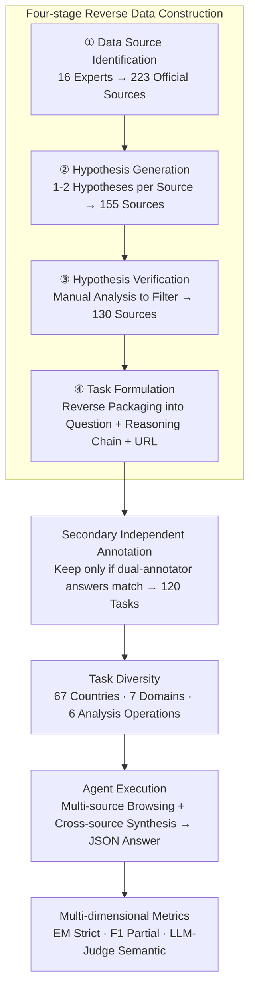

# A Benchmark for Deep Information Synthesis (DeepSynth)

**Conference**: ICLR 2026  
**arXiv**: [2602.21143](https://arxiv.org/abs/2602.21143)  
**Code**: Available (Public data and code)  
**Area**: Agent  
**Keywords**: benchmark, information synthesis, deep research, multi-source reasoning, agent evaluation

## TL;DR
The DeepSynth benchmark is proposed, containing 120 real-world information synthesis tasks across 7 domains and 67 countries (averaging 5.5 hours of human annotation per task). It requires agents to collect information from multiple webpages and perform structured reasoning. Currently, the strongest agent (o3-deep-research) only achieves 8.97 F1 / 17.5% LLM-Judge, revealing severe deficiencies in LLM agents regarding deep information synthesis.

## Background & Motivation
**Background**: LLM agents have advanced rapidly in tool use (web browsing, code execution, data analysis), but existing benchmarks primarily evaluate shallow fact retrieval or single-source information lookup.

**Limitations of Prior Work**: Existing benchmarks suffer from three issues: (1) Most are shallow retrieval tasks (e.g., GAIA) that do not require cross-source synthesis; (2) They rely heavily on English and well-known single sources like Wikipedia; (3) They lack coverage of diverse global information sources and languages.

**Key Challenge**: Real-world information synthesis tasks require collecting structured/unstructured data from multiple sources and performing complex analyses (trend detection, correlation analysis, anomaly detection, etc.), which existing benchmarks fail to evaluate.

**Goal**: To build a benchmark for evaluating the deep information synthesis capabilities of agents—where task answers cannot be directly retrieved and must be obtained through multi-step reasoning and cross-source synthesis.

**Key Insight**: Starting from real-world scenarios (16 experts, average 5.5 hours annotation per task), the process follows: select data sources → propose hypotheses → verify analysis → formulate questions. This ensures answers are non-memorizable and require genuine synthesis and reasoning.

**Core Idea**: Construct a realistic benchmark requiring "deep research" capabilities to reveal the massive gap in current agents' information synthesis abilities.

## Method

### Overall Architecture
As a benchmark paper, the core contribution is the DeepSynth dataset itself—including the design of 120 tasks, expert annotation workflows, and a comprehensive evaluation of 11 existing agents. It addresses the evaluation gap where "existing benchmarks only test shallow fact retrieval and fail to assess cross-source synthesis." The pipeline consists of two stages: **Task Construction**: 16 experts started with 223 real official data sources, proposed hypotheses, performed manual analysis, and reverse-packaged the analysis chains into tasks. After layers of filtering (223 sources → 155 sources → 130 sources → 120 tasks) and secondary independent annotation, 120 tasks were obtained where answers "cannot be searched, only synthesized." **Evaluation**: Agents perform multi-source browsing and cross-source reasoning to produce a JSON answer, which is then measured using three metrics of varying strictness: EM, F1, and LLM-Judge. Each task consists of a question (avg. 78.5 tokens), a set of gold-standard intermediate reasoning steps (avg. 7.54 steps), evidence URLs (avg. 4.2 webpages required), and a standard JSON answer.

### Key Designs

**1. Four-stage Reverse Data Construction: Ensuring answers are "synthesized, not searched"**

Most existing benchmarks follow a "find answer then write question" approach, often resulting in tasks solvable via a single search query. This work reverses the process through four phases: Data Source Identification (223 official sources across 7 domains) → Hypothesis Generation (1-2 verifiable hypotheses per source) → Hypothesis Verification (manual analysis to eliminate unverifiable ones) → Task Formulation (reverse-packaging analysis chains into questions + reasoning steps + evidence URLs + JSON answers). Finally, a secondary independent annotation is performed where a second annotator re-solves the task; only tasks with perfectly matching answers are retained. The key to this reverse flow is that the answer resides at the end of a multi-step analysis rather than on a specific webpage, making it impossible to obtain via verbatim lookup. This ensures the tasks are resistant to memorization and contamination at the source. The cost is high, with each task requiring an average of 5.5 expert hours, which limits the scale to 120 tasks.

**2. Task Diversity: Extending coverage across geography, domains, and operations**

To avoid western or English-centric bias, tasks span 67 countries and 7 domains (Socio-economic, Finance, Environment, Science, Education, Transportation, Politics). Analysis operations are also deliberately distributed: Counting & Comparison (33.7%), Trend Detection (20.9%), Ranking (19.8%), Averaging (11.1%), Correlation Analysis (7.0%), and Anomaly Detection (7.0%). This three-dimensional expansion tests agent robustness on under-represented data sources (e.g., Africa) and ensures the evaluation covers diverse reasoning patterns encountered in real information synthesis.

**3. Multi-dimensional Metrics: Measuring the same answer with three different scales**

Task outputs are standardized as JSON key-value pairs, which are naturally auto-verifiable. To avoid distortion from a single metric, three layers are used: EM (Exact Match) is the strictest, requiring all keys and values to be perfectly correct (1 for success, 0 otherwise); F1 operates at the key-value pair granularity, calculating "correct pairs / total pairs" to allow for partial correctness; LLM-Judge is the most lenient, using an LLM-as-a-judge to determine semantic equivalence, accepting minor string differences and numerical deviations of 1–5.5%. These tiered metrics reveal whether an agent is truly precise or if it is "heading in the right direction despite poor details," avoiding the binary dropout of EM.

## Key Experimental Results

### Main Results

| Model/Agent | F1 | EM | LLM-Judge |
|---|---|---|---|
| GPT-4.1 | 3.46 | 0.0 | 0.0 |
| GPT-5.1 | 3.83 | 0.0 | 0.0 |
| GPT-5.2-Pro | 8.70 | 6.25 | 6.67 |
| Gemini-2.5-Pro | 6.25 | 0.0 | 5.0 |
| DeepSeek-R1 | 3.23 | 1.67 | 2.5 |
| **o3-deep-research** | **8.97** | 2.50 | **17.5** |
| Smolagent (GPT-5) | 6.42 | 1.67 | 2.5 |
| OWL (GPT-4.1) | 5.41 | 1.67 | 12.5 |

### Ablation Study (OWL Tool Ablation)

| Configuration | F1 | Description |
|------|-----|------|
| Full | 5.41 | Full toolchain |
| - Search | 3.60 | Search is the most critical; removing it drops F1 by 1.81 |
| - Web Browsing | 4.80 | Browsing capability is also important |
| - Doc Processing | 4.90 | Minimal impact from document processing |
| - Code Execution | 4.82 | Code execution also contributes |

### Key Findings
- **All models near 0 on EM**: No model perfectly solved every task, indicating extreme benchmark difficulty.
- Small F1 gap between reasoning models (o3, R1) and general LLMs (GPT-4.1), suggesting the **bottleneck is information acquisition rather than reasoning itself**.
- Tool enhancement helps but is insufficient: o3-deep-research is 5.68 F1 higher than base o3, but still only scores ~9.
- Best-of-5 improves LLM-Judge to 25%, but Self-Consistency@5 remains at 5%—agent output variance is huge; they are occasionally correct but unstable.
- Performance on tasks related to Africa dropped significantly, exposing model weaknesses in under-represented data sources.

## Highlights & Insights
- **Reveals a significant blind spot**: Current "deep research" agents' information synthesis capabilities are far from practical; the best agent reliably solves only 3 out of 120 tasks.
- **Valuable data construction methodology**: The meticulous process of analysis-first task generation, dual verification, and 5.5-hour manual annotation per task ensures high quality and contamination resistance.
- **Valuable bottleneck diagnosis**: By comparing performance with and without tools, the study clearly identifies information acquisition (rather than reasoning) as the primary current bottleneck.

## Limitations & Future Work
- The scale of 120 tasks is relatively small and may not cover all information synthesis scenarios.
- Evaluation primarily relies on JSON exact matching, limiting the ability to assess open-ended responses.
- Annotation depends on 16 specific domain experts, potentially introducing annotator bias.
- The ability of agents to use search engine APIs (as opposed to web browsing) was not explicitly evaluated.

## Related Work & Insights
- **vs GAIA**: GAIA evaluates general AI assistants; DeepSynth focuses on deep reasoning for information synthesis, closer to real-world deep research.
- **vs BrowseComp**: BrowseComp focuses on information retrieval difficulty; DeepSynth emphasizes cross-source synthesis and analysis.
- **vs FRAMES**: FRAMES covers fact-checking and multi-hop retrieval; DeepSynth requires additional complex analysis and structured output.

## Supplementary Discussion

### Difference between Deep Information Synthesis and RAG
RAG primarily focuses on information retrieval and combination, whereas Deep Information Synthesis requires multi-step reasoning, cross-source verification, and data integration. This distinction is crucial—existing RAG benchmarks cannot evaluate an agent's "deep synthesis" capability.

## Rating
- Novelty: ⭐⭐⭐⭐ First benchmark to systematically evaluate deep information synthesis.
- Experimental Thoroughness: ⭐⭐⭐⭐⭐ 11 models/agents, multi-dimensional metrics, tool ablation, Best-of-N analysis.
- Writing Quality: ⭐⭐⭐⭐ Clear structure with detailed descriptions of the data construction process.
- Value: ⭐⭐⭐⭐ Defines the direction and identifies the gaps for deep research agent development.

<!-- RELATED:START -->

## Related Papers

- [\[ICLR 2026\] Open Data Synthesis for Deep Research](open_data_synthesis_for_deep_research.md)
- [\[ICLR 2026\] An Information Theoretic Perspective on Agentic System Design](an_information_theoretic_perspective_on_agentic_system_design.md)
- [\[ICLR 2026\] InfoMosaic-Bench: Evaluating Multi-Source Information Seeking in Tool-Augmented Agents](infomosaic-bench_evaluating_multi-source_information_seeking_in_tool-augmented_a.md)
- [\[ICLR 2026\] ST-WebAgentBench: A Benchmark for Evaluating Safety and Trustworthiness in Web Agents](st-webagentbench_a_benchmark_for_evaluating_safety_and_trustworthiness_in_web_ag.md)
- [\[ICLR 2026\] FingerTip 20K: A Benchmark for Proactive and Personalized Mobile LLM Agents](fingertip_20k_a_benchmark_for_proactive_and_personalized_mobile_llm_agents.md)

<!-- RELATED:END -->
