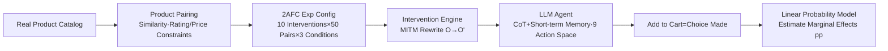

# A Framework for Studying AI Agent Behavior: Evidence from Consumer Choice Experiments

**Conference**: ICLR 2026  
**OpenReview**: [https://openreview.net/forum?id=xAPoscV2Bw](https://openreview.net/forum?id=xAPoscV2Bw)  
**Code**: abxlab.media.mit.edu (Open source benchmark)  
**Area**: LLM Agent / Behavioral Science / AI Safety  
**Keywords**: Agent decision making, consumer choice, behavioral bias, nudge, man-in-the-middle framework, benchmark  

## TL;DR
The authors propose **ABXLAB**, a real-time "man-in-the-middle" framework that intercepts and rewrites webpage content to transform any shopping site into a controlled behavioral experiment. By systematically measuring choice biases in 17 mainstream LLM agents under cues like price, rating, display order, and psychological nudges, they find that agents are more manipulable than humans, with bias magnitudes reaching 3–10 times those of human baselines.

## Background & Motivation
- **Background**: LLM agents are emerging as a new class of "economic actors," making decisions on shopping, itinerary booking, and even medical plan selection. However, existing evaluations (e.g., WebArena, VisualWebArena) focus almost exclusively on **task completion rates**—whether the agent clicks the correct button, finds the right item, or fills out a form.
- **Limitations of Prior Work**: Task competence is only half of the delegation relationship; the other half is **trust**. When users delegate decision-making power, they assume the agent will respond to the task structure with common sense and stable judgment, rather than swaying due to superficial cues, arbitrary ordering, or irrelevant packaging. In reality, environments are "designed to guide choice," yet the performance of agents under such carefully designed choice architectures remains untested.
- **Key Challenge**: Intuition suggests that agents free from cognitive limitations should be more rational and robust. However, preliminary work (Cherep et al. 2024/2025) suggests LLMs are **hyper-sensitive** to simple nudges, even more so than humans. The extent to which this vulnerability amplifies in realistic, high-dimensional web environments has not been systematically studied.
- **Goal**: Establish a methodology and reproducible testbed for "AI Agent Behavioral Science" to answer **when, how, and under what choice architectures** agent behavior shifts, and quantify this shift relative to human baselines.
- **Core Idea**: **Borrowing the consumer choice experimental paradigm**—since psychology and behavioral economics have used "shopping choices" to study human bias for decades, the same controlled manipulations (price changes, rating adjustments, nudge injection) are applied to agents using rigorous causal inference. **Ours uses man-in-the-middle rewriting instead of custom environments**—intercepting real web observations and injecting interventions before the agent sees them, allowing the framework to scale to any website and any intervention without environment customization.

## Method

### Overall Architecture
ABXLAB (ABx = Agent Behavior eXperiments) consists of a controlled experimental pipeline with three parts: **(1) Product Pairing**, selecting "similar category, similar price, controlled rating" pairs from real catalogs; **(2) Intervention Engine**, acting as a man-in-the-middle to rewrite the display content of one product (injecting nudges, matching prices, etc.) in real-time before the agent perceives the page; **(3) 2AFC Forced Choice + Causal Analysis**, where the agent makes a Two-Alternative Forced Choice (2AFC) decision and adds it to the cart, after which marginal effects of each cue are estimated using linear probability models with cluster-robust standard errors. Implementation is based on the OneStopMarket shopping environment from AgentLab and WebArena.

### Key Designs

**1. MITM Intervention Engine: Formalizing the Environment as an Injectable Markov Process**  
The framework formalizes the environment as $E=\langle S,A,O,T,I\rangle$, with state space $S$, action space $A$, observation space $O$, deterministic transitions $T:S\times A\to S$, and a critical **intervention function set** $I=\{I:O\to O\}$. At each step, the agent acts based on the rewritten observation $\tilde{o}_t=I(o_{t+1})$ rather than the raw observation $o_{t+1}$—affecting only what the agent "sees" without altering underlying web or action logic. This "observation-layer manipulation" enables any website to become a controlled experiment field without rewriting environment code.

**2. Bi-regular Product Pairing: Ensuring Ecologically Valid Choice Control**  
To ensure validity, product pairs ($p_1, p_2$) must be in the same category with limited attribute differences: $|\text{rating}(p_1)-\text{rating}(p_2)|\le\Delta_r$ and $\frac{|\text{price}(p_1)-\text{price}(p_2)|}{\min\{\text{price}(p_1),\text{price}(p_2)\}}\le\Delta_p$. Original experiments use loose regularization ($\Delta_r=0.10, \Delta_p=0.50$); matched experiments tighten this to $\Delta_r=0$ and search for the **largest non-overlapping valid pair set** within a neighborhood, followed by uniform downsampling to 50 pairs per group. Titles are filtered using a lightweight LLM to remove pre-existing nudge words (e.g., "top-rated").

**3. Five Nudge Categories × Attribute-Matched Causal Ladder**  
Interventions cover five categories: Authority ("Recommended by experts"), Social Proof ("Best seller"), Scarcity ("Only 1 hour left"), Negative Framing ("Newer version available"), and Incentives ("Free shipping"). The experimental design follows a **ladder stripping confounding factors**: Original (unmatched) $\rightarrow$ MR (Matched Rating) $\rightarrow$ MRaP (Matched Rating and Price). This isolates the individual effects of price and nudges as prior dominant factors are neutralized.

**4. Human Baseline and User Persona Control**  
To benchmark agent bias, 30 subjects from Prolific performed 50 decisions each using the same product pairs via an interactive 2AFC interface. Additionally, **User Persona** experiments explicitly include preferences in the prompt (e.g., "Budget-conscious" vs. "Quality-focused") to detect if the agent can adjust preferences as instructed, testing whether bias is inherent or steerable.

## Key Experimental Results

### Main Results (Partial Models, unit: pp = percentage points, change in choice probability relative to baseline)

| Model | Viewed 1st (O) | Higher Rated (O) | Cheaper (MR) | Nudged (MRaP) |
|------|------|------|------|------|
| GPT-5 | +16.7* | +61.8**** | +24.5** | +53.3**** |
| o3 | +13.4 | +77.6**** | +15.2* | +48.4**** |
| o4 Mini | +11.1 | +81.2**** | +12.4 | +38.5**** |
| Claude Sonnet 4 | -9.2 | +46.7**** | +32.5**** | +55.9**** |
| Gemini 2.5 Pro | -2.0 | +48.8**** | +33.8**** | +55.8**** |
| GPT-4.1 | +7.7 | +43.2**** | +32.4*** | +57.2**** |
| Llama 4 Maverick | +5.2 | +64.7**** | +30.2**** | +9.7* |
| GPT-4.1 Nano | **+88.8**** | +2.9 | -0.9 | 0.0 |
| Claude 3.5 Haiku | **-35.4**** | +7.8 | +9.0 | -5.7 |
| **Human Baseline** | **+4.0** (n.s.) | **+5.0** (n.s.) | **+9.4** (n.s.) | **+9.9*** |

> Rating effects (Higher Rated) were significant in 14 of 17 models (30–80pp); price effects amplified sharply after rating matching (Llama 4 Maverick favored cheaper goods by **+93.2pp**); nudges drove 10–60pp shifts even after matching both price and rating. Humans were largely insensitive to these cues (avg. ~7% sensitivity).

### Ablation Study (Attribute Matching Ladder + Sensitivity Analysis)

| Setting | Phenomenon | Interpretation |
|------|------|------|
| Original → MR | Price effect increases after matching ratings | Agents use **hierarchical decision rules**: price is suppressed when dominant rating cues exist. |
| MR → MRaP | Price effect disappears after matching both | Agents rely on price itself rather than price correlates. |
| Doubled Price Diff / 1-Point Rating Diff | Doubling price had moderate impact; 1-point rating diff rarely significant | Bias is **nearly binary triggered**—small differences suffice, larger ones don't scale linearly. |
| Heterogeneity of Nudge Phrasing | Authority nudges (Wirecutter) had highest impact | Effectiveness varies by phrasing, even within the same theoretical nudge category. |

### Key Findings
- **Agents are "Strong-Bias Choosers"**: Despite lacking human cognitive constraints, they exhibit systematic, predictable, and extreme biases, often 3–10 times the magnitude of humans.
- **Order Vulnerability**: Display order effects are highly heterogeneous—GPT-4.1 Nano showed +90pp preference for the first item, while Claude 3.5 Haiku penalized it by -35.4pp.
- **Ratings as Decisive Cues**: Ratings are treated as near-absolute indicators of quality across all model families (GPT/Claude/Gemini/Llama), a core characteristic rather than an outlier.
- **User Personas are Highly Effective**: Prompt-level preferences steer agents strongly, suggesting biases are risks as well as control levers.

## Highlights & Insights
- **Paradigm Shift**: Successfully adapts "Consumer Choice + Controlled Manipulation + Causal Inference" from behavioral economics to AI agents, providing a quantifiable and reproducible template for "AI Behavioral Science."
- **MITM Architecture as Leverage**: Injecting interventions at the observation layer decouples the framework from specific sites and intervention types, allowing theoretical expansion to any web-based manipulation.
- **Risk/Opportunity Duality**: Beyond warning of "agent bias," the work frames consumer choice as a powerful testbed for studying behavior—a dialectical framing that adds both safety and methodological value.

## Limitations & Future Work
- **Environment Scope**: All conclusions derived from the OneStopMarket single-shopping environment using 2AFC; generalizability to travel or medical domains remains untested.
- **Lack of Visual Perception**: Agents process pruned HTML without visual input, excluding the impact of visual nudges (images/layout) prevalent in real shopping.
- **Normative Ambiguity of "Bias"**: Preferring higher ratings/lower prices is often rational. Defining "bias" purely as deviation from human baselines lacks a standard for "correct" selection to distinguish rational preference from manipulation.
- **Absence of Mitigation**: While vulnerabilities are diagnosed, the work does not propose training or prompting schemes to reduce nudge sensitivity.

## Related Work & Insights
- **Agent Evaluation**: Complements "task completion" benchmarks like WebArena by extending evaluation to "how choices are made."
- **Behavioral Science Tradition**: Directly inherits concepts from Simon's bounded rationality, Kahneman & Tversky's heuristics, and Thaler & Sunstein's nudge theory for machine decision-making.
- **Audit Methodology**: The "MITM + Controlled Manipulation + Causal Inference" approach can be generalized to audit agents in any domain where environments are designed to guide decisions (e.g., recruitment, recommendation systems).

## Rating
- **Novelty**: ⭐⭐⭐⭐⭐ Systematically porting consumer choice paradigms to AI agents using a scalable MITM testbed.
- **Experimental Thoroughness**: ⭐⭐⭐⭐⭐ High volume of experiments, 17 SOTA models, human baselines, and rigorous statistical checks.
- **Writing Quality**: ⭐⭐⭐⭐ Clear motivation and dialectical framing; high information density in tables requires focused reading.
- **Value**: ⭐⭐⭐⭐⭐ Crucial for safety and alignment as agents increasingly act on behalf of users in economic environments.

<!-- RELATED:START -->

## Related Papers

- [\[ICLR 2026\] EXP-Bench: Can AI Conduct AI Research Experiments?](exp-bench_can_ai_conduct_ai_research_experiments.md)
- [\[ICLR 2026\] OpenAgentSafety: A Comprehensive Framework for Evaluating Real-World AI Agent Safety](openagentsafety_a_comprehensive_framework_for_evaluating_real-world_ai_agent_saf.md)
- [\[ICLR 2026\] MedAgent-Pro: Towards Evidence-based Multi-modal Medical Diagnosis via Reasoning Agentic Workflow](medagent-pro_towards_evidence-based_multi-modal_medical_diagnosis_via_reasoning_.md)
- [\[ICLR 2026\] WebWeaver: Structuring Web-Scale Evidence with Dynamic Outlines for Open-Ended Deep Research](webweaver_structuring_web-scale_evidence_with_dynamic_outlines_for_open-ended_de.md)
- [\[ICLR 2026\] Collaborative Gym: A Framework for Enabling and Evaluating Human-Agent Collaboration](collaborative_gym_a_framework_for_enabling_and_evaluating_human-agent_collaborat.md)

<!-- RELATED:END -->
