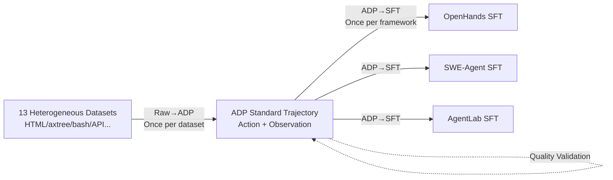

# Agent Data Protocol: Unifying Datasets for Diverse, Effective Fine-tuning of LLM Agents

**Conference**: ICLR 2026  
**OpenReview**: [https://openreview.net/forum?id=tG6301ORHd](https://openreview.net/forum?id=tG6301ORHd)  
**Code**: [https://agentdataprotocol.com](https://agentdataprotocol.com)  
**Area**: LLM Agent / Agent SFT / Data Standardization  
**Keywords**: Agent Data Protocol, Agent Fine-tuning, Unified Data Representation, Cross-task Transfer, SWE-bench, WebArena  

## TL;DR
The authors propose ADP, a lightweight "agent data interlingua" that unifies 13 heterogeneous agent training sets into a consistent Trajectory/Action/Observation pattern. These are then distributed to various agent frameworks for SFT, achieving an average gain of ~20% over base models and reaching or approaching SOTA on coding, browsing, and tool-use tasks.

## Background & Motivation
- **Background**: While LLM pretraining benefits from nearly infinite internet data, agent Supervised Fine-tuning (SFT) requires multi-step interaction trajectories, which are much harder to collect than static input-output pairs. The community has accumulated numerous agent datasets (human-annotated, synthetic, or agent rollout recordings) covering web navigation, software engineering, and tool calling.
- **Limitations of Prior Work**: Large-scale agent SFT remains rare in academia. The bottleneck is not a lack of data, but a **lack of standardization**. Each dataset uses unique formats, action spaces, and observation structures (e.g., HTML vs. accessibility trees), preventing datasets from being merged, shared, or reused.
- **Key Challenge**: Feeding $D$ datasets into $A$ agent frameworks traditionally requires writing a Raw$\rightarrow$SFT converter for every "dataset $\times$ framework" pair. This results in an $O(D \times A)$ engineering complexity, leading to redundant work and fragile integrations.
- **Goal**: To provide a unified representation that is both expressive and easily parsable, allowing any dataset to be converted once and any framework to implement a single script to share the entire data pool.
- **Core Idea**: **[Hub-and-spoke Interlingua]** ADP is introduced as an "interlingua" between agent datasets and training pipelines. This collapses many-to-many conversions into a "Raw$\rightarrow$ADP$\rightarrow$SFT" hub-and-spoke pipeline, reducing engineering complexity from quadratic to linear $O(D+A)$.

## Method

### Overall Architecture
ADP utilizes a Pydantic schema to abstract any agent trajectory into a `Trajectory` object. The fundamental insight is that despite superficial differences, most agent interactions can be decomposed into an alternating sequence of "Actions issued by the agent" and "Observations returned by the environment." The pipeline consists of three steps: Raw data to ADP format, ADP to framework-specific SFT formats, and automated quality validation.

### Key Designs

**1. Unified Trajectory Schema: Covering the full spectrum of tasks with three action types and two observation types.** ADP represents each trajectory as `Trajectory(id, content, details)`, where `content` is an alternating sequence of actions and observations. Actions are categorized into three types: `APIAction` (including `function`, `kwargs`, and `description` for tool use, e.g., mapping web navigation `goto(url=google.com)` to an `APIAction`), `CodeAction` (including `language` and `content`), and `MessageAction` (natural language communication). Observations consist of `TextObservation` (with a `source` to distinguish user vs. environment feedback) and `WebObservation` (including `html`, `axtree`, `url`, `viewport`, and optional screenshots for complex browsing). This minimal yet complete set of primitives unifies web, coding, SWE, and tool-use tasks into the same semantic space.

**2. Bi-directional Conversion Pipeline with Decoupled Responsibilities.** The pipeline is split into two directions: Raw$\rightarrow$ADP maps private actions/observations of each dataset to the ADP standard (done **once per dataset** to make it a standard resource); ADP$\rightarrow$SFT translates standard trajectories into specific framework scaffolding, system prompts, and dialogue formats (done **once per framework**). This is key to reducing costs from $O(D \times A)$ to $O(D+A)$. Empirically, converting 13 datasets to ADP required ~4892 LOC, while ADP$\rightarrow$SFT scripts for three frameworks averaged only ~77 LOC (OpenHands ~150, SWE-Agent ~50, AgentLab ~30). Scaling to $A=100$ frameworks without ADP would require ~$100 \times 4892 \approx 489,200$ LOC, whereas with ADP it remains around $4892 + 100 \times 77$ LOC.

**3. Automated Quality Validation for Trainability.** Conversion is not just reformatting; the third step involves rigorous automated checks. It verifies if tool call formats are valid, checks if a majority (threshold set to 80%) of tool calls include English "thoughts" or explanations, and ensures dialogues terminate correctly. This ensures consistency across the merged million-scale corpus and prevents "dirty" data from polluting the SFT. Based on this pipeline, the authors released the ADP Dataset V1, containing ~1.3M trajectories after sampling and balancing 13 datasets.

## Key Experimental Results

### Main Results (Best 7–8B ADP-trained agents, excerpt)

| Benchmark | Agent Framework | Model | Training Data | Accuracy |
|---|---|---|---|---|
| SWE-Bench Verified | SWE-Agent | Qwen2.5-7B-Coder | None / ADP | 0.4% $\rightarrow$ **20.2% (+19.8%)** |
| SWE-Bench Verified | OpenHands | Qwen2.5-7B-Coder | None / ADP | 2.8% $\rightarrow$ **20.4% (+17.6%)** |
| WebArena | AgentLab | Qwen2.5-7B-Coder | None / ADP | 4.5% $\rightarrow$ **21.0% (+16.5%)** |
| AgentBench OS | OpenHands | Qwen2.5-7B-Coder | None / ADP | 3.5% $\rightarrow$ **27.1% (+23.6%)** |
| GAIA | OpenHands | Qwen2.5-7B | None / ADP | 7.3% $\rightarrow$ **9.1% (+1.8%)** |

Gains persist as scale increases: a 32B model using SWE-Agent on SWE-Bench reached **40.3% (+38.1%)**, rivaling or exceeding Claude 3.5 Sonnet's 33.6%; it reached 36.8% (+26.2%) on OpenHands. The overall average improvement over base models is ~20%.

### Ablation Study (Cross-task transfer: Diverse vs. Single-task Data)

| Benchmark | Model | Single-task Training | ADP Diverse Data |
|---|---|---|---|
| SWE-Bench | Qwen2.5-7B-Instruct | SWE-smith Only 1.0% | **10.4%** |
| SWE-Bench | Qwen3-8B | SWE-smith Only 11.0% | **16.6%** |
| WebArena | Qwen2.5-7B-Instruct | Go-Browse Only 16.0% | **20.1%** |
| AgentBench OS | Qwen3-8B | AgentInstruct Only 21.5% | **25.7%** |
| GAIA | Qwen2.5-7B-Instruct | AgentInstruct Only 0.6% | **9.1%** |

### Key Findings
- **Cross-task Positive Transfer**: Mixing multi-domain ADP corpora not only outperforms single-domain fine-tuning on target tasks but also **prevents negative transfer** (performance drops on unrelated tasks) common in single-domain fine-tuning.
- **Cross-dataset Analysis**: Unified representation allows for quantitative analysis; 13 datasets average 10.1 interaction rounds (ranging from 1 to 26.8); action distributions show clear domain preferences; most datasets have function thought coverage $\ge 90\%$, suggesting reasoning explanations are a common feature of high-quality datasets.
- **Engineering Cost**: ADP$\rightarrow$SFT scripts average ~77 LOC, allowing new frameworks to unlock the entire data pool immediately.

## Highlights & Insights
- **Addresses the Real Issue**: Re-identifies the rarity of agent SFT not as a "lack of data" but as a "lack of standardization," solving it with an engineered interlingua.
- **Quadratic to Linear**: The hub-and-spoke cost argument is clear, and LOC data proves it is more than just a slogan.
- **High By-product Value**: Unified representation enables cross-dataset quantitative analysis and provides the largest public agent training set (1.3M trajectories) for community reuse.
- **Strong Generalization**: The same corpus, without domain customization, consistently improves performance across coding, browsing, tool-use, and research benchmarks across 3 frameworks and 7B–32B scales.

## Limitations & Future Work
- **Expressive Boundaries**: Current Action/Observation primitives focus on text, code, and web; lossless representation for multi-modal tasks (e.g., visual GUI control, robotics) remains to be verified.
- **Dependency on Original Label Quality**: ADP unifies format but cannot improve underlying data quality; rollout data is still limited by the baseline agent's capability during collection.
- **Impact of Sampling Weights**: The specific ratios in balanced sampling (downsampling large sets) affect results significantly; optimal mixing strategies remain an open question.
- **Heuristic Validation Thresholds**: Thresholds like the 80% function-thought coverage are manually set; their optimality across various datasets has not been fully explored.

## Related Work & Insights
- **Difference from Existing Standardization**: While previous works attempted standardization, they were often task- or agent-specific. ADP focuses on a **community-level, framework-agnostic** representation standard.
- **Data-centric AI Paradigm**: Aligns with the view that data is scarcer than models for agents, investing in data infrastructure rather than new architectures.
- **Insight**: Any "multi-producer $\times$ multi-consumer" scenario with fragmented formats (e.g., multi-modal instruction data, RL trajectories) can benefit from this "interlingua + bi-directional converters + auto-validation" hub-and-spoke architecture to reduce engineering overhead.

## Rating
- **Novelty**: ⭐⭐⭐⭐ Simple concept but precise positioning; turning data standardization into a community interlingua is an undervalued but practical direction.
- **Experimental Thoroughness**: ⭐⭐⭐⭐⭐ Comprehensive validation across 13 datasets, 4 benchmarks, 3 frameworks, and 3 scales, including cross-task transfer ablations.
- **Writing Quality**: ⭐⭐⭐⭐ Clear chain of motivation-design-cost-experiment; Figures 1 and 2 are intuitive.
- **Value**: ⭐⭐⭐⭐⭐ Releases the largest public agent training set (1.3M trajectories) and a standard protocol, significantly lowering the barrier for reproducible agent SFT.

<!-- RELATED:START -->

## Related Papers

- [\[ICLR 2026\] LLMs are Greedy Agents: Effects of RL Fine-tuning on Decision-Making Abilities](llms_are_greedy_agents_effects_of_rl_fine-tuning_on_decision-making_abilities.md)
- [\[ICLR 2026\] Repurposing Synthetic Data for Fine-grained Search Agent Supervision](repurposing_synthetic_data_for_fine-grained_search_agent_supervision.md)
- [\[CVPR 2026\] CGL: Advancing Continual GUI Learning via Reinforcement Fine-Tuning](../../CVPR2026/llm_agent/cgl_advancing_continual_gui_learning_via_reinforcement_fine-tuning.md)
- [\[ICLR 2026\] MCP Security Bench (MSB): Benchmarking Attacks Against Model Context Protocol in LLM Agents](mcp_security_bench_msb_benchmarking_attacks_against_model_context_protocol_in_ll.md)
- [\[ICLR 2026\] Orak: A Foundational Benchmark for Training and Evaluating LLM Agents on Diverse Video Games](orak_a_foundational_benchmark_for_training_and_evaluating_llm_agents_on_diverse_.md)

<!-- RELATED:END -->
