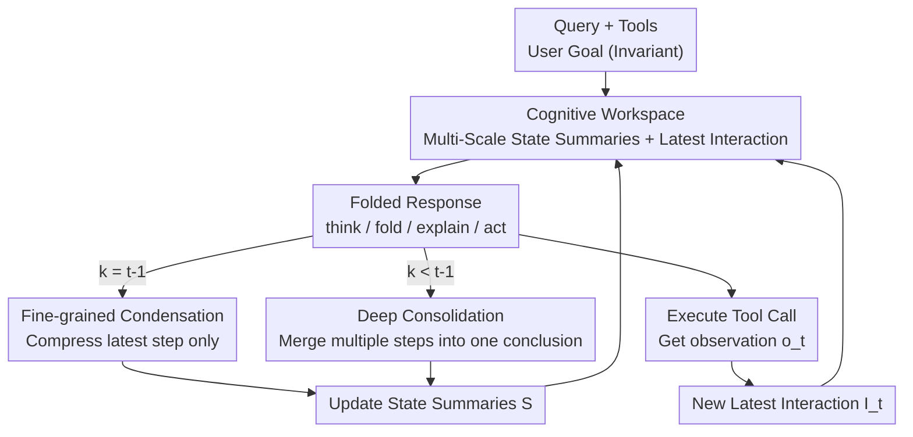

# AgentFold: Long-Horizon Web Agents with Proactive Context Folding

**Conference**: ICLR2026  
**OpenReview**: [https://openreview.net/forum?id=IuZoTgsUws](https://openreview.net/forum?id=IuZoTgsUws)  
**Code**: https://github.com/Alibaba-NLP/DeepResearch (Model: AgentFold-30B-A3B-Preview)  
**Area**: LLM Agent / Web Agent  
**Keywords**: Context Folding, Long-Horizon Tasks, Web Agent, Cognitive Workspace, Information Retrieval

## TL;DR
AgentFold treats the context of a web agent as a proactively carved "cognitive workspace." During reasoning, the agent outputs an additional "fold command" at each step to perform fine-grained condensation or multi-step deep consolidation of the historical trajectory. This keeps the context at approximately 7k tokens even after 100 interaction rounds. A 30B model (with 3B activated) achieves 36.2% on BrowseComp, surpassing the 671B DeepSeek-V3.1 and OpenAI o4-mini.

## Background & Motivation
**Background**: LLM-based web agents have become a new paradigm for information retrieval, capable of searching, browsing, and synthesizing web information. Currently, most agents follow the ReAct framework, which iteratively expands the context by appending full "Reasoning-Action-Observation" triplets.

**Limitations of Prior Work**: Long-horizon tasks (often involving dozens or hundreds of steps) reveal a fundamental trade-off termed the "comprehensiveness vs. conciseness" of context:

- **Append-only** methods (like ReAct) preserve all information, but raw webpage data is extremely noisy. After dozens of steps, key clues are buried in irrelevant content, leading to degraded decision-making and context bloat (reaching hundreds of thousands of tokens after 100 rounds).
- Another class of methods (e.g., MEM1, MemAgent) goes to the other extreme: **mechanically summarizing the entire history at every step**. While this keeps the context clean, any single summarization might **irreversibly discard** details that seem irrelevant now but are needed later. Furthermore, rewriting the entire history at every step invalidates the KV cache and makes inference expensive.

**Key Challenge**: Retaining details leads to noise saturation, while compressing noise results in accidental deletion of details. Existing methods use **static, predefined** context strategies (either keep all or compress all at every step), failing to make **situational** judgments on what to retain, abstract, or discard.

**Key Insight**: Inspired by "retrospective consolidation" in human cognition, solving problems does not involve memorizing everything nor robotically restating history at every step. Instead, humans **look back at key nodes**: discarding irrelevant steps, distilling intermediate findings, and abstracting completed sub-tasks into conclusions. This ability to "delay consolidation until sub-task results are clear" is critical for long-horizon reasoning.

**Core Idea**: Upgrade context management from a passive byproduct to a **learnable, explicit action** for the agent. By proactively outputting a "fold command" at each step to carve its historical trajectory across **multiple scales**, the agent avoids the forced choice between "retaining noise" and "losing details."

## Method

### Overall Architecture
AgentFold ensures that a web agent's context remains concise and focused without losing key clues during long-horizon retrievals. It explicitly splits the context into "Long-term Memory" and "Immediate Working Memory." The agent produces an action and a fold command simultaneously at each step, using the command to rewrite the long-term memory in real-time.

Specifically, at step $t$, the context $C_t$ is a quadruple $C_t = (Q, T, S_{t-2}, I_{t-1})$: $Q$ is the invariant user query (anchor), $T$ is the list of available tools, $S_{t-2}$ represents **Multi-Scale State Summaries** (long-term memory), and $I_{t-1}$ is the **Latest Interaction** (high-fidelity working memory). Based on $C_t$, the agent generates a response $R_t = (th_t, f_t, e_t, a_t)$, consisting of thought $th_t$, fold command $f_t$, explanation $e_t$, and action $a_t$. The fold command immediately updates $S_{t-2}$ to $S_{t-1}$. After the action is executed and observation $o_t$ is obtained, it is concatenated with the explanation and action to form the new $I_t=(e_t, a_t, o_t)$. This forms a self-regulating **perceive → reason → fold → act** loop.

### Key Designs

**1. Cognitive Workspace: Transforming Context from "Logs" to Four Carvable Partitions**

To address the issue of ReAct treating context as an ever-growing ledger, AgentFold divides the context into four functional sections: ① **Query** $Q$ as an anchor; ② **Tool List** $T$ defining the action space; ③ **Multi-Scale State Summaries** $S$ as refined long-term memory; ④ **Latest Interaction** $I$ as lossless immediate working memory. The "multi-scale" nature of $S$ is key: it is a sequence of summary blocks $S_t = (s_{x_1,y_1}, s_{x_2,y_2}, \dots, s_{x_m,y_m})$ where each $s_{x,y}$ summarizes the continuous interval from step $x$ to $y$. When $y=x$, it is a high-resolution summary of a single step; when $y>x$, it is a low-resolution merger of multiple steps. This allows **different parts of history to be stored at different resolutions based on importance**, mirroring human cognitive division between stable goals, consolidated knowledge, and volatile working memory.

**2. Fold Instruction: A Unified JSON Format for Dual-Scale Operations**

The fold command $f_t = \{\text{range}: [k, t-1],\ \text{summary}: \sigma_t\}$ facilitates two modes based on the value of $k$:
- **Granular Condensation ($k = t-1$)**: Compresses only the most recent interaction into a compact block while leaving the rest of the history untouched. This preserves the trajectory at the highest resolution for incremental progress.
- **Deep Consolidation ($k < t-1$)**: Retracts a sequence of previous summary blocks along with the latest interaction, merging them into a coarser conclusion block. This is used when a sub-investigation is complete and process details are no longer necessary, allowing the agent to abstract long sequences of failed attempts or intermediate steps into a single conclusion.

**3. Folded Response: Internalizing Context Management into Reasoning**

By making the response a quadruple $R_t = (th_t, f_t, e_t, a_t)$, AgentFold creates **cognitive synergy**. Outputting a fold command forces the agent to critically review its trajectory and distill the most salient information. This reflection enhances the understanding of the current state, leading to more accurate subsequent actions. Conversely, planning the next move forces the agent to scan recent history for clues, signaling what is worth "folding" or "retaining."

**4. Fold-Generator Data Synthesis: Converting Prompting Tricks into Enduring Capabilities**

Training AgentFold requires trajectories that demonstrate both contextual actions and strategic context management. Since even strong LLMs struggle to produce such structured responses via prompting alone, the authors built a **Fold-Generator** pipeline. Using high-capability models (GLM-4.5, DeepSeek-V3.1), they generated data and applied **rejection sampling** to filter for format compliance, tool parameter validity, and successful trajectories. This high-quality dataset $\{(C_t, R_t^*)\}$ was used for SFT on a Qwen3-30B-A3B base model, distilling complex generation-and-filtering strategies into single-pass inference.

### Loss & Training
The training follows standard Supervised Fine-Tuning (SFT) on context-response pairs from the Fold-Generator. The model (Qwen3-30B-A3B, 30B total, 3B active) is taught to generate the full structured output (thought + fold + explanation + action) in a single forward pass. The maximum tool call limit is set to 100.

## Key Experimental Results

### Main Results
Evaluation spans across three information retrieval benchmarks (BrowseComp, BrowseComp-ZH, WideSearch-en) and one general-purpose benchmark (GAIA text-only).

| Benchmark | Metric | AgentFold-30B-A3B | DeepSeek-V3.1-671B | OpenAI o4-mini | OpenAI o3 |
| :--- | :--- | :--- | :--- | :--- | :--- |
| BrowseComp | Acc | **36.2** | 30.0 | 28.3 | 49.7 |
| BrowseComp-ZH | Acc | 47.3 | **49.2** | 44.3 | 58.1 |
| WideSearch | Item-F1 | **62.1** | - | - | 60.0 |
| GAIA | Acc | 67.0 | 63.1 | - | 70.5 |

**Ours** (30B/3B active) outperforms the 671B DeepSeek-V3.1 and OpenAI o4-mini on BrowseComp. On WideSearch, it reaches 62.1%, exceeding specialized proprietary agents including o3 and Claude-4-Sonnet.

### Key Findings
- **Fold mechanism directly halts context bloat**: After 100 rounds, tokens increase sub-linearly from 3.5k to only 7k. In contrast, ReAct consumes ~84k more tokens (92% more), saving nearly 7GB of VRAM per instance.
- **Superior long-horizon scalability**: While GLM-4.5 (355B) saturates and degrades after 64 rounds due to context noise, AgentFold's accuracy continues to rise even up to 256 rounds.
- **Useful folding of failures**: Case studies show the agent can merge 10+ steps of failed attempts into a single "this path is blocked" conclusion, retaining the lesson while pruning noise.
- **KV cache friendly**: Since updates are localized to the folding operation, the prefix for steps $1$ to $t-2$ remains identical during granular condensation, allowing full cache reuse.

## Highlights & Insights
- **Context engineering as a first-class learnable action**: Instead of external memory modules, the agent manages its own knowledge, moving from static policies to self-aware knowledge management.
- **Delayed consolidation**: By waiting until sub-task outcomes are clear before folding, the agent avoids the "premature irreversible deletion" of critical details, a principle applicable to any long-horizon agent.
- **Unified JSON architecture**: Using the range start $k$ to unify fine condensation and deep merging provides a simple yet expressive interface for SFT.

## Limitations & Future Work
- The current implementation relies solely on SFT; the potential ceiling of the folding strategy with Reinforcement Learning (RL) remains unexplored.
- Over 20% of tasks were forced to terminate at the 100-round limit despite having plenty of context capacity (only 7k/128k used), suggesting performance is bound by interaction budgets rather than context length.
- The risk of "incorrect folding" (irreversibly merging useful details) has not been systematically quantified.

## Related Work & Insights
- **Vs. ReAct-style**: These accumulate full logs, eventually saturating the context or burying signals in noise. AgentFold adds "reclaimability" to the append-only paradigm.
- **Vs. Per-step Summarization (MEM1/MemAgent)**: These suffer from information loss during ogni-step compression and break KV cache. AgentFold's "look back" mechanism allows selective, multi-scale folding that is both more flexible and computationally efficient.

## Rating
- Novelty: ⭐⭐⭐⭐⭐ (Paradigm shift in context management)
- Experimental Thoroughness: ⭐⭐⭐⭐ (Extensive benchmarks but lacking RL comparison)
- Writing Quality: ⭐⭐⭐⭐⭐ (Clear motivation and excellent cognitive metaphors)
- Value: ⭐⭐⭐⭐⭐ (High practical value for 30B models beating 671B models)

<!-- RELATED:START -->

## Related Papers

- [\[ICML 2026\] ACON: Optimizing Context Compression for Long-horizon LLM Agents](../../ICML2026/llm_agent/acon_optimizing_context_compression_for_long-horizon_llm_agents.md)
- [\[ACL 2026\] OCR-Memory: Optical Context Retrieval for Long-Horizon Agent Memory](../../ACL2026/llm_agent/ocr-memory_optical_context_retrieval_for_long-horizon_agent_memory.md)
- [\[CVPR 2026\] WebGym: Scaling Training Environments for Long-Horizon Visual Web Agents with Realistic Tasks](../../CVPR2026/llm_agent/webgym_scaling_training_environments_for_long-horizon_visual_web_agents_with_rea.md)
- [\[ICLR 2026\] AgentGym-RL: An Open-Source Framework to Train LLM Agents for Long-Horizon Decision Making via Multi-Turn RL](agentgym-rl_an_open-source_framework_to_train_llm_agents_for_long-horizon_decisi.md)
- [\[ICLR 2026\] MEM1: Learning to Synergize Memory and Reasoning for Efficient Long-Horizon Agents](mem1_learning_to_synergize_memory_and_reasoning_for_efficient_long-horizon_agent.md)

<!-- RELATED:END -->
