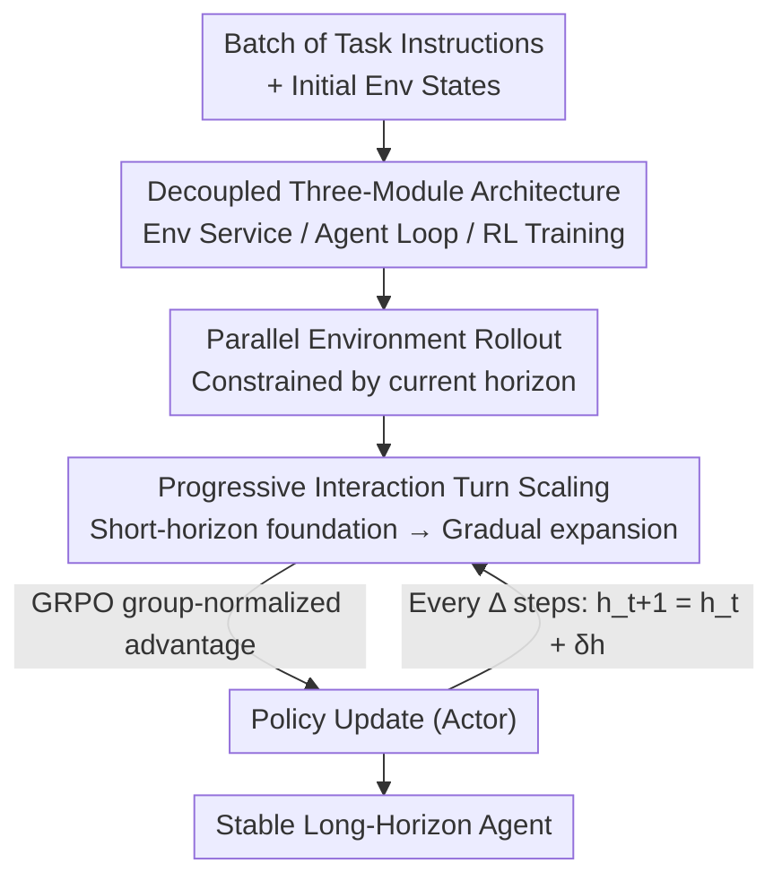

# AgentGym-RL: An Open-Source Framework to Train LLM Agents for Long-Horizon Decision Making via Multi-Turn RL

**Conference**: ICLR2026  
**OpenReview**: [https://openreview.net/forum?id=ZgCCDwcGwn](https://openreview.net/forum?id=ZgCCDwcGwn)  
**Code**: https://github.com/WooooDyy/AgentGym-RL  
**Area**: Agent / Reinforcement Learning / LLM Training  
**Keywords**: LLM Agent, Multi-Turn RL, Long-Horizon Decision Making, Interactive Environments, Curriculum Learning

## TL;DR
This paper introduces AgentGym-RL, an open-source decoupled multi-turn reinforcement learning framework capable of training LLM agents from scratch across five real-world scenarios: Web Navigation, Deep Search, Digital Games, Embodied Control, and Science Tasks. It proposes ScalingInter-RL—a phased training method that progressively increases the number of interaction turns from short-horizon to long-horizon—enabling a 7B model to match or outperform OpenAI o3 and Gemini-2.5-Pro across 27 tasks.

## Background & Motivation
**Background**: The application of LLMs has expanded from chatbots to autonomous agents capable of long-horizon real-world decision-making. To enable agents to "acquire new skills through active interaction with the environment" like humans, Reinforcement Learning (RL) is the most natural path, having already demonstrated its power in LLM reasoning (o1, DeepSeek-R1). The academic community has begun applying RL to multi-turn interactive agents.

**Limitations of Prior Work**: The open-source community lacks a unified RL framework to train agents from scratch in "diverse and realistic" environments. Existing works either suffer from limited task complexity or monolithic environments, making systematic research into agentic RL difficult. Furthermore, the authors identified a subtle engineering challenge: training long-horizon agents directly with a large interaction budget (e.g., 10 turns) is highly unstable, often leading to training collapse where the model falls into redundant or repetitive invalid actions.

**Key Challenge**: Long-horizon interaction is critical for solving complex tasks, but there is a direct trade-off between interaction budget and training stability—larger interaction turns allow for deeper exploration but cause training collapse, while smaller turns are stable but cap the maximum capability. Additionally, the true bottleneck for capability growth is "external interaction" with the environment rather than just "internal reasoning" within the model.

**Goal**: To decompose the problem into two sub-problems: (1) providing a modular, scalable, unified agentic RL framework covering diverse real-world scenarios; (2) designing a training strategy that can stably scale the number of interaction turns.

**Key Insight**: The authors observed that increasing interaction turns for baseline models during testing yields performance gains that eventually plateau, indicating a lack of inherent capability to solve complex tasks via long-horizon interaction. Since short-horizon training is stable but long-horizon capability is needed, the interaction budget should "grow" progressively during training from short to long.

**Core Idea**: Use a unified, decoupled agentic RL framework (AgentGym-RL) as the foundation, combined with ScalingInter-RL—a curriculum-based strategy that progressively increases interaction turns. This builds a foundational policy with short turns before encouraging deep exploration via expanded horizons, achieving both stability and long-horizon capability.

## Method

### Overall Architecture
AgentGym-RL decomposes an agentic RL system into three modules with clear responsibilities: The **Environment Module** encapsulates each environment as an independent service, exposing HTTP APIs such as `/observation`, `/available_actions`, `/step`, and `/reset`. The **Agent Module** encapsulates the LLM "reasoning-action" loop, processing observations and outputting actions. The **Training Module** provides a unified RL pipeline managing trajectory collection, advantage estimation, policy optimization, and reward shaping, supporting both online (PPO/GRPO/RLOO/REINFORCE++) and offline (SFT/DPO/self-improvement) algorithms. This server-client decoupling enables "plug-and-play" for switching environments, algorithms, or backbones.

The task is modeled as a Partially Observable Markov Decision Process (POMDP) $(U, S, A, O, T, r)$. Given an instruction $u \in U$, the agent generates action sequences $a_k \sim \pi_\theta(\cdot|s_k)$ according to policy $\pi_\theta$. The environment returns observation $o_k$ and transitions the state $T(s_k, a_k) = s_{k+1}$. After $N$ interaction turns, an outcome reward $r(\tau) \in [0,1]$ is provided. The optimization objective is the standard expected return $J(\theta) = \mathbb{E}_{\tau \sim \pi_\theta}[r(\tau)]$.

The core algorithm contribution is **ScalingInter-RL**, which does not modify the RL algorithm itself but instead employs a curriculum for the maximum interaction turns that increases monotonically with training steps.

### Key Designs

**1. Decoupled Environment-Agent-Training Architecture: Making Agentic RL Plug-and-Play**

Previous agentic RL efforts often coupled environments, agents, and algorithms, requiring total code rewrites for new environments. AgentGym-RL decouples these: each environment is a service (supporting multiple replicas for parallelism) communicating via HTTP using standard APIs; the agent module only handles observations and actions; the training module manages the RL lifecycle. This separation allows researchers to compare algorithms fairly on the same infrastructure across heterogeneous scenarios.

**2. Five Heterogeneous Real-World Scenarios: Forcing Real Decision-Making Capabilities**

The framework includes five highly distinct environments: WebArena (Web Navigation), RAG-based environments (Deep Search), TextCraft (Digital Games), BabyAI (Embodied Control), and SciWorld (Science Tasks). They differ significantly in state spaces, action spaces, and reward structures—from rule-clear simulations (TextCraft/SciWorld) to open, noisy real-world feedback (WebArena/Deep Search). This cross-domain heterogeneity serves as a litmus test, preventing the agent from relying on task-specific shortcuts.

**3. ScalingInter-RL Progressive Interaction Horizon: Solving the Long-Horizon Exploration vs. Stability Dilemma**

Directly training with long horizons (e.g., fixed at 10 turns) leads to collapse as models get lost in repetitive invalid actions. ScalingInter-RL sets a monotonically increasing curriculum for the interaction limit $\{h_1 < h_2 < \cdots < h_n\}$. Initially, a short horizon allows the agent to focus on exploitation to master basic skills. As training progresses, the horizon is expanded ($h_{t+1} = h_t + \delta_h$) to encourage deeper exploration. This "foundation first" approach avoids high-variance collapses in massive trajectory spaces.

**4. GRPO as the Default Optimizer: Suppressing Gradient Variance via Group Normalization**

The framework recommends GRPO (Group Relative Policy Optimization). By sampling multiple trajectories for the same query and using their mean as a baseline for normalization, GRPO mitigates the impact of outliers and provides more robust optimization compared to REINFORCE++, which normalizes across a batch.

### Loss & Training
Optimization follows policy gradient methods, where the gradient is estimated as $\nabla_\theta J(\theta) = \mathbb{E}_{\tau \sim \pi_\theta}\left[r(\tau)\sum_{k=0}^{K}\nabla_\theta \log \pi_\theta(a_k|s_k)\right]$. GRPO is used for group-normalized advantages. Backbones are Qwen2.5-3B and Qwen2.5-7B using the ReAct paradigm. Phase transitions in ScalingInter-RL are based on total optimization steps.

## Key Experimental Results

### Main Results
The framework was tested on 27 tasks across 5 scenarios. Open-source models trained with AgentGym-RL saw an average improvement of 33.65 points, matching or exceeding OpenAI o3 and Gemini-2.5-Pro. Below is an excerpt of Overall (%) performance on the Deep Search benchmark:

| Model | NQ | TriviaQA | HotpotQA | 2Wiki | Overall |
|------|------|------|------|------|------|
| GPT-4o | 20.0 | 70.0 | 30.0 | 32.0 | 26.8 |
| Gemini-2.5-Pro | 22.0 | 62.0 | 28.0 | 48.0 | 36.5 |
| OpenAI o3 | 28.0 | 70.0 | 46.0 | 64.0 | **49.5** |
| Qwen2.5-7B-Instruct (Baseline) | 18.0 | 54.0 | 18.0 | 6.0 | 18.8 |
| AgentGym-RL-7B | 44.0 | 64.0 | 40.0 | 36.0 | 34.0 |
| ScalingInter-7B | 52.0 | 70.0 | 42.0 | 44.0 | **38.3** |

ScalingInter-RL-7B achieved a 61.8% success rate on average, significantly outperforming Llama3.1-70B (46.9%) and Qwen2.5-72B (42.8%), suggesting that post-training and inference-time compute are more efficient than merely increasing parameter count.

### Ablation Study
ScalingInter-RL curriculum hyperparameter ablation (Deep Search):

| Horizon Schedule | Transition Freq | Performance |
|------|------|------|
| [5,8,10] | 100 | 38.3 |
| [5,8,10] | 125 | 38.5 |
| [3,8,13] | 100 | 36.8 |
| [5,10,15] | 100 | **39.1** |

RL Algorithm Ablation (GRPO vs. REINFORCE++):

| Configuration | TextCraft | BabyAI | SearchQA |
|------|------|------|------|
| 3B GRPO | 75.00 | 93.33 | 25.75 |
| 7B GRPO | 89.00 | 92.22 | 34.00 |
| 7B REINFORCE++ | 73.00 | 84.44 | 24.00 |

### Key Findings
- **Progressive horizon is critical for stable long-horizon training**: Fixed 10-turn training collapses into redundant actions; ScalingInter-RL is stable and reaches higher performance.
- **GRPO provides algorithm-level benefits**: 3B-GRPO outperforms 7B-REINFORCE++, highlighting the importance of lower-variance optimization.
- **Environment type determines RL gains**: Benefits are highest in clear, causal simulated worlds (SciWorld +~50 points) and more limited in noisy open environments.
- **Test-time interactions scale**: Models consistently improve with more turns; ScalingInter-RL agents lead significantly, with Pass@2 on SciWorld outperforming baseline Pass@64.

## Highlights & Insights
- **Scaling external interaction over internal reasoning**: Shifting the focus from inference-compute scaling (o1) to interaction-compute scaling for agents is a significant conceptual direction.
- **Progressive horizon scheduling as a reusable trick**: This "short-to-long" curriculum can be applied to any long-horizon agent task (tool use, coding agents) to stabilize RL training.
- **Engineering value of decoupled architecture**: Separating environment, agent, and training modules transforms agentic RL from ad-hoc scripts into a reproducible, modular research pipeline.
- **The "Aha!" Moment**: A 7B model using the right training paradigm (RL + progressive interaction) can match 100B+ parameter closed-source models.

## Limitations & Future Work
- **Limited gains in open noisy environments**: High complexity and noisy feedback in WebArena and Deep Search mean RL gains are smaller, indicating sensitivity to reward signal quality.
- **Gap with top closed-source models**: ScalingInter-7B still trails OpenAI o3 significantly in the most difficult search tasks.
- **Reliance on outcome rewards**: The use of sparse rewards makes credit assignment difficult in very long horizons; future work should focus on reward/feedback structure design.
- **Details on adaptive increments**: The specific mechanism for $\delta_h$ is briefly mentioned; curriculum design currently still requires some expertise.

## Related Work & Insights
- **vs. AgentGym (Xi et al., 2025b)**: While AgentGym provides basic environments, it focuses on SFT; AgentGym-RL makes online RL the core of the training stack for self-improvement.
- **vs. Inference-Compute Scaling (o1/R1)**: While o1 scales internal reasoning, this work scales external interaction budget, extending the scaling laws of LLMs into the interactive agent domain.

## Rating
- Novelty: ⭐⭐⭐⭐ (Progressive horizon training is a clear conceptual contribution)
- Experimental Thoroughness: ⭐⭐⭐⭐⭐ (27 tasks across 5 scenarios with extensive scaling analysis)
- Writing Quality: ⭐⭐⭐⭐ (Logically clear, though some scheduling details are relegated to the appendix)
- Value: ⭐⭐⭐⭐⭐ (Direct infrastructure contribution for the community to perform agentic RL)

<!-- RELATED:START -->

## Related Papers

- [\[ICLR 2026\] LLMs are Greedy Agents: Effects of RL Fine-tuning on Decision-Making Abilities](llms_are_greedy_agents_effects_of_rl_fine-tuning_on_decision-making_abilities.md)
- [\[ICLR 2026\] Unlocking Long-Horizon Agentic Search with Large-Scale End-to-End RL](unlocking_long-horizon_agentic_search_with_large-scale_end-to-end_rl.md)
- [\[ACL 2026\] SOLAR-RL: Semi-Online Long-horizon Assignment Reinforcement Learning](../../ACL2026/llm_agent/solar-rl_semi-online_long-horizon_assignment_reinforcement_learning.md)
- [\[ICLR 2026\] Solving the Granularity Mismatch: Hierarchical Preference Learning for Long-Horizon LLM Agents](solving_the_granularity_mismatch_hierarchical_preference_learning_for_long-horiz.md)
- [\[ICLR 2026\] Meta-RL Induces Exploration in Language Agents](meta-rl_induces_exploration_in_language_agents.md)

<!-- RELATED:END -->
