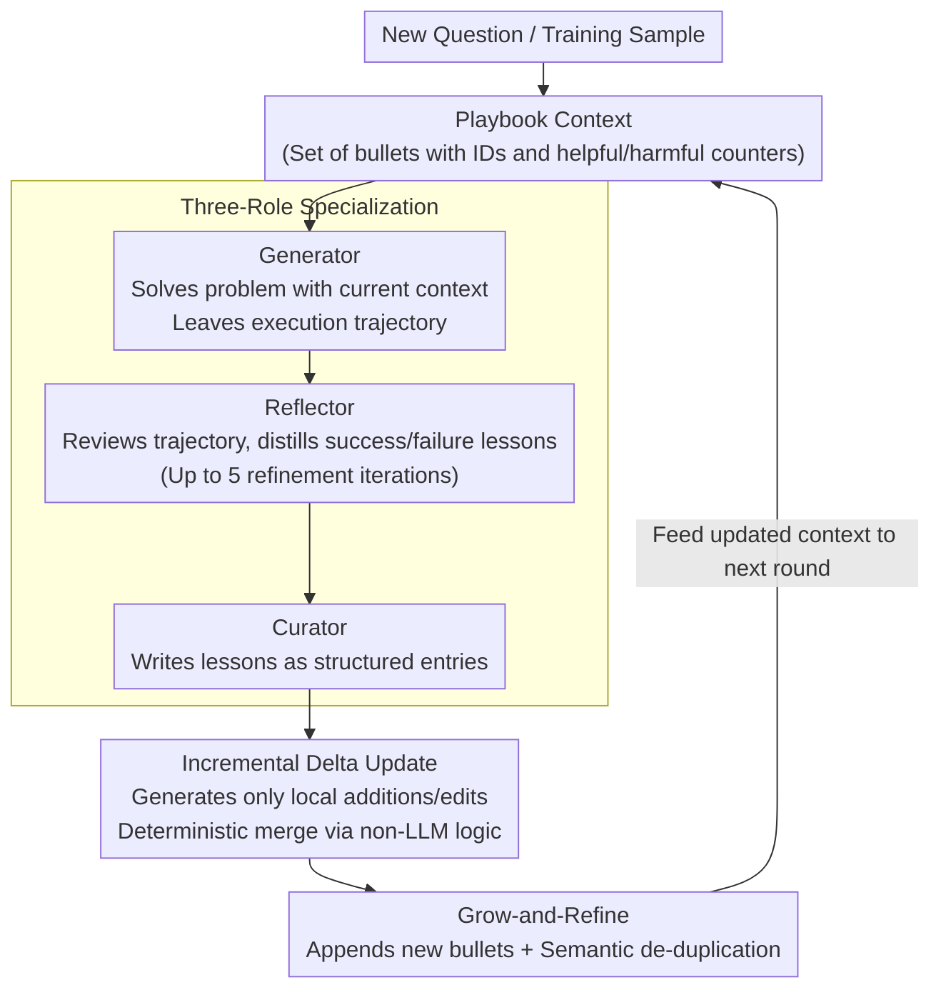

# Agentic Context Engineering: Evolving Contexts for Self-Improving Language Models

**Conference**: ICLR 2026  
**arXiv**: [2510.04618](https://arxiv.org/abs/2510.04618)  
**Code**: [https://github.com/ace-agent/ace](https://github.com/ace-agent/ace)  
**Area**: Agent  
**Keywords**: context engineering, self-improving agent, prompt optimization, evolving memory, playbook  

## TL;DR
The ACE (Agentic Context Engineering) framework proposes treating context as a continuously evolving "playbook." By utilizing a division of labor among Generator-Reflector-Curator roles and incremental delta updates, it continuously accumulates and refines strategies. This addresses brevity bias and context collapse in existing prompt optimization methods, achieving an average improvement of 10.6% on agent tasks and 8.6% on financial tasks, while reducing adaptation latency by 86.9%.

## Background & Motivation
**Background**: Context adaptation (improving performance by modifying LLM inputs rather than weights) has become a core paradigm for building scalable AI systems. Existing methods include prompt optimization (GEPA, MIPROv2) and test-time memory (Dynamic Cheatsheet).

**Limitations of Prior Work**: (1) **Brevity bias**: Most prompt optimizers pursue concise and general instructions, compressing away domain-specific strategies, tool-use guidelines, and common failure modes. (2) **Context collapse**: Monolithic rewriting approaches gradually degrade into shorter, less informative summaries during iterations—experiments observed context suddenly collapsing from 18,282 tokens to 122 tokens, leading to a sharp drop in performance.

**Key Challenge**: Agents and knowledge-intensive applications require **comprehensive and detailed** domain knowledge, yet existing methods tend to compress this information. Unlike humans, who benefit from concise summaries, LLMs often perform better with detailed context.

**Goal**: How can we build a context adaptation method that continuously accumulates knowledge without collapse or degradation?

**Key Insight**: Treat context as an "evolving playbook" rather than an "optimized prompt," using structured incremental updates instead of holistic rewriting.

**Core Idea**: Context should be a continuously growing and refined strategy manual, not a compressed, concise instruction.

## Method

### Overall Architecture
ACE aims to solve the problem where context becomes shorter and knowledge is lost through repeated iterations. It treats context as an "evolving playbook" maintained by a pipeline of three specialized roles: the **Generator** uses the current context to solve new problems and leaves a full execution trajectory; the **Reflector** reviews these trajectories to distill successful practices and specific lessons from failures; and the **Curator** translates these lessons into structured local changes (**deltas**) to append to or modify the existing context. The updated playbook is fed back into the next round, forming a continuous self-improvement loop. This process can run offline (iterating over a training set to produce an optimized system prompt) or online (updating per sample during testing as test-time memory).

### Key Designs

**1. Three-Role Specialization: Separating "Solving, Reflecting, and Archiving" to avoid single-model bottlenecks.**

Existing methods often collapse generation, evaluation, and rewriting into a single model call, leading to insufficient reflection and entangled responsibilities. ACE splits this into three specialized roles: the **Generator** is responsible for actual problem-solving to expose real success and failure trajectories; the **Reflector** focuses on "reviewing," extracting actionable strategies and lessons from trajectories through multiple refinement iterations (up to 5); and the **Curator** purely manages the integration of these insights into structured entries. This allows each stage to focus on a specific task, and ablation studies confirm that the Reflector role is a primary source of performance gains.

**2. Incremental Delta Updates: Modifying only local bullets to fundamentally prevent context collapse.**

This is the core design addressing the "monolithic rewriting leading to context collapse" pain point. Instead of representing context as a single block of text prone to full rewriting, ACE represents it as a set of structured bullets—each with a unique ID, a pair of "helpful/harmful" counters, and specific content. During each adaptation, the model generates only minor deltas (new bullets or local modifications to existing ones), which are deterministically merged by a lightweight non-LLM logic. Since the system never performs a full-text rewrite, knowledge can only be appended or tuned in place, preventing the accidental compression observed in other methods (e.g., from 18,282 tokens to 122 tokens). This also accounts for the 86.9% reduction in latency: local deltas are far cheaper than full-text rewriting.

**3. Grow-and-Refine: Balancing continuous growth and redundancy control.**

Simply performing additions would eventually cause the context to exceed the window. **Grow-and-Refine** pairs growth with a cleaning mechanism: new bullets are appended, existing bullets are updated in place (e.g., incrementing counters), and semantic embeddings are used for pairwise comparison to remove duplicate entries (**de-duplication**). This de-duplication can be performed proactively after each delta or triggered lazily when the context approaches the window limit. Through this mechanism, the playbook grows without unbound expansion, maintaining a controllable scale.

### Loss & Training
ACE does not train any model weights; it is a pure context adaptation method. In **offline mode**, it runs multiple epochs (up to 5) over a training set to iteratively build the context. In **online mode**, it updates per sample during testing with a batch size of 1, and the Reflector refines insights up to 5 times per sample. Notably, it can function without ground-truth labels—by utilizing execution feedback (e.g., whether code runs or returns an error) as a natural signal, the Reflector can distill lessons, enabling unsupervised self-improvement.

## Key Experimental Results

### Main Results (AppWorld Agent Benchmark)

| Method | Requires Labels | Test-Normal TGC | Test-Challenge TGC | Average |
|------|---------|----------------|-------------------|---------|
| ReAct baseline | - | 63.7 | 41.5 | 42.4 |
| + ICL | ✓ | 64.3 | 46.0 | 46.0 |
| + GEPA | ✓ | 64.9 | 46.0 | 46.4 |
| **+ ACE (Labeled)** | ✓ | **76.2** | **57.3** | **59.4** |
| + ACE (Unlabeled) | ✗ | 75.0 | 54.4 | 57.2 |
| + DC (online) | ✗ | 65.5 | 52.3 | 51.9 |
| **+ ACE (online)** | ✗ | **69.6** | **66.0** | **59.5** |

### Ablation Study (Financial Benchmark)

| Method | FiNER Acc | Formula Acc | Average |
|------|-----------|-------------|---------|
| Base LLM | 70.7 | 67.5 | 69.1 |
| GEPA | 73.5 | 71.5 | 72.5 |
| **ACE** | **78.3** | **85.5** | **81.9** |

### Key Findings
- ACE achieves a 17% average improvement on AppWorld (offline labeled). Using the open-source DeepSeek-V3.1, it reached the performance level of the GPT-4.o-driven IBM CUGA (ranked 1st) and surpassed it on the harder "test-challenge" split.
- **Strong Unsupervised Performance**: Even without labels, ACE improves performance by 14.8% by utilizing execution feedback for self-improvement.
- On financial tasks, ACE outperforms GEPA by 9.4% (72.5 → 81.9), demonstrating the advantage of accumulating domain knowledge for knowledge-intensive tasks.
- Adaptation latency is reduced by 86.9% because incremental delta updates are much faster than full-text rewriting.
- Ablations confirm that the Reflector role and multi-epoch refinement contribute significantly to the total gain.

## Highlights & Insights
- **Conceptual Shift to "Playbook, not Prompt"**: Context should not be compressed; it should be continuously enriched. This aligns with trends like RAG and long-context, providing a clear design philosophy for context engineering.
- **Incremental Delta Updates as a Key Innovation**: This effectively eliminates context collapse and allows for parallel merging, serving as a simple yet highly effective engineering design.
- **Unsupervised Self-Improvement**: The ability to build an effective context solely from execution feedback paves the way for true self-improving agents.
- **Reusable Three-Role Pattern**: The Generator-Reflector-Curator pattern can be migrated to other LLM systems that need to learn from experience.

## Limitations & Future Work
- As the number of bullets grows, the context may exceed the window limit, requiring smarter retrieval or compression strategies.
- De-duplication depends on the quality of semantic embeddings; bullets that are similar but not identical might still accumulate.
- The requirement for Generator/Reflector/Curator to use the same model limits the flexibility of using different model sizes to optimize costs.
- Order dependency in online mode (earlier samples affecting subsequent context) has not been analyzed for potential bias.

## Related Work & Insights
- **vs. Dynamic Cheatsheet**: ACE builds upon DC but solves the context collapse issue by introducing the Reflector and delta update mechanisms.
- **vs. GEPA**: GEPA is a prompt optimizer (pursuing concise prompts), while ACE is context engineering (pursuing comprehensive playbooks). ACE significantly outperforms GEPA in agentic and financial tasks.
- **vs. TextGrad**: While TextGrad uses gradient-like textual feedback to optimize prompts, ACE uses structured bullets to accumulate strategies, avoiding information loss caused by rewriting.

## Supplementary Discussion

### Why is Context Engineering More Important than Prompt Engineering?
Prompt Engineering is static—the system prompt is fixed once written. Context Engineering is dynamic—the context evolves based on the agent's operational experience, better matching the needs of agents in complex environments. The playbook's delta update mechanism is the concrete implementation of this philosophy.

## Rating
- Novelty: ⭐⭐⭐⭐ The "evolving playbook" concept and delta update design are practically innovative.
- Experimental Thoroughness: ⭐⭐⭐⭐⭐ Two categories of benchmarks, multiple baselines, thorough ablations, and leaderboard comparisons.
- Writing Quality: ⭐⭐⭐⭐⭐ Clear motivation, persuasive concepts, and smooth narrative.
- Value: ⭐⭐⭐⭐⭐ A significant work in the field of context engineering with high practical utility.

<!-- RELATED:START -->

## Related Papers

- [\[ICLR 2026\] EvoTest: Evolutionary Test-Time Learning for Self-Improving Agentic Systems](evotest_evolutionary_test-time_learning_for_self-improving_agentic_systems.md)
- [\[ICLR 2026\] AlphaAgentEvo: Evolution-Oriented Alpha Mining via Self-Evolving Agentic Reinforcement Learning](alphaagentevo_evolution-oriented_alpha_mining_via_self-evolving_agentic_reinforc.md)
- [\[CVPR 2026\] Resolving Evidence Sparsity: Agentic Context Engineering for Long-Document Understanding](../../CVPR2026/llm_agent/resolving_evidence_sparsity_agentic_context_engineering_for_long-document_unders.md)
- [\[ICLR 2026\] MemGen: Weaving Generative Latent Memory for Self-Evolving Agents](memgen_weaving_generative_latent_memory_for_self-evolving_agents.md)
- [\[ICLR 2026\] Your Agent May Misevolve: Emergent Risks in Self-evolving LLM Agents](your_agent_may_misevolve_emergent_risks_in_self-evolving_llm_agents.md)

<!-- RELATED:END -->
