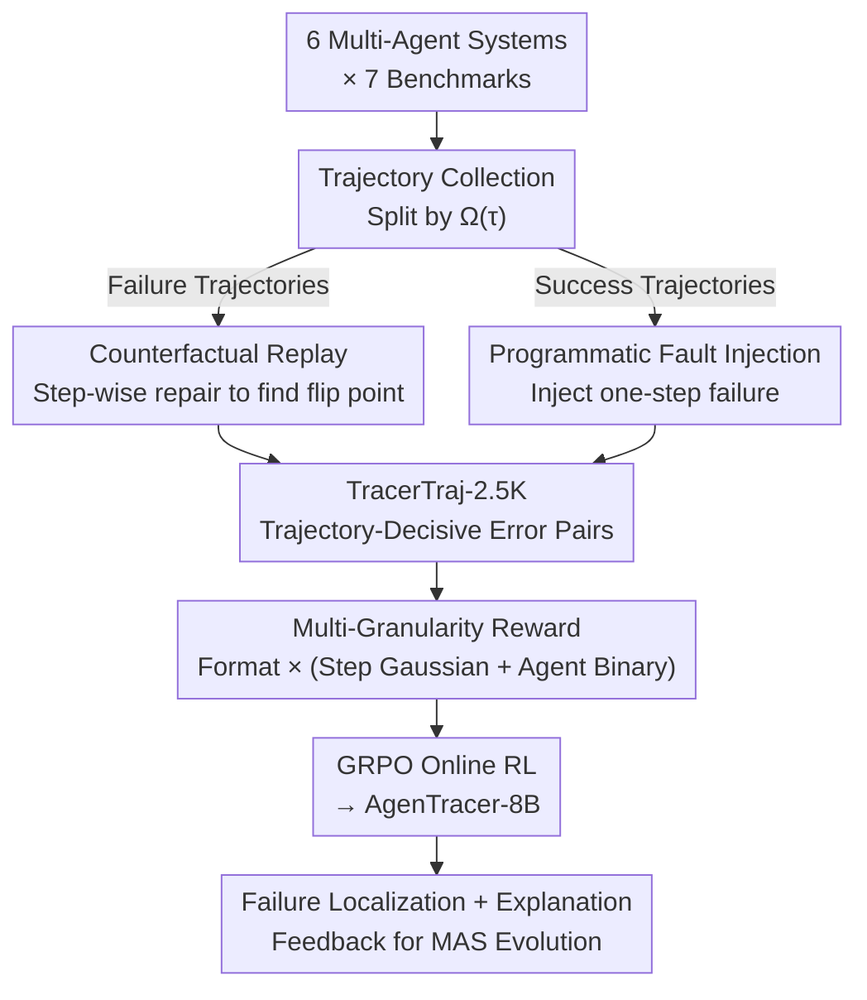

# AgenTracer: Who Is Inducing Failure in the LLM Agentic Systems?

**Conference**: ICLR2026  
**OpenReview**: [https://openreview.net/forum?id=l05DseqvuD](https://openreview.net/forum?id=l05DseqvuD)  
**Code**: https://github.com/bingreeky/AgenTracer  
**Area**: LLM Agent / Multi-Agent Systems / Failure Attribution  
**Keywords**: Failure Attribution, Multi-Agent Systems, Counterfactual Replay, Fault Injection, Reinforcement Learning

## TL;DR
AgenTracer employs "counterfactual replay + programmatic fault injection" to automatically annotate multi-agent failure trajectories, constructing the TracerTraj-2.5K dataset. It then trains a lightweight 8B "failure tracer" using multi-granularity reinforcement learning. On the Who&When benchmark, it localizes decisive errors to specific agents and steps, outperforming giant models like Gemini-1.5-Pro and Claude-3.5-Sonnet by up to 18.18% in agent-level accuracy. Furthermore, providing feedback to off-the-shelf systems like MetaGPT and MaAS leads to performance gains of 4.8~14.2%.

## Background & Motivation
**Background**: Modern complex tasks increasingly rely on LLM multi-agent systems (MAS), where multiple agents collaborate, invoke external tools, and act according to orchestration protocols. These systems significantly outperform monolithic agents in domains like data science, scientific discovery, and software engineering.

**Limitations of Prior Work**: However, this "complexity-for-performance" trade-off comes at the cost of extreme fragility. Empirical studies from UC Berkeley show that popular frameworks like OpenHands and MetaGPT have failure rates as high as 86.7%, with failure modes ranging from improper task decomposition to role non-compliance. Once a task fails, identifying "who messed up and at which step" within a long trajectory spanning dozens of steps across multiple agents—a task known as **failure attribution**—currently relies almost entirely on manual log inspection.

**Key Challenge**: Automated failure attribution is hindered by two factors. First, the **Method**: even the strongest reasoning models (OpenAI-o1, DeepSeek-R1) achieve less than 10% accuracy on GAIA trajectories; giant models are unexpectedly inept at this task. Second, **Training Resources**: available annotated data is extremely scarce—MAST has only 200 samples and Who&When has only 127 manually annotated trajectories, which is insufficient to train a dedicated tracer.

**Goal**: ① Build a pipeline for large-scale automated annotation of multi-agent failure trajectories; ② Train a fast and accurate failure locator capable of understanding long-range collaborative trajectories.

**Key Insight**: The authors focus on the concept of the **decisive error**: while a failure trajectory may contain many minor deviations, accountability lies with the "earliest action whose correction would suffice to flip the system from failure to success." Reliably identifying this $(i^*, t^*)$ (erroneous agent and decisive step) allows for automated data generation and clear training objectives.

**Core Idea**: Use "counterfactual step-level repair" to automatically annotate decisive errors and use this data to train a small model via reinforcement learning specifically for failure tracking.

## Method

### Overall Architecture
AgenTracer consists of two main components: the **AgenTracer pipeline** (automated trajectory annotation) and **AgenTracer-8B** (tracer training).

First, raw trajectories are collected from 6 multi-agent systems with varying degrees of automation across 7 benchmarks (coding, general agents, mathematics). Trajectories are categorized into success sets $T_{\text{succ}}$ and failure sets $T_{\text{fail}}$ based on the system evaluation function $\Omega(\tau)\in\{0,1\}$. For failure trajectories, **counterfactual replay** is used to iteratively attempt repairs to find the earliest flipping point. For success trajectories, **programmatic fault injection** is used to intentionally disrupt a step, creating synthetic failure samples with known "decisive errors." These annotations are combined into **TracerTraj-2.5K** (2000+ high-fidelity trajectory-error pairs). Finally, using Qwen2.5-7B (referred to as Qwen3-8B in the context of recent naming trends) as a backbone, AgenTracer-8B is trained via GRPO online RL with **multi-granularity rewards**. It takes a failure trajectory and environment feedback as input and outputs the decisive step and agent; at inference time, it provides rapid localization and explanation for MAS self-correction.

### Key Designs

**1. Counterfactual Replay: Anchoring Decisive Errors via "Minimal Repair Flipping"**

Human difficulty in attribution stems from the mixing of minor deviations and fatal errors. The authors formalize the decisive error: let $\Omega(\tau)$ be the binary evaluation and $R(\tau, t, a'_t)$ be a correction operator that replaces action $a_t$ with $a'_t$ and re-simulates all subsequent steps. The set of decisive agent-step pairs is:

$$C(\tau) = \{(i, t)\mid i=\mu(t)\ \text{and}\ \Omega(\tau)=0\ \wedge\ \Omega(R(\tau, t, a'_t))=1\},\quad (i^*, t^*)=\arg\min_{(i,t)\in C(\tau)} t$$

This represents the earliest step that, if corrected, flips the result. In practice, an analyzer agent $\pi_{\text{analyzer}}$ (based on DeepSeek-R1) performs counterfactual intervention. It receives the full failure context—trajectory $\tau$, environment feedback $F$, and ground truth solution $G$—and proposes a **minimally invasive** correction $a'_t \leftarrow \pi_{\text{analyzer}}(s_t, a_t, H_t, F, G)$, repairing local errors without leaking the full answer. By checking steps from $t=0$, the first step satisfying the flip condition is identified as $t^*$, and the active agent $i^*=\mu(t^*)$ is the culprit. This is more reliable than direct LLM guessing because every label is verified by actual success post-repair.

**2. Programmatic Fault Injection: Synthesizing High-Precision Samples from Successes**

Relying solely on failure trajectories limits data scale and diversity. The authors reverse the process: given a successful trajectory $\tau\in T_{\text{succ}}$, a random step is selected for disruption using a perturbation operator $\Pi$ (also based on DeepSeek-R1), yielding $\tilde{a}_t=\Pi(a_t)$ and a new trajectory $\tilde{\tau}=R(\tau, t, \tilde{a}_t)$. If this injection turns success into failure ($\Omega(\tilde{\tau})=0$), then by construction, $\langle\mu(t), t\rangle$ is the decisive error—the label is **inherently known with zero noise**:

$$D^+ = \{(\tilde{\tau}, \langle i^*, t^* \rangle)\mid \tau\in T_{\text{succ}},\ \tilde{\tau}=R(\tau, t, \Pi(a_t)),\ \Omega(\tilde{\tau})=0,\ \langle i^*, t^*\rangle=\langle\mu(t), t\rangle\}$$

This $D^+$ is merged with $D^-$ from counterfactual replay to form TracerTraj-2.5K. The two paths are complementary: replay ensures coverage of real-world failure distributions, while injection ensures label precision and scalability.

**3. Multi-Granularity Reward: Gated "Format × (Step Gaussian + Agent Binary)"**

Failure localization is a sparse signal—step numbers are either right or wrong. Direct 0/1 rewards are unstable. The authors design a gated multi-granularity reward for a prediction $\hat{p}_k=\langle\hat{i}_k, \hat{t}_k\rangle$:

$$R(\hat{p}_k) = \mathbb{I}_{\text{format}}\cdot\big(\lambda\cdot r_{\text{step}}(\hat{t}_k) + (1-\lambda)\cdot r_{\text{agent}}(\hat{i}_k)\big)$$

**Format reward** $\mathbb{I}_{\text{format}}$ is a strict binary gate ensuring reasoning is wrapped in `<think>` and answers in `<answer>` with the format `<agentID>|<stepID>`. **Agent-level reward** $r_{\text{agent}}(\hat{i}_k)=\mathbb{I}(\hat{i}_k=i^*)$ is a coarse binary signal. **Step-level reward** uses a Gaussian kernel to allow the reward to decay smoothly as the predicted step deviates from the truth:

$$r_{\text{step}}(\hat{t}_k) = \exp\!\left(-\frac{(\hat{t}_k - t^*)^2}{2\sigma^2}\right)$$

This Gaussian kernel grants partial credit to "near-miss" predictions, smoothing the 0/1 optimization landscape and stabilizing RL. $\lambda=0.5$ balances agent and step precision.

**4. KR-free, Dynamic Clipping GRPO: Enabling Small Models to Read Long Trajectories**

Using the Group Relative Policy Optimization (GRPO) algorithm, the authors train the backbone. For each trajectory $\tau$, the old policy $\pi_{\text{old}}$ samples $G$ candidates. Advantage $A_k$ is calculated from multi-granularity rewards. Following RLVR practices, the KL divergence term is removed, and a dynamic clipping parameter is introduced:

$$B_s = \max\!\Big(0.2\cdot B_0,\ B_0\big(1-\tfrac{s}{S_{\text{total}}}\big)\Big)$$

This parameter tightens as training progresses, encouraging exploration early on and stability later. This allows an 8B model to maintain accuracy across dozens of interaction steps.

### Loss & Training
The RL objective (GRPO with dynamic clipping):

$$\mathcal{L}_{\text{RL}} = -\mathbb{E}_{\tau,\{\hat{p}_k\}}\!\left[\frac{1}{G}\sum_{k=1}^{G}\min\big(\rho_k A_k,\ \text{clip}(\rho_k, 1-B_s, 1+B_s)A_k\big)\right]$$

where $\rho_k=\pi_{\text{tracer}}(\hat{p}_k|\tau)/\pi_{\text{old}}(\hat{p}_k|\tau)$. Key hyperparameters: batch size 32, rollout 8, learning rate $1\times10^{-6}$, $\lambda=0.5$, $\sigma=1$. Training implemented on the verl platform with 8×H100.

## Key Experimental Results

### Main Results
Performance on the Who&When benchmark (Handcraft vs. Automated subsets, Agent-level vs. Step-level, left: w/ Ground truth $G$, right: w/o $G$):

| Model | Handcraft Agent | Handcraft Step | Automated Agent | Automated Step |
|------|------|------|------|------|
| Qwen2.5-7B (Base) | 42.10/39.50 | 1.72/3.45 | 58.73/60.32 | 3.97/5.56 |
| GPT-4o | 43.10/37.93 | 3.44/3.44 | 55.55/59.52 | 29.52/21.90 |
| DeepSeek-R1 | 56.90/53.44 | 13.29/6.90 | 66.67/65.08 | 31.32/29.52 |
| Gemini-1.5-Pro | 51.72/51.72 | 9.72/6.90 | 61.11/57.14 | 29.52/25.86 |
| Claude-3.5-Sonnet | 56.90/50.00 | 17.24/18.97 | 57.93/51.11 | 40.65/38.83 |
| **AgenTracer-8B** | **69.10/63.82** | **20.68/20.68** | **69.62/63.73** | **42.86/37.30** |

AgenTracer-8B reaches 69.10% on handcraft agent-level (w/ G), 26.0% higher than GPT-4o and 12.2% higher than Claude-3.5-Sonnet. It also leads across all TracerTraj subsets (Code/MATH/Agentic).

### Downstream Gains
Integrating AgenTracer-8B feedback into existing MAS (MetaGPT, MaAS, OWL) for multi-round self-correction yields **4.8~14.2%** performance improvements over baselines like Self-Refine and CRITIC across GAIA, MATH-500, and HumanEval-Plus.

### Key Findings
- **Giant models are surprisingly ineffective at failure attribution**: Most models achieve <10% step-level accuracy on Who&When handcraft; even R1 and GPT-4o struggle with automated sets.
- **Ground Truth $G$ can be misleading**: On TracerTraj-math, Claude-3.5-Sonnet's accuracy drops from 50.79% to 46.03% when given $G$. AgenTracer remains robust in the more realistic w/o G setting.
- **Multi-path labeling + multi-granularity rewards are the performance drivers**: Counterfactuals ensure coverage, injection ensures precision, and Gaussian rewards stabilize RL.

## Highlights & Insights
- **Using "minimal repair flipping" as a label signal** is the most elegant contribution. It defines decisive errors through causal counterfactuals, making them grounded and verifiable compared to subjective guessing.
- **Bidirectional data generation**: Combining failure replay and success injection solves the data scarcity bottleneck. This "reverse generation from success" can generalize to any sequence task requiring fine-grained error annotation (e.g., credit assignment in RL).
- **Small model outperforming giants**: This reinforces the idea that for specialized tasks, high-quality data and tailored rewards allow an 8B model to surpass general-purpose giants, with the added benefit of low inference cost for production debugging.

## Limitations & Future Work
- **Dependency on DeepSeek-R1**: The labeling quality is capped by the external model's ability to propose valid "ideal corrections."
- **High Counterfactual Replay Cost**: Iterative repair and re-simulation are computationally expensive for long trajectories.
- **Single Earliest Decisive Error Assumption**: Real failures might involve coupled errors; the assumption that correcting the "earliest" step is always sufficient requires further nuance.
- **Absolute Step-level Accuracy**: Though SOTA, a ~20% accuracy on handcraft steps suggests fine-grained localization remains challenging.

## Related Work & Insights
- **Comparison with Who&When**: Who&When defined the task and identified the failure of LLMs but lacked scalable data synthesis; AgenTracer provides a complete pipeline and a deployable tracer.
- **Comparison with MAST**: MAST categorized 14 failure types but focused on analysis with limited samples; AgenTracer focuses on automated localization and system improvement.
- **Comparison with LLM-as-a-Judge**: AgenTracer relies on grounded counterfactual verification rather than subjective scoring.

## Rating
- Novelty: ⭐⭐⭐⭐⭐ (Elegant use of counterfactuals for grounded attribution).
- Experimental Thoroughness: ⭐⭐⭐⭐ (Extensive benchmarks, but more discussion on scalability would be beneficial).
- Writing Quality: ⭐⭐⭐⭐⭐ (Clear formalization and well-structured arguments).
- Value: ⭐⭐⭐⭐⭐ (High engineering value for debugging and evolving MAS).

<!-- RELATED:START -->

## Related Papers

- [\[ICLR 2026\] CoDA: Agentic Systems for Collaborative Data Visualization](coda_agentic_systems_for_collaborative_data_visualization.md)
- [\[ICLR 2026\] EvoTest: Evolutionary Test-Time Learning for Self-Improving Agentic Systems](evotest_evolutionary_test-time_learning_for_self-improving_agentic_systems.md)
- [\[ICML 2026\] AgentXRay: White-Boxing Agentic Systems via Workflow Reconstruction](../../ICML2026/llm_agent/agentxray_white-boxing_agentic_systems_via_workflow_reconstruction.md)
- [\[ACL 2026\] FAMA: Failure-Aware Meta-Agentic Framework for Open-Source LLMs in Interactive Tool Use Environments](../../ACL2026/llm_agent/fama_failure-aware_meta-agentic_framework_for_open-source_llms_in_interactive_to.md)
- [\[ICLR 2026\] Helmsman: Autonomous Synthesis of Federated Learning Systems via Collaborative LLM Agents](helmsman_autonomous_synthesis_of_federated_learning_systems_via_collaborative_ll.md)

<!-- RELATED:END -->
