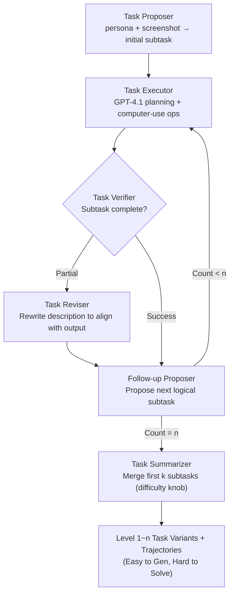

# AgentSynth: Scalable Task Generation for Generalist Computer-Use Agents

**Conference**: ICLR 2026  
**arXiv**: [2506.14205](https://arxiv.org/abs/2506.14205)  
**Code**: [https://github.com/sunblaze-ucb/AgentSynth](https://github.com/sunblaze-ucb/AgentSynth)  
**Area**: LLM Agent  
**Keywords**: Synthetic Data Generation, Computer-Use Agents, Information Asymmetry, Task Chaining, Long-Horizon Task Benchmark  

## TL;DR
The AgentSynth pipeline leverages the principle of information asymmetry—where forward step-by-step generation of simple tasks is easy, while backward holistic solving is difficult—to chain simple subtasks into complex long-horizon computer-use tasks. It automatically generates 6000+ diverse tasks and trajectories at only $0.60 per trajectory, while SOTA agents achieve only a 4% success rate at the highest difficulty level.

## Background & Motivation

**Background**: LLM agents are rapidly advancing in computer-use tasks (web navigation, desktop operations), but high-quality training and evaluation data rely heavily on human annotation.

**Limitations of Prior Work**: (a) Human annotation is prohibitively expensive (e.g., TheAgentCompany costs 17 hours and $34-425 per task); (b) Human-annotated diversity is limited and fails to cover the full complexity of real-world scenarios; (c) Synthetic data pipelines face two core challenges—current LLM agents cannot reliably generate trajectories for complex tasks, and simple generation strategies lack diversity.

**Key Challenge**: High-quality agent data requires complex and diverse tasks, yet LLM agents can only reliably complete simple tasks. How can this contradiction be reconciled?

**Goal**: Design a low-cost, high-diversity, fully automated pipeline to generate realistic computer-use tasks with controllable difficulty and corresponding trajectories.

**Key Insight**: Utilize **information asymmetry**—solving tasks forward step-by-step (where each step only requires completing a simple subtask) is far easier than reasoning the entire solution from scratch. Therefore, the agent generates subtasks forward and collects trajectories, which a summarizer then merges into a single high-level composite task.

**Core Idea**: Decompose complex tasks into a sequence of simple subtasks for forward generation, then merge them backward into seemingly unified long-horizon tasks—easy to generate, difficult to solve.

## Method

### Overall Architecture
The core contradiction AgentSynth addresses is that high-quality agent data requires complexity, but current agents only succeed at simplicity. The solution is to decouple "generation" from "solving." Within the OSWorld virtual desktop environment, six LLM-based agents work in relay to forward-build a trajectory composed of simple subtasks, which are then externally merged into a composite long-horizon task.

The pipeline functions as follows: The Task Proposer initiates the first subtask based on a random persona and desktop screenshot. The Task Executor executes it and records the trajectory. The Task Verifier determines completion; if it fails, the Task Reviser corrects the task description; if successful, the Follow-up Proposer suggests the next logically continuous subtask. This iterates for $n$ subtasks. Finally, the Task Summarizer merges the "first 1, first 2, ..., first $n$" subtasks respectively, naturally producing a set of task variants with difficulties ranging from 1 to $n$. For safety, all tasks are executed in a virtual machine, and sensitive operations like login credentials or email sending are prohibited.

### Key Designs

**1. Information Asymmetry Driven Task Construction: Creating challenges through the "Easy Forward, Hard Backward" gap**

This directly addresses the contradiction where agents cannot complete complex tasks but data requires them. The key observation is that forward step-by-step solving and zero-shot planning have vastly different cognitive loads. During generation, each subtask is a simple operation in the current desktop state (completable in a few atomic actions), allowing the agent to provide clean trajectories reliably. However, the merged high-level task description **contains no intermediate step information**, forcing the agent during testing to reason the entire path from scratch. Generation relies on simple tasks to ensure trajectory quality, while evaluation relies on composite tasks for challenge; the gap itself is the source of difficulty.

**2. Six-Agent Collaboration Pipeline: Automating "Propose-Execute-Verify-Revise-Extend-Merge"**

Each of the six agents manages a specific segment, enabling an end-to-end process without human intervention. The Task Proposer ensures diversity using random personas and screenshots. The Task Executor uses a two-stage architecture: GPT-4.1 handles high-level planning, while a computer-use-preview model handles precise coordinate operations. The Task Verifier utilizes a WebJudge-style architecture to extract requirements and select keyframes for success/failure adjudication. When a task is only partially completed, the Task Reviser rewrites the description to ensure trajectory alignment. The Follow-up Proposer maintains logical continuity, and the Task Summarizer abstracts the sequence into a single high-level description.

**3. Controllable Task Difficulty: Using subtask count as a continuous difficulty knob**

Difficulty is determined by the number of subtasks merged by the Summarizer, where Level $k$ corresponds to the first $k$ merged subtasks. This provides a quantifiable physical meaning to difficulty. Level 1 averages ~5 steps across 1.2 applications with a memory span of 2 steps, whereas Level 6 averages ~45 steps across 3.3 applications with a memory span of 18 steps and 4.3 application switches. Unlike existing benchmarks that lack systematic difficulty control, this approach allows for precise mapping of agent capability boundaries.

### A Complete Example
Take a Level 3 task: The Task Proposer sees a file manager and generates subtask 1: "Create a folder named 'report' in Documents." The Executor succeeds. The Follow-up Proposer then suggests subtask 2: "Move 'data.csv' from Downloads to 'report'," followed by subtask 3: "Open it with spreadsheet software and calculate the sum of a column." Three simple subtasks are reliably completed. Finally, the Summarizer merges them into: "Organize the downloaded sales data and summarize it in the report folder." The intermediate steps (create, move, open, sum) do not appear in the description. The test agent must infer the entire cross-app path, making the task significantly harder to solve than it was to generate.

## Key Experimental Results

### Main Results
Evaluation of SOTA agents on the generated benchmark (Success Rate %):

| Agent Model | Level 1 | Level 2 | Level 3 | Level 4 | Level 5 | Level 6 |
|-------------|---------|---------|---------|---------|---------|---------|
| SOTA Range  | ~18%    | ~14%    | ~10%    | ~8%     | ~6%     | ~4%     |

Success rates plummet from 18% at Level 1 to 4% at Level 6, demonstrating the benchmark's discriminative power and challenge.

### Quality Assessment (100 Human-Evaluated Samples)

| Quality Metric | Pass Rate |
|----------------|-----------|
| Feasibility & Realism | 91% |
| Subtask Coherence | 90% |
| Persona Relevance | 94% |
| Verifier Accuracy | 88% |

### Cost Comparison

| Framework | Typical Steps | Human Hours/Task | Cost per Task |
|-----------|---------------|------------------|---------------|
| $\tau$-bench | 20-30 | 2h | $4-50 |
| OSWorld | 10-15 | 4.4h | $8.8-110 |
| TheAgentCompany | 30-40 | 17h | $34-425 |
| **AgentSynth** | **40-60** | **N/A** | **$0.60** |

### Key Findings
- Validation of Information Asymmetry: The same subtask sequence yields high success rates during forward generation but extremely low success rates (4% at Level 6) during backward solving.
- 60%+ of trajectories involve 2+ applications, and 40%+ involve 3+ applications, reflecting real-world cross-app complexity.
- Verifier performance: The near-miss false acceptance rate is only 12%, while the benign acceptance rate is 94%.
- Broad diversity covering office work, information retrieval, entertainment, coding, and research.

## Highlights & Insights
- **Information Asymmetry** as a core design principle is ingenious. From a cognitive perspective, "sequential execution" and "zero-shot planning" represent different loads; this work systematizes this intuition into a data generation methodology.
- The cost reduction from **$34-425 to $0.60** is staggering, enabling truly scalable production of agent data.
- The **controllable difficulty** design makes it not just a benchmark but a source for curriculum learning, allowing for data generation tailored to specific capability boundaries.
- The two-stage executor design (GPT-4.1 planner + computer-use executor) is a transferable best practice for agent implementation.

## Limitations & Future Work
- Task generation currently depends on GPT-4.1; different models might introduce systemic biases in complexity and realism.
- The Verifier still has a 12% near-miss false positive rate, which could introduce noise into training data.
- Validated only on OSWorld (Ubuntu); portability to Windows/macOS is unknown.
- Logical coherence between subtasks depends on the LLM and may occasionally result in unnatural task combinations.
- Lacks evaluation of downstream performance after training agents on the generated data.

## Related Work & Insights
- **vs OS-Genesis/Learn-by-interact**: These define tasks retrospectively after executing trajectories, while AgentSynth proactively chains subtasks, offering stronger quality control.
- **vs Evol-Instruct**: AgentSynth introduces a subtask chaining mechanism rather than only evolving the final instruction.
- **vs WorkArena compositional**: While WorkArena uses predefined atomic tasks, AgentSynth generates subtasks dynamically via LLM, offering higher diversity.
- **vs Human Benchmarks**: AgentSynth matches quality but at 50-700x lower cost.

## Rating
- Novelty: ⭐⭐⭐⭐ (Creative application of information asymmetry).
- Experimental Thoroughness: ⭐⭐⭐⭐ (Robust validation but lacks downstream training results).
- Writing Quality: ⭐⭐⭐⭐⭐ (Detailed components and clear structure).
- Value: ⭐⭐⭐⭐⭐ (Infrastructure-level contribution for scalable agent data).

<!-- RELATED:START -->

<!-- RELATED:END -->

## Related Papers

- [\[ICLR 2026\] Grounding Computer Use Agents on Human Demonstrations](grounding_computer_use_agents_on_human_demonstrations.md)
- [\[ICLR 2026\] SCUBA: Salesforce Computer Use Benchmark](scuba_salesforce_computer_use_benchmark.md)
- [\[ICLR 2026\] Efficient Agent Training for Computer Use](efficient_agent_training_for_computer_use.md)
- [\[ICLR 2026\] VideoAgentTrek: Computer Use Pretraining from Unlabeled Videos](videoagenttrek_computer-use_pretraining_from_unlabeled_videos.md)
- [\[ICLR 2026\] R-WoM: Retrieval-augmented World Model for Computer-use Agents](r-wom_retrieval-augmented_world_model_for_computer-use_agents.md)

<!-- RELATED:END -->
