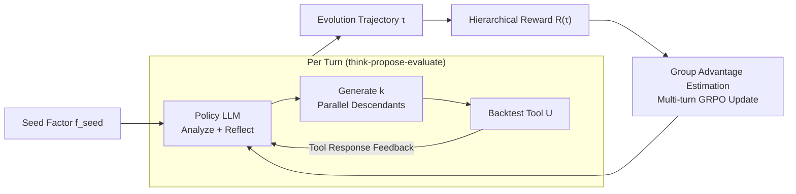

# AlphaAgentEvo: Evolution-Oriented Alpha Mining via Self-Evolving Agentic Reinforcement Learning

**Conference**: ICLR 2026  
**OpenReview**: [https://openreview.net/forum?id=lNmZrawUMu](https://openreview.net/forum?id=lNmZrawUMu)  
**Code**: TBD  
**Area**: LLM Agent / Quantitative Finance / Agentic RL  
**Keywords**: Quantitative Stock Factor Mining, Self-Evolving Agent, Agentic RL, GRPO, Hierarchical Reward, Multi-turn Tool Call  

## TL;DR
The quantitative "factor mining" process is redefined from a fragile "search-backtest-restart" cycle into a **continuous evolution trajectory**. By using a 4B LLM agent guided by hierarchical rewards in multi-turn tool calls, the system learns long-term planning and reflection, ultimately outperforming factor evolution methods driven by GPT-5-mini / DeepSeek-R1 with only 4B parameters.

## Background & Motivation
**Background**: Alpha mining aims to identify predictive factors that outperform the market within a vast and noisy search space. Two main evolutionary paths exist: traditional Genetic Programming (GP) and recent multi-agent frameworks.

**Limitations of Prior Work**:
- **GP-based methods** rely on heuristic search and random mutation. They cannot comprehend natural language instructions or extract experience from failed attempts, resulting in low interpretability, poor exploration efficiency, and a tendency to generate factors capturing spurious correlations.
- **LLM / Multi-agent frameworks** can accept human instructions but lack self-evolution mechanisms (long-term planning and reflective reasoning on past results), often getting stuck in repetitive local modifications and remains inefficient in exploration.

**Key Challenge**: Existing workflows are essentially **short-sighted**—they search, backtest, and restart rather than systematically "evolving" factors. Each candidate factor is treated as an independent trial, losing the opportunity to accumulate logic and maintain interpretability across iterations.

**Goal**: Propose an **evolution-oriented** paradigm that couples deliberate planning and reflective reasoning into multi-turn trajectories, allowing factors to be gradually refined along a continuous path.

**Core Idea**: **AlphaAgentEvo**, the first self-evolving Agentic RL framework for quantitative factor mining. It extends GRPO from single-turn text optimization to multi-turn "tool-in-the-loop" ARL. Combined with a **hierarchical reward function**, it guides the agent from "meeting basic requirements (valid tool calls)" to "complex objectives (sustained performance improvement)," spontaneously acquiring long-term planning and reflective reasoning to respond to market state changes (e.g., style shifts).

## Method

### Overall Architecture
AlphaAgentEvo models "factor mining" as **learning an evolution policy $\pi$** rather than directly optimizing a single factor. Given an expert-designed seed factor $f_{seed}$, the policy interacts with backtesting tools for $T$ turns to produce a family of evolved factors $F_\pi(f_{seed})$. In each turn, the policy LLM first *thinks* (analysis + reflection on historical factors and feedback) and then *proposes* (generating multiple parallel descendant factors as tool calls), which are evaluated by an external assessment tool $U$. The entire trajectory is scored by a hierarchical reward, and trajectories from the same seed form a group for intra-group advantage estimation and policy updates.

### Key Designs

**1. Evolution Policy Objective: Searching for stronger yet interpretable factors in the seed's neighborhood.** Unlike static mining that optimizes a single $f$, this work defines the goal as learning an evolution policy $\pi$ to maximize the performance of the best factor in the evolved family over the seed distribution $D_{seed}$, considering both in-distribution ($D_{evo}$) and out-of-distribution ($D_{test}$) markets:

$$\pi^\star = \arg\max_\pi \mathbb{E}_{f_{seed}\sim D_{seed}}\Big[\max_{f\in F_\pi(f_{seed})}\big(\mathbb{E}_{X\sim D_{evo}}s(f;X) + \lambda\,\mathbb{E}_{X\sim D_{test}}s(f;X)\big)\Big]$$

Critically, a **structural similarity constraint** $\mathrm{sim}(f, f_{seed}) \le \delta$ is introduced, measured by the overlap of the factor's Abstract Syntax Tree (AST). This constraint locks the policy to search within the local neighborhood of each seed, ensuring that the produced factors are stronger while remaining interpretable, rather than over-fitting noise through unconstrained global optimization.

**2. Extending GRPO from Single-Turn to Multi-Turn Tool-in-the-Loop.** Existing RL fine-tuning is mostly single-turn, evaluating responses with weak cross-turn coupling. Factor evolution is naturally a multi-turn tool-in-the-loop process. The authors extend GRPO to ARL: each turn, the policy generates reasoning tokens and tool call tokens to trigger the tool, followed by tool return tokens. All are concatenated into the trajectory, but **only tokens generated by the policy (marked with mask $M_{i,t}$) contribute gradients**. During generation at turn $t$, the policy LLM is conditioned on the entire historical trajectory $\tau_{1:t-1}$, enabling reflective reasoning on past attempts. Advantages are estimated using group-relative normalization $\hat{A}_g = \frac{R(\tau_g)-\mu_T}{\sigma_T}$. The objective function, based on standard GRPO's clip + KL penalty, is normalized by effective length $\frac{1}{\sum_t M_{i,t}}$ and masks out tokens emitted by tools. This modification allows the model to plan, analyze, and reflect within a long trajectory, moving beyond heuristic "search-backtest-restart" loops.

**3. Hierarchical Reward: Converting sparse, noisy backtest signals into dense, multi-dimensional signals.** Single scalar rewards fail in factor mining due to the massive search space and noise. The authors structure multiple objectives hierarchically: **Tool Call Reward** $R_{tool}=\alpha_{succ}N_{succ}-\alpha_{fail}N_{fail}$ rewards valid tool calls and penalizes failures; **Consistency Reward** $R_{cons}$ uses a lower similarity threshold $h_{low}{=}0.1$ as a soft constraint to keep factors close to the seed (preserving interpretability); **Exploration Reward** $R_{expl}=\sum_{f_i}\alpha_{exp}(1-\max_{f_j\in F_{<i}} \mathrm{sim}(f_i,f_j))$ rewards diverse exploration dissimilar to previously proposed factors; **Performance Reward** $R_{perf}$ uses log-scaling $\alpha_{perf}\log(1+\exp(s(f^\star)-\max(0,s(f_{seed}))))$ to handle noisy metrics; **Streak Reward** $R_{streak}=\alpha_{streak}N_{streak}$ provides a booster for the longest continuous performance improvement in a trajectory. The final aggregation is:

$$R(\tau)=\frac{\min(R_{cons},C_{cons})+\min(R_{expl},C_{expl})}{\min(R_{tool},C_{tool})}+\min(R_{perf},C_{perf})\cdot\min(R_{streak},C_{streak})$$

Each component is capped by $C_j$ to prevent any single item from dominating. Tool calls are treated as a "cost" in the denominator to avoid brute-force search via frequent calls. This structure allows the agent to progress from "basic compliance" to "high-level objectives," preventing collapse into repetitive patterns while balancing consistency and exploration.

## Key Experimental Results

### Main Results
On the self-constructed **AlphaEvo500** (350 train / 50 val / 100 test seeds) across HS300 and CSI500 markets (2024–2025):

| Method | HS300 Pass@3 | HS300 Pass@5 | CSI500 Pass@3 | CSI500 Pass@5 |
|------|------|------|------|------|
| Qwen3-4B-thinking | 0.36 | 0.47 | 0.68 | 0.78 |
| GPT-5-mini | 0.75 | 0.88 | 0.73 | 0.82 |
| DeepSeek-R1 | 0.68 | 0.71 | 0.71 | 0.86 |
| ToolRL-4B | 0.75 | 0.81 | 0.73 | 0.76 |
| GEPA (GPT-5-mini) | 0.87 | 0.90 | 0.86 | 0.91 |
| **AlphaAgentEvo-1.7B** | 0.77 | 0.90 | 0.76 | 0.78 |
| **AlphaAgentEvo-4B** | **0.97** | **0.97** | **0.93** | **0.95** |

On the external **Alpha158** dataset (including GP baselines), GP achieved only 0.022–0.094 Pass@3 even with 50 descendants. AlphaAgentEvo-4B reached **0.994** Pass@5 in bull markets (near saturation) and 0.581 Pass@3 in bear markets. Highlight: **The 1.7B version outperforms GPT-5-mini, and the 4B version exceeds the strongest GEPA baseline**, despite GEPA using closed-source SOTA reasoning models.

### Ablation Study
Removing two key reward components (Pass@3):

| Setting | AlphaEvo500 Pass@3 | Alpha158 Pass@3 |
|------|------|------|
| w/o exploration reward | 0.54 | 0.513 |
| w/o consistency reward | 0.51 | 0.510 |
| **Full Model** | **0.65** | **0.581** |

Training significantly improves the valid tool call rate (AlphaEvo500: 0.938 → 0.973). Both exploration and direction-aware (consistency) rewards are critical and complementary.

### Key Findings
- **Agent-level Self-Evolution** (not just factor-level): Accelerating cumulative Information Ratio (IR) gains across turns, alongside rising exploration and consistency, proves the policy itself strengthens each turn, rather than just individual factors improving.
- **Diversity and Transferability**: The average/maximum structural similarity of top-20 factors is only 0.039 / 0.263, much lower than DeepSeek-R1 (max 0.583) and Qwen3-4B (max 0.600), indicating no reward hacking or overfitting to narrow/spurious patterns.

## Highlights & Insights
- **Paradigm Rewrite**: Redefining "factor mining" from one-off trial-and-error to a continuous evolution trajectory solves both interpretability (via AST neighborhood constraints) and cumulative learning.
- **Scaling Efficiency**: Achieving superior results with a 4B open-source model compared to closed-source SOTA-driven methods demonstrates that "training an agent policy" is more cost-effective than "calling a stronger off-the-shelf model."
- **Reward Engineering Template**: The hierarchical reward transforms sparse, noisy financial backtesting feedback into dense, multi-dimensional signals. Using tool calls as a cost and similarity for both consistency and diversity is an excellent example of injecting domain priors into RL.

## Limitations & Future Work
- **Dependency on Expert Seeds**: Evolution is anchored to the local neighborhood of $D_{seed}$. While strong constraints preserve interpretability, it means the method is essentially "improving seeds" rather than "discovery from scratch," with its upper bound limited by the seed library.
- **Limited Market and Timeframes**: Training used only one year of A-share data (HS300/CSI500). Robustness across different markets, asset classes, and longer cycles remains to be verified.
- **Hyperparameter Sensitivity**: The hierarchical reward involves many $\alpha_\bullet$, caps $C_\bullet$, and thresholds $h_{low}$ and $\delta$. The cost of tuning for new scenarios is unknown.
- **Metric Trade-offs**: Because some seeds are boolean signals (returning NaN for non-selected stocks), the authors used IR/AER instead of IC-based metrics, which may differ from common industry evaluation standards.

## Related Work & Insights
- **Factor Mining Evolution**: Traditional GP (Lin et al. 2019) vs. LLM Multi-agent (AlphaAgent, Tang et al. 2025) vs. Reflective Prompt Evolution (GEPA). This paper identifies that GP cannot learn from failure and LLM agents lack self-evolution.
- **Agentic RL / Tool-in-the-loop RL**: Building on GRPO (Shao et al. 2024) to support multiple turns. It shares similarities with ToolRL (Qian et al. 2025) but emphasizes multi-turn long-term planning—a weakness that limited ToolRL's generalization over longer horizons.
- **Inspiration**: Treating a "domain-specific evaluator" as an RL environment and using structural similarity as both an exploration reward and an interpretability constraint—this "double-edged similarity" design is transferable to code generation, molecular design, and other tasks with large search spaces and structural representations.

## Rating
- **Novelty**: ⭐⭐⭐⭐ First self-evolving Agentic RL framework for quant factor mining; the combination of multi-turn GRPO + hierarchical rewards + AST constraints is highly coherent.
- **Experimental Thoroughness**: ⭐⭐⭐⭐ Two datasets × two markets × four baseline categories (GP/Multi-agent/ToolRL/LLM), including ablation, trajectory analysis, and diversity studies; slightly capped due to limited training data duration and single asset class.
- **Writing Quality**: ⭐⭐⭐⭐ Clear progression from limitations to objectives; complete hierarchical reward and objective function formulations; well-supported by diagrams.
- **Value**: ⭐⭐⭐⭐ 4B model outperforming closed-source SOTA is valuable for both Quant and small-model Agentic RL; the "Evaluator-as-Environment + Double-edged Similarity" approach is highly generalizable.

<!-- RELATED:START -->

## Related Papers

- [\[ICLR 2026\] MobileRL: Online Agentic Reinforcement Learning for Mobile GUI Agents](mobilerl_online_agentic_reinforcement_learning_for_mobile_gui_agents.md)
- [\[ICLR 2026\] Agentic Context Engineering: Evolving Contexts for Self-Improving Language Models](agentic_context_engineering_evolving_contexts_for_self-improving_language_models.md)
- [\[ICLR 2026\] WebSeer: Training Deeper Search Agents through Reinforcement Learning with Self-Reflection](webseer_training_deeper_search_agents_through_reinforcement_learning_with_self-r.md)
- [\[ICLR 2026\] MemGen: Weaving Generative Latent Memory for Self-Evolving Agents](memgen_weaving_generative_latent_memory_for_self-evolving_agents.md)
- [\[ICML 2026\] On Information Self-Locking in Reinforcement Learning for Active Reasoning of LLM Agents](../../ICML2026/llm_agent/on_information_self-locking_in_reinforcement_learning_for_active_reasoning_of_ll.md)

<!-- RELATED:END -->
