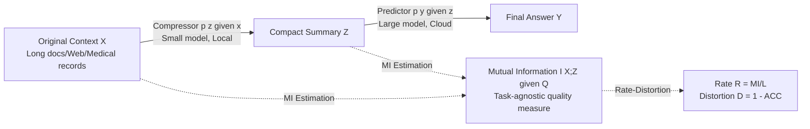

# An Information Theoretic Perspective on Agentic System Design

**Conference**: ICLR 2026  
**OpenReview**: [https://openreview.net/forum?id=isFHz8qf20](https://openreview.net/forum?id=isFHz8qf20)  
**Code**: To be confirmed  
**Area**: LLM Agent / Multi-Agent Systems  
**Keywords**: Compressor-predictor systems, Mutual Information estimation, Rate-Distortion theory, Information Bottleneck, Local-Cloud collaboration, Deep Research  

## TL;DR
This paper abstracts the common paradigm in agentic systems—where a smaller model compresses context and a larger model performs reasoning on the compressed output—as a noisy channel. It utilizes a mutual information estimator, directly computable by inference engines, to measure compression quality. This approach provides a task-agnostic answer to the resource allocation problem: compute should be "front-loaded" toward the compressor rather than the predictor.

## Background & Motivation
- **Background**: Modern agentic LM systems like "Deep Research" and "Claude Code" increasingly use multi-model architectures to bypass the context window limitations of single models. Despite surface differences, they converge on a recurring pattern: a smaller **compressor** distills massive raw context into compact text, which is then consumed by a larger **predictor** to produce the final answer.
- **Limitations of Prior Work**: The design of compressor-predictor systems relies primarily on **trial-and-error**. When replacing a model or tuning a component, engineers lack principled methods to determine whether performance gains stem from better distillation by the compressor or superior reasoning by the predictor. Attribution currently requires expensive, task-specific pairwise sweeps of the entire compound system.
- **Key Challenge**: The root cause is the **inability to measure how much information the compressor actually preserves from the original context**, which ultimately determines the reasoning potential of the predictor. There is a lack of task-agnostic metrics to evaluate compressor output independently of downstream performance.
- **Goal**: To provide a task-agnostic, cheaply computable measure of compression quality and derive design principles for agentic systems (how to allocate compute between the compressor and predictor).
- **Core Idea**: **[Information Theoretic Perspective]** The compressor is viewed as a **noisy channel** between raw data and the predictor. The **mutual information $I(X;Z)$** between the context $X$ and its compression $Z$ serves as a task-agnostic measure of compressor efficacy—analogous to the role of perplexity as a task-agnostic proxy for downstream performance.

## Method

### Overall Architecture
The system is abstracted as a two-stage information bottleneck process: context $X$ is processed by a compressor $p(z \mid x)$ to yield a compact summary $Z$, which is then processed by a predictor $p(y \mid z)$ to produce answer $Y$, represented as $X \xrightarrow{p(z \mid x)} Z \xrightarrow{p(y \mid z)} Y$. With the compressor acting as a noisy channel, the paper uses mutual information to measure the volume of information about $X$ transmitted through the channel. Rate-distortion analysis is then applied to link "bits transmitted" to "downstream error," eventually leading to an actionable design principle.

### Key Designs

**1. A Mutual Information Estimator Computable by Inference Engines: Avoiding Full Vocabulary Probabilities and Auxiliary Models**  
Measuring $I(X;Z)$, the information $Z$ contains about $X$, typically requires variational bounds that need underlying distributions or auxiliary network training, making them impractical. Starting from the KL divergence representation $I(X;Z)=\mathbb{E}_{x,z\sim p(x,z)}\left[\log\frac{p(z\mid x)}{p(z)}\right]$, where $p(z)$ is intractable, the authors use Monte Carlo sampling to approximate the marginal $p(z)$ as an average over data samples:

$$\hat I(X;Z)=\frac{1}{NM}\sum_{i=1}^{N}\sum_{j=1}^{M}\left[\log p(z_{ij}\mid x_i)-\log\left(\frac{1}{N}\sum_{l=1}^{N}p(z_{ij}\mid x_l)\right)\right]$$

This requires only the log-probabilities exposed by the compressor rather than the full vocabulary distribution, allowing it to run on accelerated engines like SGLang. The estimator is upper-bounded by $\hat I \le \log N$. In practice, the query $Q$ is separated from each context to estimate $I(X;Z \mid Q)$; small negative values caused by finite sampling are clipped to 0. An engineering detail: since 1–3B small models may assign high likelihood to nonsensical tokens (poor calibration), log-probabilities are calculated using a 7–8B **proxy model** (from a different model family to reduce bias).

**2. Rate-Distortion Analysis: Linking "Bit Efficiency" to "Downstream Error Rate"**  
The paper leverages rate-distortion theory to unify communication quality and task performance. **Rate (bit efficiency)** is defined as $R = \frac{I(X;Z \mid Q)}{L}$ (bits of mutual information per output token, where $L$ is the length of the compressed output), and **Distortion** as $D = 1 - \text{ACC}(Z)$. As the rate increases, distortion should converge to an irreducible lower bound. By fitting decay exponential curves to rate-distortion data, the authors found that the information rate is strongly correlated with downstream performance and perplexity ($r = -0.84, R^2 = 0.71$). This transforms MI into a **proxy signal capable of predicting system performance without end-to-end evaluation**. This also explains why increasing the predictor from 70B to 405B results in almost no further reduction in distortion.

**3. "Front-load Compute to the Compressor" Design Principle and Component Ranking**  
After performing a system sweep across five datasets and three model families, the authors used logistic regression to predict binary correctness on LONGHEALTH/FINANCEBENCH. This revealed a clear hierarchy of importance: **Compressor Family > Compressor Scale > Predictor Scale**. The conclusion is that compute should be "front-loaded" to the compressor—potentially on local devices—to trade for a smaller, cheaper cloud-based predictor. Larger compressors are not only more accurate but also more concise (carrying more bits per token), causing FLOPs-per-generation to scale **sub-linearly** with model size.

## Key Experimental Results

### Main Results: Compressor vs. Predictor Scaling

| Operation | Dataset | Change in Accuracy |
|------|--------|-----------|
| QWEN-2.5 Compressor 1.5B $\rightarrow$ 7B | LONGHEALTH | +60% |
| Predictor 70B $\rightarrow$ 405B | LONGHEALTH | Only +12% |
| Predictor 70B $\rightarrow$ 405B | FINANCEBENCH | Only +1% |
| 7–8B vs. 1–1.5B Compressor | LONGHEALTH | Up to 3.1$\times$ more accurate, beats GPT-4o-only baseline by 4pp |
| 7–8B vs. 1–1.5B Compressor | FINANCEBENCH | Up to 2.6$\times$ more accurate, recovers 97% of GPT-4o baseline |

The shift from a 1.5B to a 7B QWEN-2.5 compressor increases FLOPs-per-generation by only **1.3%**. 7–12B compressors are up to **4.6$\times$ more concise** than their 1–1.5B counterparts in the same family. A 7B QWEN-2.5 compared to its 1.5B sibling achieves: 1.6$\times$ accuracy, 4.6$\times$ conciseness, and 5.4$\times$ mutual information per token.

### Correlation between Information Rate and Performance

| Metric | Result |
|------|------|
| Information Rate vs. Perplexity (FINEWEB extractive) | $r=-0.84, R^2=0.71$ |
| Compressor Error Composition | Wrong answer 36.3% / No answer 33.3% / Missing details 30.4% |
| Preference for same-family compressor | No; distortion is primarily determined by model family and scale |

### Deep Research Deployment

| Configuration | RACE Score | API Cost |
|------|---------|----------|
| GPT-4o + Uncompressed Web (Baseline) | — | 100% |
| QWEN-2.5-14B Compression + GPT-4o Prediction | +2.3% | Only 28.1% |
| Local 3B Compressor | Recovers 99% frontier accuracy | 26% API Cost (74% reduction) |

### Key Findings
- Compressor quality **overwhelmingly** determines system performance; scaling the compressor is far more cost-effective than scaling the predictor.
- Larger compressors are simultaneously more accurate and more concise, leading to sub-linear FLOPs growth—enabling a "local compute for cloud compute" trade-off.
- The MI rate is a low-cost proxy for end-to-end evaluation; compressor scaling laws are robust to prompt-specified conciseness levels (3/6/9 sentences).

## Highlights & Insights
- **Turning Engineering Lore into Measurable Theory**: This work is the first to use an MI estimator, directly computable on production inference engines, to transition compressor-predictor system design from trial-and-error to quantifiable attribution.
- **Counter-intuitive but Practical Conclusion**: While the instinct is to build a stronger "brain" (predictor), the paper proves the importance of better "eyes/ears" (compressor). Given that compressors are small enough for local deployment, this directly translates into a 74% reduction in API costs.
- **MI Estimator bypasses Engineering Hurdles**: By not requiring full vocabulary log-probabilities or auxiliary discriminators, it can be integrated into SGLang for low-cost batch processing.

## Limitations & Future Work
- MI estimation at the 1–3B scale depends on proxy models and log-probabilities, introducing potential variance and bias; clipping negative values is an engineering compromise.
- The study primarily focuses on GPT-style **non-reasoning** models and **single-turn** communication, with limited generalizability to reasoning-enhanced models or iterative multi-agent workflows.
- Compression is treated as synonymous with "summarization," excluding other forms like structured extraction or function-call generation; FLOPs-per-generation does not account for device-specific optimizations.
- Future Work: Exploring alternative estimators like InfoNCE, rate-distortion-based training objectives for compressors, information-theoretic routing/fallback strategies, and scaling behaviors in MoE models.

## Related Work & Insights
- **Information Bottleneck** (Tishby et al., 2000; Shwartz-Ziv & Tishby, 2017): This work extends the "compression vs. prediction" tradeoff from single-model representations to the communication channel between two LMs.
- **Scaling Laws** (Kaplan et al., 2020; Hoffmann et al., 2022): MI acts as a task-agnostic proxy for compression quality, similar to how perplexity relates to downstream performance.
- **Multi-Agent Systems** (Narayan et al., 2025; Hadfield et al., 2025): Validates the efficacy of the data-plane/control-plane split ("small model reads, large model orchestrates") and provides the first channel-based quantification of intermediate communication.
- **Insight**: Any cascaded system using "small model preprocessing + large model decision-making" (RAG, tool usage, memory compression) can utilize this MI framework for component attribution and compute allocation without requiring end-to-end sweeps.

## Rating
- Novelty: ⭐⭐⭐⭐⭐ — Reframing agentic system design as an information theory problem with a practical MI estimator is a fresh and self-consistent perspective.
- Experimental Thoroughness: ⭐⭐⭐⭐ — Comprehensive sweep across five datasets, three model families, and multiple predictor sizes plus real-world Deep Research implementation; however, it remains focused on non-reasoning single-turn setups.
- Writing Quality: ⭐⭐⭐⭐⭐ — Structured around four guiding questions with clear, actionable conclusions and well-organized visuals.
- Value: ⭐⭐⭐⭐⭐ — The "front-load the compressor, deploy locally, reduce cost by 74%" insight provides direct guidance for industrial-grade agentic system deployment.

<!-- RELATED:START -->

## Related Papers

- [\[ICLR 2026\] BED-LLM: Intelligent Information Gathering with LLMs and Bayesian Experimental Design](bed-llm_intelligent_information_gathering_with_llms_and_bayesian_experimental_de.md)
- [\[ICLR 2026\] In-the-Flow Agentic System Optimization for Effective Planning and Tool Use](in-the-flow_agentic_system_optimization_for_effective_planning_and_tool_use.md)
- [\[ICLR 2026\] A Benchmark for Deep Information Synthesis (DeepSynth)](a_benchmark_for_deep_information_synthesis.md)
- [\[ICLR 2026\] FlowSearcher: Synthesizing Memory-Guided Agentic Workflows for Web Information Seeking](flowsearcher_synthesizing_memory-guided_agentic_workflows_for_web_information_se.md)
- [\[ICLR 2026\] Trade in Minutes! Rationality-driven Agentic System for Quantitative Financial Trading](trade_in_minutes_rationality-driven_agentic_system_for_quantitative_financial_tr.md)

<!-- RELATED:END -->
