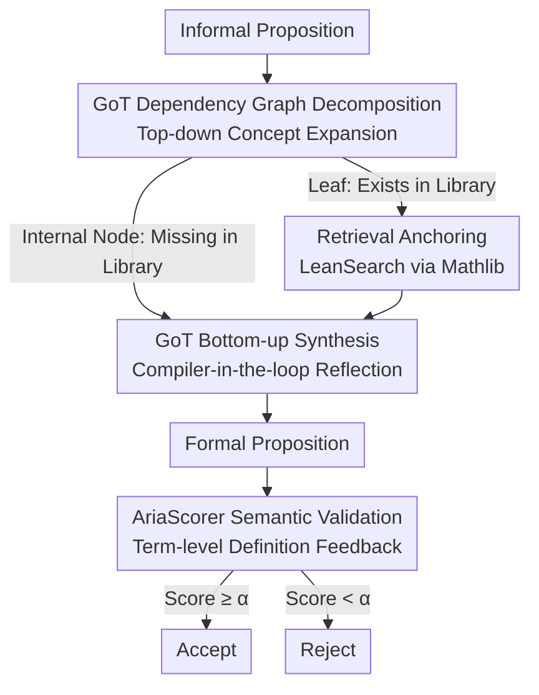

# Aria: an Agent for Retrieval and Iterative Auto-Formalization via Dependency Graph

**Conference**: ICLR2026  
**OpenReview**: [https://openreview.net/forum?id=CPxZClPMiy](https://openreview.net/forum?id=CPxZClPMiy)  
**Code**: To be confirmed  
**Area**: LLM Agent / Auto-formalization / Theorem Proving  
**Keywords**: Auto-formalization, Lean, Graph-of-Thought, Retrieval-Augmented Generation, Semantic Validation

## TL;DR
Aria transforms the translation of natural language mathematical propositions into Lean formal code into a **retrieval + iterative synthesis** agent. It employs a "Graph-of-Thought" (GoT) to decompose propositions top-down into a concept dependency graph. Concepts found in Mathlib are anchored, while missing ones are synthesized bottom-up into new definitions. A semantic checker, AriaScorer, validates results by pulling real definitions for every Lean term from Mathlib. On research-level conjecture datasets where prior methods scored 0%, Aria achieves 42.9%.

## Background & Motivation

**Background**: Interactive theorem provers (Lean 4 + Mathlib) are the primary tools for formalized mathematics, yet writing formal propositions relies heavily on manual expert knowledge. The community uses LLMs for "auto-formalization"—translating natural language propositions into formal code. **Proposition formalization is the critical first step**; while proofs can be searched over time, an incorrectly translated proposition renders all subsequent efforts futile.

**Limitations of Prior Work**: Existing one-pass LLM generation for formal propositions suffers from three major issues: (1) **Hallucination**—invoking functions that do not exist in Mathlib or are version-incompatible; (2) **Semantic Misalignment**—code passes compilation but diverges from the mathematical meaning of the original proposition ("correct type, wrong meaning"); (3) **Inability to Synthesize New Definitions**—research-grade mathematics involves creating new objects, which one-pass generation cannot achieve regardless of retrieval if the concept is missing from the library. These problems escalate on difficult (research/conjecture-level) propositions.

**Key Challenge**: LLM pre-training knowledge is **static and becomes outdated**, while Mathlib evolves rapidly. Furthermore, formalization requires **dynamically creating** concepts absent from the library. One-pass generation fails both to track library versions and to create new definitions, leading to total failure on conjecture-level propositions. Additionally, semantic checkers based on surface text similarity (e.g., LeanScorer) fail to catch subtle errors where phrasing is similar but definitions differ.

**Goal**: Address three sub-problems: (a) Align generation with the **current version** of Mathlib (mitigating hallucinations); (b) Enable the system to **self-synthesize** new definitions (mitigating non-synthesizability); (c) **Rigorously determine** the semantic faithfulness of formal propositions (mitigating false positives).

**Key Insight**: Mimic the workflow of a human mathematician—recursively decompose unknown concepts until reaching recognized (library-existent) base concepts, then build definitions back up layer by layer. Mathematical abstraction follows a key principle: **any concept, however complex, can be defined using only its direct predecessor concepts**, which naturally fits a dependency graph.

**Core Idea**: Replace one-pass generation with an agentic workflow featuring "two-phase GoT + compiler-in-the-loop reflection + retrieval," and replace surface text comparison with a checker that "pulls back real Mathlib definitions" at the term level.

## Method

### Overall Architecture
The Aria system consists of two major components: the **formalization agent** (GoT auto-formalization pipeline, §3.1) and the **semantic checker AriaScorer** (§3.2). Given a non-formal proposition, the agent first uses a GoT planner to expand it **top-down** into a concept dependency graph (where each node is a definition/structure/class). For each node, LeanSearch-driven retrieval anchors it to Mathlib; successful matches become leaves, while unmatched nodes are marked "to be synthesized" and further expanded. Once all leaves are grounded, the agent performs **bottom-up synthesis**: for each "to be synthesized" concept, it collects all verified child dependency code as context for the LLM to generate Lean code. This is passed to the compiler; errors are fed back for reflection and rewriting, while success marks the node as synthesized for parent use. Finally, the formal and original propositions are sent to AriaScorer for semantic validation to output Accept/Reject.

### Key Designs

**1. GoT Dependency Graph Decomposition: From "Translating a Large Proposition" to "Landing Concepts"**

One-pass translation of research-level propositions is prone to error due to complex concept dependencies. Aria's Planning Module models formalization as "constructing and solving a concept dependency graph." The system performs **top-down expansion**: at each node, it invokes LeanSearch to retrieve candidates (formal code, informal description). Since the top result might not be the standard definition required, Aria uses an LLM as a "reasoner" to audit candidates and select the **single most appropriate definition**. If no match is found, the node is treated as an internal node, triggering further expansion of its sub-concepts and marking it "to be synthesized." This implements the principle that **complex concepts = combinations of direct predecessors**.

**2. GoT Bottom-up Synthesis + Compiler-in-the-loop Reflection: Creating New Definitions**

Once expansion concludes, the agent enters the **bottom-up synthesis** phase. This allows it to create verifiable formal definitions for concepts not in the library (e.g., "Cohen-Macaulay Module"). The mechanism: for a target concept, it collects **all verified formal code of its direct child nodes** as context, allowing the LLM to generate the Lean definition. The code is immediately checked by the Lean compiler; if it fails, **error messages and the failed code** are fed back (compiler-in-the-loop reflection) for correction. Synthesis is thus built on a solid foundation of compiler-verified sub-dependencies, ensuring **syntactic correctness** before reaching the top-level proposition.

**3. AriaScorer Term-level Semantic Grounding: Pulling Real Definitions for Verification**

Compilation success does not ensure semantic faithfulness. Existing LeanScorer uses "sub-task decomposition + matching" for semantic checks, categorizing matches as **Perfectly Match / Minor Inconsistency / Major Inconsistency**, then aggregating these via a **Sugeno fuzzy integral** into a score in $[0,1]$. However, surface similarity misses hidden errors where terms are phrased similarly but defined differently. AriaScorer adds **term-level retrieval and interpretation**: using the Lean static analyzer `jixia`, it extracts **every Lean term** referenced in the formal proposition and looks up its name, kind, type, value, and informal description in the "informalized Mathlib dataset" curated by Herald. These **authoritative definitions, along with the original proposition, sub-tasks, and few-shot examples**, are injected into the LLM's evaluation context. This forces the LLM to reason based on **actual term semantics** rather than surface names, identifying subtle inconsistencies like reversed parameter orders or unexpected type coercions.

### A Complete Example
Using the proposition: "Let $R$ be a Noetherian ring and $M$ be a Cohen-Macaulay module over $R$, then $M\otimes_R R[\mathbf{x}]$ is a Cohen-Macaulay module over the polynomial ring."
- **Decomposition**: Expands into nodes like Noetherian ring, polynomial ring, Cohen-Macaulay module, Krull dimension, depth, etc. "Noetherian ring" $\rightarrow$ `IsNoetherianRing` and "Krull dimension" $\rightarrow$ `Order.krullDim` are anchored as leaves. "Cohen-Macaulay Module" is missing from the library and marked for synthesis, further expanding into `depth`, `regular sequence`, etc.
- **Synthesis**: Recursively synthesizes `depth` (e.g., using `sSup {n | ∃ s : List R, ...}`), then uses it as context to synthesize the `IsCohenMacaulayModule` class, with compiler feedback at each step.
- **Assembly**: Once dependencies are ready, it synthesizes the top-level theorem `isCohenMacaulayModule_tensor_mvPolynomial (...) := by sorry`.
- **Validation**: AriaScorer pulls definitions for `IsNoetherianRing`, `IsCohenMacaulay`, etc., checks each sub-task, and compares the aggregated score with threshold $\alpha$ for acceptance.

## Key Experimental Results

### Main Results
End-to-end auto-formalization comparison (Success Rate %). Compiler = compilation rate, Final acc. = passes both compilation **and** AriaScorer semantic check. Conjectures column is manually verified. Kimina's scores on ProofNet are marked `*` due to potential data contamination.

| Method | ProofNet Compiler | ProofNet Final | FATE-H Final | FATE-X Compiler | FATE-X Final | Conjectures Final |
|------|------|------|------|------|------|------|
| **Ours (Aria)** | **91.6** | **68.5** | **71.0** | 69.0 | **44.0** | **42.9** |
| Goedel-V2 (pass@128) | – | – | 43.0 | 63.0 | 24.0 | 0 |
| Gemini-2.5-Pro (pass@1) | 55.8 | 27.8 | 31.0 | 27.0 | 21.0 | 0 |
| Goedel-V2 (pass@1) | 59.6 | 32.0 | 27.0 | 27.0 | 16.0 | 0 |
| Kimina (pass@1) | 70.4* | 24.7* | 0.0 | 5.0 | 1.0 | 0 |
| Herald (pass@1) | 48.5 | 18.3 | 12.0 | 8.0 | 5.0 | 0 |

Notably, on Conjectures (14 real homological conjectures): **all baselines are at 0%, while Aria achieves 42.9%**. On FATE-X, Aria uses an average of 17.7 API calls; its 44.0% Final acc. exceeds Goedel-V2 pass@128 (which uses over 7x calls but only reaches 24.0% Final), proving architectural superiority over mere compute scaling.

### AriaScorer Semantic Checker Comparison (on FATE-X)

| Checker | Accuracy | Precision | Recall | F1 |
|--------|---------|-----------|--------|-----|
| **AriaScorer (α=0)** | **89.9%** | 90.9% | **96.2%** | **93.5%** |
| AriaScorer (α=0.9) | 82.6% | **95.5%** | 80.8% | 87.5% |
| LeanScorer (α=0) | 71.0% | 77.6% | 88.5% | 82.1% |
| LeanScorer (α=0.9) | 73.9% | 81.5% | 84.6% | 83.0% |
| Back Translation | 33.3% | 87.5% | 13.5% | 23.3% |
| Gemini-2.5-Pro Direct | 76.8% | 83.3% | 86.5% | 84.9% |

LeanScorer is an ablation of AriaScorer **without term-level grounding**. The F1-score increases from 82.1% to 93.5% with grounding. $\alpha=0$ allows for more tolerance in mathematical equivalence (higher recall), while $\alpha=0.9$ achieves 95.5% precision, suitable for deployment.

### Ablation Study

| Configuration | Key Phenomenon | Explanation |
|------|---------|------|
| Full Aria | 6 Conjectures successful | Complete system performance. |
| w/o Reflection | Performance collapses | Compiler-in-the-loop is essential for correct code generation. |
| w/o GoT Planning | Success on Conjectures drops 6 $\rightarrow$ 1 | Losing logical structure handling makes hard datasets unsolvable. |
| w/o RAG Retrieval | 0% on Conjectures | Without retrieval grounding, the system cannot prevent fundamental hallucinations of non-existent concepts. |

### Key Findings
- The three components (Reflection / GoT / RAG) are indispensable; **harder datasets rely more on GoT** for handling complex concept dependencies.
- RAG prevents "hallucinating non-existent concepts," while GoT enables "synthesizing new concepts."
- Baseline failures are categorized: General reasoning models (e.g., Gemini) **hallucinate interfaces** due to low Mathlib expertise; specialized formalizers (Goedel/Kimina) lack mathematical reasoning and **imitate formats** without understanding logic. Aria's synergy of reasoning models + GoT + retrieval bridges both gaps.

## Highlights & Insights
- **Turning Un-synthesizable into Synthesizable**: By exploiting the nature of mathematical abstraction (complex concepts = combination of predecessors), the agent can synthesize definitions missing from Mathlib, driving success from 0 to 42.9% on conjectures.
- **Compiler as a Trusted Reward Signal**: Offloading "syntactic correctness" to a null-hallucination oracle via reflection stabilizes generation quality without additional training.
- **Semantic Checking via Definitions**: Moving from "text matching" to "definition grounding" solves the false positive problem where phrasing looks correct but definitions differ. This paradigm of "grounding symbols back to real semantics" is valuable for any formal language alignment.
- **Rigorous Fairness**: Comparison based on API call counts rather than just success rates proves that Aria wins through architecture rather than compute brute-force.

## Limitations & Future Work
- **Focus on Propositions, Not Proofs**: The work stops at translating propositions correctly; theorem proving (writing `by ...` proofs) is left for future work (propositions currently use `:= by sorry`).
- **Inference Cost**: Averaging 17.7 calls per problem on FATE-X makes GoT + Reflection significantly more expensive than one-pass generation.
- **Infrastructure Dependency**: Performance relies on LeanSearch indexing, Herald dataset coverage, and `jixia` stability; failure in any component degrades the agent.
- **Evaluation Scale**: The Conjecture set (14 items) and the number of Algebra PhD annotators for AriaScorer ground truth are limited in statistical confidence.

## Related Work & Insights
- **vs. One-pass SFT/ICL Formalizers (Kimina, Herald, Goedel-V2)**: These struggle with new definitions and score 0% on conjectures; Aria’s dependency graph approach is a qualitative leap.
- **vs. RAG Formalization (Lu et al. 2025)**: Pure RAG only anchors **existing** definitions; Aria uses retrieval as a switch—if retrieval fails, it triggers synthesis.
- **vs. LeanScorer**: AriaScorer improves F1 from 82.1% to 93.5% by adding term-level definition grounding to sub-task decomposition.
- **vs. Back Translation**: Back Translation has high precision but extremely low recall (13.5%), whereas term-level grounding maintains precision while maximizing recall.

## Rating
- Novelty: ⭐⭐⭐⭐⭐ "Recursive decomposition + bottom-up synthesis" enables agentic formalization of previously impossible conjecture-level concepts.
- Experimental Thoroughness: ⭐⭐⭐⭐ Solid benchmarks, fair compute comparison, and module ablations, though limited by the small size of the gold-standard conjecture set.
- Writing Quality: ⭐⭐⭐⭐⭐ Clear workflow illustrations and concrete case studies (Cohen-Macaulay module).
- Value: ⭐⭐⭐⭐⭐ Successfully pushing conjecture-level auto-formalization from 0 to 40%+ opens a realistic path for automating advanced mathematics.

<!-- RELATED:START -->

## Related Papers

- [\[ACL 2025\] GeAR: Graph-enhanced Agent for Retrieval-augmented Generation](../../ACL2025/llm_agent/gear_graph-enhanced_agent_for_retrieval-augmented_generation.md)
- [\[ICLR 2026\] MobileIPL: Enhancing Mobile Agents Thinking Process via Iterative Preference Learning](mobileipl_enhancing_mobile_agents_thinking_process_via_iterative_preference_lear.md)
- [\[ICLR 2026\] GTool: Graph Enhanced Tool Planning with Large Language Model](gtool_graph_enhanced_tool_planning_with_large_language_model.md)
- [\[ICLR 2026\] R-WoM: Retrieval-augmented World Model for Computer-use Agents](r-wom_retrieval-augmented_world_model_for_computer-use_agents.md)
- [\[ACL 2026\] OCR-Memory: Optical Context Retrieval for Long-Horizon Agent Memory](../../ACL2026/llm_agent/ocr-memory_optical_context_retrieval_for_long-horizon_agent_memory.md)

<!-- RELATED:END -->
