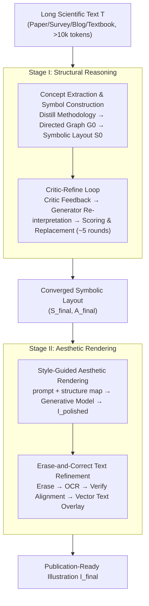

# AutoFigure: Generating and Refining Publication-Ready Scientific Illustrations

**Conference**: ICLR 2026  
**arXiv**: [2602.03828](https://arxiv.org/abs/2602.03828)  
**Code**: [https://github.com/ResearAI/AutoFigure](https://github.com/ResearAI/AutoFigure)  
**Area**: Audio and Speech  
**Keywords**: Scientific illustration generation, multi-agent framework, long-text understanding, FigureBench, VLM evaluation

## TL;DR
This paper proposes AutoFigure—the first Agent framework based on the "Reasoned Rendering" paradigm. By decoupling structural layout planning and aesthetic rendering into two stages, it automatically generates publication-quality scientific illustrations from long scientific texts. Supported by FigureBench (3,300 pairs), the first large-scale benchmark for systematic evaluation, 66.7% of the generated results were deemed suitable for camera-ready versions by the original authors.

## Background & Motivation
High-quality scientific illustrations are essential for conveying complex scientific concepts, allowing readers to grasp the core ideas of a paper within minutes. However, manual creation typically takes days and requires creators to possess both domain knowledge and professional design skills.

**Limitations of Prior Work**:

1. **Benchmark Level**: Existing datasets such as Paper2Fig100k, ACL-Fig, and SciCap+ primarily focus on reconstructing figures from captions or short text snippets, rather than distilling core structures from methodology in long texts (averaging >10k tokens). There is a lack of benchmarks truly oriented toward the "long-context scientific illustration design" task.

2. **Methodological Level**:
   - Systems like PosterAgent and PPTAgent only excel at "understanding, extracting, and reorganizing" existing multimodal content, lacking the capability to **generate** visual content from raw text.
   - Code-based methods like AutoTikZ prioritize structural and geometric correctness but suffer from poor aesthetic expression.
   - End-to-end T2I models like DALL-E / GPT-Image can generate beautiful images but fail to maintain **structural fidelity**—the logical relationships and hierarchical structures in long scientific texts are often lost.

**Key Challenge**: The trade-off between structural accuracy and visual aesthetics. Code-based methods have good structure but lack beauty, while generative models are aesthetic but structurally chaotic.

**Key Insight**: Decouple these two requirements—first use an LLM for structural reasoning and layout planning, then use a generative model for aesthetic rendering.

## Method

### Overall Architecture
AutoFigure decomposes the process of "drawing a scientific illustration" into two tasks that are traditionally performed simultaneously but often conflict—determining the structure first, then making it visually appealing. The system receives a long scientific text $T$ (paper, survey, blog, or textbook, averaging over 10k tokens). In Stage I (Structural Reasoning), an LLM performs semantic parsing and layout planning to distill the methodology into a logical graph, which is then refined through a "Critic-Refine" loop into a structured symbolic layout $(S_{\text{final}}, A_{\text{final}})$. Subsequently, in Stage II (Aesthetic Rendering), this layout is passed to a multimodal generative model to be rendered into a publication-quality illustration. Specialist post-processing for text erasure and correction is applied to output the final figure $I_{\text{final}}$. The authors refer to this paradigm as "Reasoned Rendering": letting reasoning handle "what to draw" and rendering handle "how well it looks." Additionally, the paper constructs the FigureBench benchmark to specifically measure the task of "distilling structure from long text."

### Key Designs

**1. Concept Extraction and Symbol Construction: Compressing long text into a logical graph**

When end-to-end T2I models consume long text directly, logical relationships and hierarchical structures are often lost during generation because the text is too long and the structure is too high-dimensional. Therefore, the first step of Stage I does not rush to draw. Instead, a Concept Extraction Agent distills a methodology summary $T_{\text{method}}$ and a set of entities and relationships from $T$, then serializes them into an initial symbolic layout $S_0$ and style description $A_0$ using markup languages (SVG/HTML). The key is that $S_0$ effectively encodes a directed graph $G_0 = (V_0, E_0)$, where nodes are concepts and edges are logical relationships—explicitly mapping "long-text understanding" to a graph structure. All subsequent reasoning is performed on this compact representation rather than in a fuzzy pixel space.

**2. Critic-Refine Loop: Entrusting layout quality to test-time scaling**

Layouts generated in a single pass are often suboptimal, yet the quality of a scientific illustration is difficult to achieve in one go. AutoFigure simulates a repeated dialogue between an AI "Designer" and an AI "Critic." In each iteration, the critic $\Phi_{\text{critic}}$ examines the current best layout and provides feedback $F^{(i)}_{\text{best}}$. The generator $\Phi_{\text{gen}}$ takes this feedback, re-interprets the methodology text, and produces candidate layouts. These are compared against the current best using a score $q$ and replaced if superior. The loop continues until convergence or a limit is reached (approximately 5 rounds in experiments). This is essentially a form of test-time compute scaling—spending more computation on "repeatedly polishing the same figure." In ablation studies, increasing iterations from 0 to 5 raised the Overall score from 6.28 to 7.14, demonstrating the efficacy of this mechanism.

**3. Style-Guided Aesthetic Rendering: Using layout maps to constrain generative models**

Upon obtaining the converged $(S_{\text{final}}, A_{\text{final}})$, a transformation function $\Phi_{\text{prompt}}$ expands it into an exhaustive text-to-image prompt. Simultaneously, a structure map derived from $S_{\text{final}}$ is fed into a multimodal generative model (such as GPT-Image / Nano-Banana) to render a high-fidelity image $I_{\text{polished}}$. The structure map is included because text prompts alone struggle to lock down spatial relationships; the structure map acts as a "skeleton sketch" for the generative model, allowing it to focus on coloring and beautification while adhering to the Stage I reasoning results, thus balancing structural fidelity with visual aesthetics.

**4. "Erase-and-Correct" Text Refinement: Bypassing T2I model text rendering flaws**

Text rendered by T2I models is often blurred or misspelled (e.g., "ravity" missing a "g," a character-level error). However, labels in scientific illustrations cannot be incorrect. AutoFigure does not rely on the model to write correctly; instead, it replaces the text entirely. First, a non-LLM eraser $\Phi_{\text{erase}}$ removes all text pixels to obtain a clean background $I_{\text{erased}}$. Then, an OCR engine $\Phi_{\text{ocr}}$ extracts preliminary strings and bounding boxes. A multimodal verifier $\Phi_{\text{verify}}$ aligns and corrects the OCR results against the ground-truth labels in $S_{\text{final}}$. Finally, vector text is overlaid on $I_{\text{erased}}$ to produce the final figure $I_{\text{final}}$. Since the text exists as a vector layer rather than pixels, the characters are clear and guaranteed to be consistent with the layout labels.

**5. FigureBench: A benchmark dedicated to "long-context illustration design"**

Existing datasets mostly reconstruct figures from captions or short snippets, which cannot measure the ability to "distill structure from long text." FigureBench collects 3,300 high-quality scientific text-illustration pairs, covering Papers (3,200), Surveys (40), Blogs (20), and Textbooks (40). The test set consists of 300 pairs—200 randomly sampled from Research-14K, filtered by GPT-5 and annotated by two humans (Cohen's $\kappa = 0.91$), and 100 manually selected from surveys/blogs/textbooks. The development set (3,000 pairs) was constructed from Research-14K using a fine-tuned VLM automatic filter. Evaluation employs a VLM-as-a-judge protocol (reference-based scoring + blind comparison), scoring across eight sub-metrics within three dimensions: visual design, communication effectiveness, and content fidelity.

## Key Experimental Results

### Main Results (Automatic Evaluation, Paper Category)

| Method | Overall | Win-Rate | Aesthetics | Accuracy |
|------|---------|----------|------|--------|
| AutoFigure | **7.03** | **53.0%** | **7.28** | 6.96 |
| HTML-Code | 6.35 | 11.0% | 5.90 | **6.99** |
| SVG-Code | 5.49 | 31.0% | 5.00 | 6.15 |
| GPT-Image | 3.47 | 7.0% | 4.24 | 4.77 |
| Diagram Agent | 2.12 | 0.0% | 2.25 | 2.11 |

### Human Expert Evaluation (10 first authors reviewing generation results for their own papers)

| Metric | Value | Description |
|------|------|------|
| Win-Rate (vs. other AI) | 83.3% | Second only to human original figures (96.8%) |
| Publication Intent Rate | **66.7%** | Willing to use in camera-ready versions |
| Accuracy Score | ~3.5/5 | Within reasonable limits |
| Aesthetics Score | ~4/5 | Approaching human levels |

### Ablation Study

| Configuration | Key Metric | Description |
|------|---------|------|
| Iteration Rounds (0→5) | Overall 6.28→7.14 | Test-time scaling via Critic-Refine loop is highly effective |
| Reasoning Model Selection | Claude-4.1-Opus > GPT-5 > Gemini-2.5-Pro | Stronger reasoning model → superior layout |
| Intermediate Format | SVG(8.98) > HTML(8.85) >> PPT(6.12) | SVG/HTML allows one-pass generation of complete files |
| Text Refinement Module | +0.04 Overall (+0.10 Aesthetics) | Crucial for publication quality |
| Open-Source Models | Qwen3-VL-235B achieves Overall 7.08 | Surpasses multiple commercial models, nears GPT-5 |

### Key Findings
- AutoFigure leads comprehensively across four document types: Blog (7.60), Survey (6.99), Textbook (**8.00**), and Paper (7.03).
- The Textbook category achieved a Win-Rate of 97.5%, indicating that standardized pedagogical diagrams are easiest to automate.
- The Paper category has a relatively lower Win-Rate (53.0%) because paper illustrations often require customized designs without prior visual templates.
- TikZ code methods yielded Overall scores < 1.5, illustrating the fundamental limitations of end-to-end code generation paradigms—LLMs face excessive cognitive load when serializing high-dimensional structures.
- **Human-Machine Correlation Validation**: The Pearson correlation coefficient between VLM and human scores is $r=0.659$, and Spearman $\rho=0.593$, with ranking error < 1.

## Highlights & Insights
- **"Reasoned Rendering" Decoupling Paradigm**: The approach of decomposing scientific illustration generation into "structural reasoning" + "aesthetic rendering" is ingenious, allowing each module to be optimized independently.
- **Critic-Refine Loop = Test-Time Scaling**: More iterations significantly improve quality, aligning with scaling laws in LLM reasoning.
- **"Erase-and-Correct" Strategy**: Elegantly solves the pain point of poor T2I text rendering, ensuring text accuracy through OCR and vector overlay.
- **High Practical Value**: A publication intent rate of 66.7% implies that AutoFigure is approaching the threshold of practical utility.
- **Open-Source Model Potential**: Qwen3-VL-235B reaches a level surpassing most commercial models, lowering the barrier to deployment.

## Limitations & Future Work
- **Text Rendering Precision Bottleneck**: Character-level errors (e.g., "ravity" missing "g") still occur under small font sizes, dense layouts, or complex backgrounds.
- **Relatively Weaker Performance in Paper Category**: Paper illustrations have high hierarchical complexity (macro-flow + micro-steps + detailed entities) and require high levels of customization.
- **"Concretization" Bias**: When the source text description is insufficient, the system may generate structures that are visually plausible but factually imprecise.
- Focus is limited to the CS domain; effectiveness in disciplines with unique visual conventions like biology or chemistry has not been verified.
- End-to-end latency is approximately 9-17 minutes, which is still long for real-time interactive scenarios.

## Related Work & Insights
- **PosterAgent / PPTAgent**: Poster/PPT generation systems, but only excel at rearranging existing content and cannot generate from text from scratch.
- **AutoTikZ / TikZero**: Code generation methods based on LaTeX TikZ; structurally accurate but aesthetically poor.
- **AI Scientist / Zochi**: Autonomous AI scientific discovery systems, where visual expression capability is a key bottleneck.
- **Research-14K / CycleResearcher**: Scientific paper datasets providing source data for FigureBench.
- Insights: With the rise of the AI Scientist, "letting AI express its own discoveries" has become a critical need. AutoFigure completes the final link from "understanding science" to "presenting science." Future directions may include dynamic or interactive scientific chart generation.

## Rating
- Novelty: ⭐⭐⭐⭐⭐ (Pioneering task definition + first large-scale benchmark + novel paradigm)
- Experimental Thoroughness: ⭐⭐⭐⭐⭐ (Automatic evaluation + human expert evaluation + extensive ablation + open-source model validation)
- Writing Quality: ⭐⭐⭐⭐⭐ (Exquisite diagrams, complete narrative, extremely detailed appendix)
- Value: ⭐⭐⭐⭐⭐ (Directly addresses practical pain points, high utility, profound impact on the AI for Science direction)

<!-- RELATED:START -->

## Related Papers

- [\[ICLR 2026\] STARK: Strategic Team of Agents for Refining Kernels](stark_strategic_team_of_agents_for_refining_kernels.md)
- [\[ICLR 2026\] TusoAI: Agentic Optimization for Scientific Methods](tusoai_agentic_optimization_for_scientific_methods.md)
- [\[ICLR 2026\] SciNav: A General Agent Framework for Scientific Coding Tasks](scinav_a_general_agent_framework_for_scientific_coding_tasks.md)
- [\[ICLR 2026\] SR-Scientist: Scientific Equation Discovery With Agentic AI](sr-scientist_scientific_equation_discovery_with_agentic_ai.md)
- [\[ICLR 2026\] ScienceBoard: Evaluating Multimodal Autonomous Agents in Realistic Scientific Workflows](scienceboard_evaluating_multimodal_autonomous_agents_in_realistic_scientific_wor.md)

<!-- RELATED:END -->
