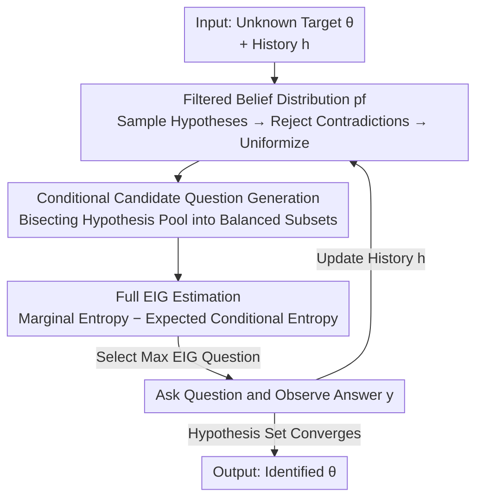

# BED-LLM: Intelligent Information Gathering with LLMs and Bayesian Experimental Design

**Conference**: ICLR 2026  
**OpenReview**: [https://openreview.net/forum?id=qyylZMLYT8](https://openreview.net/forum?id=qyylZMLYT8)  
**Code**: To be confirmed  
**Area**: LLM Agent / Active Information Gathering / Bayesian Experimental Design  
**Keywords**: Expected Information Gain, Sequential Bayesian Experimental Design, Active Questioning, Belief Filtering, 20 Questions

## TL;DR
This paper applies Sequential Bayesian Experimental Design (BED) to LLMs, enabling the model to select questions with the "maximum Expected Information Gain (EIG)" in each round. This transforms the LLM into a proactive and adaptive multi-turn information-gathering agent. In 20 Questions and movie preference inference tasks, the average success rate exceeds direct prompting by 37.4 percentage points.

## Background & Motivation
**Background**: Many real-world tasks require LLMs to "proactively elicit information"—clarifying user intent, performing personalization, acting as multi-turn dialogue agents, or serving as automated agents in decision pipelines (e.g., medical consultation, troubleshooting, preference learning, automated surveys). The commonality in these tasks is that information is not provided all at once; it must be gathered **round-by-round, selecting the next question based on collected answers**.

**Limitations of Prior Work**: While modern LLMs can write polished and insightful questions in a single round, they struggle with multi-turn interactions—specifically, they fail to "tailor" questions to previously collected answers. Existing research shows that LLMs perform poorly in multi-turn guessing games, task clarification, IT automation, and multi-step tool calling.

**Key Challenge**: Directly feeding history into the context to let the LLM "update beliefs in-context" (in-context updating) seems convenient, but empirical tests show that even strong models like GPT-4o often **sample hypotheses that contradict the history and become prematurely overconfident**. This issue worsens as the history grows longer. The root cause is that LLM in-context updating is not equivalent to Bayesian updating; it fails to utilize context information effectively and uniformly.

**Goal**: To provide LLMs with a **principled, information-theory-driven** adaptive questioning mechanism that faithfully absorbs history while remains computationally feasible for probabilistic models like LLMs, where "sampling is easy but calculating entropy is difficult."

**Key Insight**: The authors leverage the sequential Bayesian Experimental Design (BED) framework—originally designed for scenarios requiring adaptive design decisions with a generative model. The core is to select the experiment with the "maximum Expected Information Gain (EIG)" at each step. By treating "which question to ask" as "selecting an experimental design," the problem is transformed into a sequential BED task.

**Core Idea**: Construct a joint probability model of the target $\theta$ and answer $y$ using the LLM's predictive distribution, and iteratively follow a cycle of "selecting the question that maximizes EIG $\to$ observing the answer $\to$ updating the belief" rather than letting the LLM generate the next question directly based on intuition.

## Method

### Overall Architecture
Let the target quantity be $\theta$ (the entity to guess, user preference profile, etc.), with an initial prior belief $p(\theta)$. In each round $t$, the agent presents a question $x_t$ to the user, receives an answer $y_t$, and records the history as $h_{t-1}=(x_i,y_i)_{i=1}^{t-1}$. The core of BED is a joint generative model $p(\theta, y; x)$, selecting questions based on the **Expected Information Gain**:

$$\text{EIG}_\theta(x) = H[p(y;x)] - \mathbb{E}_{p(\theta)}\big[H[p(y|\theta;x)]\big]$$

This represents the "marginal entropy of the answer" minus the "expected conditional entropy of the answer given $\theta$." Intuitively, a good question is one where the answer is **difficult to guess beforehand** (high marginal entropy) but where the answer **significantly narrows down $\theta$** (low conditional entropy). BED-LLM adapts this to LLMs through a five-step loop each round: (A) Sample a set of candidate hypotheses $\Theta^{\text{cand}}$ from the filtered belief; (B) Generate a batch of diverse multiple-choice candidate questions $X^{\text{cand}}$ using an LLM; (C) Estimate EIG for each candidate question; (D) Select and ask the question with the maximum EIG; (E) Observe the answer, update history, and return to (A).

The essence of the method lies not just in the "BED" label, but in three critical modeling decisions: **how to factorize the joint model, how to update beliefs, and how to estimate EIG**. The following diagram illustrates the data flow per round:

> The modeling foundation for this cycle is the **Prior–Likelihood joint model** (Key Design 1), which determines how beliefs from B and likelihoods from D are combined into $p(\theta,y;x)$.

### Key Designs

**1. Prior–Likelihood Joint Model: Placing Uncertainty in "Answer Space" instead of "Hypothesis Space"**

There are two ways to construct a joint model with LLMs: **Prior–Likelihood pairing** $p(\theta;h)\,p(y;[\theta,x])$ (sample $\theta$ first, then $y$ conditioned on $\theta$ in context), or **Data–Estimation pairing** $p(y;[h,x])\,p(\theta;[h,x,y])$ (sample $y$ first, then infer $\theta$ based on $y$). A key observation is that for LLMs, these two sequences **do not induce equal joint distributions**—generally $p_{\text{LLM}}(\theta)\,p_{\text{LLM}}(y;[\theta,x]) \neq p_{\text{LLM}}(y;x)\,p_{\text{LLM}}(\theta;[x,y])$. Therefore, this is a consequential design decision.

BED-LLM chooses the Prior–Likelihood pairing, where the initial joint model is $p(\theta,y;x)=p(\theta)\,p_{\text{LLM}}(y;[\theta,x])$. Why? To estimate EIG (which contains entropy terms), one must calculate **specific probabilities** for a conditional distribution. LLMs are "accurate at sampling but difficult for entropy estimation"—the more complex and high-dimensional the space, the less reliable the entropy estimate. Prior–Likelihood pairing allows placing the "term requiring entropy calculation" in the **space of answer $y$** ($H[p_{\text{LLM}}(y;[\theta,x])]$). In this paper's tasks, the space of $y$ (multiple-choice answers) is far simpler than the space of $\theta$ (arbitrary entities/user profiles). The authors provide an actionable criterion: **use Prior–Likelihood if $\theta$ is more complex than $y$, and Data–Estimation if $y$ is more complex than $\theta$**. Additionally, Prior–Likelihood allows the belief state $p_f(\theta;h)$ to be read directly, ensuring the current belief is independent of the next question $x_t$ (a theoretical requirement for valid BED).

**2. Filtered Belief Distribution $p_f(\theta;h)$: Rejection Sampling to Remedy LLM "Forgetfulness and Overconfidence"**

Using $p_{\text{LLM}}(\theta;h)$ directly as the belief leads to two issues: sampling hypotheses that contradict history and prematurely concentrating probability mass on a few hypotheses. Full Bayesian updates are correct but computationally infeasible due to massive LLM calls. BED-LLM adopts a middle ground by constructing a modified distribution $p_f(\theta;h)$ that differs from $p_{\text{LLM}}(\theta;h)$ in two ways. First, **Consistency Filtering**: for each sampled $\theta$, the likelihood $p_{\text{LLM}}(y_i;[\theta,x_i])$ is used to check compatibility with every round in the history. If the likelihood of any observed answer falls below a threshold, the $\theta$ is **rejected** (the threshold balances robustness against model uncertainty with strict historical consistency). To save computation, a **Hypothesis Retention Mechanism** is used—hypotheses compatible with the latest Q&A are kept for the next round. Second, **Diversity Promotion**: Hypotheses are generated in batches with prompts encouraging diversity, and after filtering/deduplication, a **uniform distribution is enforced**. Ablation studies show that reverting to original in-context beliefs (ICL Beliefs) results in a drastic drop in success rate, confirming this step as a core component.

**3. Conditional Candidate Question Generation: Encouraging Questions that "Bisect the Hypothesis Pool"**

Since EIG cannot be directly optimized over the space of all possible questions, BED-LLM has the LLM **propose a batch of candidates and then selects from them**. Proposing involves two modes: **Unconditional Generation** (given only history $h$) and **Conditional Generation** (given history $h$ and the sampled hypothesis set $\Theta^{\text{cand}}$, prompting the LLM to propose questions that "bisect" the hypothesis pool into balanced subsets). Conditional generation essentially "feeds" EIG intuition to the LLM. To ensure diversity, $M$ questions are sampled jointly with high temperature. Conditional generation is effective in **discrete, clear-hypothesis** scenarios (20 Questions), but in complex, overlapping scenarios (Preference Inference), it tends to overfit to $\Theta^{\text{cand}}$, so unconditional generation is used instead. All questions are restricted to **multiple-choice formats** to simplify uncertainty quantification.

**4. Full EIG (Non-deterministic Likelihood): Rejecting "Deterministic Likelihood" Approximations**

Previous works applying information theory to LLM questioning often assumed that "given $(\theta,x_t)$, the answer is deterministic." This causes EIG to collapse into only the marginal predictive entropy $H[p(y_t;x_t,h_{t-1})]$—similar to "Split" or "bisecting the hypothesis pool" objectives. BED-LLM argues this is incorrect: the expected likelihood entropy $\mathbb{E}_{p(\theta;h)}[H[p(y_t|\theta;x_t,h)]]$ measures "whether the question remains ambiguous even if $\theta$ is known." Retaining this term allows the model to **avoid vague or ambiguous questions that are useless for learning $\theta$**. For example, two questions might have the same high marginal entropy, but if one has high conditional entropy (even knowing the entity, the answer is uncertain), its EIG will be near zero. BED-LLM uses a **Rao-Blackwellized estimator** for the full EIG:

$$\text{EIG}_\theta(x_t;h_{t-1}) \approx \frac{1}{N}\sum_{n=1}^{N}\sum_{y_t}p_{\text{LLM}}(y_t;[\theta_n,x_t])\log p_{\text{LLM}}(y_t;[\theta_n,x_t]) - \sum_{y_t}\hat{p}(y_t;[h_{t-1},x_t])\log\hat{p}(y_t;[h_{t-1},x_t])$$

where $\hat{p}(y_t;[h,x_t])=\frac{1}{N}\sum_n p_{\text{LLM}}(y_t;[\theta_n,x_t])$ and $\theta_n\sim p_f(\theta;h)$. This calculation is possible because the likelihood is in the $y$ space (probabilities read from LLM logits). By the Rao-Blackwell theorem, this estimator has strictly lower variance than pure sampling; furthermore, since both terms use the same likelihood evaluations, calculating the full EIG **adds no extra cost**. There is no reason to use the deterministic approximation.

## Key Experimental Results

Two scenarios: **20 Questions** (guess an entity within 20 yes/no questions; 100 targets each for Animals/Celebrities/Things) and **Preference Inference** (infer movie tastes using 5 multiple-choice questions; 200 user profiles). Answers are provided by an independent teacher LLM that only sees the ground truth $\theta^*$; "mismatched" scenarios where the questioner and answerer use **different LLMs** are also tested.

### Main Results (Final Success Rate in 20 Questions, Sample)

| Dataset / Model | Prompt-Only | Split (Prev. SOTA) | CoT | **BED-LLM** |
|---|---|---|---|---|
| Animals / GPT-4o | 45 | 83 | 62 | **93** |
| Animals / Mistral-Large | 33 | 85 | 35 | **95** |
| Celebrities / Mistral-Large | 19 | 63 | 42 | **91** |
| Celebrities / Qwen2.5-72B | 32 | 56 | 48 | **84** |
| Things / GPT-4o | 34 | 40 | 49 | **64** |
| Things / Llama-3.1-8B | 10 | 12 | 10 | **26** |

Ours significantly outperforms all baselines across **all datasets × all LLMs**. The final success rate is typically double that of Prompt-Only, with an average gain of 37.4 percentage points over direct prompting, and **no performance drops**. In Preference Inference, movies recommended by BED-LLM received higher average ratings than Prompt-Only and Entropy, with the advantage being most pronounced in heterogeneous model settings.

### Ablation Study (Each ablation modifies one core component of BED-LLM)

| Configuration | Modification | Typical Performance (vs BED-LLM) |
|---|---|---|
| **Full (BED-LLM)** | — | Optimal |
| Entropy | Replaced full EIG with marginal entropy | Significant drop, only slightly better than Split |
| Data–Estimation | Replaced Prior-Likelihood factorization | Massive drop, worse than Entropy |
| ICL Beliefs | Removed belief filtering; used raw $p_{\text{LLM}}(\theta;h)$ | Disastrous drop (worst in most settings) |
| Implicit Max. | Used LLM judgment instead of explicit EIG | Far worse than explicit EIG, but better than Prompt-Only |

### Key Findings
- **Belief Filtering (ICL Beliefs ablation) has the largest impact**: Removing rejection sampling and using raw in-context beliefs leads to the lowest success rate—proving that "faithful absorption of history" is the foundation of the method.
- **Value of Non-deterministic Likelihood**: the "Entropy" baseline (using BED-LLM likelihood but only optimizing marginal entropy) performs closer to "Split" than to BED-LLM, proving that gains come from the full EIG objective rather than just better marginal estimates.
- **Joint Model Factorization is a critical decision**: Data–Estimation performed worse than Entropy, validating the argument to place uncertainty in the $y$ space for these tasks.
- **Robust to model mismatch**: The advantage persists even when the questioner and answerer use different LLMs, which is crucial for real-world user interaction.

## Highlights & Insights
- **Formalizing "which question to ask" as "selecting an experimental design"**: This is not just another prompt trick; it installs an information-theoretic steering wheel for active information gathering, with every design decision grounded in theory.
- **Identifying the "deterministic likelihood assumption" pitfall**: Previous works that simplified EIG into marginal entropy can be fooled by questions with ambiguous answers. Adding the conditional entropy term costs almost nothing but successfully filters out ineffective questions—an insight transferable to any active learning or retrieval task using information gain.
- **Remedying unfaithful LLM updates with rejection sampling**: The "sample → check consistency → reject → uniformize" pipeline is far more reliable than expecting LLMs to update history faithfully in-context. This is a highly practical engineering paradigm.
- **Mapping modeling choices to criteria**: The rule "Use Prior–Likelihood if $\theta$ is complex; Data–Estimation if $y$ is complex" (based on which entropy is easier to estimate) serves as a valuable reference for anyone performing probabilistic inference with LLMs.

## Limitations & Future Work
- **Computational Overhead**: Each round requires sampling hypotheses, filtering, and evaluating likelihoods for every candidate question against every hypothesis. Cumulative LLM calls are significantly higher than direct prompting.
- **Dependency on LLM Logits and Multiple-Choice Formats**: Full EIG estimation requires $p_{\text{LLM}}(y;[\theta,x])$ (via logits), which is problematic for black-box APIs that only provide text. Restricting questions to multiple-choice also sacrifices the flexibility of open-ended questioning.
- **Overfitting of conditional generation in complex spaces**: In Preference Inference, the model had to revert to unconditional generation, indicating "bisecting the pool" isn't a silver bullet.
- **Filtering threshold as a hyperparameter**: The likelihood threshold for consistency filtering requires tuning to balance robustness and strict consistency.
- **Simplicity of the Answer Space**: The method's feasibility relies on the $y$ space being simpler than the $\theta$ space; it is not directly applicable to tasks where $y$ is highly complex (e.g., long-form answers).

## Related Work & Insights
- **vs Prompt-Only / CoT**: These rely on LLMs to generate the next question directly. BED-LLM uses explicit EIG maximization; structural reasoning (CoT) alone cannot bridge this gap.
- **vs Split (Prev. SOTA)**: Split selects questions that most evenly divide the hypothesis set, which is equivalent to maximizing marginal predictive entropy under a deterministic likelihood assumption. BED-LLM uses non-deterministic likelihood and full EIG, allowing it to filter out ambiguous questions.
- **vs Classical Sequential BED**: Classical methods use approximate inference for full Bayesian updates, which is expensive for LLMs and fails to utilize their generative strengths. BED-LLM provides a compromise between full Bayesian and pure in-context approaches.
- **Insights**: This paradigm of "LLM as probabilistic model + information-theoretic goals" can be extended to medical diagnosis, active retrieval, science discovery, and any agent task requiring stepwise information elicitation.

## Rating
- Novelty: ⭐⭐⭐⭐⭐ First to apply Prior–Likelihood pairing + full EIG for LLM information gathering with clear modeling justifications.
- Experimental Thoroughness: ⭐⭐⭐⭐⭐ Tested on 6 LLMs × 3 datasets + preference inference, with 5 ablations and model mismatch tests.
- Writing Quality: ⭐⭐⭐⭐⭐ Very clear explanations of the BED-LLM interface, factorization criteria, and EIG estimation.
- Value: ⭐⭐⭐⭐ Provides a rigorous framework for active gathering; deployment cost and logit dependency are the main hurdles.

<!-- RELATED:START -->

## Related Papers

- [\[ICLR 2026\] An Information Theoretic Perspective on Agentic System Design](an_information_theoretic_perspective_on_agentic_system_design.md)
- [\[ICLR 2026\] A Benchmark for Deep Information Synthesis (DeepSynth)](a_benchmark_for_deep_information_synthesis.md)
- [\[ICLR 2026\] Sculptor: Empowering LLMs with Cognitive Agency via Active Context Management](sculptor_empowering_llms_with_cognitive_agency_via_active_context_management.md)
- [\[ICLR 2026\] FlowSearcher: Synthesizing Memory-Guided Agentic Workflows for Web Information Seeking](flowsearcher_synthesizing_memory-guided_agentic_workflows_for_web_information_se.md)
- [\[ICLR 2026\] InfoMosaic-Bench: Evaluating Multi-Source Information Seeking in Tool-Augmented Agents](infomosaic-bench_evaluating_multi-source_information_seeking_in_tool-augmented_a.md)

<!-- RELATED:END -->
