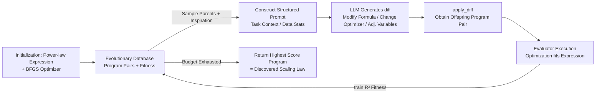

# Can Language Models Discover Scaling Laws?

**Conference**: ICLR 2026  
**OpenReview**: [https://openreview.net/forum?id=TPTtWC0pGk](https://openreview.net/forum?id=TPTtWC0pGk)  
**Code**: Open source (Website / HuggingFace / GitHub links provided in paper)  
**Area**: LLM Agent / Automated Scientific Discovery  
**Keywords**: Scaling Law Discovery, Evolutionary Agent, Symbolic Regression, AI Scientist, Superhuman Performance  

## TL;DR
This paper proposes **SLDAgent**—an evolutionary agent that co-evolves "formula generators + parameter optimizers"—along with **SLDBench**, the first scaling law discovery benchmark. It demonstrates for the first time that LLM agents can automatically discover scaling laws whose extrapolation accuracy exceeds human-expert derivations across all 8 evaluated tasks.

## Background & Motivation
**Background**: Scaling laws are the cornerstone of foundation model development—ranging from Kaplan/Chinchilla pre-training loss $L=\theta_0+\theta_1/N^{\theta_2}+\theta_3/D^{\theta_4}$ to recent scenarios like MoE, vocabulary size, SFT, domain mixing, and learning rate-batch size. They are used to predict large-scale model performance, select optimal configurations, and pick pre-training checkpoints.

**Limitations of Prior Work**: Discovering scaling laws for new scenarios relies almost entirely on human experts proposing mathematical forms based on intuition and experience, followed by manual coefficient fitting. This process is **slow, labor-intensive, and often suboptimal**, requiring repeated "hypothesis-experiment" cycles and being limited by human ability to analyze complex multi-variable relationships.

**Key Challenge**: Scaling Law Discovery (SLD) simultaneously requires **symbolism** (must be generalizable mathematical formulas) and **openness** (infinite formula space with no prior answers). Existing AI Scientist-type agents excel at automating engineering workflows but struggle with open-ended problem formulation, principled experimental design, and long-range robust execution. Tests show that applying strong LLMs directly to off-the-shelf CLI agents like Codex or Claude Code fails to produce scaling laws superior to human ones.

**Goal**: Rigorously answer: "Can LLM agents discover the scaling laws governing their own behavior more efficiently and accurately than humans?"

**Core Idea**: **Evolutionary search + co-evolution of formula/optimization**—Mirroring human research as a generational improvement process, SLD is modeled as evolutionary optimization in the space of executable programs. LLMs continuously mutate the pair of sub-programs—"formula expression" and "parameter fitting routine"—using $R^2$ on extrapolation data as a clear, continuous fitness signal without needing to learn a reward model.

## Method

### Overall Architecture
SLDBench defines each task as: given a set of observational trials $\mathcal{D}=\{(x_i,j_i,y_i)\}$ (where $x$ represents features like model size/data volume/batch size, $y$ is loss/perplexity/accuracy, and $j$ is the experimental setting index), produce a symbolic expression $f_\theta:x\mapsto \hat y$ and fitted parameters $\{\theta_j\}$ for each setting to make the $R^2$ on the "largest scale" held-out extrapolation test set as close to 1 as possible. SLDAgent is an evolutionary coding agent: each candidate "program" consists of a pair of sub-programs—`Expression(x, θ)` defines the symbolic model $f_\theta$, and the `Optimization` routine fits parameters to data. The LLM continuously mutates this pair; offspring are executed, scored, and written back to the evolutionary database. The population improves until the program with the highest fitness is returned as the discovered scaling law.

### Key Designs

**1. Co-evolution of Expression & Optimization: Searching "formula guessing" and "coefficient fitting" together**. Unlike general-purpose program evolution (e.g., AlphaEvolve, which evolves a single function), SLDAgent splits each candidate into `Expression` and `Optimization` sub-programs that can be mutated independently. The motivation is specific to SLD: a good formula fails without an accurate optimizer, and vice versa. Starting from a baseline program pair (typically a power-law `Expression` + standard BFGS `Optimization`), the LLM can modify the formula structure, swap optimization algorithms (e.g., BFGS to SGD, tuning initialization), or adjust global variables in a single mutation to improve both sub-programs toward the same goal. Ablations prove this co-evolution leverages LLM capabilities better than task-agnostic evolution.

**2. Evolutionary Search Loop + Probabilistic Exploration-Exploitation**: Each step selects parents from the database using a mixed strategy: **Exploitation** of high-score programs (70%), **Diversity** (20%), and **Elite** top programs (10%). These are included in a structured prompt with task context and data statistics (range, mean, variance). The LLM proposes a `diff` for the parent code. The offspring is executed: its `Optimization` fits the `Expression` on seen data, calculating training $R^2$ as fitness to be written back. **The test set remains untouched**, ensuring the integrity of extrapolation evaluation.

**3. Multi-island + MAP-Elites to Prevent Premature Convergence**: Similar to AlphaEvolve, five "islands" evolve in parallel. MAP-Elites structures the population across three dimensions: "fitness score, complexity, and novelty," actively maintaining diversity and preventing local optima. The system is built on the OpenEvolve framework.

**4. Principled Rather Than Just Accurate Formulas**: Case studies reveal SLDAgent does not rely on parameter stuffing or overfitting. For example, in the SFT task, the human law $L=\theta_2+\frac{\theta_0}{D^{\theta_1}+\theta_3}$ has $\theta_3$ with the same dimension as $D^{\theta_1}$, making it less interpretable. The SLDAgent law $L=\theta_2+\frac{\theta_0}{1+(D/\theta_3)^{\theta_1}}$ uses a dimensionless ratio $(D/\theta_3)^{\theta_1}$, allowing $\theta_3$ to retain the natural units of "data scale" and directly characterize the scale where the curve shifts from steep decay to saturation. For MoE, it discovered $L=\frac{\theta_1 N^{\theta_2}}{1+\theta_3 E^{\theta_4}}+\theta_5 N^{0.6\theta_2}+\theta_6$, cleanly separating parameter-driven terms, expert decay factors, and the irreducible loss lower bound $\theta_6$, ensuring convergence to a finite limit as $E\to\infty$ and $N\to\infty$. Human log-linear forms are highly sensitive to fitting symbols during extrapolation and may diverge ($R^2$ 0.891 vs 0.732).

## Key Experimental Results

### Main Results Table (Fixed GPT-5, Comparing 8 Agent Architectures, Avg. $R^2$ over 5 runs)

| Method | parallel | vocab | SFT | domain_mix | moe | d_constrain | lr&bsz | u_shape | **Avg R²** |
|---|---|---|---|---|---|---|---|---|---|
| Aider | 0.991 | 0.132 | 0.131 | 0.514 | 0.119 | 0.718 | -0.659 | -0.474 | 0.184 |
| OpenHands | 1.000 | 0.182 | 0.640 | 0.899 | 0.466 | 0.534 | -0.909 | -0.278 | 0.317 |
| CodeX | 0.999 | 0.977 | 0.855 | 0.933 | 0.649 | 0.763 | -0.039 | -0.740 | 0.550 |
| Goose | 1.000 | 0.962 | 0.899 | 0.944 | 0.813 | 0.894 | 0.280 | -0.232 | 0.695 |
| **Human** | 1.000 | 0.966 | 0.957 | 0.671 | 0.703 | 0.911 | -0.076 | -1.000 | 0.517 |
| **Ours (SLDAgent)** | **1.000** | **0.987** | **0.993** | **0.988** | 0.773 | **0.944** | **0.604** | -0.305 | **0.748** |

SLDAgent leads with 0.748, significantly outperforming Goose (0.695) and Human (0.517), tying with humans on `parallel` and exceeding humans across all other tasks.

### Ablation Study / Cross-Model Table (SLDAgent vs. Native CLI, Avg. $R^2$)

| Model | Native CLI | SLDAgent | Gain |
|---|---|---|---|
| Gemini-2.5-Flash | 0.077 | 0.506 | **+0.429** |
| Gemini-3-Pro | 0.382 | 0.636 | +0.254 |
| Claude-Haiku-4.5 | 0.419 | 0.519 | +0.100 |
| Claude-Sonnet-4.5 | 0.472 | 0.590 | +0.118 |
| o4-mini | 0.349 | 0.657 | +0.308 |
| GPT-5 | 0.550 | 0.748 | +0.198 |

Regardless of the LLM used, SLDAgent consistently improves upon native CLI agent performance, indicating that **the agent design, rather than the backbone LLM alone, is the decisive factor**.

### Key Findings
- **Superhuman Performance**: Combined with GPT-5, SLDAgent ties or exceeds human experts on all 8 tasks.
- **Wide Task Difficulty Spectrum**: Nearly all agents achieve full marks on `parallel`; `lr&bsz` and `u_shape` are extremely difficult (weaker agents often yield strongly negative $R^2$, and even humans achieve only -1.000 on `u_shape`). SLDAgent is the only method robust across nearly all tasks.
- **Application I (Pre-training Hyperparameters)**: The explicit discovered formula $L(N,D,lr,bsz)$ allows for analytical optimization via $\partial L/\partial lr=\partial L/\partial bsz=0$. Extrapolating to a 1B model/100B tokens, the actual validation loss at the analytical optimum is 2.0776, a difference of only 0.067% from the true optimum (2.0762).
- **Application II (Model Selection for Fine-tuning)**: Using a 6.25% subset to fit an SFT law and predict full performance for 14 candidate LLMs, the SLDAgentLaw achieves an average RelAcc of 100% and PearCorr of 87.7%, outperforming five baselines including RectifiedLaw and SubTuning.

## Highlights & Insights
- **First empirical evidence of "AI discovering scaling laws governing itself better than humans"**: Moves AI Scientists from "writing code/running experiments" to "producing generalizable symbolic scientific knowledge" that can benefit the research community.
- **Value of the Benchmark**: SLDBench aggregates 5000+ real training experiments across 8 heterogeneous tasks. Using $R^2$ as a continuous target directly computable from extrapolation data (no reward model learning) distinguishes it from symbolic regression tasks that "rediscover known formulas" or engineering tasks like MLE-Bench.
- **Explainability as a Byproduct**: Discovered formulas show more principled dimensional consistency and asymptotic behavior than human laws, proving that evolutionary search finds "correct" structures rather than just overfitting.
- **Agent > Model**: Different agents using the same GPT-5 show massive performance gaps (0.184 to 0.748), highlighting the leverage of system design.

## Limitations & Future Work
- **u_shape Remains a Bottleneck**: As an adversarial extrapolation scenario, even SLDAgent (-0.305) hasn't fully conquered it, matching the human failure (-1.000). Non-monotonic scaling prediction remains an open problem.
- **Model Capacity Bottleneck**: Smaller models (Gemini-2.5-Flash / Claude-Haiku-4.5) still underperform human baselines on hard tasks like `lr&bsz` even with SLDAgent; the framework cannot fully compensate for base capability.
- **Task Coverage**: Currently limited to 8 tasks and dependent on existing open-source data. The authors plan to expand this; generalization to entirely new, zero-prior scaling scenarios is yet to be verified.
- **Sandbox Evaluation**: Current evaluation is within a sandbox without network access; open-ended data acquisition and experimental design are not yet part of the closed loop.

## Related Work & Insights
- **Evolutionary Coding Agents**: Directly inspired by AlphaEvolve / OpenEvolve (multi-island, MAP-Elites, program evolution), migrating these concepts from "optimizing matrix multiplication" to scientific formula discovery.
- **AI Scientist Lineage**: Part of Automated Scientific Discovery alongside Lu et al.'s automated papers and Swanson's automated drug discovery, but focusing on "symbolic + open-ended" deeper intelligence.
- **Scaling Law Literature**: Built upon the foundations of Chinchilla, StepLaw, and specific laws for MoE/SFT/Domain Mixing, treating them as strong baselines to exceed.
- **Insight**: Handing scientific problems with clear, continuous, computable targets but unknown global optima to evolutionary search + LLM mutation may be a general paradigm for AI4Science. The "co-evolution of model form + fitting process" can be transferred to other symbolic modeling tasks.

## Rating
- **Novelty**: ⭐⭐⭐⭐⭐ First proof that AI agents can discover scaling laws superior to humans; establishes the first SLD benchmark.
- **Experimental Thoroughness**: ⭐⭐⭐⭐⭐ 8 tasks × 8 agents × 6 LLMs × 5 repetitions, plus two real downstream applications and deep formula analysis.
- **Writing Quality**: ⭐⭐⭐⭐ Clear motivation and persuasive case studies (SFT/MoE comparison). Task naming and dense tables require some cross-referencing.
- **Value**: ⭐⭐⭐⭐⭐ Provides both a benchmark/framework and practical value (analytical pre-training hyperparameters and efficient model selection).

<!-- RELATED:START -->

## Related Papers

- [\[ICLR 2026\] Agentic Context Engineering: Evolving Contexts for Self-Improving Language Models](agentic_context_engineering_evolving_contexts_for_self-improving_language_models.md)
- [\[ICLR 2026\] GPS: Graph-guided Proactive Information Seeking in Large Language Models](gps_graph-guided_proactive_information_seeking_in_large_language_models.md)
- [\[ICLR 2026\] ToolWeaver: Weaving Collaborative Semantics for Scalable Tool Use in Large Language Models](toolweaver_weaving_collaborative_semantics_for_scalable_tool_use_in_large_langua.md)
- [\[ICLR 2026\] Nemotron-Research-Tool-N1: Exploring Tool-Using Language Models with Reinforced Reasoning](nemotron-research-tool-n1_exploring_tool-using_language_models_with_reinforced_r.md)
- [\[ICLR 2026\] Scaling Agent Learning via Experience Synthesis](scaling_agent_learning_via_experience_synthesis.md)

<!-- RELATED:END -->
