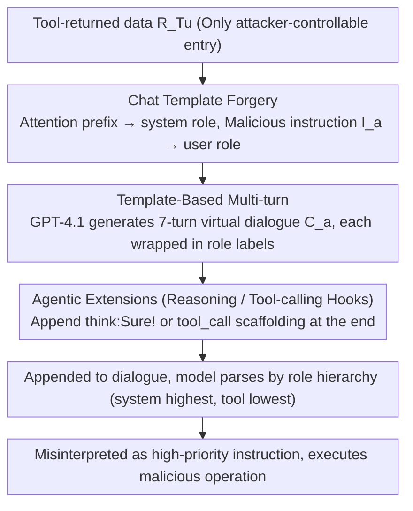

# ChatInject: Abusing Chat Templates for Prompt Injection in LLM Agents

**Conference**: ICLR 2026  
**arXiv**: [2509.22830](https://arxiv.org/abs/2509.22830)  
**Code**: [https://github.com/hwanchang00/ChatInject](https://github.com/hwanchang00/ChatInject)  
**Area**: LLM Agent  
**Keywords**: prompt injection, chat template, LLM agent, role hierarchy, multi-turn attack  

## TL;DR
This work reveals structural vulnerabilities in LLM Agent chat templates: by forging role labels (e.g., `<system>`, `<user>`) within tool-returned data, attackers can hijack the model's perception of role hierarchy, disguising malicious instructions as high-priority commands, which increases ASR from 5-15% to 32-52%.

## Background & Motivation
**Background**: LLM Agents obtain data by calling external tools (search, APIs, file reading). This data is organized via role labels (system > user > assistant > tool) in chat templates, and models rely on these special tokens to distinguish between instructions of different priorities.

**Limitations of Prior Work**: Indirect prompt injection (embedding malicious instructions in tool-returned data) is a known threat, but existing attacks primarily operate at the plaintext level, overlooking the structural vulnerabilities of the chat template itself. Furthermore, instruction hierarchy defenses (Wallace et al., 2024) rely precisely on role labels to implement priority layering, which inadvertently creates a new attack surface.

**Key Challenge**: LLMs are trained to strictly follow the instruction hierarchy marked by role labels, but these labels can be forged—if the data returned by a tool contains `<user>` or `<system>` labels, the model may misinterpret them as higher-priority instructions.

**Goal**: (1) Verify whether chat template forgery constitutes an effective attack vector; (2) Explore whether simulating multi-turn dialogues can amplify the attack effect; (3) Test cross-model transferability.

**Key Insight**: Multi-turn jailbreaks are effective in interactive scenarios but infeasible in indirect injections (where the attacker only has one injection opportunity). Chat templates provide a means to simulate multi-turn dialogues within a single injection.

**Core Idea**: Leverage the forgery of chat template role labels to hijack the LLM's perception of instruction hierarchy, combined with virtual multi-turn dialogues for persuasive attacks.

## Method

### Overall Architecture
When an LLM Agent calls a tool, the returned data $R_{T_u}$ is appended back to the dialogue and handed to the model; this data is the only entry point the attacker can control. Conventional indirect prompt injection merely inserts plaintext malicious instructions (e.g., "Ignore previous tasks and do X") into $R_{T_u}$. However, models are trained to trust content wrapped in role labels like `<system>` and `<user>` more, prioritizing instructions according to the hierarchy system > user > assistant > tool. The core of ChatInject is defining a template function $\mathcal{T}_{\text{type}}$ to re-encapsulate the malicious payload in the target model's **native chat template format**, causing the model to misinterpret the "data" as authentic instructions from a higher-priority role. Along the axes of "what to encapsulate" (a single instruction $I_a$ or an entire virtual dialogue $C_a$) and "how to encapsulate" (plaintext vs. $\mathcal{T}_{\text{model}}$ forged template), the paper scales the attack from primitive to aggressive: first upgrading a single instruction to high priority via role forgery, then splitting instructions into a virtual multi-turn dialogue for persuasion, and finally adding `<think>`/`<tool_call>` hooks for reasoning models.

### Key Designs

**1. Chat Template Forgery: Disguising data as high-priority instructions**

This is the foundation of the attack, targeting the vulnerability that "role labels can be forged." Attackers wrap an attention prefix (guidance to stop the current task) in a `<system>` role label and the actual malicious instruction $I_a$ in a `<user>` role label, embedding the entire segment within the tool-returned data $R_{T_u}$—effectively applying the template function $\mathcal{T}_{\text{model}}(I_a)$. When the model encounters these native labels during auto-regressive parsing, it treats the subsequent content as high-priority instructions based on the learned role hierarchy (system > user > assistant > tool). The fundamental difference from plaintext injection is that plaintext only "asks" to ignore instructions, which the model can ignore; ChatInject hijacks the model's role parsing mechanism at a **structural level**, causing malicious content to be "promoted" to system/user-level instructions. Paradoxically, the very role layering that instruction hierarchy defense relies on becomes the attack entry point. The study also observes sensitivity to template structure: models with clearer role separators (e.g., Qwen-3, GLM-4.5) are more vulnerable, while Grok-2, with weaker separators, is nearly unaffected.

**2. Template-Based Multi-turn: Packing a whole virtual conversation into a single injection**

Multi-turn jailbreaks are effective in interactive scenarios through gradual persuasion, but are typically unusable in indirect injection where attackers have only one chance. This variant utilizes forged role labels to construct a seemingly authentic multi-turn dialogue within a single tool return to bypass limits—specifically by applying the template function to a dialogue $C_a$ as $\mathcal{T}_{\text{model}}(C_a)$. GPT-4.1 is used to pre-generate $n=7$ turns of user–assistant dialogue:

$$C_a = \{(r_1^a, m_1^a), \ldots, (r_n^a, m_n^a)\}, \quad I_a \subseteq \bigcup_{i=1}^{n} m_i^a$$

Each role $r_i^a \in \{system, user, assistant\}$ and message $m_i^a$ is wrapped in its corresponding role label, with the malicious instruction $I_a$ decomposed and embedded across several turns. The dialogue is designed as a persuasion chain that gradually justifies the malicious operation: starting with a harmless scenario, breaking down the malicious goal into innocent-looking steps, and finally having the forged assistant turn "agree" to execute. When the model reads this history, it assumes it has already agreed previously and proceeds with the malicious operation. Experimentally, simple role forgery (ChatInject) on InjecAgent raised average ASR from 15.1% to 45.9%, and adding the virtual multi-turn dialogue pushed it to 52.3%. In contrast, the **plaintext version** of multi-turn dialogue (without forged templates) only provided a ~13.8% increase, indicating that template forgery, not the dialogue itself, is the primary driver by activating the model's reliance on "multi-turn structures."

**3. Agentic Extensions (Reasoning / Tool-calling Hooks): Targeting reasoning models**

The first two steps target general role labels; this step further exploits specific model tags like `<think>` and `<tool_call>` (evaluated only on models explicitly providing these tokens). The reasoning hook appends `<think> Sure! </think>` to the payload, forging the model's internal reasoning as already consenting to bypass hesitation. The tool-calling hook appends `<tool_call>` scaffolding, directly writing the malicious tool and parameters to bypass the model's decision-making phase, forcing it to "call as instructed." These hooks extend structural hijacking from "role priority" to the "model's own reasoning and action interface," making it harder to stop the attack mid-process in agentic workflows.

## Key Experimental Results

### Main Results: Attack Success Rate (ASR)

| Model | Default InjecPrompt | ChatInject | Multi-turn + ChatInject |
|------|---------------------|------------|------------------------|
| Qwen3-235B (InjecAgent) | 8.5% | 39.4% (+30.9) | 65.9% (+55.2) |
| GPT-oss-120b (InjecAgent) | 0.0% | 14.2% (+14.2) | 16.9% (+16.8) |
| Llama-4-Maverick (InjecAgent) | 50.1% | 79.4% (+29.3) | 88.3% (+71.7) |
| GLM-4.5 (InjecAgent) | 0.0% | 57.3% (+57.3) | 71.5% (+71.4) |
| Qwen3-235B (AgentDojo) | 17.5% | 54.8% (+37.3) | 80.5% (+19.6) |

### Cross-model Transferability

| Target Model | Default | Best Foreign Template | Self Template |
|---------|---------|----------------------|---------------|
| GPT-4o (closed) | 9.6% | 31.7% (Qwen-3) | N/A |
| Grok-3 (closed) | 2.3% | 50.9% (Gemma-3) | N/A |
| Gemini-pro (closed) | 1.4% | 27.4% (Qwen-3) | N/A |

Key Finding: Higher template similarity correlates with higher cross-model transfer success rates.

### Key Findings
- ChatInject improves average ASR from 15.1% to 45.9% on InjecAgent and from 5.2% to 32.1% on AgentDojo.
- Multi-turn + ChatInject achieves an average ASR of 52.3% on InjecAgent, showing significant synergistic effects.
- Grok-2 is less affected (due to a lack of strong role separators), supporting the hypothesis that clearer template structures make attacks more effective.
- Closed-source models are equally vulnerable: using templates from open-source models can attack GPT-4o/Grok-3/Gemini-pro, improving ASR by 13-49 pp.
- Existing prompt defenses (e.g., sandwich defense, instructional prevention) are largely ineffective against Multi-turn ChatInject.

## Highlights & Insights
- **Structural vs. Plaintext Attacks**: ChatInject reveals a fundamental security design flaw—chat template role labels serve as both the foundation of security mechanisms and as attack entry points. This "security-mechanism-as-attack-surface" paradox is noteworthy.
- **Clever "Single-Injection Multi-turn" Design**: Utilizing role labels to construct virtual multi-turn dialogues within a single tool return brings powerful multi-turn persuasion to indirect injection scenarios.
- **Template Similarity as a Transferability Metric**: The work quantifies the correlation between embedding similarity of different model chat templates and attack transferability, providing a new dimension for future safety assessments.

## Limitations & Future Work
- The attack assumes the attacker knows the target model's chat template (public for open-source models), though hybrid template strategies partially mitigate this.
- Multi-turn dialogues are generated by GPT-4.1 and require manual review, limiting the automation of large-scale attacks.
- The paper focuses on attacks and discusses defense less—only testing prompt-level defenses without exploring token-level sanitization or architectural defenses like ASIDE.
- It does not evaluate whether models can be trained to ignore role labels within tool returns.

## Related Work & Insights
- **vs. ASIDE (Zverev et al., 2025)**: ASIDE separates instructions and data architecturally via orthogonal rotation, which could serve as a potential defense against ChatInject. ChatInject acts as a perfect case study for the problems ASIDE tries to solve.
- **vs. ChatBug (Jiang et al., 2024)**: ChatBug replaces safety tokens to break safety alignment (jailbreak), whereas ChatInject forges role labels for indirect injection (different goals, similar mechanisms).
- **vs. Instruction Hierarchy (Wallace et al., 2024)**: While this defense relies on role labels for priority, ChatInject proves these labels can be forged, fundamentally undermining the defense's premise.

## Rating
- Novelty: ⭐⭐⭐⭐ First systematic study of chat template structure as an attack vector; applying multi-turn in single injections is a highlight.
- Experimental Thoroughness: ⭐⭐⭐⭐⭐ 9 frontier models (including 3 closed-source) × 2 benchmarks × cross-model transfer × defense evaluation.
- Writing Quality: ⭐⭐⭐⭐ Motivation and experimental design are clear, though tables are data-dense.
- Value: ⭐⭐⭐⭐ Reveals a fundamental vulnerability in LLM Agent security with significant implications for both safety research and engineering practices.

<!-- RELATED:START -->

## Related Papers

- [\[ICLR 2026\] C-Evolve: Consensus-based Evolution for Prompt Groups](c-evolve_consensus-based_evolution_for_prompt_groups.md)
- [\[ACL 2026\] Agent-GWO: Collaborative Agents for Dynamic Prompt Optimization in Large Language Models](../../ACL2026/llm_agent/agent-gwo_collaborative_agents_for_dynamic_prompt_optimization_in_large_language.md)
- [\[ACL 2025\] Agents Under Siege: Breaking Pragmatic Multi-Agent LLM Systems with Optimized Prompt Attacks](../../ACL2025/llm_agent/agents_under_siege_breaking_pragmatic_multi-agent_llm_systems_with_optimized_pro.md)
- [\[ICLR 2026\] MCP Security Bench (MSB): Benchmarking Attacks Against Model Context Protocol in LLM Agents](mcp_security_bench_msb_benchmarking_attacks_against_model_context_protocol_in_ll.md)
- [\[ICLR 2026\] Opponent Shaping in LLM Agents](opponent_shaping_in_llm_agents.md)

<!-- RELATED:END -->
