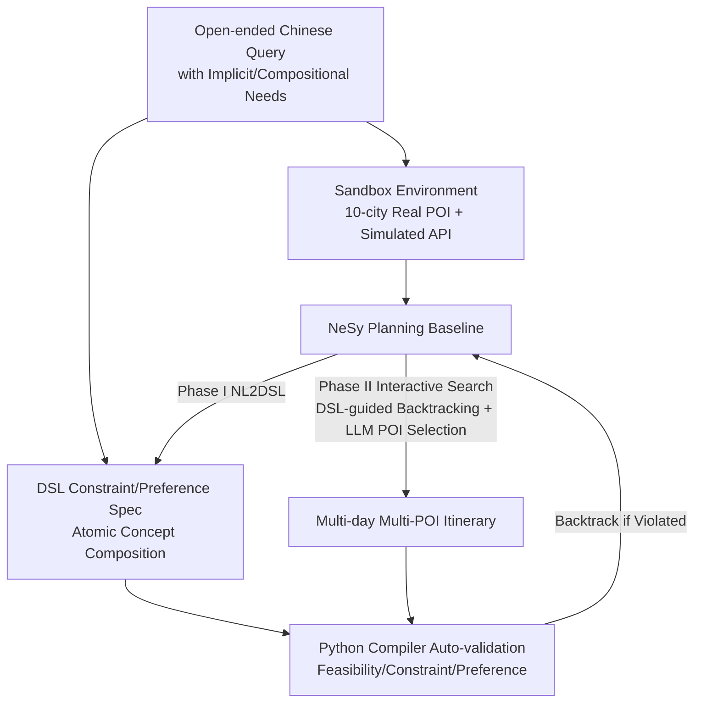

# ChinaTravel: An Open-Ended Travel Planning Benchmark with Compositional Constraint Validation for Language Agents

**Conference**: ICLR 2026  
**OpenReview**: [https://openreview.net/forum?id=0YRVlxY9BH](https://openreview.net/forum?id=0YRVlxY9BH)  
**Code**: Yes (Project Page / Codebase / Dataset are open, Nanjing University LAMDA + Huawei Noah)  
**Area**: LLM Agent / Travel Planning Benchmark / Neuro-Symbolic Planning  
**Keywords**: Language Agent, Travel Planning, Compositional Constraint, Domain-Specific Language, Neuro-Symbolic  

## TL;DR
ChinaTravel utilizes a compositional Domain-Specific Language (DSL) to automatically translate "open-ended natural language travel requirements" into verifiable logical constraints and preference objectives. Combined with 1154 real-world Chinese user queries, it constructs the first truly open multi-day multi-POI travel planning benchmark that requires contextual grounding and generalization to unseen constraint combinations. Empirical results show that neuro-symbolic agents achieve a 10x higher constraint satisfaction rate than pure LLMs ($37.0\%$ vs $2.60\%$), yet the task remains far from solved.

## Background & Motivation
**Background**: Travel planning is regarded as a hallmark scenario for Language Agents—it couples significant practical demand with strict constraint satisfaction problems. Agents must call various tools for flights, trains, attractions, restaurants, and hotels, making interdependent decisions across dimensions of space, time, and budget. Previously, TripPlanning (Zheng et al. 2024) and TravelPlanner (Xie et al. 2024) were the dominant benchmarks in this field.

**Limitations of Prior Work**: Existing benchmarks are built on the "slot-filling" paradigm, where agents only extract values for fixed attributes (budget, dates, room type, etc.). The authors point out four fundamental flaws: (i) **Task Bias**, emphasizing inter-city travel while ignoring intra-city scheduling with denser constraints; (ii) **Rigid Constraint Validation**, relying on fixed rule lists that cannot generalize to unseen requirements; (iii) **Synthetic Queries**, consisting of templated LLM-synthesized sentences lacking real semantics; (iv) **Misleading NeSy Evaluation**, exposing pure LLMs' shortcomings in constraint compliance while ignoring bottlenecks of neuro-symbolic methods. Sharp evidence shows that months after TravelPlanner's release, Hao et al. (2025) achieved a success rate leap from $4\%$ to $97\%$ using a "LLM constraint extraction + formal verification" neuro-symbolic pipeline, indicating that templated, fixed-constraint settings have reached saturation and fail to expose the bottlenecks of NeSy methods in real natural language interaction.

**Key Challenge**: Real human needs are **compositional, diverse, and often implicitly expressed** (e.g., "traveling with a child who cannot eat spicy food" implies excluding Sichuan/Chongqing cuisines). The slot-filling paradigm can only express fixed propositional logic and cannot handle compositional constraints across events, such as "meal budget $\le 1000$ yuan" or "reach Shanghai before 18:00 on the second day." Every new requirement requires manual rule writing.

**Goal**: To build an open-ended travel planning benchmark that evolves with the space of real-world requirements while maintaining automatic verifiability.

**Key Insight**: **Upgrade constraint verification from a "fixed rule list" to a "compositional language space" via DSL.** By providing a small set of basic concept functions + Python-like syntax, any requirement can be written as a combination of primitives and verified directly by a Python compiler. Combined with 1154 real user open queries, this pushes the two true open-world challenges: "contextual grounding" and "generalization to unseen concept combinations."

## Method

### Overall Architecture
ChinaTravel consists of three layers: (1) A **Sandbox Environment** containing real data from 10 popular Chinese cities (720 planes, 5770 trains, 3413 attractions, 4655 restaurants, 4124 hotels, all with metadata and simulated API interfaces), using 25 environment constraints for feasibility measurement; (2) A **Compositional DSL** that combines atomic concepts of space, time, cost, and type into logical constraints (hard) and preference objectives (soft), automatically verified by a Python compiler for feasibility, constraint satisfaction, and preference ranking; (3) An open-ended dataset produced by a **Four-stage Construction Pipeline**, including 154 human-verified queries (Human-154) and 1000 human-tested queries (Human-1000). The authors also provide a **NeSy Planning** baseline as a preliminary solution.

### Key Designs

**1. Compositional Domain-Specific Language (DSL): Moving constraints from propositional logic to compositional language space.** This is the engine of the work. TravelPlanner has only 5 fixed concepts, each mapping to a specific requirement—essentially propositional logic. It only reasons about truth relations of atomic propositions and cannot touch the internal structure of travel events. ChinaTravel’s DSL provides variables (referring to itinerary activities), Boolean operations (`not`/`and`/`or`), numerical comparison and calculation (`<`/`>`/`==`/`+`/`-`/`*`/`/`), attribute functions (`cost(var)`, `type(var)`, `time(var)`), relation functions (`dist(expr1, expr2)`), assignment side effects (`var = expr`), set operations (union/intersection/difference), enumeration (`for var in {var}`), and conditional side effects (`if expr : effect`). Thus, a complex requirement for "visiting a museum" is translated as $\exists x \in \text{Attraction\_visiting},\ x.\text{type}=\text{museum}$, and "budget 5000" as $\text{total\_budget} \le 5000$. The key Gain is that new requirements no longer need manual rule engine updates; they are compiled and executed for validation, expanding the constraint space exponentially from $\sim 10$ combinations in TravelPlanner to 100 types in Human-1000 (85 of which are new constraints never seen in templates).

**2. Objective Modeling of Soft Preferences: Turning "seeing as many attractions as possible" into automatically comparable optimization targets.** Travel needs include hard constraints and many soft preferences— "soft" means they are quantitative comparisons based on continuous values rather than binary satisfaction problems. Common preferences include maximizing attractions visited or minimizing transit time. ChinaTravel formalizes these using the same DSL as minimization/maximization targets (e.g., $\max \sum_x \mathbb{1}[x \in \text{Attraction\_visiting}]$), enabling automatic evaluation and preference ranking without manual scoring. This allows the benchmark to assess both "satisfying hard constraints" and "selecting the better solution among feasible ones."

**3. Four-phase Construction + Real Human Requirement Injection: Allowing the benchmark to evolve with real-world requirement space.** Data is not synthesized in one go but iterated in a closed loop: Phase I builds databases and APIs; Phase II uses DeepSeek-V2.5 to transform random query skeletons into natural language with varying complexity (Easy/Medium) and diverse expressions; Phase III handles quality control and auto-validation; Phase IV is the key differentiator—after the first loop, 250+ real human requirements are collected via surveys, yielding Human-154 which contains new constraints (e.g., departure time, meal costs) not found in templates, further expanded to Human-1000 via the WJX platform. Because real users introduce complex constraints that cannot be enumerated during development, the DSL's extensible and verifiable nature allows the benchmark to embrace the evolving requirement space and systematically expose open-world challenges.

**4. C-LPR Metric and NeSy Planning Baseline: Preventing cheating and providing decoupled solutions.** To prevent evaluation from being exploited by unrealistic constraint prioritization (like "lying about costs to meet a budget"), the authors propose **Conditional Logical Pass Rate (C-LPR)**. It counts the logical constraint satisfaction rate only if the plan first passes environment constraints: $\text{C-LPR}=\frac{\sum_{p\in P}\mathbb{1}_{\text{passed(Env},p)}\cdot\sum_{c\in C_p}\mathbb{1}_{\text{passed}(c,p)}}{\sum_{p\in P}|C_p|}$, measuring meaningful constraint satisfaction within realistic boundaries. The NeSy Planning baseline has two phases: **NL2DSL** uses Reflexion + DSL syntax checkers to translate natural language into DSL; **Interactive Search** uses a neuro-symbolic solver to order activities by symbolic sketches and uses an LLM to recommend POIs, generating itineraries with DSL validation and backtracking upon violation. Its core idea is to decouple **understanding (flexible NL handling), planning (DSL-guided backtracking/verification), and execution (precise tool calls)**.

## Key Experimental Results

### Main Results (Key Excerpts)

| Method (Backend) | Subset | DR | EPR(Mic.) | LPR(Mic.) | C-LPR | **FPR** |
|---|---|---|---|---|---|---|
| Act (DeepSeek) | Easy | 70.4 | 49.9 | 64.6 | 30.6 | **0** |
| ReAct one-shot (GPT-4o) | Easy | 77.5 | 68.3 | 74.1 | 52.3 | **5.33** |
| **NeSy Planning (Ours, DeepSeek)** | Easy | 75.3 | 75.3 | 70.4 | 52.6 | **52.6** |
| **NeSy Planning (Ours, DeepSeek)** | Human-154 | 51.9 | 53.2 | 47.0 | 37.6 | **37.0** |
| **NeSy Planning (Ours, DeepSeek)** | Human-Test | 44.6 | 44.5 | 38.7 | 23.3 | **23.3** |
| TTG (Oracle, SCIP) | Easy | 18.3 | 21.5 | 17.2 | 15.0 | 8.66 |
| LLM-Modulo (GPT-4o, Oracle Verifier) | Easy | 91.6 | 88.2 | 95.5 | 84.6 | 7.00 |

> Core figures: Pure LLM methods have nearly zero EPR and widely zero FPR. NeSy Planning boosts FPR to $52.6\% / 37.0\% / 23.3\%$ across subsets, a Gain of approximately 10x in constraint satisfaction over pure neural methods ($37.0\%$ vs $2.60\%$).

### Ablation Study (Costs and Failures of Existing NeSy Methods)

- **TTG (MILP Solver) is Infeasible**: Constraint scale is roughly $O(N^3T)$. Even downsampled to $N=22$ with $T=24$ hourly slots, a 2-day instance involves ~600,000 constraints. Only $18\%$ of Easy cases were solved within 15 mins/query.
- **LLM-Modulo Feedback Loop Does Not Scale**: While GPT-4o has the lowest cumulative errors, the number of successfully corrected errors per round drops to $\le 1$ after 3-5 rounds, where refinement stalls while increasing cost and latency.

## Key Findings
- **Contextual Grounding (Intent Grounding) is Hard**: $78.4\%$ of DSL statements in Human-1000 contain "semantic POIs" requiring cultural/contextual inference (vs $5.4\%$ in TravelPlanner). On real semantic POIs, DeepSeek-V3 accuracy drops from $94\% \to 76\%$, and GPT-4o from $79\% \to 53\%$.
- **Unseen Compositional Generalization Collapse**: Unseen DSL structures account for $84\%$ of samples, but structure alignment accuracy is only $12\%$, whereas seen patterns ($16\%$) reach $93\%$.
- **Syntactic Compliance Leads to Constraint Loss**: While Reflexion + syntax checking rapidly reduces parsing errors to 0, it induces the LLM to "delete constraints" during iterations. GPT-4o generated ~2 fewer constraints on average than DeepSeek-V3, leading to lower performance on Human-154/1000.
- **Long Horizons Overwhelm Single-pass Generation**: Queries involves $>1200$ candidate POIs and 540M context tokens for dense networks, far exceeding LLM context limits ($128K/64K$), proving single-pass text generation is unsuitable.

## Highlights & Insights
- **Making "Constraint Verification" a Compositional Language**: This is the primary Novelty. Using primitives + a Python compiler realizes complex logic (meal budgets, arrival times) that is automatically verifiable and exponentially extensible, bypassing the bottleneck of manual rule writing.
- **Real-user Queries as Diagnostic Tools**: Human-154/1000 exposes "semantic POI grounding" and "unseen composition generalization" as open-world bottlenecks that synthetic data would never reveal, providing quantification ($78.4\%$ vs $5.4\%$).
- **C-LPR is an Underrated Evaluation Contribution**: It prevents cheating by checking environment feasibility before logical compliance, reflecting more realistic constraint satisfaction than FPR.

## Limitations & Future Work
- **NeSy Planning as an Initial Baseline**: The gap between standard mode and Oracle Translation shows that NL2DSL translation quality is the current bottleneck.
- **Regional and Linguistic Limitations**: Focused on 10 Chinese cities and Chinese queries; cultural grounding knowledge (cuisines, regional tastes) relies heavily on Chinese common sense.
- **Compositional Generalization**: Generalizing to unseen structures ($84\%$ of samples, $12\%$ alignment) remains an open research problem.

## Related Work & Insights
- **Comparison with TravelPlanner / TripPlanning**: This work responds to the saturation of the slot-filling paradigm. The ability for NeSy pipelines to hit $97\%$ on TravelPlanner (Hao et al. 2025) was the direct motivation for upgrading validation to a compositional DSL.
- **Neuro-symbolic Planning Lineage**: Inherits from LLM-modulo and TTG but extends them to multi-day multi-POI real long-horizon scenarios, where previous methods were shown to fail.

## Rating
- **Novelty**: ⭐⭐⭐⭐⭐
- **Experimental Thoroughness**: ⭐⭐⭐⭐⭐
- **Writing Quality**: ⭐⭐⭐⭐
- **Value**: ⭐⭐⭐⭐⭐

<!-- RELATED:START -->

## Related Papers

- [\[ICLR 2026\] Darwin Gödel Machine: Open-Ended Evolution of Self-Improving Agents](darwin_gödel_machine_open-ended_evolution_of_self-improving_agents.md)
- [\[ICLR 2026\] WebWeaver: Structuring Web-Scale Evidence with Dynamic Outlines for Open-Ended Deep Research](webweaver_structuring_web-scale_evidence_with_dynamic_outlines_for_open-ended_de.md)
- [\[ICLR 2026\] Natural Language PDDL (NL-PDDL): Open-world Goal-oriented Commonsense Regression Planning in Embodied AI](natural_language_pddl_nl-pddl_for_open-world_goal-oriented_commonsense_regressio.md)
- [\[ICLR 2026\] GTool: Graph Enhanced Tool Planning with Large Language Model](gtool_graph_enhanced_tool_planning_with_large_language_model.md)
- [\[ICML 2025\] Open Source Planning & Control System with Language Agents for Autonomous Scientific Discovery](../../ICML2025/llm_agent/open_source_planning_control_system_with_language_agents_for_autonomous_scientif.md)

<!-- RELATED:END -->
