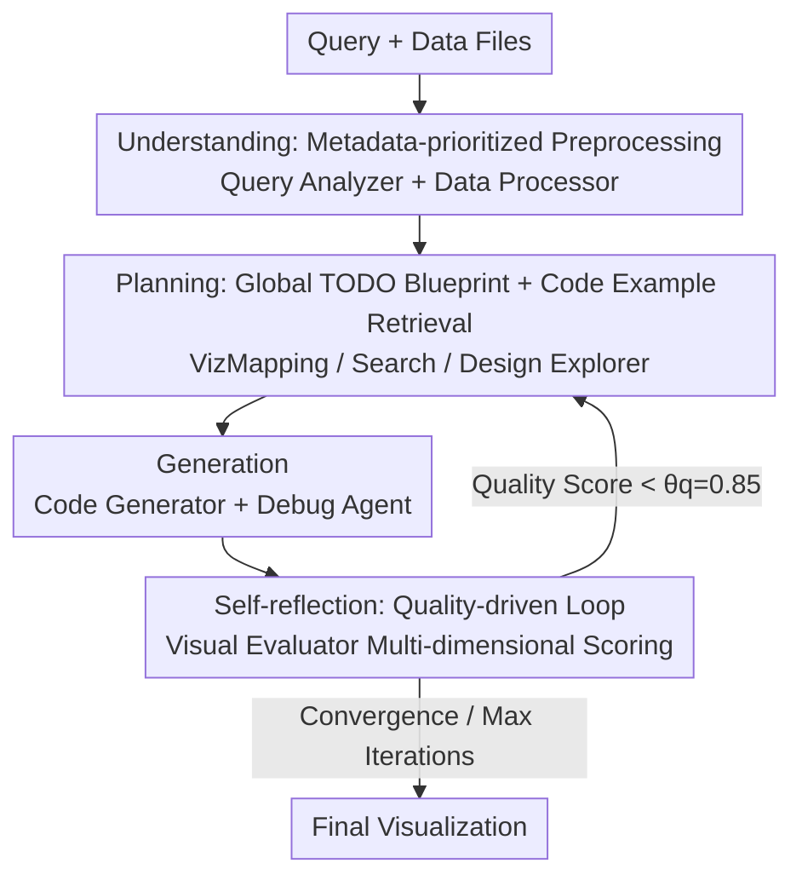

# CoDA: Agentic Systems for Collaborative Data Visualization

**Conference**: ICLR 2026  
**OpenReview**: [https://openreview.net/forum?id=M4RKeHIAxw](https://openreview.net/forum?id=M4RKeHIAxw)  
**Project Page**: [https://coda-agent.github.io/CoDA/](https://coda-agent.github.io/CoDA/)  
**Area**: Agent / LLM Code Generation / Data Visualization  
**Keywords**: Multi-agent systems, NL2Vis, Metadata preprocessing, Self-reflection, Code generation  

## TL;DR
CoDA remodels "natural language to data visualization" as a multi-agent collaboration problem. It uses 8 specialized LLM agents to complete understanding, planning, generation, and self-reflection in stages. By "reading only metadata rather than raw data," it bypasses token limits, and through a "quality-driven reflection loop," it iteratively refines charts. It improves overall scores by up to 41.5% over strong baselines on MatplotBench, Qwen, and DA-Code.

## Background & Motivation
**Background**: Natural Language to Visualization (NL2Vis) is a high-frequency but tedious part of data science—analysts reportedly spend over two-thirds of their time on data cleaning and manual chart refinement. Early rule-based systems like Voyager and Draco encoded design knowledge as constraints but were limited to predefined templates and struggled with flexible natural language queries. Recent LLM methods (e.g., CoML4VIS) use Chain-of-Thought to generate plotting code directly, offering significantly more flexibility.

**Limitations of Prior Work**: Direct LLM generation approaches have two fatal flaws. First, stuffing entire raw datasets into the context window easily triggers token limits and hallucinations in multi-file or large-file scenarios. Second, while existing "multi-agent" frameworks (VisPath, MatplotAgent) introduce collaboration, it is mostly concentrated on initial "query parsing," lacking metadata analysis of the data itself, which leads to fragile data processing and poor robustness during iterative refinement.

**Key Challenge**: The authors argue that these systems share a fundamental flaw—**concentrating reasoning and coordination only on the initial query parsing step**, with almost no continuous reflection or error correction mechanisms for truly difficult stages (multi-file/big data, execution errors, iterative quality refinement). This "shallow agent alignment" inevitably fails in complex scenarios.

**Goal**: To build a system capable of handling three challenges simultaneously—processing large-scale/multi-source data, coordinating expertise across linguistics, statistics, and design, and creating a continuous "evaluation-feedback-refinement" loop.

**Key Insight**: Treat visualization not as "one-shot monolithic code generation," but as a collaboration among experts with different professional personas, dividing labor like a real data team and dynamically adapting through a shared state.

**Core Idea**: Utilize a specialized team of LLM agents to decompose tasks into four stages: understanding → planning → generation → self-reflection. During this process, **only metadata summaries are extracted instead of loading raw data**, and a **quality-driven reflection loop based on image evaluation** is used to make visualization generation a resilient, self-evolving process.

## Method

### Overall Architecture
CoDA (Collaborative Data-visualization Agents) takes a natural language query and several data files (CSV/JSON/SQL/XLSX/README, etc.) as input and outputs a refined visualization. The pipeline consists of 8 specialized agents organized into four stages: **Understanding** (Query Analyzer extracts intent and decomposes global TODOs; Data Processor extracts metadata) → **Planning** (Search Agent retrieves example code; VizMapping Agent selects chart types and data mappings; Design Explorer defines design specs like color schemes and layout) → **Generation** (Code Generator synthesizes Python code; Debug Agent executes and searches online for fixes) → **Self-reflection** (Visual Evaluator performs multi-dimensional quality scoring on the rendered image).

Agents do not talk directly to each other but exchange structured messages via a **shared memory buffer**, passing upstream products (metadata guiding planning, planning guiding coding) down through the levels. The key lies in the final feedback loop: if the Visual Evaluator's quality score is below the threshold $\theta_q=0.85$, the problem is routed back to the corresponding upstream agent (e.g., poor aesthetics go back to the Design Explorer). The system halts when quality converges or the maximum iteration limit (default 3 rounds) is reached.

### Key Designs

**1. Collaborative Multi-agent Division of Labor: Decomposing monolithic generation into eight professional experts**

Traditional systems treat visualization as a one-way monolithic process of "parse query → ingest data → output code," which is unstable for complex queries. CoDA’s core action is dividing labor based on **depth of expertise**—each agent is responsible for a clearly defined capability domain, preventing a single model from being overwhelmed. The I/O of the eight agents is explicitly defined: Query Analyzer outputs visualization types and global TODOs; Data Processor outputs metadata summaries and insights; VizMapping Agent maps semantics to chart primitives; Design Explorer produces layout and aesthetic specs; Code Generator synthesizes code; Debug Agent handles execution and fixes; Visual Evaluator scores the image. This "modular" design makes the system extensible and ensures robustness through quality-driven termination. Unlike VisPath/MatplotAgent, CoDA integrates collaboration throughout the entire planning, building, critique, and reflection chain.

**2. Metadata-Prioritized Preprocessing: Extracting structure instead of ingesting raw data to bypass token limits**

The most fatal issue for direct LLM approaches is stuffing entire tables or multi-file datasets into the context, causing token explosions and hallucinations. The Data Processor uses lightweight tools like pandas to extract only **metadata summaries**—schemas, statistics, and data patterns (shapes, column names, required aggregations)—and never uploads the raw data itself. Downstream agents like VizMapping and Design Explorer make decisions based on these summaries. This step is a crucial trade-off of "using context for context": compressing $O(\text{data scale})$ input into $O(\text{schema description})$ constant-level summaries allows the system to handle multi-source, large-file scenarios without overflowing due to a single large CSV. This is why CoDA wins in real SWE scenarios like DA-Code, where navigation in a code repo is required.

**3. Global TODO Blueprint + Code Example Retrieval: Providing a map and a reference book for the planning stage**

The planning stage addresses two independent vulnerabilities. First, the Query Analyzer decomposes the query into a **global TODO list** (e.g., "filter data, aggregate, select chart type, highlight peaks"), serving as a high-level blueprint for cross-agent scheduling to prevent fragmentation of intent. Ablations show that removing it drops the OS from 79.5% to 75.1% (−4.4%) because VizMapping lacks a reference for chart selection. Second, the Search Agent acts as a tool to retrieve relevant plotting code examples from Matplotlib docs or the Python Graph Gallery, compensating for the LLM's inability to perfectly recall obscure API syntax. Ablations show removing it drops OS to 76.0% (−3.5%), mainly due to a 9% crash in EPR—specialized visualizations like custom subplots frequently suffer syntax errors without examples. Together, they handle "what to do" and "how to write it correctly."

**4. Quality-Driven Self-Reflection Loop: Using image evaluation as human eyes for iterative refinement**

Many agent systems only adapt during initial planning and let go after generation, leaving output quality unchecked. CoDA places a Visual Evaluator at the end, which performs multi-dimensional quality assessment (clarity, accuracy, aesthetics, layout, correctness) directly on the **rendered image**, checks if TODOs are completed, and provides prioritized fixes. If the score is below $\theta_q=0.85$, the issue is routed back to the relevant upstream agent for refinement. Evaluation only stops upon convergence or hitting the iteration cap. Importantly, this Evaluator serves only as an **internal self-refinement signal** and is not used as the reporting metric for the paper (which uses independent ground-truth scoring) to avoid circular reasoning. Ablations show that increasing iterations from 1 to 3 rounds raises OS from 75.6% to 79.5%, with diminishing returns after 3 rounds.

## Key Experimental Results

### Main Results
Using gemini-2.5-pro as the backbone, with a maximum of 3 refinement rounds and a threshold of $\theta_q=0.85$. Metrics are Execution Pass Rate (EPR), Visualization Success Rate (VSR), and Overall Score (OS).

| Benchmark | Metric | MatplotAgent | VisPath | CoML4VIS | CoDA |
|-----------|------|------|------|------|------|
| MatplotBench | OS (%) | 55.0 | 38.0 | 53.0 | **79.5** |
| MatplotBench | EPR (%) | 97.0 | 75.0 | 76.0 | **99.0** |
| MatplotBench | VSR (%) | 56.7 | 37.3 | 69.7 | **79.8** |
| Qwen Code Interp. | OS (%) | 65.0 | 81.6 | 79.1 | **89.0** |

On MatplotBench, OS improved by 24.5% over the best alternative, with a maximum improvement of 41.5% over VisPath. In the more difficult DA-Code (repository-level SWE visualization), CoDA achieved 39.0%, nearly double DS-STAR (20.5%) and about 20 percentage points higher than the strongest DA-Agent (19.23%).

Cross-backbone experiments (MatplotBench OS) confirm that gains come from the architecture: gemini-2.5-pro 79.5%, gemini-2.5-flash 77.7%, claude-4-sonnet 75.2%, and open-source Qwen3-VL 73.7%—all remained the highest in their respective model families.

### Ablation Study
| Configuration | OS (%) | Description |
|------|--------|------|
| CoDA (Full, 3 rounds) | 79.5 | Default configuration |
| 1-round iteration | 75.6 | Shallow one-shot generation, -3.9% |
| 5-round iteration | 80.1 | Minimal marginal gain after 3 rounds (+0.6%) |
| w/o Global TODO | 75.1 | -4.4%, intent fragmentation, EPR −5% |
| w/o Search Agent | 76.0 | -3.5%, EPR crashes 9% (syntax errors) |

### Key Findings
- **All three major components were statistically validated**: Self-reflection iterations, global TODOs, and example retrieval are essential, each affecting different aspects of OS—TODOs ensure EPR and coordination, Search Agent ensures EPR (syntax), and the reflection loop boosts VSR (visual quality).
- **More efficient than similar multi-agent systems**: CoDA uses a total of 50,219 tokens, 14.8 LLM calls, and 849.3s per instance, performing better than MatplotAgent (60,969 tokens, 15.4 calls, 990.6s). This shows that the context saved by metadata preprocessing offsets the multi-agent communication overhead.
- **Recognized by human experts**: Three experts performed pairwise preference on 200 images; CoDA's Elo (1701) far exceeded MatplotAgent (1506). It achieved the highest mean and lowest variance across five aesthetic dimensions.

## Highlights & Insights
- **"Exchanging metadata for context" is simple but crucial**: Not reading raw data and only reading schemas/statistics simultaneously solves token explosion, hallucination, and multi-file failure. This approach is transferable to any task where LLMs handle large structured data (Table QA, data cleaning agents).
- **Strictly separating the internal evaluator from external benchmarks** to avoid circular reasoning is a commendable detail in experimental integrity.
- **Multi-agent systems are not necessarily more expensive**: By compressing input via metadata, CoDA is cheaper in tokens and wall-clock time than single-chain multi-agent systems, breaking the intuition that "collaboration = expensive."

## Limitations & Future Work
- The authors admit calculation overhead from multi-round communication is a limitation; future work could consider distilling agents or adapting multi-modal inputs.
- Evaluation relies heavily on LLM-as-judge (VSR, OS). although human evaluation supports this, the bias/hallucination of scoring models may still affect absolute values.
- Major ablations were done on MatplotBench; the relative importance of components in repository-level scenarios (DA-Code) is not yet fully clear.
- The reflection threshold $\theta_q=0.85$ and 3-round cap are empirical values; their transferability across datasets was not fully discussed.

## Related Work & Insights
- **vs CoML4VIS (LLM Single-chain)**: It uses CoT to ingest tables directly, which is token-efficient but only achieves 62.6% OS under complex queries. CoDA’s extra calls for metadata and reflection yield significantly higher robustness.
- **vs VisPath / MatplotAgent (Existing Multi-agent)**: Their collaboration is focused on initial parsing and lacks metadata analysis; CoDA extends collaboration across the entire pipeline.
- **vs DS-STAR / DA-Agent (Data Science Agents)**: On repository-level DA-Code, CoDA uses the Query Analyzer to route subtasks to the Data Processor for metadata and Code Generator/Visual Evaluator to resolve dependencies, nearly doubling DS-STAR’s score.

## Rating
- Novelty: ⭐⭐⭐⭐ The combination of metadata-prioritized processing and full-link reflection is solid engineering; incremental but well-integrated.
- Experimental Thoroughness: ⭐⭐⭐⭐⭐ Comprehensive coverage across three benchmarks, four backbones, ablations, efficiency, and human evaluation.
- Writing Quality: ⭐⭐⭐⭐ Agent I/O and frameworks are clearly presented.
- Value: ⭐⭐⭐⭐ Directly valuable for automating data visualization; the metadata logic is highly reusable.

<!-- RELATED:START -->

## Related Papers

- [\[ICLR 2026\] Helmsman: Autonomous Synthesis of Federated Learning Systems via Collaborative LLM Agents](helmsman_autonomous_synthesis_of_federated_learning_systems_via_collaborative_ll.md)
- [\[ICLR 2026\] KRAMABENCH: A Benchmark for AI Systems on Data-to-Insight Pipelines over Data Lakes](kramabench_a_benchmark_for_ai_systems_on_data-to-insight_pipelines_over_data_lak.md)
- [\[ICLR 2026\] AgenTracer: Who Is Inducing Failure in the LLM Agentic Systems?](agentracer_who_is_inducing_failure_in_the_llm_agentic_systems.md)
- [\[ICML 2026\] CoDA-Bench: Can Code Agents Handle Data-Intensive Tasks?](../../ICML2026/llm_agent/coda-bench_can_code_agents_handle_data-intensive_tasks.md)
- [\[ICLR 2026\] EvoTest: Evolutionary Test-Time Learning for Self-Improving Agentic Systems](evotest_evolutionary_test-time_learning_for_self-improving_agentic_systems.md)

<!-- RELATED:END -->
