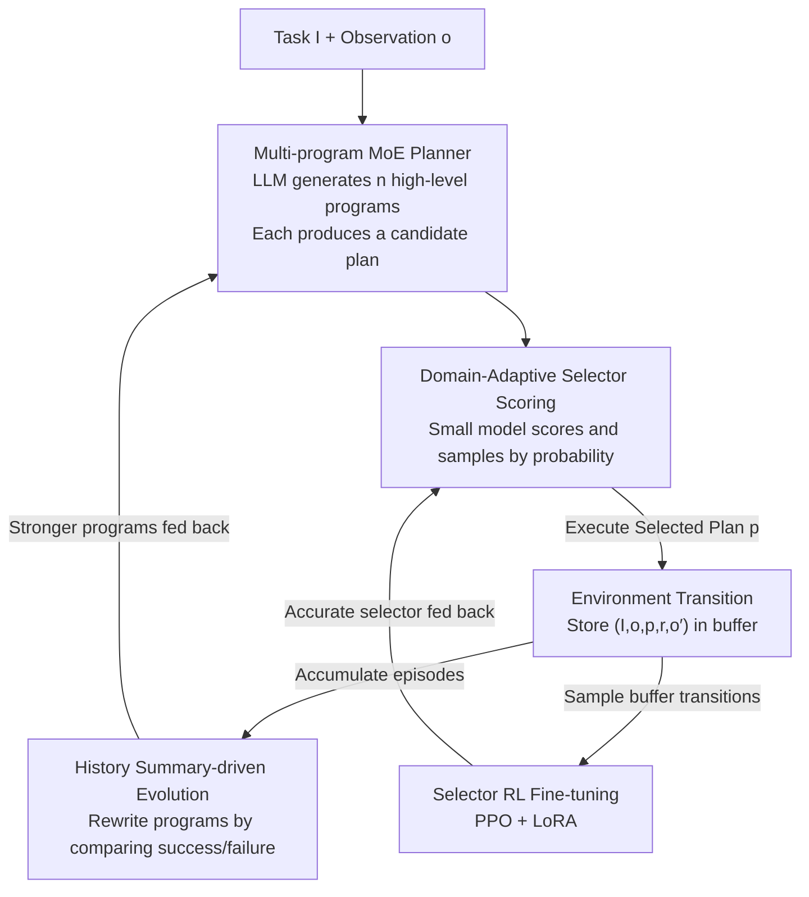

# Code Driven Planning with Domain-Adaptive Selector

**Conference**: ICLR2026  
**OpenReview**: [https://openreview.net/forum?id=yDbJHQlrbf](https://openreview.net/forum?id=yDbJHQlrbf)  
**Code**: Supplementary materials provided with the paper (public repository TBD)  
**Area**: LLM Agent / Sequential Decision Planning  
**Keywords**: LLM Planning, Code-driven, Domain-Adaptive Selector, Mixture of Experts, Reinforcement Learning

## TL;DR
CoPiC enables LLMs to generate multiple "high-level planning programs" at once (rather than requesting plans from the LLM step-by-step). These programs interact with the environment in a closed loop to produce candidate plans. A small model, the "Domain-Adaptive Selector" fine-tuned via RL, is then used to select the plan best aligned with long-term rewards. This approach achieves an average success rate improvement of 19.14% and an average token cost reduction of 79.39% across ALFWorld, NetHack, and StarCraft II unit production environments.

## Background & Motivation
**Background**: Utilizing LLMs as task planners for AI agents has become a mainstream approach for sequential decision-making problems. Leveraging vast world knowledge, LLMs can decompose high-level instructions, such as "put the vase in the safe," into executable natural language plans. This proves more efficient and generalizable than traditional learning-based agents in household scenarios (ALFWorld) and games.

**Limitations of Prior Work**: A gap exists between the general knowledge of LLMs and specific environments, leading to hallucinations where LLMs generate "seemingly reasonable but non-executable" plans (e.g., picking up non-existent objects or calling actions not available in the environment). To rectify this, current methods (ReAct, Reflexion, AdaPlanner, REPL-Plan, etc.) follow an "immediate feedback" route: feeding environmental observations back to the LLM at every step for repeated replanning. This results in two major drawbacks: first, **frequent LLM queries lead to explosive token costs**; second, this step-by-step correction focuses only on **immediate short-term feedback**, greedily fixing the current step while failing to assemble a high-quality plan that considers long-term rewards.

**Key Challenge**: Repeatedly generating and revising "static plans tailored to specific observations" is inherently unable to adapt to dynamic environments. As observations change, the entire static plan must be discarded and rebuilt, causing query frequency to expand linearly with interaction steps while only optimizing locally. The root cause is that the output of planning is a "dead plan" rather than a "strategy capable of automatic adjustment based on observations."

**Goal**: (1) Significantly reduce LLM query costs; (2) Align planning with long-term rewards instead of short-term feedback; (3) Bridge the gap between universal LLM knowledge and environment-specific requirements.

**Key Insight**: The authors observe that LLM code generation capabilities are significantly more reliable than natural language planning. Therefore, they propose letting the LLM generate "high-level planning programs." A program is a piece of closed-loop code that reads the current observation and calculates an action sequence on the fly. It inherently adapts to observations and can be reused repeatedly without querying the LLM at every step. However, a single program is limited by the LLM's general knowledge and may not cover all observational scenarios. Thus, a **Mixture of Experts (MoE)** layer is added: multiple programs act as experts to produce diverse candidate plans, and a **Domain-Adaptive Selector** is trained to pick the most appropriate one.

**Core Idea**: Replace "step-by-step LLM replanning" with "multiple LLM-generated high-level planning programs (MoE as planner) + an RL-fine-tuned domain-adaptive selector (as estimator)." The former reduces expensive LLM calls from "once per step" to "once per evolution round," while the latter replaces short-term greedy corrections with scoring based on long-term rewards.

## Method

### Overall Architecture
The core problem CoPiC addresses is: in a Partially Observable Markov Decision Process (POMDP, denoted as $\langle S, O, A, R, P, I\rangle$), given a linguistic task $I$ and observation $o$, find an action sequence plan $p$ aligned with long-term rewards while minimizing LLM query costs. The framework consists of **two modules** (LLM Planner + Domain-Adaptive Selector) operating alternately across **two phases**.

- **Planning Phase**: The LLM planner first uses an "Init Prompt" to generate $n$ (default $n=3$) high-level planning programs $\{\rho_i\}_{i=1}^n$. Each program reads $I$ and the current observation $o$ to calculate a candidate plan $p_i$ on the fly, forming a candidate set $\{p_i\}_{i=1}^n$. The domain-adaptive selector $C_\theta$ scores each candidate and samples the plan $p$ most aligned with long-term rewards to interact with the environment, generating a new observation $o'$ and reward $r$, and storing the transition $(I, o, p, r, o')$ in a buffer.
- **Learning Phase**: The accumulated interaction results are used for two purposes: first, performing a "history summary" of recent episodes to feed back to the LLM for evolving stronger planning programs; second, fine-tuning the selector using PPO + LoRA to improve its ability to select plans with high long-term rewards.

The two phases alternate repeatedly; programs become more accurate through evolution, and the selector becomes more specialized to the domain, resulting in an upward spiral of performance. A key selling point is **zero-shot domain adaptation**: CoPiC learns only on training tasks. During testing, it generalizes to unseen tasks without further fine-tuning the selector or additional LLM queries.

### Key Designs

**1. Multi-program MoE Planner: Replacing a "Fixed Plan" with "Adaptive Code"**

To address the issue of explosive query costs when static plans are rebuilt as observations change, CoPiC does not have the LLM output a plan directly. Instead, it generates a **high-level planning program** $\rho_i(p_i \mid I, o)$—a segment of closed-loop code that takes the current environment observation as input and outputs an action sequence calculated on the fly. This way, when observations change, the program recalculates the plan internally without querying the LLM. Since a single program is limited by general knowledge and cannot cover all scenarios, the authors introduce a **Mixture of Experts (MoE)**: generating $n$ programs (default $n=3$) simultaneously. Each program acts as an expert producing one candidate plan to form a diverse candidate set $\{p_i\}_{i=1}^n$, i.e., $\{\rho_i(p_i\mid I,o): I\times O\to\Delta(A^T)\}_{i=1}^n$. The example provided in the paper for StarCraft "SCV production" is intuitive: the program contains domain logic like "if supply < 8 then build depot, if base is missing build base, then train SCV," encoding "what to do first" into code rather than asking the LLM at every step. Compared to AdaPlanner (which generates one static program per task, lacking dynamicism) and REPL-Plan (which recursively calls a REPL to generate reusable APIs), CoPiC produces **multiple dynamic programs** for each task category, providing the foundation for subsequent "selection."

**2. Domain-Adaptive Selector Scoring: Replacing Short-term Greedy Correction with Long-term Reward Alignment**

Once the candidate set is available, which plan should be executed? This step targets the issue where immediate feedback only optimizes the next step, failing to produce a good long-term plan. The selector $C_\theta(p\mid o, I, \{p_i\}_{i=1}^n)$ is initialized from a **small language model** (TinyLlama). Drawing inspiration from TWOSOME, scoring follows three steps: (1) **Calculate Plan Probability**—input the "selector prompt" (current observation text $d_{cp}$ + candidate plan texts $d_{p_i}$ + evaluation instructions) and calculate the conditional probability of the plan description tokens: $\text{prob}(d_{p_i}\mid d_{cp})=\prod_{k=1}^{N_i}\text{prob}(w_i^k\mid d_{cp}, w_i^1,\dots,w_i^{k-1})$; (2) **Plan Text Length Regularization**—since cumulative multiplication naturally biases against long plans, the logit is normalized using $\text{logit}(d_{p_i}\mid d_{cp})=\log(\text{prob}(d_{p_i}\mid d_{cp}))/W_i$, where $W_i$ is the word count (word count is used rather than token count $N_i$ in experiments); (3) **Normalized Scoring**—since candidate set likelihoods vary, a softmax with temperature $\tau$ is applied:

$$\text{score}(p_i)=\frac{\exp(\text{logit}(d_{p_i}\mid d_{cp})/\tau)}{\sum_{j=1}^n \exp(\text{logit}(d_{p_j}\mid d_{cp})/\tau)}$$

During training, $\tau=1.0$ is used to balance exploration and exploitation, while $\tau=0.0$ is used during testing for deterministic output. The final plan $p$ is sampled from $\{(p_i,\text{score}(p_i))\}_{i=1}^n$. Crucially, after RL fine-tuning, this selector **carries domain priors**, enabling it to recognize long-term strategies like "protecting a pet's life is more valuable than short-term combat gains," whereas a pure LLM-as-a-Judge lacks this knowledge. Ablations show the RL-tuned selector achieves a 19.88% higher success rate and 27.14% lower token cost than GPT-4.1-as-a-Judge.

**3. History-summary Driven Program Evolution: Self-Correction through Success/Failure Analysis**

Initial planning programs are often imperfect; this module in the learning phase improves them. After interacting with the environment for $N$ episodes, the most recent $M$ ($M\le N$) episodes are condensed into a "history summary" format: $\{\langle \text{trajectory}_i, \text{signal}_i\rangle\}_{i=N-M+1}^N$, where $\text{trajectory}_i=(o_i^0,p_i^0,o_i^1,p_i^1,\dots)$ and $\text{signal}_i\in\{\text{True},\text{False}\}$ indicates success. Subsequently, success examples, the current programs, and the history summary are combined into a "Feedback Prompt," allowing the LLM to **compare failure and success trajectories** (e.g., identifying the error "attempting to open a container before moving close to it"). This locates weaknesses and performs targeted debugging to evolve stronger programs. Ablations show that in ALFWorld Clean/Heat/Cool tasks, the average success rate rose from 75.60% (v1) to 91.44% (round 2) and reached 100.00% by round 4, demonstrating the necessity of program evolution.

**4. Selector RL Fine-tuning: Injecting Domain Experience via PPO + LoRA**

An initialized small model is not yet "domain-aware"; this step uses reinforcement learning to inject experience gained during interactions. CoPiC utilizes a **parameter-efficient LoRA architecture** within a **PPO** framework to fine-tune the selector. LoRA parameters and MLP layers are added to the final transformer block of the small model to serve as the actor and critic in PPO. When fine-tuning on transitions from the replay buffer, **only the LoRA parameters and the new MLP are updated while the base LLM remains frozen**, ensuring computational efficiency and stability. This design allows the selector to continuously acquire domain-specific knowledge, providing more accurate plan assessments than a "zero-prior LLM evaluator." Ablations show that removing the selector (replacing it with random sampling) drops success rates in Heat/Cool tasks by 20%~60% for the same interaction cost.

### A Complete Example
Using the ALFWorld task "put some vase in safe" as a walkthrough:

1. **Generate Programs**: The LLM uses the Init Prompt (including ALFWorld Python agent definitions, few-shot examples of different tasks, and the task description) to generate $n=3$ programs. One might include `pick_and_place` logic—checking if the target is held, searching for the safe if so, or exploring if not.
2. **Produce Candidates**: The three programs read the observation and output candidate plans, e.g., "Go to shelf 1 and take vase / Go to drawer 1 and open it / Go to safe 1 and place vase."
3. **Selector Scoring**: The observation + three candidates are fed into the Selector Prompt for TinyLlama. Scores are calculated via "probability $\to$ length regularization $\to$ softmax," and "Go to drawer 1 and open it" is sampled for execution.
4. **Environment Transition**: Execution yields a new observation $o'$ and reward $r$; the transition $(I,o,p,r,o')$ is stored in the buffer.
5. **Learning Phase**: After sufficient episodes, the history summary feeds success/failure comparisons back to the LLM to evolve the program (fixing bugs like "opening the drawer without being near it"), while the selector is fine-tuned via PPO+LoRA. The next round uses evolved programs and a more accurate selector until the task is consistently solved.

### Loss & Training
- **Selector**: Fine-tuned using the PPO objective; the actor/critic are handled by LoRA and MLP layers while the LLM body is frozen.
- **Planning Program**: No gradient; relies on in-context learning. LLMs evolve code through Feedback Prompts by comparing success/failure trajectories.
- **Key Hyperparameters/Settings**: $n=3$ programs; TinyLlama as the selector; GPT-3.5 as the base LLM for ALFWorld and StarCraft, while GPT-4o is used for NetHack due to its complexity. Results averaged over 5 random seeds.

## Key Experimental Results

### Main Results
Across three environments (ALFWorld / NetHack / StarCraft II), CoPiC improves the average Success Rate (SR) by **19.14%**, reduces token Cost by **79.39%**, and decreases average interaction steps by 30.43%.

CoPiC vs. representative baselines in six ALFWorld task categories (Cost in M = million tokens):

| Task | CoPiC SR↑ | CoPiC Cost↓ | AdaPlanner SR / Cost | Reflexion SR / Cost | REPL-plan SR / Cost |
|------|-----------|-------------|----------------------|---------------------|---------------------|
| Pick | 100.00 | 0.05M | 100.00 / 0.63M | 91.67 / 2.09M | 82.50 / 0.66M |
| Examine | 100.00 | 0.04M | 64.44 / 1.95M | 86.67 / 1.51M | 83.33 / 0.41M |
| Clean | 100.00 | 0.33M | 91.61 / 0.89M | 73.55 / 2.54M | 89.03 / 0.75M |
| Heat | 100.00 | 0.26M | 76.52 / 0.74M | 75.65 / 1.88M | 91.30 / 0.61M |
| Cool | 100.00 | 0.28M | 89.52 / 1.57M | 73.33 / 1.46M | 88.57 / 0.47M |
| Pick Two | 95.29 | 0.06M | 87.06 / 1.58M | 81.18 / 1.65M | 100.00 / 0.43M |

ALFWorld overall: SR +16.96%, Cost −83.76%. Even compared with the online learning version CoPiC(TSL) using baseline settings, it maintains a 17.17% SR gain and 87.16% token reduction. On NetHack: SR +13.72%, Cost −70.96% (queries for difficult "Level 3" tasks dropped 96.11% while SR increased 10%). StarCraft Hard tasks: SR +44.75%, Cost −87.86%.

### Ablation Study

| Configuration | Key Finding | Description |
|------|---------|------|
| Full CoPiC | Leads across all environments | Synergy between Program MoE + RL Selector |
| w/o Selector (Random) | Heat/Cool SR dropped 20%~60% under same cost | Selector improves both efficiency and quality |
| w/o Program Evolution | Clean/Heat/Cool mean 75.60%→91.44% (R2)→100% (R4) | Evolution is key to high performance |
| CoPiC(LaJ) (GPT-4.1-as-a-Judge) | RL Selector vs LaJ: SR +19.88%, tokens −27.14% | Domain priors vs zero-prior scoring |
| Open-source LLM (DeepSeek/Qwen2.5-Coder-14B) | vs AdaPlanner: SR +26.29%, Cost −85.09% | Supports both open/closed-source LLMs |

### Key Findings
- **Selector contributes most significantly and cleverly**: Removing it (random selection) causes the largest performance drop, proving that "selecting correctly" is more vital than "generating more." The accuracy stems from RL fine-tuning which injects domain priors—e.g., in NetHack, it identifies that "protecting the pet is beneficial for long-term combat," whereas baselines attack pets for short-term gain despite prompts.
- **Structural cost reduction**: By shifting from "querying per step" to "evolving programs per round + small model scoring," queries for hard tasks (NetHack leveling) dropped by 96%.
- **Zero-shot Domain Adaptation**: Learning on training tasks allows generalization to test tasks without further fine-tuning or LLM queries—a capability distinguishing CoPiC from Reflexion/AdaPlanner/REPL-Plan (which rely on test-set online learning).
- **Higher Data Efficiency**: ALFWorld learning curves show CoPiC achieves higher asymptotic performance with fewer environmental interactions.

## Highlights & Insights
- **Clever decoupling of "Programs as Planner" and "Small Model as Estimator"**: Moving expensive LLM calls to a low-frequency evolution round and delegating high-frequency evaluation to a lightweight model places "expensive/smart" and "cheap/sufficient" components where they belong. This is the structural reason for the 79% token reduction.
- **MoE + Selector addresses the LLM planning dilemma**: A single program cannot bridge the gap between universal knowledge and specific observations. Multiple programs provide diversity, and the selector provides specialized accuracy. This "generation-diversity + selection-accuracy" division can be transferred to tasks like code generation, retrieval reranking, and tool calling.
- **Refined scoring with length regularization and temperature annealing**: Using word count for regularization and zeroing temperature for deterministic testing are practical engineering lessons for converting LM likelihoods into comparable scores.
- **RL tuning on small models instead of large LLMs**: Using LoRA + PPO on a small model effectively embeds domain experience while avoiding the prohibitive costs of fine-tuning large LLMs.

## Limitations & Future Work
- **Reliance on LLM code generation reliability**: The framework assumes the LLM can generate high-quality planning programs. It may degrade for LLMs with weak coding skills or environments that are highly unstructured or have obscure rules.
- **Limited Environment Scale**: Currently validated only on the StarCraft "unit production" sub-task. Future work includes testing on full games (Civ, SCII) and complex real-world scenarios with longer horizons and larger action spaces.
- **Requirement for Reward Functions**: Selector fine-tuning relies on environmental reward $R$. While the authors emphasize that reward design is "straightforward and lacks expert knowledge," reliable rewards can be scarce in real-world scenarios.
- **Improvement Directions**: Exploring finer-grained (step-level) long-term value estimation or automating program evolution to go beyond LLM in-context rewriting.

## Related Work & Insights
- **vs Reflexion / ReAct (Feedback-based)**: These rely on step-by-step reflection, leading to high latency and a short-term focus. CoPiC eliminates high-frequency queries using program-driven generation.
- **vs AdaPlanner (Programmatic but Static)**: AdaPlanner generates a static program per task, lacking dynamicism and requiring task-specific prompts. CoPiC produces **multiple dynamic programs** and identifies the best via a broad selector.
- **vs REPL-Plan**: REPL-Plan recursively generates APIs; CoPiC emphasizes "diverse candidate + learned selection."
- **vs SayCan / Prospector (Scoring-based)**: Those using LLM scoring lack environment priors or suffer from scoring errors; those using offline expert data are costly and generalize poorly. CoPiC uses online-generated data to fine-tune the selector efficiently.
- **vs PDDL-based methods (LLM-DP)**: In PDDL approaches, LLMs only complete files while external solvers plan. CoPiC performs planning directly via LLM-generated programs.

## Rating
- Novelty: ⭐⭐⭐⭐⭐ The "program as planner + small model as estimator" decoupling is novel, addressing the cost/reward trade-off via MoE + Domain-Adaptive selection.
- Experimental Thoroughness: ⭐⭐⭐⭐⭐ Three heterogeneous environments, multiple strong baselines, 5 seeds, various LLMs, and comprehensive ablation.
- Writing Quality: ⭐⭐⭐⭐ Clear description of the two phases and full formulas, although some details (PPO objective) reside in the appendix.
- Value: ⭐⭐⭐⭐⭐ 79% token reduction and 19% SR increase with zero-shot adaptation; highly relevant for deploying cost-sensitive LLM agents.

<!-- RELATED:START -->

## Related Papers

- [\[ICLR 2026\] OrchestrationBench: LLM-Driven Agentic Planning and Tool Use in Multi-Domain Scenarios](orchestrationbench_llm-driven_agentic_planning_and_tool_use_in_multi-domain_scen.md)
- [\[AAAI 2026\] Reflection-Driven Control for Trustworthy Code Agents](../../AAAI2026/llm_agent/reflection-driven_control_for_trustworthy_code_agents.md)
- [\[ICML 2026\] AutoRPA: Efficient GUI Automation through LLM-Driven Code Synthesis from Interactions](../../ICML2026/llm_agent/autorpa_efficient_gui_automation_through_llm-driven_code_synthesis_from_interact.md)
- [\[ICLR 2026\] Modeling Others' Minds as Code](modeling_others_minds_as_code.md)
- [\[ICML 2026\] NaviAgent: Graph-Driven Bilevel Planning for Scalable Tool Orchestration](../../ICML2026/llm_agent/naviagent_graph-driven_bilevel_planning_for_scalable_tool_orchestration.md)

<!-- RELATED:END -->
