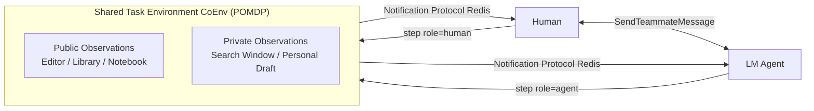

# Collaborative Gym: A Framework for Enabling and Evaluating Human-Agent Collaboration

**Conference**: ICLR 2026  
**OpenReview**: [https://openreview.net/forum?id=GDYueXtKXT](https://openreview.net/forum?id=GDYueXtKXT)  
**Code**: [https://github.com/SALT-NLP/collaborative-gym](https://github.com/SALT-NLP/collaborative-gym)  
**Area**: llm_agent  
**Keywords**: human-agent collaboration, dual-control environment, non-turn-taking interaction, agent evaluation, mixed-initiative systems  

## TL;DR
Proposes Collaborative Gym (Co-Gym)—the first open framework supporting **bidirectional communication and non-turn-taking collaboration** between humans and LM agents in shared task environments, accompanied by an evaluation suite that assesses both collaboration outcomes and processes.

## Background & Motivation
- **Background**: Research on LLM agents is highly focused on the "fully autonomous" path—enabling agents to independently complete tasks like web navigation, personal assistance, programming, and scientific discovery, effectively excluding humans from the loop.
- **Limitations of Prior Work**: Many real-world scenarios naturally require human participation (e.g., latent user preferences, domain expertise, control over critical decisions). However, existing human-agent collaboration infrastructures are either **single-control** (only one party can manipulate the environment) or **dual-control turn-taking** (e.g., CowPilot, τ²-Bench), often confined to single environments (browser/database). The turn-taking structure contradicts the "asynchronous, interruptible, and interleaved" nature of real human collaboration.
- **Key Challenge**: While human-agent collaboration promises to exceed individual performance through complementary expertise, there is a **lack of a unified platform that replicates real asynchronous dynamics and systematically evaluates collaboration quality**. This leaves fundamental questions—whether collaboration is effective and how to design collaborative agents—unanswered.
- **Goal**: Construct a multi-task framework for human-agent collaboration that is unconstrained for agents, removes turn-taking limitations, and enables simultaneous quantification of results and processes.
- **Core Idea**: **[Dual-control at Env Layer + Non-turn-taking at Interaction Layer + Process-oriented Evaluation]**—Utilize a unified environment interface to support bidirectional operations by humans and agents on a shared workspace, replace turn-taking with "collaboration actions + notification protocols," and assess collaboration via dual metrics of outcome and process auditing.

## Method

### Overall Architecture
Co-Gym consists of three main components: (1) **Collaboration-driven Environment Design**, modeling tasks as Partially Observable Markov Decision Processes (POMDP) and introducing a `role` parameter in the `step` function for shared environment access; (2) **Non-turn-taking Interaction Protocol**, comprising two "collaboration actions" and a cross-process "notification protocol" to enable asynchronous operations; (3) **Evaluation Suite**, measuring both collaboration outcomes (Delivery Rate, Task Performance) and processes (Initiative Entropy, Satisfaction). The framework provides **Simulation Conditions** with reliable user simulators and **Web Application Conditions** with a chat panel and shared workspace.

### Key Designs

**1. Collaboration-driven Environment Abstraction (CoEnv): Embedding dual-control in the step signature.** Co-Gym does not restrict agent implementation but defines a unified environment interface formalizing each task as a POMDP $(S, A, T, R, U, O)$. To add new tasks (e.g., CoTravelPlanningEnv, CoRelatedWorkEnv, CoTabularAnalysisEnv), one only needs to declare the toolset, action space $A$, observation space $O$, transition function $T$, and initial task description. The key modification is introducing the `role` parameter in the `step` function: `obs, reward, done, private = env.step(role, action)`, allowing the environment to update state based on the actor's identity. The observation space distinguishes between **Public Components** (e.g., a shared Editor, analogous to a whiteboard) and **Private Components** (e.g., an agent's search window, analogous to a personal notebook) via the `private` flag—enabling concurrent individual work during collaboration.

**2. Non-turn-taking Interaction: Decoupling "Speech" and "Action" via Collaboration Actions and Notification Protocols.** To mimic human coordination via communication rather than fixed turns, Co-Gym adds two meta-actions: `SendTeammateMessage` (proactive messaging by the agent) and `WaitTeammateContinue` (a keep-alive signal indicating "I’m waiting for you"). Both parties can send consecutive messages without waiting for responses, breaking the turn-taking lock. Since agents require explicit updates while humans observe continuously, the framework utilizes a **Redis-based** notification protocol to listen for four events: ① Public observation updates (broadcast to all), ② Private observation changes (notify the specific party), ③ New messages (notify receiver), and ④ Environment silence exceeding a threshold (broadcast). For instance, when an agent updates the Editor, both receive new observations; when a human sends a message, only the agent is notified. This event-driven mechanism ensures reliable asynchronous collaboration across processes.

**3. Process-oriented Evaluation Suite: Measuring results beyond task completion.** The outcome dimension includes: **Delivery Rate**, a binary metric for delivery within step limits; and **Task Performance**, which scores delivered samples using task-specific functions (deterministic metrics or LM/human judges) normalized to $[0, 1]$. The process dimension introduces two auditing metrics: **Initiative Entropy ($H_{init}$)**, treating collaboration as a mixed-initiative system. LM-based labeling identifies utterances that "advance task execution or build consensus" as holding the initiative. The balance of initiative among team members is measured by entropy—higher entropy indicates a more balanced distribution:

$$H_{init} = \begin{cases} -\sum_{i=1}^{N} p_i \log_N(p_i) & \forall i,\ p_i > 0 \\ 0 & \exists i,\ p_i = 0 \end{cases}$$

where $p_i$ is the proportion of initiative utterances by member $i$, and $N$ is the number of participants; and **Overall Satisfaction**, scored by humans on a 1–5 Likert scale post-collaboration to complement task performance metrics.

## Key Experimental Results

Experiments compared three agent types (Fully Autonomous / Collaborative / Collaborative + Scenario Planning) across four LMs (GPT-4o, GPT-4-turbo, Claude-3.5-sonnet, Llama-3.1-70B) in three tasks: Travel Planning, Related Work Writing, and Tabular Analysis, under both simulated and real conditions. The "Collaborative + Scenario Planning" agent uses a two-stage decision process: a three-way decision (Execute Action / Message / Idle) followed by specific action generation. All agents are based on ReAct + Scratchpad memory.

### Main Results (Simulated Condition, Excerpt: Task Performance)

| Agent Type (LM) | Travel Plan | Related Work | Tabular |
|---|---|---|---|
| Autonomous (Claude-3.5) | 0.577 | 0.617 | 0.358 |
| Collaborative (Claude-3.5) | 0.653* | 0.621 | 0.359 |
| Collab + ScenPlan (Claude-3.5) | 0.682* | 0.736* | 0.365* |
| Collab + ScenPlan (GPT-4o) | 0.667* | 0.658* | 0.434* |

(* indicates significant Gain over the same autonomous LM at $p < 0.05$)

### Main Results (Real-world Condition, 50 samples/task, vs Autonomous Agent)

| Metric | Travel | Related Work | Tabular |
|---|---|---|---|
| Human Task Perf. | 0.788 | 0.604 | 0.804 |
| Win Rate vs Autonomous | **86%** | 66% | **74%** |
| Overall Satisfaction (1–5) | 3.78 | 3.06 | 4.06 |
| Initiative Entropy $H_{init}$ | 0.88 | 0.63 | 0.74 |

### Key Findings
- **Trade-off between Delivery Rate and Quality**: Under simulated conditions (30 step limit), collaborative agents showed lower delivery rates than autonomous ones due to frequent plan adjustments based on human actions; however, the **quality of delivered samples was higher**, with the Scenario Planning version leading significantly across tasks.
- **Real Users Prefer Collaboration**: 99 real users contributed 150 trajectories (6.3k actions, 77k words). Collaborative agents achieved an 86% win rate in Travel Planning and 74% in Tabular Analysis, with higher satisfaction ratings than autonomous agents.
- **Persisting Weaknesses**: In real conditions, **65%** of cases still experienced communication failure and **40%** scenario awareness failure. Failures primarily stemmed from agents ignoring human messages (46%), repetitive prompting (26%), or redundant/missing actions (33%).
- **Balanced Initiative is Better**: Scenario Planning significantly increased $H_{init}$, correlating with higher quality. This suggests that true back-and-forth interaction, rather than one-sided dominance, yields better gains.

## Highlights & Insights
- **Paradigm Shift**: Introduces "non-turn-taking (asynchronous)" as a first-class citizen in human-agent collaboration. The collaboration-action + notification-protocol approach elegantly solves the engineering challenge of "agents being blind to environment changes," mirroring real teamwork more closely than forced turn-taking.
- **Clean Environment Abstraction**: By adding only a `role` parameter to `step` and distinguishing public/private observations, it extends single-agent environments to dual-control with low migration cost and high scalability.
- **Thoughtful Evaluation**: Importing the linguistic concept of "Initiative Entropy" into agent evaluation, combined with dual simulated/real conditions, represents a rare attempt to quantify both "outcome quality" and "collaboration health."
- **MIT Licensed + Real Web App**: Directly applicable for developing production-ready collaborative agents, rather than serving as a purely academic sandbox.

## Limitations & Future Work
- **Collaboration Slows Delivery**: Forced step limits hinder collaborative agents' ability to deliver on time, indicating current LM deficiencies in decision efficiency when adapting to human intent. Better memory and planning scaffolds are needed.
- **Communication and Context Sensing Gaps**: Failure rates (65%/40%) show that LMs remain fragile in understanding/recalling human input and sensing environment changes; improvements are required in both base models and agent scaffolding.
- **Limited Task Coverage**: Only three tasks were evaluated. While the LLM-based human simulator quality was validated, differences from the diverse preferences of real humans persist.
- **Metric Subjectivity**: Task performance relies partially on LM/rubric judging, and satisfaction depends on small-scale human samples, requiring larger-scale validation for cross-task robustness.

## Related Work & Insights
- **Comparison with CowPilot / τ²-Bench**: While all provide dual-control, the latter are restricted to forced turn-taking and single environments (browser/DB). Co-Gym uses notification protocols to enable asynchronous work and supports multiple environments.
- **Comparison with WorkArena / τ-Bench**: These are single-control setups where humans cannot share environment operations with agents. The `role`-based `step` in Co-Gym is the key differentiator.
- **Insight**: Quantifying "Initiative," using event notifications instead of turns, and modeling "shared whiteboard vs personal notes" via public/private observations are designs transferable to multi-agent collaboration, pair programming, and collaborative writing.

## Rating
- **Novelty**: ⭐⭐⭐⭐⭐ First non-turn-taking dual-control framework; original in both paradigm and evaluation.
- **Experimental Thoroughness**: ⭐⭐⭐⭐ Solid scale with 3 tasks × 4 models × dual conditions + 99 real users; however, task diversity and human sample size could be further expanded.
- **Writing Quality**: ⭐⭐⭐⭐ Clear three-component structure, sufficient illustrations and tables, and precise framework abstractions.
- **Value**: ⭐⭐⭐⭐⭐ MIT licensed, extensible, and addresses the critical yet overlooked direction of human-agent collaboration; high value for both academia and industry.

<!-- RELATED:START -->

## Related Papers

- [\[ICLR 2026\] OpenAgentSafety: A Comprehensive Framework for Evaluating Real-World AI Agent Safety](openagentsafety_a_comprehensive_framework_for_evaluating_real-world_ai_agent_saf.md)
- [\[ACL 2025\] Leveraging Dual Process Theory in Language Agent Framework for Real-time Simultaneous Human-AI Collaboration](../../ACL2025/llm_agent/dpt_agent_dual_process.md)
- [\[ACL 2025\] MultiAgentBench: Evaluating the Collaboration and Competition of LLM Agents](../../ACL2025/llm_agent/multiagentbench_evaluating_the_collaboration_and_competition_of_llm_agents.md)
- [\[ICLR 2026\] Grounding Computer Use Agents on Human Demonstrations](grounding_computer_use_agents_on_human_demonstrations.md)
- [\[ICLR 2026\] Empowering Efficiency and Efficacy in WebAgent via Enabling Info-Rich Seeking](empowering_efficiency_and_efficacy_in_webagent_via_enabling_info-rich_seeking.md)

<!-- RELATED:END -->
